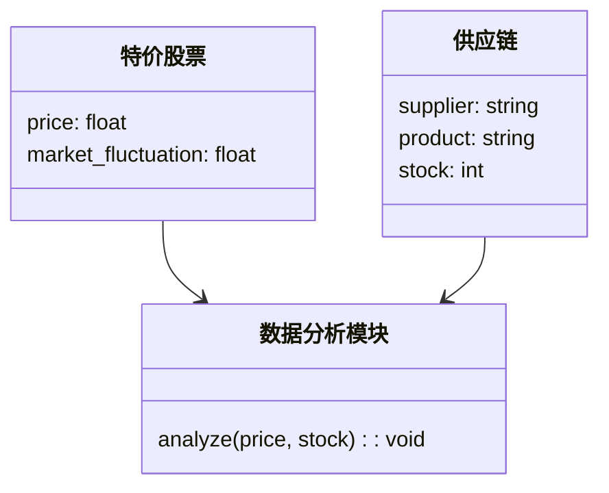
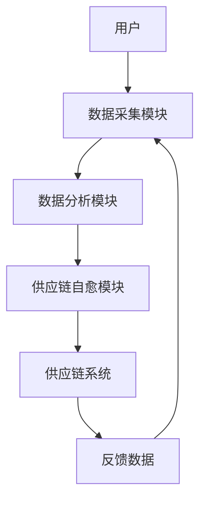

                 


# 特价股票与公司智能供应链自愈能力的关系探讨

## 关键词：特价股票、智能供应链、自愈能力、数据分析、系统架构

## 摘要  
本文探讨了特价股票与公司智能供应链自愈能力之间的关系，分析了特价股票对供应链稳定性的影响，以及智能供应链如何通过自愈能力应对市场波动。通过数学模型和系统架构设计，本文详细阐述了如何利用数据分析优化供应链的自愈能力，并提供了实际案例和最佳实践。

---

# 引言  

在现代商业环境中，特价股票和智能供应链自愈能力的关系日益重要。特价股票通常反映公司财务状况不佳，而供应链的自愈能力则是企业在危机中维持运营的关键。本文将从理论和实践两个层面探讨这一关系，为读者提供深入的分析和见解。

---

# 第一部分：背景介绍  

## 第1章：特价股票与智能供应链自愈能力的背景  

### 1.1 特价股票的定义与特点  

#### 1.1.1 特价股票的定义  
特价股票是指价格低于面值的股票，通常反映公司财务状况不佳或市场信心不足。

#### 1.1.2 特价股票的特点  
- 价格波动大  
- 投资者风险高  
- 可能引发连锁市场反应  

#### 1.1.3 特价股票的市场影响  
- 影响公司市值和信用评级  
- 可能导致供应链合作伙伴的风险暴露  

### 1.2 智能供应链的基本概念  

#### 1.2.1 供应链的基本概念  
供应链是围绕企业需求，从原材料采购到产品交付的完整链条。

#### 1.2.2 智能供应链的特点  
- 数据驱动  
- 自动化运作  
- 实时监控与响应  

#### 1.2.3 智能供应链的核心要素  
- 数据采集与分析  
- 自动化决策系统  
- 供应商协同  

### 1.3 特价股票与供应链自愈能力的关系  

#### 1.3.1 特价股票对供应链的影响  
- 供应链资金链紧张  
- 供应商信任度下降  

#### 1.3.2 供应链自愈能力的定义  
供应链在遭受外部冲击时，能够自动识别问题并恢复的能力。

#### 1.3.3 两者的关系  
特价股票是供应链自愈能力的重要触发因素，供应链自愈能力则是应对特价股票引发风险的关键机制。

---

# 第二部分：核心概念与联系分析  

## 第2章：核心概念与联系分析  

### 2.1 特价股票的市场行为分析  

#### 2.1.1 特价股票的市场波动  
- 投资者情绪波动影响股价  
- 市场波动对供应链的影响  

#### 2.1.2 投资者行为对供应链的影响  
- 投资者抛售股票引发连锁反应  
- 供应链合作伙伴面临资金压力  

### 2.2 智能供应链自愈能力的原理  

#### 2.2.1 供应链的自我修复机制  
- 数据分析驱动的预测与响应  
- 自动化决策系统  

#### 2.2.2 数据分析在供应链自愈中的作用  
- 实时监控市场变化  
- 预测潜在风险  

### 2.3 特价股票与供应链自愈能力的对比分析  

#### 2.3.1 概念对比  
| 概念 | 特价股票 | 供应链自愈能力 |
|------|-----------|----------------|
| 定义 | 股票价格低于面值 | 供应链自动恢复能力 |
| 目标 | 投资者收益 | 供应链稳定性 |

#### 2.3.2 特性对比  
- 特价股票具有价格波动性，而供应链自愈能力具有稳定性。
- 特价股票影响市场信心，而供应链自愈能力增强市场信心。

---

# 第三部分：算法原理讲解  

## 第3章：算法原理与数学模型  

### 3.1 供应链自愈能力的评估模型  

#### 3.1.1 模型假设  
- 供应链自愈能力与市场波动呈负相关  
- 数据分析是供应链自愈的核心驱动  

#### 3.1.2 数学模型  
$$ C = f(S, M) $$  
其中，C表示供应链自愈能力，S表示市场波动，M表示数据分析能力。

#### 3.1.3 模型实现  
使用Python进行模拟，代码如下：

```python
import numpy as np
import pandas as pd

# 示例数据：市场波动（0-1）和数据分析能力（0-1）
market_fluctuation = np.random.uniform(0, 1, 100)
data_analysis = np.random.uniform(0, 1, 100)

# 计算供应链自愈能力
def calculate_supply_chain_resilience(market_fluctuation, data_analysis):
    return np.mean(market_fluctuation * data_analysis)

resilience = calculate_supply_chain_resilience(market_fluctuation, data_analysis)
print("供应链自愈能力指数:", resilience)
```

---

## 第4章：系统分析与架构设计  

### 4.1 问题场景介绍  

#### 4.1.1 特价股票引发的供应链问题  
- 供应商资金链紧张  
- 客户订单延迟  

#### 4.1.2 供应链自愈能力的实现需求  
- 实时监控市场变化  
- 自动调整供应链策略  

### 4.2 系统功能设计  

#### 4.2.1 领域模型设计  


#### 4.2.2 系统架构设计  


---

## 第5章：项目实战  

### 5.1 环境安装  

#### 5.1.1 工具安装  
- Python 3.8+
- numpy、pandas库  
- mermaid CLI工具  

### 5.2 核心代码实现  

#### 5.2.1 数据分析模块  
```python
import numpy as np
import pandas as pd

# 模拟市场数据
market_data = pd.DataFrame({
    'stock_price': np.random.uniform(0, 100, 100),
    'volume': np.random.randint(0, 1000, 100)
})

# 数据分析模块
def analyze_market(market_data):
    return market_data.rolling(5).mean()

result = analyze_market(market_data)
print(result)
```

#### 5.2.2 供应链自愈模块  
```python
import pandas as pd

# 供应链数据
supply_chain = pd.DataFrame({
    'product_id': [1, 2, 3],
    'stock_level': [10, 20, 15],
    'supplier_delay': [0, 1, 0]
})

# 自愈逻辑
def supply_chain_healing(supply_chain):
    supply_chain['adjusted_stock'] = supply_chain['stock_level'] + supply_chain['supplier_delay']
    return supply_chain

result = supply_chain_healing(supply_chain)
print(result)
```

### 5.3 实际案例分析  

#### 5.3.1 案例背景  
某公司因股价暴跌（特价股票）导致供应链资金紧张，供应商延迟交付。

#### 5.3.2 数据分析与自愈过程  
- 数据分析模块识别市场波动，触发自愈机制  
- 自愈模块调整库存和供应商策略  

---

## 第6章：最佳实践  

### 6.1 小结  

#### 6.1.1 关键点总结  
- 特价股票是供应链自愈能力的重要触发因素  
- 数据分析是供应链自愈的核心驱动  

### 6.2 注意事项  

#### 6.2.1 数据分析的准确性  
- 数据质量直接影响自愈能力  

#### 6.2.2 系统维护  
- 定期更新模型和算法  

### 6.3 拓展阅读  

#### 6.3.1 推荐书籍  
- 《供应链管理》  
- 《数据分析实战》  

#### 6.3.2 在线资源  
- 行业报告：供应链自愈能力的最新研究  

---

# 结语  

通过本文的分析，我们可以看到，特价股票与供应链自愈能力的关系是复杂而深刻的。供应链自愈能力不仅是应对市场波动的关键，也是企业长期稳定发展的基石。未来，随着技术的进步，供应链自愈能力将更加智能化和自动化，为企业应对市场挑战提供更强大的支持。

--- 

**End of Article**

