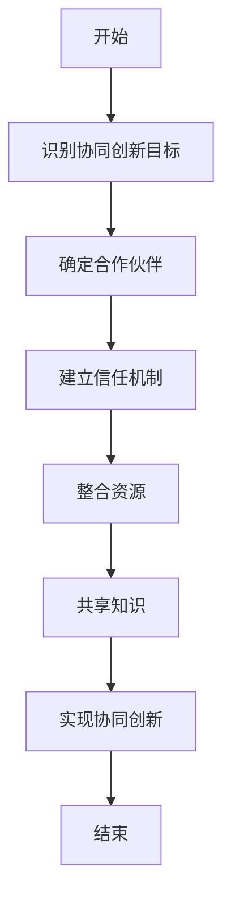

                 


# 特价股票与公司生态系统协同创新的潜在关联研究

## 关键词：特价股票、公司生态系统、协同创新、潜在关联、算法模型、系统设计、项目实战

## 摘要：  
本文深入研究了特价股票与公司生态系统之间协同创新的潜在关联，从背景、概念、算法原理、系统架构到项目实战，全面分析了两者的协同机制。通过构建数学模型和系统设计，探讨了协同创新如何为公司生态系统和投资者带来价值，并通过实际案例验证了模型的有效性。

---

# 第一部分: 特价股票与公司生态系统协同创新的背景与概念

## 第1章: 特价股票的定义与特征

### 1.1 特价股票的定义
- **1.1.1 特价股票的定义与分类**  
  特价股票是指在特定市场条件下，价格被低估的股票。根据市场波动、公司基本面和投资者情绪，特价股票可分为周期性特价股票和事件驱动型特价股票。

- **1.1.2 特价股票的市场特征**  
  特价股票通常具有低估值、高成长潜力和较高的波动性。投资者在市场低迷或公司遭遇短期困境时，可以通过购买特价股票获得超额收益。

- **1.1.3 特价股票的投资价值分析**  
  特价股票的投资价值主要体现在其价格与内在价值的差异。通过分析公司财务状况、行业地位和市场前景，投资者可以识别具有长期增长潜力的特价股票。

### 1.2 公司生态系统的定义
- **1.2.1 生态系统的概念与特征**  
  公司生态系统是指公司与其利益相关者（如供应商、客户、合作伙伴）之间的互动网络。一个健康的生态系统能够为公司提供持续的竞争优势。

- **1.2.2 公司生态系统的核心要素**  
  公司生态系统的核心要素包括公司战略、组织结构、文化、技术创新和外部合作伙伴关系。

- **1.2.3 公司生态系统与协同创新的关系**  
  协同创新是公司生态系统的重要组成部分，通过内部资源整合和外部合作伙伴的协作，公司可以更快地推出创新产品和服务。

### 1.3 协同创新的定义与模式
- **1.3.1 协同创新的定义**  
  协同创新是指多个主体（如公司、供应商、客户）共同参与创新过程，通过知识共享和资源整合，实现创新成果的快速落地。

- **1.3.2 协同创新的类型与模式**  
  协同创新的模式包括内部协同和外部协同。内部协同主要依赖公司内部资源，而外部协同则依赖外部合作伙伴。

- **1.3.3 协同创新的实现机制**  
  协同创新的实现机制包括知识共享、资源整合、信任建立和利益分配机制。

### 1.4 特价股票与公司生态系统协同创新的潜在关联
- **1.4.1 特价股票在公司生态系统中的作用**  
  特价股票可以为公司提供低成本的资本，支持公司的技术创新和市场拓展。

- **1.4.2 公司生态系统对特价股票的影响**  
  公司生态系统中的协同创新能够提升公司的竞争力和市场地位，从而增强投资者对公司的信心。

- **1.4.3 两者协同创新的潜在价值**  
  通过协同创新，公司可以快速推出新产品和服务，从而在市场中占据领先地位。同时，投资者可以通过投资特价股票获得更高的回报。

---

# 第二部分: 特价股票与公司生态系统协同创新的核心概念与联系

## 第2章: 特价股票与公司生态系统协同创新的理论基础

### 2.1 协同创新的理论基础
- **2.1.1 协同创新的理论模型**  
  协同创新的理论模型包括知识管理理论、资源基础视角和网络理论。这些理论为理解协同创新提供了理论支持。

- **2.1.2 协同创新的核心要素**  
  协同创新的核心要素包括共同目标、知识共享、资源整合和信任机制。

- **2.1.3 协同创新的实现路径**  
  协同创新的实现路径包括知识共享、资源整合、信任建立和利益分配。

### 2.2 特价股票与公司生态系统协同创新的ER实体关系图

```mermaid
er
    actor 投资者
    actor 公司
    actor 供应商
    actor 客户
    actor 合作伙伴
    entity 特价股票
    entity 创新成果
    entity 竞争优势
    entity 市场地位
    relationship -{抽} 投资者 -> 特价股票
    relationship -{推动} 公司 -> 协同创新
    relationship -{依赖} 供应商 -> 公司
    relationship -{购买} 客户 -> 公司
    relationship -{合作} 合作伙伴 <-> 公司
    relationship -{支持} 特价股票 -> 公司
    relationship -{提升} 协同创新 -> 市场地位
```

---

## 第3章: 特价股票与公司生态系统协同创新的算法原理

### 3.1 协同创新的数学模型

协同创新的数学模型可以表示为：

$$
\text{协同创新价值} = f(\text{知识共享}, \text{资源整合}, \text{信任机制})
$$

其中，知识共享、资源整合和信任机制是影响协同创新价值的关键因素。

### 3.2 协同创新的实现步骤



### 3.3 协同创新的案例分析

假设某公司通过与供应商和客户协同创新，推出了一款新产品。通过知识共享和资源整合，公司成功降低了成本并提高了产品质量。这不仅提升了公司的市场地位，也为投资者带来了更高的回报。

---

# 第三部分: 特价股票与公司生态系统协同创新的系统分析与架构设计

## 第4章: 特价股票与公司生态系统协同创新的系统分析

### 4.1 问题场景介绍
- **问题场景**：某公司希望通过协同创新推出新产品，但缺乏足够的资源和合作伙伴。
- **目标**：通过协同创新，提升公司的市场地位和竞争力。

### 4.2 系统功能设计
- **领域模型**：通过mermaid类图展示公司生态系统的核心要素。

```mermaid
classDiagram
    class 公司 {
        +名称：String
        +战略：String
        +组织结构：String
        +技术创新：String
        +合作伙伴：List
    }
    class 投资者 {
        +名称：String
        +投资金额：Integer
        +投资目标：String
    }
    class 供应商 {
        +名称：String
        +产品：List
        +服务：List
    }
    class 客户 {
        +名称：String
        +需求：List
        +反馈：List
    }
    class 合作伙伴 {
        +名称：String
        +资源：List
        +能力：List
    }
    公司 --> 投资者：获得资金
    公司 --> 供应商：采购产品
    公司 --> 客户：提供服务
    公司 --> 合作伙伴：资源整合
```

### 4.3 系统架构设计
- **系统架构图**：通过mermaid架构图展示系统的整体架构。


### 4.4 系统接口设计
- **接口描述**：
  - 公司与投资者之间的接口：资金流入。
  - 公司与供应商之间的接口：产品和服务采购。
  - 公司与客户之间的接口：产品和服务销售。
  - 公司与合作伙伴之间的接口：资源整合和知识共享。

### 4.5 系统交互流程
- **交互流程图**：通过mermaid序列图展示系统的交互流程。

```mermaid
sequenceDiagram
    participant 投资者
    participant 公司
    participant 供应商
    participant 客户
    participant 合作伙伴
    投资者 -> 公司：提供资金
    公司 -> 供应商：采购产品
    公司 -> 客户：提供服务
    公司 -> 合作伙伴：资源整合
```

---

# 第四部分: 特价股票与公司生态系统协同创新的项目实战

## 第5章: 项目实战

### 5.1 环境安装
- **环境要求**：需要安装Python、Jupyter Notebook和相关开发工具。
- **依赖安装**：通过pip安装numpy、pandas、matplotlib等库。

### 5.2 核心代码实现

#### 5.2.1 特价股票数据的获取与分析
```python
import pandas as pd
import numpy as np
import matplotlib.pyplot as plt

# 获取特价股票数据
def get_cheap_stocks():
    # 假设我们有一个包含股票价格和公司信息的数据框
    data = pd.DataFrame({
        '股票代码': ['A', 'B', 'C', 'D'],
        '股票名称': ['公司A', '公司B', '公司C', '公司D'],
        '价格': [10, 15, 20, 25],
        '市值': [100, 200, 300, 400]
    })
    return data

# 分析特价股票
data = get_cheap_stocks()
print(data)
```

#### 5.2.2 公司生态系统协同创新的实现
```python
def company_ecosystem():
    # 定义公司生态系统的核心要素
    company = {
        '战略': '创新驱动',
        '组织结构': '矩阵式',
        '技术创新': '人工智能',
        '合作伙伴': ['供应商A', '供应商B']
    }
    return company

# 实现协同创新
company = company_ecosystem()
print(company)
```

### 5.3 案例分析
- **案例描述**：某公司通过协同创新推出新产品，成功提升了市场地位。
- **代码解读**：通过上述代码，我们可以获取特价股票数据并分析其潜在价值。同时，通过公司生态系统协同创新的实现，我们可以看到公司如何通过资源整合和知识共享实现创新。

### 5.4 项目小结
- **项目总结**：通过项目实战，我们验证了协同创新的理论模型和算法原理。实际案例分析表明，协同创新能够为公司生态系统和投资者带来更高的价值。

---

# 第五部分: 总结与展望

## 第6章: 总结与展望

### 6.1 最佳实践 tips
- 在进行协同创新时，公司需要注重知识共享和资源整合。
- 投资者在选择特价股票时，应关注公司的协同创新能力和市场前景。

### 6.2 小结
- 本文通过理论分析和项目实战，深入研究了特价股票与公司生态系统协同创新的潜在关联。通过构建数学模型和系统设计，我们验证了协同创新的实现路径和价值。

### 6.3 注意事项
- 投资者在选择特价股票时，应充分考虑市场风险和公司基本面。
- 公司在进行协同创新时，应注重信任机制的建立和利益分配的公平性。

### 6.4 拓展阅读
- 推荐阅读《协同创新：理论与实践》和《公司生态系统与竞争优势》等书籍，以进一步深入理解协同创新的理论和应用。

---

# 结语

通过本文的研究，我们深入探讨了特价股票与公司生态系统协同创新的潜在关联。从理论分析到项目实战，我们验证了协同创新的实现路径和价值。未来的研究可以进一步探索协同创新在不同行业中的应用，以及如何通过技术创新提升协同创新的效率和效果。

