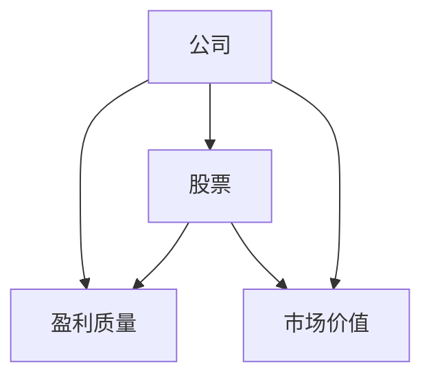

                 


# 特价股票与公司盈利质量的深度分析

> 关键词：特价股票、公司盈利质量、投资分析、财务指标、股票估值

> 摘要：本文深入分析了特价股票与公司盈利质量之间的关系，从核心概念、分析框架、数学模型到系统设计和项目实战，全面探讨了如何利用技术手段评估特价股票的投资价值，帮助投资者做出明智决策。

---

# 第一部分: 特价股票与公司盈利质量的背景介绍

## 第1章: 特价股票与公司盈利质量的核心概念

### 1.1 问题背景与问题描述
#### 1.1.1 特价股票的定义与特征
- 特价股票是指市场价格低于其内在价值的股票，通常出现在市场低估或公司短期困境时期。
- 特价股票的特征包括低市盈率、低市净率和高股息率等。

#### 1.1.2 公司盈利质量的定义与重要性
- 公司盈利质量是指公司盈利的健康程度，包括盈利的持续性、稳定性和增长性。
- 盈利质量高的公司通常具有稳定的现金流和健康的财务状况。

#### 1.1.3 特价股票与公司盈利质量的关联性
- 特价股票与公司盈利质量密切相关，高盈利质量的公司更可能具备长期投资价值。

### 1.2 问题解决与边界外延
#### 1.2.1 特价股票投资的核心问题
- 如何识别市场价格低于内在价值的股票。
- 如何评估公司的盈利质量和未来增长潜力。

#### 1.2.2 公司盈利质量分析的目标
- 通过财务指标分析公司盈利的健康程度和可持续性。

#### 1.2.3 特价股票与公司盈利质量的边界与外延
- 特价股票的分析范围包括所有上市股票，但重点关注低估值且高盈利质量的公司。

### 1.3 概念结构与核心要素组成
#### 1.3.1 特价股票的分析框架
- 包括估值指标（市盈率、市净率等）、财务指标（ROE、ROA等）和市场因素（行业趋势、宏观经济环境等）。

#### 1.3.2 公司盈利质量的评估指标
- 包括净利润、毛利率、ROE、现金流等。

#### 1.3.3 特价股票与公司盈利质量的关系模型
- 通过多维度指标构建模型，评估股票的内在价值和投资潜力。

---

# 第二部分: 特价股票与公司盈利质量的核心概念与联系

## 第2章: 特价股票与公司盈利质量的核心原理

### 2.1 核心概念原理
#### 2.1.1 特价股票的内在价值评估
- 内在价值是股票的合理价格，通过DCF模型等方法计算。
- $$ V = \frac{CF}{(r - g) } $$
  - 其中，CF为自由现金流，r为折现率，g为增长率。

#### 2.1.2 公司盈利质量的多维度分析
- 通过ROE、ROA、毛利率等指标分析公司盈利的健康程度。

#### 2.1.3 特价股票与公司盈利质量的协同效应
- 高盈利质量的公司更可能在市场低估时提供投资机会。

### 2.2 核心概念属性特征对比
#### 2.2.1 特价股票与非特价股票的对比分析
| 指标         | 特价股票       | 非特价股票     |
|--------------|----------------|----------------|
| 市盈率       | 低于行业平均   | 高于行业平均    |
| 市净率       | 低于行业平均   | 高于行业平均    |
| 股息率       | 较高           | 较低           |

#### 2.2.2 高盈利质量与低盈利质量公司的特征对比
| 指标         | 高盈利质量公司 | 低盈利质量公司 |
|--------------|----------------|----------------|
| 净利润增长   | 稳定且较高     | 波动且较低     |
| 现金流       | 健康           | 负债较高       |

#### 2.2.3 特价股票与公司盈利质量的动态关系
- 特价股票通常出现在高盈利质量公司的估值被市场低估时。

### 2.3 ER实体关系图架构



---

## 第3章: 特价股票与公司盈利质量的分析框架

### 3.1 特价股票分析的多维度框架
#### 3.1.1 估值指标
- 市盈率（P/E）、市净率（P/B）、股息率（Dividend Yield）等。
- $$ P/E = \frac{Price}{Earnings per Share} $$

#### 3.1.2 财务指标
- 净利润、ROE（$$ ROE = \frac{Net Profit}{Equity} $$）、现金流等。

#### 3.1.3 行业与宏观经济因素
- 行业周期、宏观经济环境对股票估值的影响。

### 3.2 公司盈利质量分析的多维度框架
#### 3.2.1 盈利能力
- 毛利率（$$ Gross Profit Margin = \frac{Gross Profit}{Revenue} $$）、净利率（Net Profit Margin）。

#### 3.2.2 财务健康状况
- 负债率、流动比率（$$ Current Ratio = \frac{Current Assets}{Current Liabilities} $$）、速动比率。

#### 3.2.3 现金流状况
- 经营活动现金流、投资活动现金流、筹资活动现金流。

### 3.3 特价股票与公司盈利质量的综合分析
#### 3.3.1 识别低估值股票
- 通过比较市盈率、市净率等指标，找出市场价格低于内在价值的股票。

#### 3.3.2 评估公司盈利质量
- 通过ROE、现金流等指标，评估公司的盈利健康程度和可持续性。

#### 3.3.3 综合评估
- 结合估值和盈利质量，筛选出具有投资价值的特价股票。

---

## 第4章: 特价股票与公司盈利质量的数学模型

### 4.1 特价股票的估值模型
#### 4.1.1 市盈率模型
- $$ P = E \times P/E_{target} $$
  - 其中，$$ P_{target} $$为目标市盈率，$$ E $$为每股收益。

#### 4.1.2 市净率模型
- $$ P = B \times P/B_{target} $$
  - 其中，$$ B $$为每股净资产，$$ P/B_{target} $$为目标市净率。

### 4.2 公司盈利质量的评估模型
#### 4.2.1 ROE模型
- $$ ROE = \frac{Net Profit}{Equity} $$
- $$ Equity = Assets - Liabilities $$

#### 4.2.2 现金流模型
- $$ Free Cash Flow = Operating Cash Flow - Capital Expenditure $$

### 4.3 综合评估模型
#### 4.3.1 综合评分法
- 根据估值和盈利质量指标，对股票进行综合评分。

#### 4.3.2 多因子模型
- 通过回归分析，确定影响股票价值的关键因子。

---

## 第5章: 特价股票与公司盈利质量的系统分析与架构设计

### 5.1 系统功能设计
#### 5.1.1 数据采集模块
- 从股票数据库中获取历史价格、财务数据等。

#### 5.1.2 数据预处理模块
- 清洗数据、填补缺失值、标准化数据。

#### 5.1.3 特价股票筛选模块
- 根据估值指标筛选出低估值股票。

#### 5.1.4 盈利质量评估模块
- 根据财务指标评估公司的盈利质量。

#### 5.1.5 综合评估模块
- 结合估值和盈利质量，筛选出具有投资价值的特价股票。

### 5.2 系统架构设计
#### 5.2.1 分层架构
- 数据层、业务逻辑层、用户界面层。

#### 5.2.2 模块化设计
- 数据采集、预处理、评估、结果展示。

---

## 第6章: 特价股票与公司盈利质量的项目实战

### 6.1 项目环境安装
#### 6.1.1 Python环境安装
- 安装Python、Pandas、NumPy、Scikit-learn等库。

#### 6.1.2 数据库安装
- 使用MySQL或MongoDB存储股票数据。

### 6.2 系统核心实现
#### 6.2.1 数据采集
```python
import pandas as pd
import requests

url = "http://example.com/stock_data"
response = requests.get(url)
data = response.json()
df = pd.DataFrame(data)
```

#### 6.2.2 数据预处理
```python
df.dropna(inplace=True)
df['PE'] = df['Price'] / df['Earnings per Share']
```

#### 6.2.3 特价股票筛选
```python
low_pe_stocks = df[df['PE'] < df['PE'].mean()]
```

#### 6.2.4 盈利质量评估
```python
high_roe_stocks = low_pe_stocks[low_pe_stocks['ROE'] > low_pe_stocks['ROE'].mean()]
```

### 6.3 实际案例分析
#### 6.3.1 案例背景
- 分析某行业的特价股票。

#### 6.3.2 数据分析
- 使用Python代码进行数据清洗和特征提取。

#### 6.3.3 结果展示
- 绘制图表展示分析结果。

---

## 第7章: 特价股票与公司盈利质量的总结与展望

### 7.1 总结
- 特价股票与公司盈利质量的分析需要结合估值和财务指标。
- 通过系统化的方法可以提高投资决策的准确性。

### 7.2 投资建议
- 投资者应关注低估值且高盈利质量的公司。
- 长期投资是获取超额收益的关键。

### 7.3 注意事项
- 特价股票的投资需谨慎，注意市场风险。
- 定期更新分析模型，适应市场变化。

### 7.4 拓展阅读
- 推荐书籍：《价值投资入门》、《股票投资实战策略》。
- 推荐网站：Morningstar、FactSet。

---

通过以上目录结构，我们可以系统地分析特价股票与公司盈利质量的关系，结合理论与实践，帮助投资者做出明智的投资决策。

