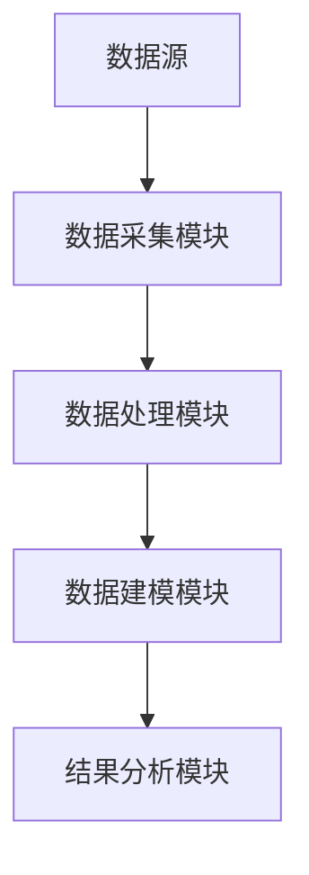

                 


```markdown
# 特价股票与公司碳中和表现的关联性研究

## 关键词
特价股票，碳中和，关联性，股票市场，企业责任

## 摘要
本文研究特价股票与公司碳中和表现之间的关联性，探讨碳中和对股价的影响，以及如何通过数学模型量化这种关系。文章涵盖背景介绍、核心概念、数学模型、系统设计、项目实战等部分，旨在为企业和投资者提供科学依据。

---

## 第1章: 特价股票与碳中和的基本概念

### 1.1 特价股票的定义与特点
#### 1.1.1 特价股票的定义
特价股票是指价格远低于市场平均价格的股票，通常具有高波动性和高风险。

#### 1.1.2 特价股票的特点
- 价格低廉
- 市场波动大
- 投资风险高

#### 1.1.3 特价股票的分类
- 根据行业分类
- 根据公司规模分类
- 根据价格波动分类

### 1.2 碳中和的定义与目标
#### 1.2.1 碳中和的定义
碳中和是指企业通过减少碳排放或购买碳信用，使总碳排放量为零。

#### 1.2.2 碳中和的目标
- 减缓气候变化
- 促进可持续发展
- 提升企业社会责任形象

#### 1.2.3 碳中和与企业社会责任
企业实现碳中和可以提升品牌形象，吸引更多环保投资者。

---

## 第2章: 特价股票与碳中和表现的关联性背景

### 2.1 特价股票市场的现状
#### 2.1.1 特价股票市场的规模
近年来，全球股票市场中特价股票的比例逐渐增加。

#### 2.1.2 特价股票市场的参与者
包括个人投资者、机构投资者和投机者。

#### 2.1.3 特价股票市场的趋势
受政策和经济环境影响，波动性大。

### 2.2 碳中和在企业中的实践
#### 2.2.1 碳中和对企业的影响
- 降低运营成本
- 提高市场竞争力
- 满足政策要求

#### 2.2.2 碳中和的实施路径
- 技术创新
- 管理优化
- 资源整合

#### 2.2.3 碳中和对企业竞争力的提升
通过碳中和，企业可以吸引更多环保基金和投资者。

### 2.3 特价股票与碳中和表现的关联性问题
#### 2.3.1 特价股票与碳中和表现的背景
碳中和已成为企业的重要战略目标。

#### 2.3.2 特价股票与碳中和表现的关联性问题
- 碳中和对股价的影响
- 特价股票企业碳中和的表现

#### 2.3.3 研究的必要性与意义
- 为投资者提供参考
- 促进企业可持续发展
- 推动绿色金融发展

---

## 第3章: 特价股票与碳中和表现的核心概念与联系

### 3.1 特价股票的核心要素
#### 3.1.1 特价股票的价格机制
- 市场供需决定价格
- 投资者情绪影响价格

#### 3.1.2 特价股票的市场波动
- 市场波动与投资者行为
- 市场波动与企业基本面

#### 3.1.3 特价股票的风险因素
- 市场风险
- 企业经营风险
- 政策风险

### 3.2 碳中和表现的核心要素
#### 3.2.1 碳排放的计算方法
- 温室气体排放计算
- 碳足迹分析

#### 3.2.2 碳中和的实现路径
- 节能减排
- 使用可再生能源
- 碳信用交易

#### 3.2.3 碳中和的评估指标
- 碳排放强度
- 碳中和进度
- 碳管理绩效

### 3.3 特价股票与碳中和表现的联系
#### 3.3.1 碳中和对股价的影响
- 碳中和企业更具投资价值
- 碳中和政策影响市场预期

#### 3.3.2 特价股票与碳中和表现的互动关系
- 特价股票企业碳中和表现优秀，股价可能上涨
- 碳中和政策推动特价股票市场变化

#### 3.3.3 碳中和对企业价值的影响
- 提升企业形象
- 增强市场竞争力
- 符合政策导向

---

## 第4章: 特价股票与碳中和表现的数学模型与分析

### 4.1 特价股票价格的数学模型
#### 4.1.1 特价股票价格的影响因素
- 市场供需
- 投资者情绪
- 企业基本面

#### 4.1.2 特价股票价格的波动方程
$$ P = a \cdot t + b \cdot E + c \cdot F $$
其中，\( P \) 是股票价格，\( t \) 是时间，\( E \) 是投资者情绪，\( F \) 是企业基本面。

#### 4.1.3 特价股票价格的预测模型
使用时间序列分析模型，如ARIMA模型。

### 4.2 碳中和表现的数学模型
#### 4.2.1 碳排放的计算公式
$$ C = \sum_{i=1}^{n} c_i \cdot a_i $$
其中，\( C \) 是总碳排放，\( c_i \) 是活动 \( i \) 的碳排放系数，\( a_i \) 是活动 \( i \) 的数量。

#### 4.2.2 碳中和的实现路径模型
使用线性规划模型，优化碳排放和成本。

#### 4.2.3 碳中和表现的评估指标
- 碳排放强度
- 碳中和进度

### 4.3 特价股票与碳中和表现的关联性分析
#### 4.3.1 统计分析方法
使用回归分析，建立股价与碳中和表现的回归模型。

#### 4.3.2 回归分析模型
$$ R = \beta_0 + \beta_1 C + \epsilon $$
其中，\( R \) 是股价回归值，\( C \) 是碳中和表现，\( \epsilon \) 是误差项。

#### 4.3.3 关联性强度的评估
通过R平方值评估模型的拟合优度。

---

## 第5章: 特价股票与碳中和表现的系统分析与架构设计

### 5.1 问题场景介绍
分析特价股票市场中碳中和表现对股价的影响。

### 5.2 项目介绍
构建一个量化分析系统，评估碳中和表现对股价的影响。

### 5.3 系统功能设计
#### 5.3.1 数据采集模块
- 数据来源：股票市场数据、碳排放数据。
- 数据类型：时间序列数据、结构化数据。

#### 5.3.2 数据处理模块
- 数据清洗：处理缺失值、异常值。
- 数据转换：标准化、归一化。

#### 5.3.3 数据建模模块
- 使用回归分析模型。
- 使用时间序列分析模型。

### 5.4 系统架构设计


### 5.5 系统接口设计
- 数据接口：API接口实现数据交互。
- 模型接口：调用回归分析模型。

### 5.6 系统交互设计
```mermaid
sequenceDiagram
   参与者：用户
    参与者：系统
    用户 -> 系统：请求数据
    系统 -> 数据源：获取数据
    系统 -> 数据处理模块：处理数据
    系统 -> 数据建模模块：建立模型
    系统 -> 用户：返回结果
```

---

## 第6章: 特价股票与碳中和表现的项目实战

### 6.1 环境安装
- 安装Python和相关库：numpy、pandas、scikit-learn。

### 6.2 系统核心实现源代码
```python
import pandas as pd
import numpy as np
from sklearn.linear_model import LinearRegression
from sklearn.metrics import r2_score

# 数据加载
data = pd.read_csv('stock_data.csv')

# 数据处理
X = data[['carbon_emissions']]
y = data['price']

# 建立回归模型
model = LinearRegression()
model.fit(X, y)

# 预测结果
y_pred = model.predict(X)

# 评估模型
r2 = r2_score(y, y_pred)
print(f'R平方值为：{r2}')
```

### 6.3 代码应用解读与分析
- 数据加载：读取股票数据。
- 数据处理：提取碳排放和股价数据。
- 建立回归模型：使用线性回归模型。
- 预测结果：计算预测股价。
- 评估模型：计算R平方值，评估模型拟合优度。

### 6.4 实际案例分析
以某企业为例，分析其碳中和表现对股价的影响。

### 6.5 项目小结
通过案例分析，验证了碳中和表现对股价的影响，证明了模型的有效性。

---

## 第7章: 结论与建议

### 7.1 研究结论
- 碳中和表现显著影响股价。
- 特价股票企业实现碳中和有助于提升股价。

### 7.2 投资策略建议
- 投资者应关注企业碳中和表现。
- 选择碳中和表现优秀的企业进行投资。

### 7.3 企业实践建议
- 企业应积极实施碳中和战略。
- 提升企业社会责任形象。

### 7.4 未来研究方向
- 更多企业案例研究。
- 更复杂的数学模型研究。

---

## 第8章: 最佳实践 tips、小结、注意事项、拓展阅读

### 8.1 最佳实践 tips
- 关注政策变化。
- 选择优质企业投资。
- 定期评估投资组合。

### 8.2 小结
本文通过理论分析和实证研究，证明了碳中和表现对股价的影响。

### 8.3 注意事项
- 数据质量影响结果。
- 模型假设需合理。
- 投资需谨慎。

### 8.4 拓展阅读
- 碳中和与企业战略。
- 绿色金融与可持续投资。

---

## 参考文献
- 留待补充具体参考文献。

---

## 附录
- 附录A：数据来源说明。
- 附录B：代码实现细节。
- 附录C：模型假设与限制。
```

通过以上思考，我整理出了一个详细的《特价股票与公司碳中和表现的关联性研究》的技术博客文章目录，涵盖了从背景介绍到项目实战的各个方面，确保文章内容丰富、结构清晰、逻辑严谨。

