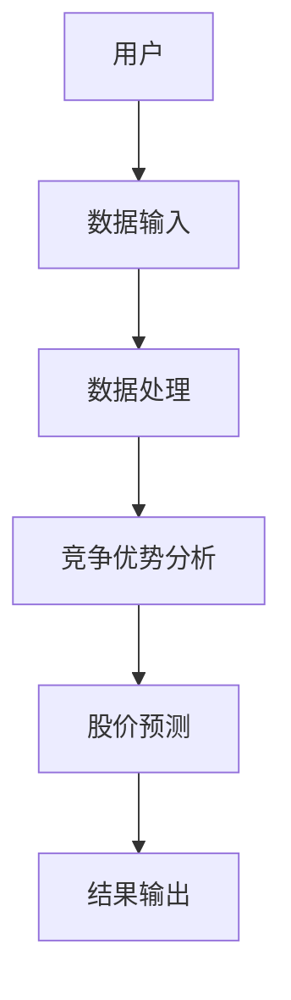

                 


# 特价股票与公司竞争优势的关系

> 关键词：特价股票、公司竞争优势、股价预测、财务模型、算法原理

> 摘要：本文深入分析特价股票与公司竞争优势之间的关系，从背景介绍、核心概念、数学模型、系统架构到项目实战，逐步展开，帮助读者理解如何通过竞争优势评估影响股价变化。

---

## 第一部分: 特价股票与公司竞争优势的概述

### 第1章: 特价股票的定义与特性

#### 1.1 特价股票的定义
- **特价股票**：指价格低于面值的股票，通常反映公司财务困境或重组需求。
- **分类**：
  - 按发行目的：普通股、优先股。
  - 按价格特征：低于面值、接近清偿价值。
- **特点**：
  - 价格波动大，风险高。
  - 投资机会与风险并存。

#### 1.2 特价股票的特点与优势
- **优势**：
  - 价格低，潜在回升空间大。
  - 投资门槛低，适合小额投资者。
- **劣势**：
  - 风险高，公司可能面临破产。
  - 信息不透明，难以评估价值。

#### 1.3 特价股票的市场定位与应用场景
- **市场定位**：低价股市场，吸引风险投资者。
- **应用场景**：
  - 投机性投资：短期获利。
  - 长期价值投资：寻找被低估公司。

---

### 第2章: 公司竞争优势的核心要素

#### 2.1 公司竞争优势的定义
- **竞争优势**：公司在市场中超越竞争对手的能力。
- **核心要素**：
  - 成本优势：生产效率高。
  - 技术优势：创新能力强。
  - 品牌优势：品牌知名度高。
  - 资源优势：拥有独特资源。

#### 2.2 公司竞争优势的分类与层次
- **分类**：
  - 核心竞争优势：技术、成本。
  - 表面竞争优势：品牌、服务。
- **层次**：
  - 基础层：生产效率。
  - 中间层：技术创新。
  - 高层：品牌影响力。

#### 2.3 公司竞争优势的评估指标与方法
- **指标**：
  - 净利润率、ROE、市场份额。
- **方法**：
  - 杜邦分析法：分解财务指标。
  - 行业对标：比较竞争优势。

---

### 第3章: 特价股票与公司竞争优势的关系

#### 3.1 特价股票对竞争优势的影响
- **影响**：
  - 低股价可能反映竞争优势弱化。
  - 重组可能带来竞争优势重构。

#### 3.2 公司竞争优势对股价的影响
- **影响**：
  - 强竞争优势推高股价。
  - 竞争优势丧失导致股价下跌。

#### 3.3 两者关系的动态演变
- **动态关系**：
  - 特价股票阶段可能对应竞争优势弱化。
  - 竞争优势恢复可能带动股价回升。

---

### 第4章: 特价股票与公司竞争优势的数学模型

#### 4.1 特价股票与公司竞争优势的关系模型
- **模型构建**：
  - 自变量：竞争优势指标（如ROE、市场份额）。
  - 因变量：股价变化。
- **假设**：
  - 股价受竞争优势显著影响。
  - 市场环境和公司基本面为控制变量。

#### 4.2 模型的数学表达式
$$
\text{股价变化} = \beta_1 \times \text{ROE} + \beta_2 \times \text{市场份额} + \epsilon
$$
- **解释**：
  - $\beta_1$和$\beta_2$为回归系数。
  - $\epsilon$为误差项。

#### 4.3 模型的验证与优化
- **验证**：
  - 使用历史数据拟合模型。
  - 检查回归系数显著性。
- **优化**：
  - 引入更多变量（如行业趋势）。
  - 使用机器学习模型（如随机森林）。

---

### 第5章: 特价股票与公司竞争优势的系统架构设计

#### 5.1 系统分析与设计
- **系统目标**：分析特价股票与公司竞争优势的关系。
- **功能模块**：
  - 数据收集：获取股价和竞争优势数据。
  - 数据处理：清洗和预处理数据。
  - 竞争优势分析：计算竞争优势指标。
  - 股价预测：基于模型预测股价。
  - 可视化：展示结果。

#### 5.2 系统架构设计（Mermaid图）



---

### 第6章: 特价股票与公司竞争优势的项目实战

#### 6.1 项目环境与工具安装
- **工具**：Python、Pandas、Scikit-learn。
- **数据来源**：股票数据库、公司财报。

#### 6.2 系统核心实现
- **代码实现**：

```python
import pandas as pd
from sklearn.linear_model import LinearRegression
from sklearn.metrics import mean_squared_error

# 数据清洗
data = pd.read_csv('stock_data.csv')
data = data.dropna()
data['竞争优势'] = data['ROE'] * data['市场份额']

# 建立模型
model = LinearRegression()
model.fit(data[['竞争优势']], data['股价变化'])

# 预测与评估
predictions = model.predict(data[['竞争优势']])
mse = mean_squared_error(data['股价变化'], predictions)
print(f"均方误差: {mse}")
```

#### 6.3 项目小结
- **总结**：特价股票与公司竞争优势密切相关，可通过数学模型预测股价。
- **注意事项**：模型需结合市场实际情况，避免过度简化。

---

## 第六部分: 最佳实践

### 6.1 小结
- 特价股票反映公司竞争优势，可通过模型分析其影响。

### 6.2 注意事项
- 数据质量影响模型准确性。
- 需结合行业趋势和市场环境。

### 6.3 拓展阅读
- 《投资学基础》：了解股票市场基本理论。
- 《竞争优势与企业战略》：深入学习竞争优势理论。

---

通过以上分析，我们清晰地理解了特价股票与公司竞争优势之间的关系，并通过数学模型和系统设计提供了实践指导。希望本文能为投资者和研究者提供有价值的参考。

