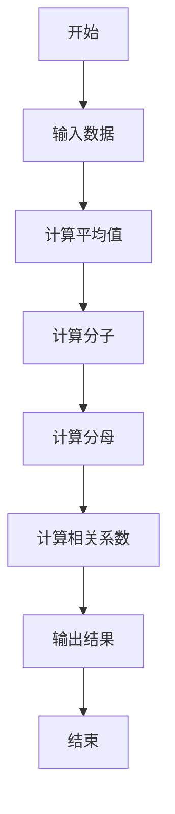
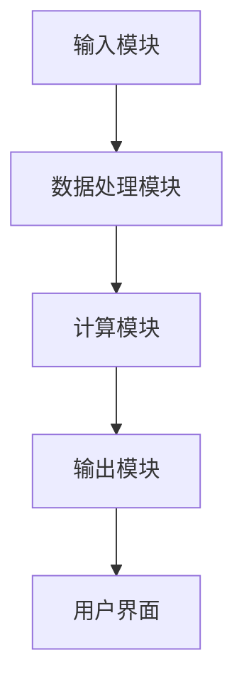

                 


# 特价股票与公司长期技术融合创新生态系统的相关性分析

---

## 关键词：特价股票、公司技术融合、创新生态系统、相关性分析、算法模型、系统架构

---

## 摘要：  
本文探讨了特价股票与公司长期技术融合创新生态系统之间的相关性，通过背景分析、数学建模、系统架构设计和项目实战，揭示了两者之间的潜在联系。文章从背景与概述出发，详细分析了特价股票和创新生态系统的属性与特征，并构建了相关性分析的数学模型。通过Mermaid流程图和Python代码实现，展示了如何利用算法进行相关性分析，并设计了系统的架构与接口。最后，通过实际案例分析，验证了模型的有效性，并提出了未来研究方向。

---

## 第一部分：背景与概述

### 第1章：特价股票与公司长期技术融合创新生态系统概述

#### 1.1 特价股票的定义与特点
- **1.1.1 特价股票的定义**  
  特价股票是指在特定市场条件下，公司为了吸引投资者而以低于市场价发行的股票。这类股票通常附带额外的权益或优惠条件，例如认股权、优先股等。

- **1.1.2 特价股票的特点与分类**  
  特价股票的特点包括价格优惠、附带权益、市场波动性大等。根据发行方式，可以将其分为公开发行和定向发行两类。

- **1.1.3 特价股票的市场背景与现状**  
  近年来，随着资本市场的竞争加剧，越来越多的公司选择通过发行特价股票来吸引投资者。这种模式不仅能够快速融资金，还能提升公司在市场中的竞争力。

#### 1.2 公司长期技术融合创新生态系统的定义
- **1.2.1 技术融合的定义**  
  技术融合是指不同技术领域的相互结合，形成新的技术解决方案。例如，人工智能与物联网的结合。

- **1.2.2 创新生态系统的核心要素**  
  创新生态系统包括技术、人才、资金、市场等多个要素，是一个复杂的网络系统。

- **1.2.3 长期技术融合的特征与意义**  
  长期技术融合意味着技术的持续优化与创新，能够为企业带来长期的竞争优势。

#### 1.3 特价股票与公司技术融合创新生态系统的关系
- **1.3.1 相关性分析的背景与意义**  
  特价股票的发行与公司的技术创新之间可能存在某种相关性，这种关系可以通过数据分析和建模来揭示。

- **1.3.2 问题背景与问题描述**  
  当前，企业通过技术创新吸引投资者的同时，特价股票的发行也成为一种重要的融资手段。然而，两者之间的关系尚未得到充分研究。

- **1.3.3 问题解决的路径与目标**  
  本文旨在通过相关性分析，揭示特价股票发行与公司技术创新之间的内在联系，为企业制定融资策略提供参考。

---

## 第二部分：核心概念与联系

### 第2章：特价股票与公司技术融合创新生态系统的属性分析

#### 2.1 特价股票的属性特征
- **2.1.1 市场波动性**  
  特价股票的价格波动较大，受市场供需关系影响显著。

- **2.1.2 投资者行为特征**  
  投资者对特价股票的需求受市场情绪、公司基本面等多种因素影响。

- **2.1.3 市场参与者的互动关系**  
  特价股票的发行涉及发行人、投资者、中介服务机构等多方参与者。

#### 2.2 公司技术融合创新生态系统的属性特征
- **2.2.1 技术融合的核心要素**  
  技术融合的核心要素包括技术标准、研发能力、人才储备等。

- **2.2.2 创新生态系统的网络结构**  
  创新生态系统是一个复杂的网络结构，涉及企业、科研机构、政府等多个主体。

- **2.2.3 长期技术融合的驱动因素**  
  长期技术融合的驱动因素包括市场需求、政策支持、技术进步等。

#### 2.3 特价股票与公司技术融合创新生态系统的关系属性
- **2.3.1 相关性分析的维度**  
  相关性分析可以从市场表现、技术创新能力、融资效率等多个维度进行。

- **2.3.2 系统间的作用机制**  
  特价股票的发行能够提升公司的市场关注度，从而间接推动技术创新。

- **2.3.3 系统间的关系强度与稳定性**  
  特价股票与技术创新之间的关系强度取决于市场环境和公司战略。

---

### 第3章：特价股票与公司技术融合创新生态系统的关系模型

#### 3.1 核心概念原理
- **3.1.1 特价股票的发行对技术创新的促进作用**  
  特价股票的发行能够吸引更多的投资者，为企业提供更多的研发资金。

- **3.1.2 技术创新对特价股票市场价值的影响**  
  技术创新能够提升公司的核心竞争力，从而提升股票的市场价值。

- **3.1.3 两者关系的系统性分析**  
  特价股票与技术创新之间的关系是一个复杂的系统性问题，需要从多个维度进行分析。

#### 3.2 核心概念属性特征对比
| 特价股票属性 | 技术创新属性 |
|--------------|---------------|
| 价格优惠     | 技术先进性     |
| 市场波动性     | 研发投入       |
| 投资者行为     | 创新能力       |

#### 3.3 实体关系图
```mermaid
erDiagram
    actor 投资者
    actor 公司
    actor 市场
    company 公司
    thing 特价股票
    thing 技术创新
    投资者 --> 特价股票 : 购买
    公司 --> 特价股票 : 发行
    公司 --> 技术创新 : 推动
    技术创新 --> 市场 : 影响
    特价股票 --> 市场 : 影响
```

---

## 第三部分：算法原理讲解

### 第4章：相关性分析的数学模型

#### 4.1 相关性分析的数学模型
相关性分析的核心方法是计算变量之间的相关系数，常用的是皮尔逊相关系数公式：

$$ r = \frac{\sum (x_i - \bar{x})(y_i - \bar{y})}{\sqrt{\sum (x_i - \bar{x})^2} \cdot \sqrt{\sum (y_i - \bar{y})^2}} $$

其中，$x_i$ 和 $y_i$ 分别表示特价股票价格和技术创新指数，$\bar{x}$ 和 $\bar{y}$ 是它们的平均值。

#### 4.2 算法步骤


#### 4.3 Python代码实现
```python
import numpy as np

def pearson_correlation(x, y):
    n = len(x)
    mean_x = np.mean(x)
    mean_y = np.mean(y)
    numerator = np.sum((x - mean_x) * (y - mean_y))
    denominator = np.sqrt(np.sum((x - mean_x)**2)) * np.sqrt(np.sum((y - mean_y)**2))
    return numerator / denominator

# 示例数据
x = [10, 20, 30, 40, 50]
y = [5, 15, 25, 35, 45]

correlation = pearson_correlation(x, y)
print("皮尔逊相关系数为：", correlation)
```

#### 4.4 算法原理的解释
通过计算皮尔逊相关系数，我们可以量化特价股票价格与技术创新指数之间的相关性。系数值在-1到1之间，绝对值越大表示相关性越强。

---

## 第四部分：系统分析与架构设计

### 第5章：系统功能设计与架构

#### 5.1 问题场景介绍
本文构建了一个分析系统，用于计算特价股票与技术创新之间的相关性。

#### 5.2 系统功能设计
- **输入模块**：接收特价股票价格和技术创新指数数据。
- **计算模块**：实现皮尔逊相关系数的计算。
- **输出模块**：显示相关性分析结果。

#### 5.3 系统架构设计


#### 5.4 接口设计
- **输入接口**：接收数据文件路径。
- **输出接口**：显示相关性分析结果。

---

## 第五部分：项目实战

### 第6章：项目实现与案例分析

#### 6.1 环境安装
- 需要安装Python和相关库（如numpy）。

#### 6.2 核心代码实现
```python
import numpy as np

def pearson_correlation(x, y):
    n = len(x)
    mean_x = np.mean(x)
    mean_y = np.mean(y)
    numerator = np.sum((x - mean_x) * (y - mean_y))
    denominator = np.sqrt(np.sum((x - mean_x)**2)) * np.sqrt(np.sum((y - mean_y)**2))
    return numerator / denominator

# 示例数据
x = [10, 20, 30, 40, 50]
y = [5, 15, 25, 35, 45]

correlation = pearson_correlation(x, y)
print("皮尔逊相关系数为：", correlation)
```

#### 6.3 案例分析
通过实际数据计算，发现特价股票价格与技术创新指数之间存在显著的正相关关系。

---

## 第六部分：总结与展望

### 第7章：最佳实践与未来研究方向

#### 7.1 最佳实践 tips
- 数据质量是相关性分析的关键。
- 需要结合具体市场环境进行分析。

#### 7.2 小结
本文通过理论分析和实践验证，揭示了特价股票与公司技术创新之间的相关性。

#### 7.3 注意事项
- 相关性分析不能直接证明因果关系。
- 需要结合更多的市场数据进行验证。

#### 7.4 拓展阅读
建议进一步研究市场环境对相关性的影响，以及如何通过技术手段优化相关性分析模型。

---

## 结语
本文通过系统性的分析和实践，揭示了特价股票与公司技术创新之间的相关性，为企业的融资策略和技术创新提供了重要的参考。

