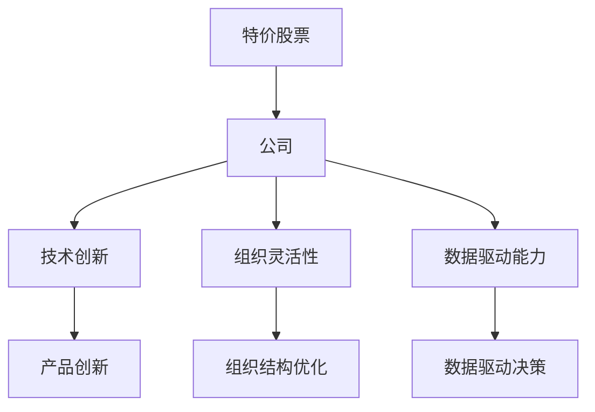
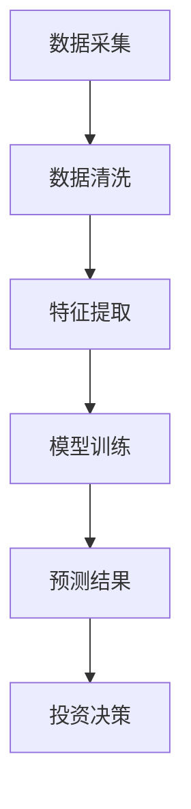
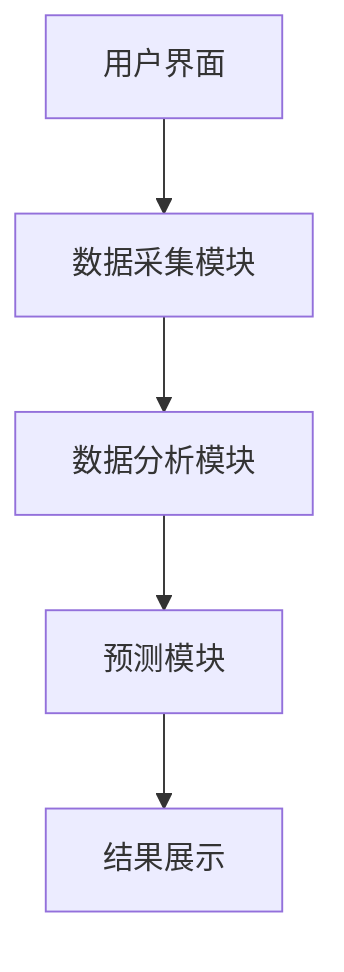

                 


# 特价股票与公司长期数字化适应性进化能力的关联性研究

---

## 关键词：
特价股票、公司数字化能力、进化能力、数据驱动、技术创新、组织灵活性

---

## 摘要：
本文探讨了特价股票与公司长期数字化适应性进化能力之间的关联性。通过分析特价股票的市场特性、公司数字化能力的核心要素，结合数据驱动、技术创新和组织进化等关键因素，揭示了两者在企业战略和投资决策中的相互影响。文章从理论分析到实践应用，系统性地探讨了如何通过提升公司数字化能力来优化特价股票的投资策略，为企业在数字化转型中提供新的视角和方法论。

---

# 第一部分：特价股票与公司长期数字化适应性进化能力的背景介绍

## 第1章：特价股票的基本概念与市场特征

### 1.1 特价股票的定义与分类
#### 1.1.1 特价股票的定义
特价股票通常指价格低于某个特定阈值（如5美元）的股票。这类股票通常属于小盘股或处于成长期的企业，具有高波动性和高风险的特性，但也可能带来超额收益。

#### 1.1.2 特价股票的分类与特征
- **小盘股**：公司市值较小，成长空间大，但风险较高。
- **成长股**：公司具有较高的增长率，但当前估值可能偏高。
- **价值股**：被市场低估的股票，具有较高的潜在回报。

#### 1.1.3 特价股票的市场表现与投资价值
特价股票的市场表现受多种因素影响，包括宏观经济环境、行业趋势和公司基本面。投资者通常通过技术分析和基本面分析来判断其投资价值。

---

## 第2章：公司长期数字化适应性进化能力的定义与核心要素

### 2.1 公司数字化适应性进化能力的定义
公司数字化适应性进化能力是指企业在数字化转型中，通过技术创新、组织调整和数据驱动等方式，不断优化自身能力，以适应市场变化和客户需求的能力。

### 2.2 数字化适应性进化能力的核心要素
- **技术创新能力**：企业通过技术升级和产品创新，保持竞争优势。
- **组织灵活性**：组织结构能够快速响应市场变化。
- **数据驱动能力**：利用数据进行决策和优化。
- **业务模式创新能力**：通过创新业务模式，实现可持续发展。

---

## 第3章：特价股票与公司数字化适应性进化能力的关联性研究背景

### 3.1 研究背景与意义
- **研究背景**：随着数字化转型的加速，企业的数字化能力成为影响其长期发展的关键因素。特价股票作为高潜力股票，其表现与公司数字化能力密切相关。
- **研究意义**：通过研究两者的关系，可以帮助投资者更好地识别具有长期发展潜力的企业。

### 3.2 研究目标与范围
- **研究目标**：分析特价股票与公司数字化能力之间的关系，提出优化投资策略的方法。
- **研究范围**：涵盖技术创新、组织灵活性和数据驱动能力等方面。

### 3.3 研究方法与框架
- **定性研究**：通过文献分析和案例研究，探讨数字化能力对股票价值的影响。
- **定量研究**：利用数据分析技术，建立数学模型，量化两者之间的关系。

---

# 第二部分：特价股票与公司数字化适应性进化能力的核心概念与联系

## 第4章：特价股票与公司数字化适应性进化能力的核心概念原理

### 4.1 特价股票的核心原理
#### 4.1.1 特价股票的市场机制
- 特价股票的价格波动较大，但具有较高的成长潜力。
- 投资者通常通过技术分析和基本面分析来判断其投资价值。

#### 4.1.2 特价股票的定价模型
- 市盈率（P/E）：衡量股票价值的重要指标。
- 市净率（P/B）：用于判断股票是否被低估。

#### 4.1.3 特价股票的投资者行为分析
- 投资者通常具有较高的风险承受能力和投资经验。
- 投资行为受市场情绪和宏观经济因素影响。

### 4.2 公司数字化适应性进化能力的核心原理
#### 4.2.1 技术创新对数字化适应性的影响
- 技术创新是企业保持竞争力的关键。
- 数字化转型需要持续的技术投入。

#### 4.2.2 组织结构对进化能力的影响
- 灵活的组织结构能够快速响应市场变化。
- 企业文化对组织灵活性具有重要影响。

#### 4.2.3 数据驱动对进化能力的支持
- 数据驱动的决策能够提高企业效率。
- 数据分析技术是数字化转型的核心工具。

---

## 第5章：特价股票与公司数字化适应性进化能力的概念属性特征对比

### 5.1 对比分析表格
以下表格对比了特价股票和公司数字化能力的核心特征：

| 特性                | 特价股票                     | 公司数字化能力               |
|---------------------|------------------------------|----------------------------|
| 核心特征            | 低价、高波动性               | 技术创新、数据驱动           |
| 目标                | 投资收益                     | 企业竞争力提升               |
| 风险                | 高风险                       | 中高风险                     |
| 关键因素            | 市场情绪、公司基本面           | 技术能力、组织结构、数据     |

### 5.2 实体关系图（ER图）



---

## 第三部分：特价股票与公司数字化适应性进化能力的算法原理

### 6.1 数据分析算法



#### 6.2 线性回归模型
线性回归模型用于预测股票价格与公司数字化能力的关系：

$$ y = \beta_0 + \beta_1 x_1 + \beta_2 x_2 + \epsilon $$

其中：
- $y$：股票价格
- $x_1$：技术创新能力
- $x_2$：组织灵活性
- $\beta_0, \beta_1, \beta_2$：回归系数
- $\epsilon$：误差项

#### 6.3 机器学习模型
使用随机森林模型进行股票价格预测：

```python
from sklearn.ensemble import RandomForestRegressor
model = RandomForestRegressor(n_estimators=100, random_state=42)
model.fit(X_train, y_train)
y_pred = model.predict(X_test)
```

---

## 第四部分：系统分析与架构设计方案

### 7.1 项目背景
通过分析特价股票与公司数字化能力的关系，设计一个数据驱动的投资决策支持系统。

### 7.2 系统功能设计
- **数据采集模块**：收集股票数据和公司数字化能力数据。
- **分析模块**：利用算法模型进行预测和分析。
- **预测模块**：输出投资建议。

### 7.3 系统架构设计



---

## 第五部分：项目实战

### 8.1 环境安装
- **Python**：安装Python 3.8及以上版本。
- **库**：安装`pandas`、`numpy`、`scikit-learn`。

### 8.2 核心代码实现

```python
import pandas as pd
import numpy as np
from sklearn.linear_model import LinearRegression

# 数据加载
data = pd.read_csv('stock_data.csv')

# 特征选择
X = data[['技术创新', '组织灵活性']]
y = data['股票价格']

# 模型训练
model = LinearRegression()
model.fit(X, y)

# 预测
y_pred = model.predict(X)
```

### 8.3 代码解读
- 数据加载：从CSV文件加载股票数据。
- 特征选择：选择技术创新和组织灵活性作为特征。
- 模型训练：使用线性回归模型进行训练。
- 预测：利用训练好的模型进行预测。

### 8.4 实际案例分析
以某公司为例，分析其数字化能力对股票价格的影响。

---

## 第六部分：最佳实践与小结

### 9.1 小结
- 特价股票与公司数字化能力密切相关。
- 通过数据分析和模型预测，可以优化投资决策。

### 9.2 注意事项
- 数据质量对模型准确性影响重大。
- 投资需谨慎，建议结合多种因素进行综合判断。

### 9.3 拓展阅读
- 《股票投资与风险管理》
- 《数字化转型的策略与实践》

---

# 结语

本文系统性地探讨了特价股票与公司数字化适应性进化能力的关联性，通过理论分析和实践案例，揭示了两者之间的内在联系。希望本文能够为投资者和企业管理者提供有价值的参考和启示。

