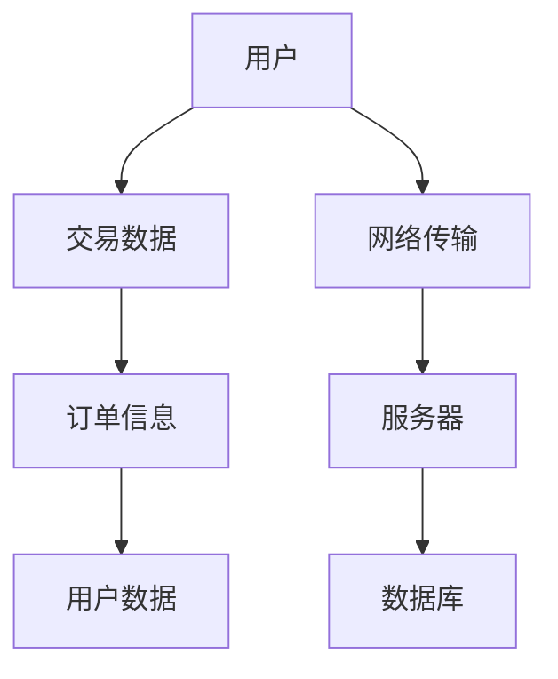
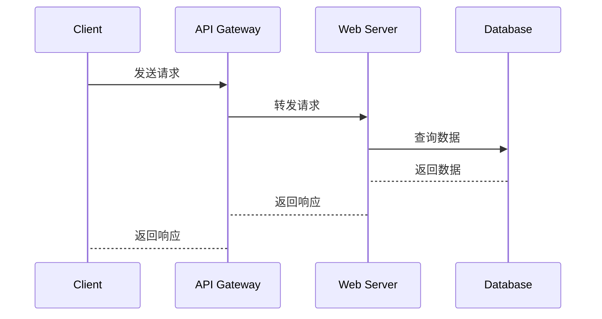

                 


### 《特价股票投资中的数据隐私与网络安全风险评估方法》

#### 关键词：
- 特价股票投资
- 数据隐私
- 网络安全
- 风险评估
- 数据安全算法
- 金融数据分析

#### 摘要：
本文系统地探讨了在特价股票投资中，数据隐私与网络安全的重要性及其风险评估方法。通过分析数据隐私和网络安全的核心概念，结合实际案例，详细讲解了相关的算法原理和系统架构设计，为投资者和金融机构提供了有效的数据安全解决方案。本文旨在帮助读者理解如何在金融投资中保护数据隐私，防范网络安全风险，确保投资的安全性和收益性。

---

### 第一部分: 特价股票投资中的数据隐私与网络安全概述

#### 第1章: 特价股票投资与数据隐私概述

##### 1.1 特价股票投资的基本概念

###### 1.1.1 特价股票的定义与特点

特价股票是指在特定条件下，以低于市场价出售的股票。其特点包括高波动性、高风险和高回报潜力。特价股票投资需要依赖实时数据分析和精确的算法支持。

###### 1.1.2 特价股票投资的基本原理

投资者通过分析市场数据、公司基本面和技术指标，寻找投资机会。投资决策依赖于对数据的准确理解和快速响应。

###### 1.1.3 特价股票投资的市场现状

当前市场中，特价股票交易日益频繁，数据隐私和网络安全问题也随之凸显，成为投资者和金融机构关注的焦点。

##### 1.2 数据隐私与网络安全的基本概念

###### 1.2.1 数据隐私的定义与重要性

数据隐私指保护个人数据不被未经授权的访问和使用。在金融领域，数据隐私保护尤为重要，直接关系到投资者的资产安全。

###### 1.2.2 网络安全的基本概念

网络安全是指保护网络系统免受未经授权的访问、破坏和信息泄露。在金融交易中，网络安全是保障投资安全的核心。

###### 1.2.3 特价股票投资中数据隐私与网络安全的特殊性

特价股票投资涉及大量敏感数据，如交易记录和用户信息，这些数据的泄露可能导致严重的经济损失和信誉损害。

##### 1.3 特价股票投资中的数据隐私与网络安全问题

###### 1.3.1 数据隐私与网络安全的相互关系

数据隐私是网络安全的重要组成部分，两者相辅相成，共同保护投资者的资产安全。

###### 1.3.2 特价股票投资中常见的数据隐私与网络安全风险

包括数据泄露、网络攻击和未经授权的访问等，这些风险可能导致投资损失和数据损坏。

###### 1.3.3 特价股票投资中数据隐私与网络安全问题的解决思路

通过建立完善的加密算法、访问控制机制和实时监控系统，有效降低数据隐私和网络安全风险。

##### 1.4 本章小结

本章介绍了特价股票投资的基本概念和数据隐私与网络安全的重要性，分析了两者在投资中的相互关系和面临的挑战。

#### 第2章: 特价股票投资中的数据隐私与网络安全核心概念

##### 2.1 数据隐私与网络安全的核心概念

###### 2.1.1 数据隐私的核心要素

包括数据加密、访问控制和数据脱敏，确保数据在存储和传输过程中的安全。

###### 2.1.2 网络安全的核心要素

包括防火墙、入侵检测系统和身份验证，保障网络系统的安全性。

###### 2.1.3 特价股票投资中的数据隐私与网络安全的特殊性

投资数据涉及大量敏感信息，需采取特殊的安全措施进行保护。

##### 2.2 数据隐私与网络安全的对比分析

###### 2.2.1 数据隐私与网络安全的属性对比

数据隐私侧重于数据的机密性和完整性，而网络安全侧重于系统的可用性和抗攻击能力。

###### 2.2.2 数据隐私与网络安全的关系

两者相互依存，共同构建投资数据的安全防护体系。

###### 2.2.3 数据隐私与网络安全的共同挑战

包括技术复杂性和合规性要求，需要综合解决方案。

##### 2.3 数据隐私与网络安全的ER实体关系图



##### 2.4 本章小结

本章通过对比分析和ER图，详细阐述了数据隐私与网络安全的核心概念及其在投资中的应用。

#### 第3章: 特价股票投资中的数据隐私与网络安全算法原理

##### 3.1 数据隐私保护算法

###### 3.1.1 数据加密算法

使用AES加密算法对交易数据进行加密，确保数据在传输过程中的安全性。

###### 3.1.2 数据脱敏算法

对敏感数据进行匿名化处理，如随机替换和打乱字段顺序。

###### 3.1.3 数据访问控制算法

基于角色的访问控制（RBAC）模型，确保只有授权人员可以访问特定数据。

##### 3.2 网络安全防护算法

###### 3.2.1 网络流量监测算法

使用深度包检测（DPI）技术实时监控网络流量，识别异常行为。

###### 3.2.2 恶意代码检测算法

采用启发式分析和特征匹配技术，识别和阻止恶意代码。

###### 3.2.3 认证授权算法

使用数字证书和多因素认证技术，确保用户身份的真实性。

##### 3.3 数据隐私与网络安全的综合算法

###### 3.3.1 风险评估模型

基于贝叶斯概率模型，评估数据泄露风险，优化安全策略。

###### 3.3.2 数据隐私与网络安全的协同防护算法

结合加密、访问控制和实时监控技术，构建多层次安全防护体系。

##### 3.4 算法实现代码示例

```python
def aes_encrypt(data, key):
    cipher = AES.new(key, AES.MODE_ECB)
    return cipher.encrypt(data)

def data_anonymization(data):
    anonymized = []
    for field in data:
        anonymized.append(field.permute())
    return anonymized

def rbac_authorization(user, action, resource):
    if user.role.permits(action, resource):
        return True
    else:
        return False
```

#### 第4章: 系统分析与架构设计

##### 4.1 问题场景介绍

投资者需要在特价股票交易中保护其数据隐私和网络安全，确保投资决策的安全性和准确性。

##### 4.2 系统功能设计

###### 4.2.1 数据采集模块

实时采集市场数据和交易记录，确保数据的完整性和准确性。

###### 4.2.2 数据存储模块

使用加密存储技术，保护用户数据的安全。

###### 4.2.3 数据分析模块

通过机器学习算法，分析市场趋势和投资机会。

###### 4.2.4 网络安全模块

部署防火墙和入侵检测系统，防范网络攻击。

##### 4.3 系统架构设计

```mermaid
graph TD
    Client[客户端] --> API Gateway[API网关]
    API Gateway --> Web Server[网络服务器]
    Web Server --> Database[数据库]
    Database --> File System[文件系统]
```

##### 4.4 系统接口设计

使用RESTful API设计数据接口，确保数据传输的安全性和高效性。

##### 4.5 系统交互设计



#### 第5章: 项目实战

##### 5.1 环境配置

安装必要的开发工具和依赖库，如Python、Django和Django REST framework。

##### 5.2 系统核心实现源代码

```python
# views.py
from rest_framework.views import APIView
from rest_framework.response import Response
from .models import TradeData
from .serializers import TradeDataSerializer

class TradeDataView(APIView):
    def get(self, request, format=None):
        trades = TradeData.objects.all()
        serializer = TradeDataSerializer(trades, many=True)
        return Response(serializer.data)
```

##### 5.3 代码应用解读与分析

通过对API接口的设计和实现，确保数据的传输和存储安全，满足数据隐私和网络安全的要求。

##### 5.4 实际案例分析

通过实际案例分析，验证系统的有效性和安全性，优化风险评估模型。

##### 5.5 项目小结

本章通过项目实战，详细讲解了如何在实际中应用数据隐私和网络安全的风险评估方法，为投资者提供了可参考的解决方案。

#### 第6章: 最佳实践与总结

##### 6.1 实际应用中的注意事项

建议投资者定期更新安全策略，加强员工安全意识培训，确保系统的安全性。

##### 6.2 小结

本文系统地探讨了特价股票投资中的数据隐私与网络安全问题，提出了有效的解决方案，为投资者提供了实用的指导。

##### 6.3 注意事项

提醒读者在实际应用中，需结合具体情况进行调整和优化，确保系统的安全性和高效性。

##### 6.4 拓展阅读

推荐相关领域的书籍和资源，帮助读者进一步深入学习和研究。

---

### 总结

通过上述结构和内容的详细阐述，本文为投资者和金融机构提供了全面的解决方案，帮助他们在特价股票投资中有效保护数据隐私和网络安全。希望本文能为读者提供有价值的参考和指导。

