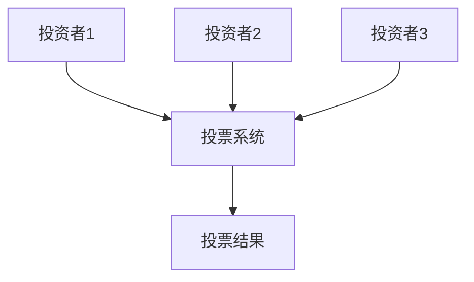
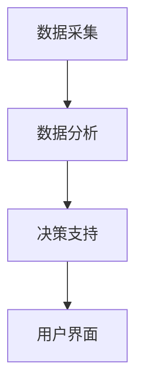

                 


# 特价股票投资中的群体智慧与集体决策方法

## 关键词：
- 特价股票
- 群体智慧
- 集体决策
- 投资策略
- 数学模型

## 摘要：
本文探讨了群体智慧与集体决策方法在特价股票投资中的应用，分析了群体决策的基本原理、数学模型以及系统设计。通过构建群体决策模型和实际案例分析，展示了如何利用群体智慧优化投资策略，帮助投资者在复杂市场中做出更明智的决策。

---

# 第1章: 特价股票投资的背景与概述

## 1.1 特价股票的定义与特点

### 1.1.1 特价股票的定义
特价股票是指价格低于市场平均值的股票，通常具有较高的潜在回报率。这类股票可能因公司短期问题或市场波动而被低估，为投资者提供了以较低价格买入的机会。

### 1.1.2 特价股票的特点
- **低估值**：市盈率、市净率等指标低于行业平均水平。
- **高潜力**：存在恢复增长的可能性。
- **高波动性**：价格波动较大，投资风险较高。

### 1.1.3 特价股票的市场现状
- **市场波动**：受宏观经济和行业趋势影响。
- **投资者行为**：投资者在市场波动中寻求低价股票。

## 1.2 群体智慧与集体决策的定义

### 1.2.1 群体智慧的定义
群体智慧是指通过个体的知识和经验汇总，形成集体智慧，用于解决复杂问题。

### 1.2.2 集体决策的定义
集体决策是指通过个体意见的整合，形成最终决策的过程。

### 1.2.3 群体智慧与集体决策的区别与联系
- **区别**：群体智慧侧重于知识汇总，集体决策侧重于决策过程。
- **联系**：集体决策依赖群体智慧的支持。

## 1.3 特价股票投资中的群体智慧应用背景

### 1.3.1 投资者行为分析
- **个体决策**：投资者基于个人判断做出决策。
- **群体行为**：市场参与者的行为影响整体走势。

### 1.3.2 群体决策在投资中的优势
- **多样性**：个体决策的多样性有助于降低整体风险。
- **信息整合**：整合个体信息，形成更全面的决策依据。

### 1.3.3 特价股票市场的特点与挑战
- **低流动性**：交易量小，价格波动大。
- **高风险**：潜在回报高，但风险也大。

---

# 第2章: 群体智慧在股票投资中的核心机制

## 2.1 群体智慧的基本原理

### 2.1.1 群体智慧的信息传递机制
- **信息传递**：个体通过交流传递信息。
- **信息整合**：信息汇总形成集体智慧。

### 2.1.2 群体共识的形成过程
- **意见汇总**：个体意见汇总成集体意见。
- **共识达成**：通过讨论和协商形成共识。

### 2.1.3 群体决策的多样性与稳定性
- **多样性**：个体决策的多样性有助于降低风险。
- **稳定性**：群体决策相对个体决策更为稳定。

## 2.2 集体决策在股票投资中的应用

### 2.2.1 集体决策的基本流程
1. **信息收集**：收集市场数据和个体意见。
2. **讨论分析**：分析数据，提出决策方案。
3. **投票决策**：通过投票形成最终决策。

### 2.2.2 集体决策中的个体差异
- **个体差异**：不同个体有不同的信息和判断。
- **协调机制**：通过协调机制减少个体差异的影响。

### 2.2.3 集体决策的协调机制
- **协调机制**：通过规则和流程确保协调一致。
- **反馈机制**：通过反馈调整决策。

---

# 第3章: 特价股票投资中的群体决策模型

## 3.1 群体决策模型的构建

### 3.1.1 模型的基本框架
- **输入**：个体意见和市场数据。
- **处理**：信息整合和决策分析。
- **输出**：集体决策结果。

### 3.1.2 模型的核心要素
- **个体意见**：投资者的个人判断。
- **市场数据**：股票价格、交易量等信息。
- **决策规则**：决策的规则和流程。

### 3.1.3 模型的输入与输出
- **输入**：个体意见和市场数据。
- **输出**：集体决策结果和风险评估。

## 3.2 群体决策算法的实现

### 3.2.1 基于投票的决策算法


### 3.2.2 基于加权的决策算法
```python
def weighted_decision(votes, weights):
    total = sum(weights)
    return {vote: (weight / total) for vote, weight in zip(votes, weights)}
```

### 3.2.3 基于共识的决策算法
```latex
$$ \text{共识度} = \frac{\sum_{i=1}^{n} w_i x_i}{\sum_{i=1}^{n} w_i} $$
```

---

# 第4章: 群体智慧在特价股票投资中的数学模型

## 4.1 群体决策的数学表达

### 4.1.1 群体决策的数学公式
$$ \text{集体决策} = \sum_{i=1}^{n} w_i x_i $$

### 4.1.2 群体决策的权重分配
$$ w_i = \frac{1}{n} $$

### 4.1.3 群体决策的优化模型
$$ \max \sum_{i=1}^{n} w_i x_i $$

## 4.2 特价股票投资的数学模型

### 4.2.1 特价股票的定价模型
$$ \text{价格} = \alpha \times \text{市盈率} + \beta \times \text{市净率} $$

### 4.2.2 特价股票的风险评估模型
$$ \text{风险} = \gamma \times \text{波动率} + \delta \times \text{市场风险} $$

### 4.2.3 特价股票的收益预测模型
$$ \text{收益} = \epsilon \times \text{预期回报率} + \zeta \times \text{行业趋势} $$

---

# 第5章: 群体智慧在特价股票投资中的系统设计

## 5.1 系统功能设计

### 5.1.1 数据采集模块
- **功能**：采集市场数据和个体意见。
- **实现**：通过API获取实时数据。

### 5.1.2 数据分析模块
- **功能**：分析数据，生成决策建议。
- **实现**：使用机器学习模型进行分析。

### 5.1.3 决策支持模块
- **功能**：提供决策支持，输出集体决策结果。
- **实现**：通过用户界面展示结果。

## 5.2 系统架构设计



## 5.3 系统接口设计

### 5.3.1 数据接口
- **输入**：市场数据和个体意见。
- **输出**：分析结果和决策建议。

### 5.3.2 用户接口
- **输入**：用户查询。
- **输出**：决策结果和风险评估。

## 5.4 系统交互设计

### 5.4.1 交互流程
1. 用户提交查询。
2. 系统分析数据。
3. 系统输出结果。

### 5.4.2 交互案例
- **用户**：查询某只特价股票。
- **系统**：分析数据，输出决策建议。

---

# 第6章: 项目实战与案例分析

## 6.1 环境搭建

### 6.1.1 开发环境
- **语言**：Python
- **工具**：Jupyter Notebook

## 6.2 核心实现

### 6.2.1 群体决策算法实现
```python
def group_decision(votes):
    from collections import Counter
    counts = Counter(votes)
    max_vote = max(counts.values())
    return [vote for vote, count in counts.items() if count == max_vote]
```

### 6.2.2 数学模型实现
```python
def predict_price(features):
    model = LinearRegression()
    model.fit(features, labels)
    return model.predict(new_features)
```

## 6.3 案例分析

### 6.3.1 案例背景
- **公司**：某科技公司。
- **股价**：近期大幅下跌，市盈率低于行业平均。

### 6.3.2 数据分析
- **市盈率**：15。
- **市净率**：2。

### 6.3.3 决策过程
- **数据收集**：收集公司财报和市场数据。
- **数据分析**：分析公司基本面。
- **群体决策**：投资者投票决定是否买入。

## 6.4 项目小结

### 6.4.1 成功经验
- **数据准确性**：确保数据准确。
- **决策透明度**：确保决策过程透明。

### 6.4.2 改进建议
- **模型优化**：进一步优化数学模型。
- **算法改进**：改进群体决策算法。

---

# 第7章: 最佳实践与小结

## 7.1 最佳实践

### 7.1.1 投资者行为
- **理性决策**：避免情绪化投资。
- **分散投资**：降低风险。

### 7.1.2 群体决策
- **信息共享**：促进信息共享。
- **规则制定**：制定决策规则。

## 7.2 小结

### 7.2.1 核心观点
- 群体智慧能够有效降低投资风险。
- 数学模型和算法在决策中起重要作用。

### 7.2.2 展望
- **技术进步**：随着技术进步，群体智慧的应用将更加广泛。
- **市场变化**：投资者需要不断适应市场变化。

---

通过以上章节的详细分析，我们可以看到群体智慧与集体决策方法在特价股票投资中的重要性。通过科学的模型和算法，投资者可以更好地做出决策，降低风险，提高收益。

