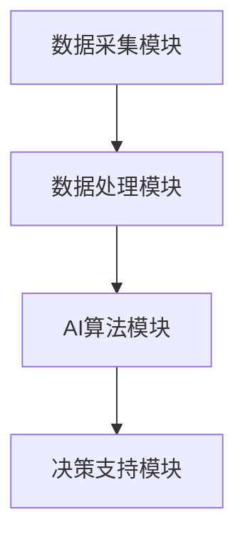
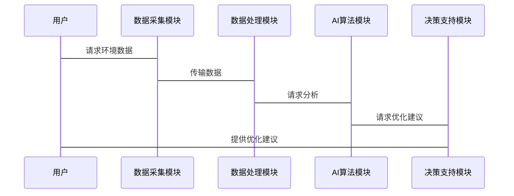

                 


# 环保AI Agent：监测与保护生态环境

> 关键词：环保AI Agent, 环境监测, 人工智能, 生态保护, 数据分析, 系统架构

> 摘要：环保AI Agent是一种利用人工智能技术监测和保护生态环境的智能系统。本文将从环保AI Agent的背景与概念、算法原理与数学模型、系统架构设计、项目实战以及最佳实践等方面进行详细探讨，帮助读者深入了解环保AI Agent的核心原理和实际应用。

---

## 第一部分: 环保AI Agent的背景与概念

### 第1章: 环保AI Agent的背景与问题背景

#### 1.1 环境保护的现状与挑战

当前，全球面临着严重的环境问题，如气候变化、空气污染、水资源短缺、生物多样性减少等。传统的方法在环境监测和保护方面存在诸多局限性：

- **数据采集成本高**：传统的环境监测依赖于人工采集和实验室分析，成本高且效率低。
- **监测范围有限**：人工监测范围有限，难以覆盖大面积区域。
- **数据处理复杂**：环境数据种类繁多，处理和分析需要大量专业人员。

#### 1.2 AI技术在环保领域的应用前景

人工智能技术在环保领域的应用具有显著优势：

- **高效性**：AI可以通过自动化的方式快速处理大量数据，显著提高环境监测的效率。
- **精准性**：AI算法可以对环境数据进行深度分析，帮助发现潜在的环境问题。
- **预测性**：通过机器学习模型，AI可以预测环境变化趋势，提前采取应对措施。

#### 1.3 环保AI Agent的定义与目标

环保AI Agent是一种智能系统，旨在通过实时监测环境数据，利用人工智能技术进行分析和预测，从而实现对生态环境的有效保护。其目标包括：

- 实时监测环境数据。
- 自动识别环境异常。
- 提供环境优化建议。
- 协助决策者制定环保政策。

### 第2章: 环保AI Agent的核心概念与原理

#### 2.1 环保AI Agent的定义与组成

环保AI Agent由以下核心部分组成：

- **数据采集模块**：负责收集环境数据，如温度、湿度、空气质量等。
- **数据处理模块**：对采集到的数据进行预处理和特征提取。
- **AI算法模块**：利用机器学习、深度学习等技术对数据进行分析和预测。
- **决策支持模块**：根据分析结果生成环境优化建议。

#### 2.2 环保AI Agent的核心原理

环保AI Agent的核心原理是通过AI算法对环境数据进行分析，识别潜在的环境问题，并提供解决方案。例如：

- 使用监督学习算法对空气质量数据进行分类，识别污染严重区域。
- 使用无监督学习算法对卫星遥感数据进行聚类，发现异常区域。

#### 2.3 环保AI Agent与其他技术的对比

以下是环保AI Agent与其他技术的对比：

| 技术 | 优势 | 局限性 |
|------|-------|--------|
| 传统环境监测 | 成本低，易于操作 | 覆盖范围小，效率低 |
| 物联网技术 | 实时性强，数据采集丰富 | 数据处理复杂，分析能力有限 |
| AI技术 | 数据处理能力强，分析精准 | 需要大量数据支持，技术门槛高 |

### 第3章: 环保AI Agent的核心要素与系统架构

#### 3.1 核心要素分析

- **数据源**：包括传感器数据、卫星遥感数据、互联网公开数据等。
- **AI算法**：包括机器学习、深度学习等算法。
- **决策模块**：包括规则引擎和优化算法。

#### 3.2 系统架构设计

环保AI Agent的系统架构可以分为以下几层：

- **数据采集层**：负责采集环境数据。
- **数据处理层**：对数据进行预处理和特征提取。
- **决策层**：利用AI算法对数据进行分析，并生成优化建议。

---

## 第二部分: 环保AI Agent的算法原理与数学模型

### 第4章: 环保AI Agent的核心算法原理

#### 4.1 机器学习在环境监测中的应用

- **监督学习**：用于分类和回归任务。
- **无监督学习**：用于聚类和异常检测。
- **强化学习**：用于环境优化和决策。

#### 4.2 深度学习在环境分析中的应用

- **图像识别**：用于卫星遥感图像分析。
- **自然语言处理**：用于环境文本分析。
- **神经网络模型**：用于环境预测与模拟。

### 第5章: 环保AI Agent的数学模型与公式

#### 5.1 环境监测中的回归模型

线性回归模型：
$$ y = \beta_0 + \beta_1x_1 + \beta_2x_2 + \dots + \beta_nx_n $$

逻辑回归模型：
$$ P(y=1|x) = \frac{e^{\beta_0 + \beta_1x_1 + \dots + \beta_nx_n}}{1 + e^{\beta_0 + \beta_1x_1 + \dots + \beta_nx_n}} $$

---

## 第三部分: 环保AI Agent的系统分析与架构设计

### 第6章: 系统分析与架构设计

#### 6.1 问题场景介绍

环保AI Agent需要解决的主要问题包括：

- 实时监测环境数据。
- 自动识别环境异常。
- 提供环境优化建议。

#### 6.2 系统功能设计

- **数据采集功能**：通过传感器和API接口采集环境数据。
- **数据处理功能**：对数据进行清洗和特征提取。
- **AI算法功能**：利用机器学习模型进行环境预测和分类。
- **决策支持功能**：生成环境优化建议。

#### 6.3 系统架构设计

以下是环保AI Agent的系统架构图：



#### 6.4 系统接口设计

- **数据接口**：与传感器和API接口对接。
- **用户接口**：提供可视化界面供用户查看环境数据和优化建议。

#### 6.5 系统交互设计

以下是系统交互流程图：



---

## 第四部分: 项目实战

### 第7章: 项目实战

#### 7.1 环境安装

需要安装以下工具：

- Python 3.8+
- Scikit-learn、TensorFlow、Keras等AI库
- Matplotlib、Seaborn等可视化库

#### 7.2 核心代码实现

以下是环保AI Agent的核心代码示例：

```python
import pandas as pd
from sklearn.model import LinearSVC
from sklearn.metrics import accuracy_score

# 数据加载
data = pd.read_csv('environment_data.csv')

# 数据预处理
X = data.drop('target', axis=1)
y = data['target']

# 模型训练
model = LinearSVC()
model.fit(X, y)

# 模型预测
y_pred = model.predict(X)

# 模型评估
print(accuracy_score(y, y_pred))
```

#### 7.3 项目小结

通过以上代码，我们可以实现一个简单的环保AI Agent系统，能够对环境数据进行分类和预测，帮助我们更好地监测和保护生态环境。

---

## 第五部分: 最佳实践

### 第8章: 最佳实践

#### 8.1 小结

环保AI Agent是一种高效、智能的环境监测和保护工具，能够显著提高环境监测的效率和精准度。

#### 8.2 注意事项

- 确保数据的准确性和完整性。
- 定期更新模型，以适应环境变化。
- 注意数据隐私和安全问题。

#### 8.3 未来趋势

- AI技术的进一步发展将推动环保AI Agent的智能化和自动化。
- 多模态数据的融合将进一步提升环境监测的精度。

---

通过以上内容，我们可以看到，环保AI Agent在监测与保护生态环境方面具有重要的应用价值。未来，随着AI技术的不断发展，环保AI Agent将在更多领域发挥重要作用。

