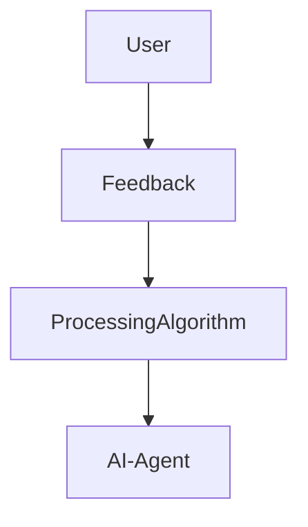
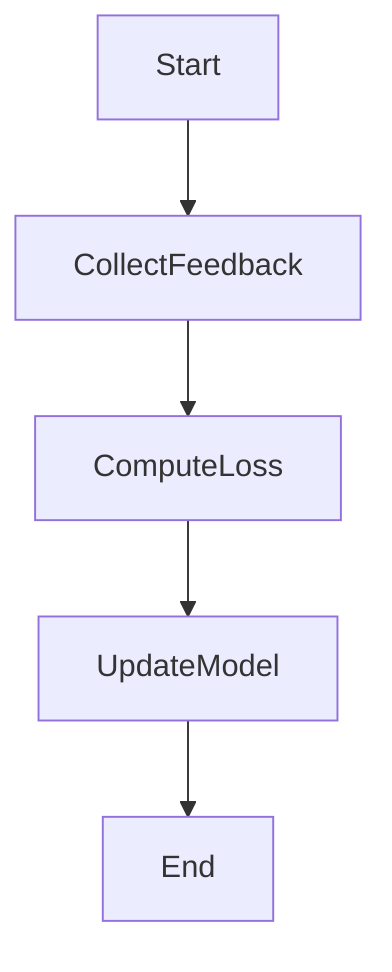
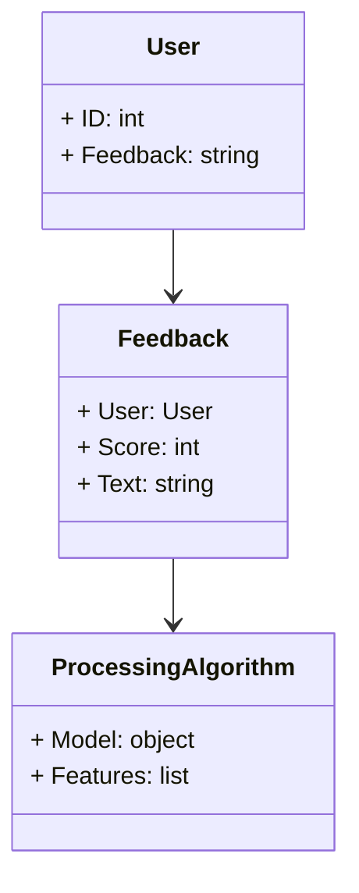
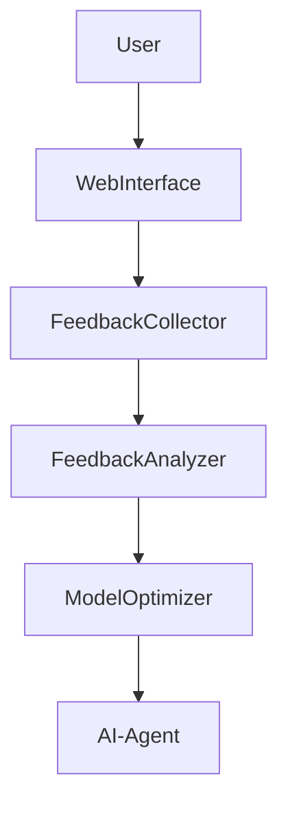

                 


# 用户反馈处理：不断改进AI Agent的表现

## 关键词：用户反馈、AI Agent、自然语言处理、机器学习、系统架构

## 摘要：本文系统阐述了如何通过用户反馈处理来优化AI Agent的表现。从背景介绍、核心概念到算法原理、系统架构设计，再到项目实战和最佳实践，全面解析了用户反馈处理的关键环节和实施方法。通过具体案例分析和代码实现，展示了如何利用反馈数据提升AI Agent的交互能力和用户体验。

---

# 目录大纲：《用户反馈处理：不断改进AI Agent的表现》

## 第1章：用户反馈处理的背景与重要性

### 1.1 问题背景
AI Agent作为人工智能技术的重要应用，广泛应用于智能客服、虚拟助手等领域。然而，AI Agent在实际使用中常常面临用户反馈处理的挑战。用户的反馈是改进AI Agent表现的关键数据，如何有效地收集、分析和应用这些反馈是提升AI Agent性能的核心问题。

### 1.2 问题描述
用户反馈是用户对AI Agent输出结果的评价，包括满意、不满意、中立等。有效的反馈处理需要对这些评价进行分类、分析，并将其应用于模型优化中。然而，现有的反馈处理方法存在效率低下、精度不足等问题，导致AI Agent的表现未能达到预期。

### 1.3 问题解决
通过引入机器学习算法，可以有效提高用户反馈处理的效率和准确性。监督学习和强化学习等方法可以分别处理不同的反馈类型，优化AI Agent的输出结果。此外，结合领域知识和反馈特征，可以进一步提升反馈处理的精度和鲁棒性。

### 1.4 边界与外延
用户反馈处理的边界主要集中在文本反馈的处理上，不包括语音或图像反馈。同时，本文不涉及实时反馈处理，而是聚焦于离线反馈分析。用户反馈处理与其他技术如自然语言处理和机器学习密切相关，本文将重点探讨其在AI Agent中的应用。

### 1.5 核心要素组成
用户反馈处理的核心要素包括反馈数据、处理算法和改进机制。反馈数据是处理的基础，处理算法决定了反馈分析的方式，改进机制则将分析结果应用于模型优化。这三部分共同作用，才能实现AI Agent的持续改进。

---

## 第2章：用户反馈处理的核心概念与联系

### 2.1 核心概念原理
用户反馈处理涉及多个关键概念，包括反馈分类、情感分析和意图识别。反馈分类是对用户反馈进行标签化处理，情感分析是判断反馈的情感倾向，意图识别则是理解用户反馈的具体意图。这些概念相互关联，共同构成了用户反馈处理的理论基础。

### 2.2 核心概念属性特征对比
| 反馈处理方法 | 优点 | 缺点 |
|--------------|------|------|
| 基于规则的方法 | 实现简单，易于解释 | 需要大量人工规则，扩展性差 |
| 机器学习方法 | 高精度，自适应性强 | 需要大量标注数据，实现复杂 |

通过对比分析，机器学习方法在处理复杂反馈时更具优势，但需要更多的计算资源和数据支持。

### 2.3 ER实体关系图架构

此图展示了用户与反馈、处理算法以及AI Agent之间的关系，用户提供反馈，反馈经过处理算法优化，最终提升AI Agent的表现。

---

## 第3章：用户反馈处理的算法原理

### 3.1 基于反馈的损失函数优化

#### 3.1.1 算法原理
反馈的损失函数用于衡量模型输出与用户期望之间的差异。通过不断优化损失函数，可以提升模型的预测精度。具体公式为：
$$ L = -\sum_{i=1}^{n} y_i \log(p_i) + (1 - y_i) \log(1 - p_i) $$
其中，$y_i$是真实标签，$p_i$是模型预测的概率。

#### 3.1.2 算法流程

该流程展示了从收集反馈到更新模型的完整过程，确保模型能够逐步优化。

#### 3.1.3 代码实现
```python
import numpy as np
from sklearn.metrics import accuracy_score

def feedback_loss(y_true, y_pred):
    y_pred = np.clip(y_pred, 1e-15, 1 - 1e-15)
    return -np.mean(y_true * np.log(y_pred) + (1 - y_true) * np.log(1 - y_pred))

# 示例数据
y_true = np.array([1, 0, 1, 0])
y_pred = np.array([0.9, 0.1, 0.8, 0.2])

loss = feedback_loss(y_true, y_pred)
print("Loss:", loss)
print("Accuracy:", accuracy_score(y_true, y_pred > 0.5))
```

---

## 第4章：用户反馈处理的系统分析与架构设计

### 4.1 系统功能设计
系统功能模块包括数据采集、反馈分析、模型优化和效果评估。数据采集模块负责收集用户反馈，反馈分析模块进行分类和情感分析，模型优化模块基于反馈结果更新模型，效果评估模块监控模型性能。

#### 4.1.1 领域模型

该类图展示了用户、反馈和处理算法之间的关系。

### 4.2 系统架构设计
系统架构采用分层设计，包括数据层、业务逻辑层和表现层。数据层负责数据存储，业务逻辑层处理反馈分析，表现层展示结果。

#### 4.2.1 系统架构图


---

## 第5章：用户反馈处理的项目实战

### 5.1 项目环境配置
需要安装Python、TensorFlow和Scikit-learn等库。

#### 5.1.1 环境安装
```bash
pip install numpy
pip install scikit-learn
pip install tensorflow
```

### 5.2 系统核心实现
实现用户反馈处理系统，包括数据预处理、模型训练和评估。

#### 5.2.1 核心代码实现
```python
from sklearn.model_selection import train_test_split
from tensorflow.keras.models import Sequential
from tensorflow.keras.layers import Dense

# 数据预处理
X_train, X_test, y_train, y_test = train_test_split(X, y, test_size=0.2)

# 模型训练
model = Sequential()
model.add(Dense(64, activation='relu', input_dim=X.shape[1]))
model.add(Dense(1, activation='sigmoid'))
model.compile(optimizer='adam', loss='binary_crossentropy', metrics=['accuracy'])
model.fit(X_train, y_train, epochs=10, batch_size=32)

# 模型评估
loss, accuracy = model.evaluate(X_test, y_test)
print("Test loss:", loss)
print("Test accuracy:", accuracy)
```

### 5.3 案例分析与详细解读
通过实际案例分析，展示如何利用用户反馈优化AI Agent的表现。例如，分析用户对AI客服的反馈，识别常见问题并改进回答策略。

---

## 第6章：最佳实践与小结

### 6.1 经验总结
- 定期收集和分析用户反馈，及时优化模型。
- 结合领域知识，选择合适的反馈处理方法。
- 使用多种算法进行对比，选择最优方案。

### 6.2 注意事项
- 确保反馈数据的多样性和代表性。
- 处理反馈时注意数据隐私保护。
- 及时监控模型性能，防止过拟合。

### 6.3 小结
用户反馈处理是优化AI Agent表现的关键环节。通过有效的数据收集、分析和应用，可以显著提升AI Agent的交互能力和用户体验。未来，随着技术的发展，用户反馈处理将更加智能化和自动化。

---

## 附录：拓展阅读

- 《机器学习实战》
- 《深度学习》
- 《自然语言处理入门》

---

通过以上内容，用户可以系统地了解如何处理用户反馈，优化AI Agent的表现。从理论到实践，文章详细讲解了每个步骤和方法，帮助读者掌握用户反馈处理的核心技术。

