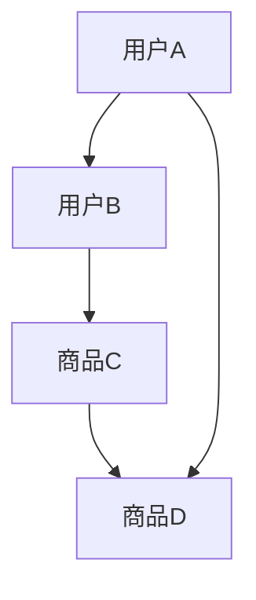
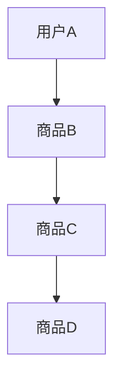
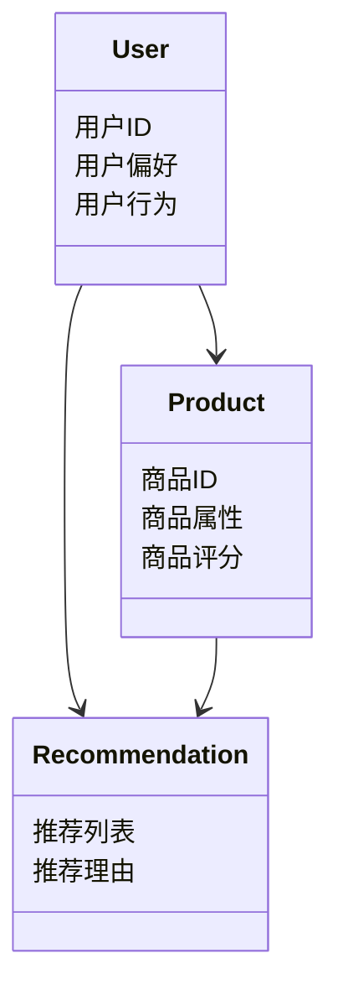
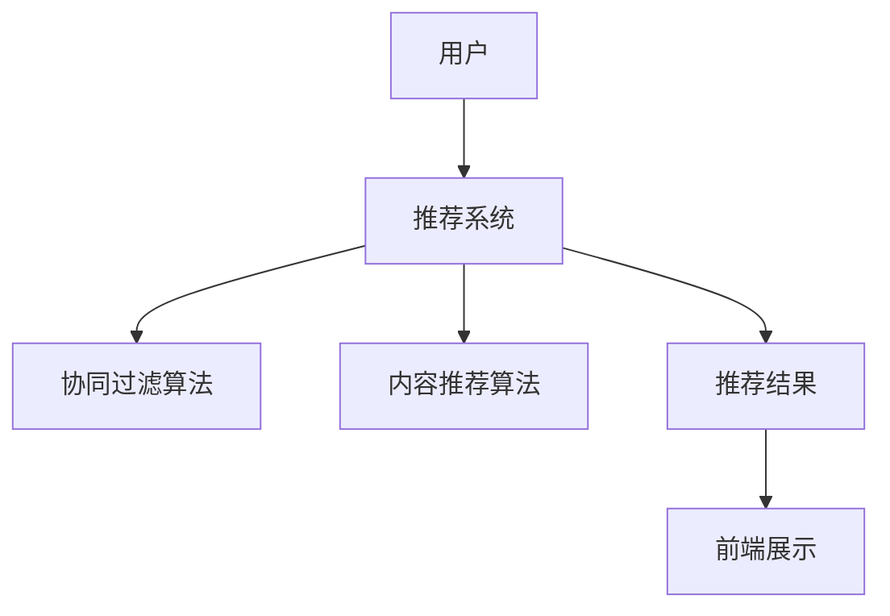

                 


# 《电子商务平台的AI Agent推荐系统》

---

## 关键词：电子商务、AI Agent、推荐系统、协同过滤、算法原理、系统架构、项目实战

---

## 摘要：

本文详细探讨了电子商务平台中的AI Agent推荐系统，从背景到实现，从原理到实战，全面解析其工作原理、算法模型、系统架构以及实际应用场景。通过具体案例分析，展示了如何利用AI Agent提升推荐系统的效率和用户体验。文章还提供了丰富的代码实现和系统设计图，帮助读者深入理解并实践AI Agent推荐系统的开发。

---

## 第1章: 电子商务平台的AI Agent推荐系统背景

### 1.1 问题背景与描述

电子商务平台的核心目标是为用户提供优质的购物体验。然而，海量的商品信息和用户需求的多样性使得推荐系统成为提升用户体验的关键技术。传统的推荐系统基于规则或简单的统计方法，难以应对用户需求的动态变化和个性化要求。

#### 1.1.1 电子商务平台的推荐问题
- 用户信息的复杂性：用户可能有不同的偏好、购买历史和行为特征。
- 商品的多样性：平台可能提供数百万种商品，用户难以找到自己感兴趣的商品。
- 推荐系统的实时性要求：用户希望在浏览时就能得到实时的个性化推荐。

#### 1.1.2 用户需求与推荐系统的重要性
- 用户需求的核心是个性化推荐：用户希望看到与自己兴趣相符的商品。
- 推荐系统的作用：通过分析用户行为和商品属性，提供个性化推荐，提升用户满意度和购买率。

#### 1.1.3 AI Agent在推荐系统中的作用
- AI Agent（智能代理）能够实时分析用户行为和商品信息，动态调整推荐策略。
- AI Agent可以结合上下文信息（如时间、地点）提供更精准的推荐。

### 1.2 问题解决与边界

#### 1.2.1 AI Agent推荐系统的解决方案
- 基于协同过滤的推荐：分析用户行为数据，找到相似用户的购买历史，推荐相似商品。
- 基于内容的推荐：分析商品属性，推荐与用户偏好匹配的商品。
- 混合推荐：结合协同过滤和内容推荐的优点，提升推荐的准确性和多样性。

#### 1.2.2 系统的边界与外延
- 系统边界：AI Agent推荐系统仅关注推荐逻辑，不涉及前端展示和后端存储。
- 系统外延：推荐结果可以集成到平台的其他功能模块（如搜索、购物车）中。

#### 1.2.3 核心概念与组成要素
- 用户：包括普通用户和VIP用户。
- 商品：包括商品属性（如价格、类别、品牌）和商品评分。
- 推荐结果：包括推荐列表和推荐理由。

### 1.3 核心概念与联系

#### 1.3.1 AI Agent推荐系统原理
- 用户行为分析：通过收集用户的点击、浏览、购买等行为数据，分析用户的兴趣偏好。
- 商品属性分析：通过商品的类别、品牌、价格等属性，提取商品的特征。
- 推荐生成：结合用户行为和商品属性，生成个性化推荐列表。

#### 1.3.2 核心概念属性对比

| 概念       | 属性                       |
|------------|---------------------------|
| 用户       | 用户ID、用户偏好、用户行为 |
| 商品       | 商品ID、商品属性、商品评分 |
| 推荐结果   | 推荐列表、推荐理由           |

#### 1.3.3 ER实体关系图

```mermaid
erd
    user (用户ID, 用户偏好, 用户行为)
    product (商品ID, 商品属性, 商品评分)
    recommendation (推荐列表, 推荐理由)
```

---

## 第2章: AI Agent推荐系统的算法原理

### 2.1 算法原理概述

#### 2.1.1 推荐算法的分类
- 协同过滤：基于用户相似性或商品相似性进行推荐。
- 基于内容的推荐：基于商品的属性特征进行推荐。
- 混合推荐：结合协同过滤和内容推荐的优点。

#### 2.1.2 基于协同过滤的推荐算法
- 用户-用户协同过滤：找到与当前用户相似的其他用户，推荐他们购买的商品。
- 商品-商品协同过滤：找到与当前商品相似的其他商品，推荐给用户。

#### 2.1.3 基于内容的推荐算法
- 商品特征提取：通过文本挖掘、自然语言处理等技术提取商品的特征。
- 用户特征匹配：根据用户的偏好，匹配最相关的商品。

#### 2.1.4 混合推荐算法
- 优点：结合了协同过滤和内容推荐的优点，推荐结果更准确。
- 缺点：实现复杂，需要同时处理用户行为和商品属性数据。

### 2.2 算法流程图

#### 协同过滤算法流程图



#### 基于内容的推荐流程图



### 2.3 数学模型与公式

#### 协同过滤的数学模型

用户-用户协同过滤的相似度计算公式：

$$ \text{相似度}(u_i, u_j) = \frac{\sum_{k \in N(u_i) \cap N(u_j)} (r_{u_i,k} - \bar{r}_{u_i}) \times (r_{u_j,k} - \bar{r}_{u_j})}{\sqrt{\sum_{k \in N(u_i) \cap N(u_j)} (r_{u_i,k} - \bar{r}_{u_i})^2} \times \sqrt{\sum_{k \in N(u_i) \cap N(u_j)} (r_{u_j,k} - \bar{r}_{u_j})^2}}} $$

其中，$u_i$ 和 $u_j$ 是用户，$r_{u_i,k}$ 是用户 $u_i$ 对商品 $k$ 的评分，$\bar{r}_{u_i}$ 是用户 $u_i$ 的平均评分，$N(u_i)$ 是用户 $u_i$ 评分过的商品集合。

---

## 第3章: 系统分析与架构设计

### 3.1 系统分析

#### 3.1.1 问题场景介绍
- 用户在电子商务平台上浏览商品时，希望看到个性化的推荐。
- 系统需要实时分析用户的浏览行为，动态生成推荐列表。

#### 3.1.2 项目介绍与目标
- 项目目标：开发一个基于AI Agent的推荐系统，提升用户体验。
- 项目范围：涵盖用户行为分析、推荐算法实现、推荐结果展示。

#### 3.1.3 系统功能设计
- 用户行为收集：通过日志记录用户的浏览、点击、购买行为。
- 推荐算法实现：基于协同过滤和内容推荐，生成推荐列表。
- 推荐结果展示：将推荐结果集成到平台的前端页面。

### 3.2 系统架构设计

#### 3.2.1 领域模型类图



#### 3.2.2 系统架构图



---

## 第4章: 项目实战

### 4.1 环境安装与配置

#### 4.1.1 开发环境搭建
- 操作系统：Linux/Windows/MacOS
- 开发工具：PyCharm/VS Code
- 依赖管理工具：pip

#### 4.1.2 依赖库安装
```bash
pip install numpy pandas scikit-learn
```

#### 4.1.3 数据集准备
- 数据集格式：CSV文件，包含用户ID、商品ID、评分等字段。

### 4.2 核心代码实现

#### 4.2.1 推荐算法实现

```python
import numpy as np
from sklearn.metrics.pairwise import cosine_similarity

# 示例数据：用户-商品评分矩阵
users = ['u1', 'u2', 'u3']
products = ['p1', 'p2', 'p3']
ratings = {
    'u1': {'p1': 5, 'p2': 3, 'p3': 4},
    'u2': {'p1': 3, 'p2': 5, 'p3': 2},
    'u3': {'p1': 4, 'p2': 2, 'p3': 5}
}

# 转换为数值矩阵
user_ids = list(ratings.keys())
product_ids = list(ratings[user_ids[0]].keys())
matrix = np.zeros((len(user_ids), len(product_ids)))

for i, user in enumerate(user_ids):
    for j, product in enumerate(product_ids):
        matrix[i][j] = ratings[user][product]

# 计算相似度矩阵
similarity_matrix = cosine_similarity(matrix)

# 推荐算法实现
def recommend(user_index, similarity_matrix, matrix):
    user_recommendations = []
    for i in range(len(similarity_matrix[user_index])):
        if i != user_index:
            user_recommendations.append((i, similarity_matrix[user_index][i]))
    return sorted(user_recommendations, key=lambda x: x[1], reverse=True)

# 示例推荐
user_index = 0
recommendations = recommend(user_index, similarity_matrix, matrix)
print("推荐结果：", recommendations)
```

#### 4.2.2 系统功能实现

```python
# 示例推荐系统实现
class AIRecommendationSystem:
    def __init__(self, user_data, product_data):
        self.user_data = user_data
        self.product_data = product_data

    def get_recommendations(self, user_id):
        # 假设已经实现协同过滤算法
        return self协同过滤(user_id)

    def协同过滤(self, user_id):
        # 示例协同过滤算法
        pass
```

#### 4.2.3 代码解读与分析
- 数据矩阵：将用户-商品评分数据转换为数值矩阵。
- 相似度计算：使用余弦相似度计算用户相似度。
- 推荐算法：基于相似度排序，返回推荐结果。

### 4.3 实际案例分析

#### 4.3.1 案例背景介绍
- 案例场景：用户在电商平台浏览商品，系统实时生成推荐列表。
- 数据来源：用户点击流数据和商品属性数据。

#### 4.3.2 系统实现细节
- 数据预处理：清洗和格式化数据，确保数据质量。
- 算法实现：基于协同过滤和内容推荐的混合算法。
- 推荐结果展示：将推荐结果集成到电商平台的前端页面。

#### 4.3.3 案例结果与分析
- 推荐准确率：通过A/B测试评估推荐系统的性能。
- 用户满意度：通过用户反馈收集推荐系统的用户体验。

---

## 第5章: 最佳实践与总结

### 5.1 最佳实践Tips

#### 5.1.1 系统优化建议
- 数据预处理：清洗和格式化数据，确保数据质量。
- 算法优化：尝试不同的推荐算法，找到最优的组合。
- 系统性能优化：优化算法复杂度，提升推荐速度。

#### 5.1.2 开发注意事项
- 数据隐私：确保用户数据的安全性和隐私性。
- 系统稳定性：确保推荐系统在高并发情况下的稳定性。
- 模型更新：定期更新推荐模型，保持推荐的准确性。

#### 5.1.3 部署与维护建议
- 部署环境：选择合适的云服务提供商，确保系统的高可用性。
- 模型维护：定期监控模型性能，及时调整参数。
- 系统扩展：根据用户增长情况，扩展系统容量。

### 5.2 项目小结

#### 5.2.1 核心知识点回顾
- 用户行为分析：通过分析用户行为数据，了解用户的兴趣偏好。
- 推荐算法实现：基于协同过滤和内容推荐的混合算法。
- 系统架构设计：基于用户行为和商品属性的领域模型设计。

#### 5.2.2 项目经验总结
- 项目实施过程中，数据预处理和算法优化是关键。
- 系统的稳定性和性能优化是保障用户体验的重要因素。
- 团队协作和项目管理在项目成功中起着重要作用。

#### 5.2.3 未来发展方向
- 推荐系统的实时性：提升推荐的实时性，满足用户的即时需求。
- 多模态推荐：结合图像、视频等多种形式的商品信息，提升推荐的准确性。
- 智能化推荐：结合自然语言处理和机器学习，实现更智能的推荐。

### 5.3 注意事项与拓展阅读

#### 5.3.1 注意事项
- 数据隐私：确保用户数据的安全性。
- 系统稳定性：确保推荐系统的高可用性。
- 模型更新：定期更新推荐模型，保持推荐的准确性。

#### 5.3.2 拓展阅读推荐
- 《推荐系统实践》：深入理解推荐系统的实现和应用。
- 《机器学习实战》：掌握机器学习的核心算法和技术。
- 《AI Agent编程》：学习AI Agent的编程和应用。

#### 5.3.3 未来学习方向
- 深度学习在推荐系统中的应用。
- 多模态推荐系统的实现。
- 智能化推荐系统的开发。

---

# 结语

通过本文的详细讲解，读者可以全面了解电子商务平台的AI Agent推荐系统，从背景到实现，从原理到实战，掌握推荐系统的核心技术和开发方法。希望本文能够为读者提供有价值的参考和启发，帮助他们在实际项目中更好地应用这些技术。

