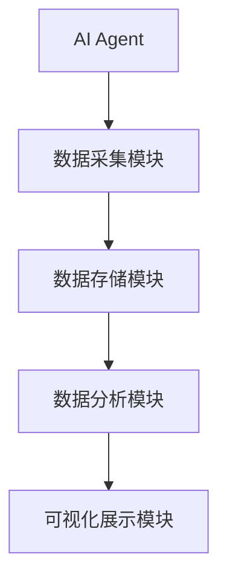
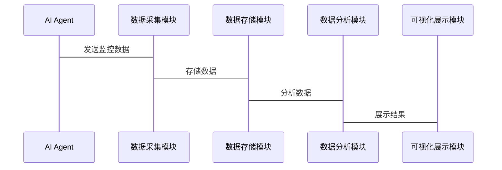

                 


# 监控与日志：跟踪AI Agent的运行状态

## 关键词：AI Agent、监控、日志、运行状态、算法、系统架构、可视化

## 摘要：  
本文详细探讨了如何通过监控与日志技术来跟踪AI Agent的运行状态。文章从AI Agent的基本概念出发，逐步分析了监控与日志的核心原理、算法实现、系统架构，并通过实际案例展示了如何在项目中应用这些技术。通过本文，读者将能够深入了解如何设计和实现一个高效的AI Agent监控系统，从而确保AI Agent的稳定运行和问题快速定位。

---

## 第一章：AI Agent与监控日志概述

### 1.1 AI Agent的基本概念

#### 1.1.1 AI Agent的定义与分类  
AI Agent（人工智能代理）是指能够感知环境、自主决策并执行任务的智能实体。根据功能和应用场景的不同，AI Agent可以分为以下几类：
- **简单反射型Agent**：基于当前输入做出简单反应。
- **基于模型的反射型Agent**：通过内部模型理解和预测环境。
- **目标驱动型Agent**：基于明确的目标执行任务。
- **实用驱动型Agent**：通过效用函数优化决策。

#### 1.1.2 AI Agent的核心功能与特点  
AI Agent的核心功能包括感知、决策、执行和自适应学习。其特点在于：
- **自主性**：能够自主决策和行动。
- **反应性**：能够实时感知环境并做出反应。
- **学习性**：能够通过数据学习和优化。
- **可扩展性**：能够适应不同的应用场景。

#### 1.1.3 AI Agent的应用场景与发展趋势  
AI Agent广泛应用于自动驾驶、智能助手、机器人、推荐系统等领域。随着AI技术的不断发展，AI Agent的智能化和实时性要求越来越高。

---

### 1.2 监控与日志的重要性

#### 1.2.1 监控在AI Agent运行中的作用  
监控是确保AI Agent稳定运行的关键技术，主要体现在：
- **实时监控**：实时采集和分析AI Agent的运行数据。
- **异常检测**：及时发现和定位运行中的异常情况。
- **性能优化**：通过监控数据优化AI Agent的性能。

#### 1.2.2 日志在问题排查与优化中的价值  
日志是AI Agent运行过程中产生的记录，具有以下作用：
- **问题排查**：通过日志回溯问题发生的根源。
- **行为分析**：分析AI Agent的行为模式。
- **性能优化**：通过日志分析优化AI Agent的运行效率。

#### 1.2.3 监控与日志结合的必要性  
监控与日志的结合能够实现：
- **数据的实时性**：监控提供实时数据，日志提供历史数据。
- **问题的快速定位**：通过监控数据触发日志分析，快速定位问题。

---

### 1.3 本章小结  
本章主要介绍了AI Agent的基本概念及其监控与日志的重要性，为后续内容奠定了基础。

---

## 第二章：监控与日志的核心概念

### 2.1 监控的基本原理

#### 2.1.1 监控数据的采集方式  
监控数据的采集方式包括：
- **主动采集**：通过API接口主动获取数据。
- **被动采集**：通过日志文件被动采集数据。

#### 2.1.2 监控指标的分类与选择  
监控指标可以分为：
- **性能指标**：如CPU使用率、内存使用率。
- **行为指标**：如API调用次数、错误率。
- **状态指标**：如服务是否在线、网络连接状态。

#### 2.1.3 监控数据的存储与处理  
监控数据的存储可以选择数据库（如MySQL、MongoDB）或时序数据库（如InfluxDB）。数据处理包括数据清洗、归档和分析。

---

### 2.2 日志的基本原理

#### 2.2.1 日志的定义与分类  
日志是系统运行过程中产生的记录，可以分为：
- **系统日志**：记录系统运行状态。
- **应用日志**：记录应用程序的运行情况。
- **安全日志**：记录安全事件。

#### 2.2.2 日志的结构与格式  
日志通常包含时间戳、日志级别、日志来源和日志内容。常见的日志格式包括JSON、XML和自定义格式。

#### 2.2.3 日志的采集与管理  
日志的采集可以通过文件读取、网络传输等方式实现。日志的管理包括日志归档、日志清理和日志查询。

---

### 2.3 监控与日志的关联性

#### 2.3.1 监控数据与日志数据的结合  
监控数据提供实时状态，日志数据提供历史记录。两者结合可以实现问题的快速定位。

#### 2.3.2 日志在监控中的应用  
通过日志分析可以发现监控数据中未捕捉到的异常情况。

#### 2.3.3 监控与日志的协同工作流程  
1. 监控系统采集实时数据。
2. 当监控数据出现异常时，触发日志采集。
3. 通过日志分析定位问题根源。

---

### 2.4 本章小结  
本章详细讲解了监控与日志的核心原理及其关联性，为后续的算法实现奠定了基础。

---

## 第三章：监控与日志的算法原理

### 3.1 日志采集与分析算法

#### 3.1.1 日志采集算法  
日志采集算法包括：
- **轮转采集**：定期将日志文件分割存储。
- **异步采集**：通过多线程实现高效采集。

#### 3.1.2 日志分析算法  
日志分析算法包括：
- **关键词匹配**：通过正则表达式匹配特定日志。
- **模式识别**：通过机器学习识别日志模式。

#### 3.1.3 实现代码示例  
```python
import re

# 示例日志内容
log_content = "2023-10-01 12:34:56 [INFO] Process started"

# 通过正则表达式提取日志时间
pattern = r'\d{4}-\d{2}-\d{2} \d{2}:\d{2}:\d{2}'
match = re.search(pattern, log_content)
if match:
    print("日志时间:", match.group())
```

---

### 3.2 监控分析算法

#### 3.2.1 时间序列分析算法  
时间序列分析用于预测和监控系统的性能变化。常见的算法包括ARIMA和LSTM。

#### 3.2.2 异常检测算法  
异常检测算法用于发现系统中的异常行为。常见的算法包括LOF和Isolation Forest。

#### 3.2.3 监控数据的可视化算法  
数据可视化算法包括折线图、柱状图和热力图，用于直观展示监控数据。

---

### 3.3 算法原理的数学模型

#### 3.3.1 时间序列分析的数学模型  
ARIMA模型的数学表达式为：
$$ARIMA(p, d, q)$$

其中：
- p：自回归阶数
- d：差分阶数
- q：移动平均阶数

#### 3.3.2 异常检测算法的数学公式  
LOF算法的计算公式为：
$$LOF(x) = \frac{d(x, k)}{d(k, k)}$$

其中：
- d(x, k)：点x与第k近邻的距离
- d(k, k)：点k与第k近邻的距离

---

### 3.4 本章小结  
本章通过算法原理和数学模型，详细讲解了日志采集与监控分析的核心技术。

---

## 第四章：AI Agent监控系统的架构设计

### 4.1 系统功能设计

#### 4.1.1 数据采集模块  
负责采集AI Agent的运行数据和日志数据。

#### 4.1.2 数据存储模块  
负责存储采集到的监控数据和日志数据。

#### 4.1.3 数据分析模块  
负责分析监控数据和日志数据，发现异常情况。

#### 4.1.4 可视化展示模块  
负责将分析结果以图形化的方式展示给用户。

---

### 4.2 系统架构图  


---

### 4.3 系统接口设计

#### 4.3.1 数据采集接口  
```http
GET /api/monitor/data
```

#### 4.3.2 数据分析接口  
```http
POST /api/monitor/analyze
```

#### 4.3.3 可视化展示接口  
```http
GET /api/monitor/dashboard
```

---

### 4.4 系统交互流程  


---

### 4.5 本章小结  
本章通过系统架构设计，详细讲解了AI Agent监控系统的实现方式。

---

## 第五章：项目实战与案例分析

### 5.1 环境安装

#### 5.1.1 安装Python  
安装Python 3.x版本，确保环境支持相关库的安装。

#### 5.1.2 安装相关库  
安装Flask、Prometheus-client、Gunicorn等库：
```bash
pip install flask prometheus-client gunicorn
```

---

### 5.2 系统核心实现

#### 5.2.1 数据采集模块  
```python
from prometheus_client import start_http_server, generate_latest
import time

def start_monitor():
    start_http_server(8000)
    while True:
        time.sleep(1)
        print("监控服务运行中...")
```

#### 5.2.2 数据存储模块  
```python
import json
from datetime import datetime

def save_log(log_content):
    with open('monitor.log', 'a') as f:
        f.write(f"{datetime.now()}: {log_content}\n")
```

#### 5.2.3 数据分析模块  
```python
import re

def analyze_logs():
    with open('monitor.log', 'r') as f:
        content = f.read()
        matches = re.findall(r'\[INFO\] (.+)', content)
        print("分析结果:", matches)
```

---

### 5.3 案例分析

#### 5.3.1 案例背景  
假设一个AI Agent运行过程中出现错误，导致服务中断。

#### 5.3.2 实施步骤  
1. 通过监控系统发现服务中断。
2. 触发日志采集模块采集日志。
3. 通过数据分析模块定位问题根源。
4. 根据分析结果修复问题。

#### 5.3.3 分析结果  
通过分析日志，发现是由于内存溢出导致服务崩溃。修复后，系统恢复正常运行。

---

### 5.4 本章小结  
本章通过项目实战和案例分析，详细讲解了监控与日志技术在实际项目中的应用。

---

## 第六章：总结与最佳实践

### 6.1 总结  
本文详细探讨了如何通过监控与日志技术来跟踪AI Agent的运行状态。通过算法实现和系统架构设计，展示了如何确保AI Agent的稳定运行和快速问题定位。

### 6.2 最佳实践  
- **数据采集**：选择合适的数据采集方式，确保数据的完整性和实时性。
- **日志管理**：合理设计日志的结构和格式，便于后续分析和处理。
- **系统架构**：设计合理的系统架构，确保系统的扩展性和可维护性。
- **算法优化**：根据实际需求，选择合适的算法进行优化和改进。

### 6.3 注意事项  
- 监控系统需要实时运行，确保数据的及时性。
- 日志文件需要定期归档和清理，避免占用过多存储空间。
- 系统架构设计需要考虑高可用性和容错性。

### 6.4 拓展阅读  
- 《Monitoring and Logging in Distributed Systems》
- 《Effective Python Logging》
- 《Algorithm of Anomaly Detection》

---

## 附录：参考文献  
（此处列出相关书籍、论文和技术文档的参考文献）

---

**全文完。**

