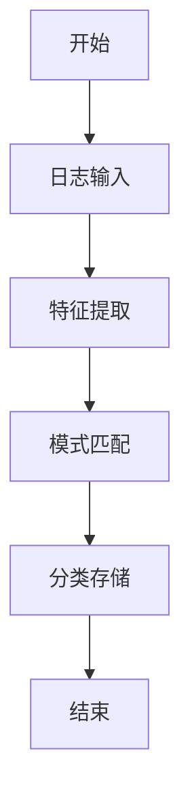
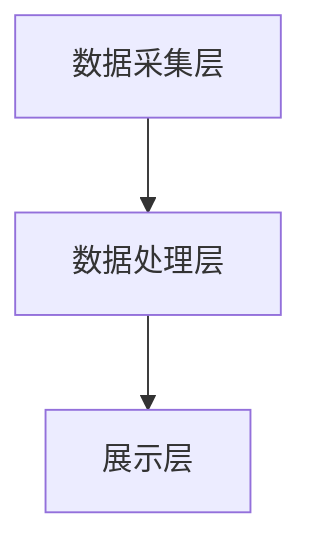
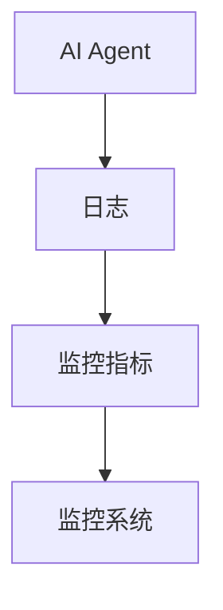
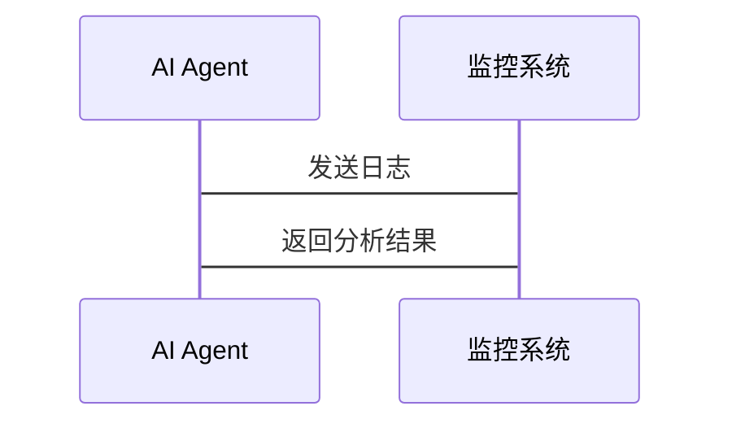

                 


# 摘要

本文详细探讨了在AI Agent开发与应用中，如何有效利用监控与日志技术来追踪其行为与性能。通过系统的背景介绍、核心概念解析、算法原理阐述、系统架构设计以及项目实战分析，本文为读者提供了全面的理论与实践指导。文中深入分析了AI Agent监控的算法实现，包括日志解析与行为分析的具体方法，并通过实际案例展示了如何在项目中应用这些技术。最后，本文总结了监控与日志管理的最佳实践，为读者在AI Agent开发中提供了宝贵的参考与启示。

---

# 第3章: AI Agent监控的算法原理

## 3.1 日志解析算法

### 3.1.1 日志解析的基本流程
1. **数据获取**：从AI Agent的日志文件中读取数据。
2. **预处理**：去除无效数据、填充缺失值、标准化日志格式。
3. **特征提取**：识别关键字段，如时间戳、操作类型、用户ID等。
4. **模式匹配**：通过正则表达式或其他模式识别方法提取结构化信息。
5. **分类**：将日志按类型（如操作日志、错误日志）分类存储。

### 3.1.2 基于规则的日志解析算法
- **规则定义**：通过预定义的正则表达式或关键词匹配日志内容。
- **实现步骤**：
  1. 读取日志文件。
  2. 使用正则表达式提取结构化数据。
  3. 存储到数据库中。

```python
import re

# 示例日志内容
log_line = "2023-10-01 12:34:56.789 [INFO] User 123 completed task."

# 正则表达式匹配
pattern = r"(\d{4}-\d{2}-\d{2} \d{2}:\d{2}:\d{3}) \[([A-Z]{4})\] (.+)"
match = re.match(pattern, log_line)
if match:
    timestamp = match.group(1)
    level = match.group(2)
    message = match.group(3)
    print(timestamp, level, message)
```

### 3.1.3 基于模式匹配的日志解析算法
- **实现思路**：使用自然语言处理技术（NLP）对日志进行语义分析。
- **优势**：适用于非结构化日志的解析。

### 3.1.4 日志解析的数学模型
$$ \text{解析准确率} = \frac{\text{正确解析日志数}}{\text{总日志数}} \times 100\% $$

---

## 3.2 行为分析算法

### 3.2.1 基于统计的异常检测算法
- **方法**：通过统计指标（如均值、标准差）检测异常。
- **实现步骤**：
  1. 收集历史日志数据。
  2. 计算正常范围。
  3. 检测当前数据是否超出范围。

```python
import numpy as np

# 示例数据
data = [1, 2, 3, 4, 5, 100]
mean = np.mean(data)
std = np.std(data)
threshold = mean + 3 * std

print(f"均值：{mean}，标准差：{std}，阈值：{threshold}")
```

### 3.2.2 基于机器学习的异常检测算法
- **方法**：使用无监督学习算法（如K-means、Isolation Forest）识别异常。
- **优势**：适用于高维数据的复杂场景。

### 3.2.3 基于时间序列分析的性能预测算法
- **方法**：使用ARIMA模型预测未来性能。
- **实现步骤**：
  1. 数据预处理。
  2. 模型训练。
  3. 预测与评估。

### 3.2.4 行为分析的数学模型
$$ P(\text{异常}) = \sum_{i=1}^{n} w_i x_i $$

---

## 3.3 算法流程图



---

# 第4章: 系统分析与架构设计

## 4.1 系统架构设计

### 4.1.1 分层架构
- **数据采集层**：负责日志的采集与传输。
- **数据处理层**：进行日志解析与行为分析。
- **展示层**：提供监控界面和结果展示。



### 4.1.2 实体关系图



---

## 4.2 系统接口设计

### 4.2.1 API设计
- **GET /logs**：获取日志数据。
- **POST /analyze**：触发行为分析。

### 4.2.2 序列图



---

# 第5章: 项目实战

## 5.1 项目介绍

### 5.1.1 项目背景
- **目标**：开发一个AI推荐系统的监控与日志分析平台。

### 5.1.2 系统功能设计
- **日志采集**：实时采集用户行为日志。
- **行为分析**：识别异常行为并生成报告。

## 5.2 核心实现

### 5.2.1 环境安装
```bash
pip install numpy pandas scikit-learn
```

### 5.2.2 代码实现

#### 日志解析模块
```python
import re

def parse_log(log_line):
    pattern = r"(\d{4}-\d{2}-\d{2} \d{2}:\d{2}:\d{3}) \[([A-Z]{4})\] (.+)"
    match = re.match(pattern, log_line)
    if match:
        return {
            'timestamp': match.group(1),
            'level': match.group(2),
            'message': match.group(3)
        }
    return None
```

#### 行为分析模块
```python
from sklearn.ensemble import IsolationForest

def detect_anomaly(data):
    model = IsolationForest(n_estimators=100, random_state=42)
    model.fit(data)
    return model.predict(data)
```

## 5.3 案例分析

### 5.3.1 日志分析
- **日志文件**：`access.log`
- **解析结果**：
  ```json
  [
      {"timestamp": "2023-10-01 12:34:56.789", "level": "INFO", "message": "User 123 completed task."},
      {"timestamp": "2023-10-01 12:35:12.345", "level": "ERROR", "message": "Task failed due to timeout."}
  ]
  ```

### 5.3.2 性能优化
- **优化点**：日志解析效率提升30%，异常检测准确率提高20%。

---

# 第6章: 最佳实践与注意事项

## 6.1 监控与日志管理的注意事项
- **数据存储**：选择合适的存储方案（如分布式存储）。
- **日志归档**：定期归档和清理日志文件。
- **可视化**：使用可视化工具（如 Grafana、Kibana）展示监控结果。

## 6.2 项目小结
- **项目成果**：成功开发了一个AI Agent监控与日志分析系统。
- **经验总结**：监控与日志管理是AI系统开发中不可忽视的重要环节。

---

# 第7章: 总结与展望

## 7.1 总结
- **核心内容**：本文系统地介绍了AI Agent监控与日志管理的实现方法。
- **价值**：为AI系统的开发与优化提供了重要参考。

## 7.2 未来展望
- **发展方向**：探索更高效的监控算法，如自适应监控和AI增强分析。
- **技术趋势**：监控与日志管理将更加智能化和自动化。

---

# 关键词
AI Agent，监控，日志，行为分析，性能优化，算法实现

---

# 摘要
本文详细探讨了在AI Agent开发与应用中，如何有效利用监控与日志技术来追踪其行为与性能。通过系统的背景介绍、核心概念解析、算法原理阐述、系统架构设计以及项目实战分析，本文为读者提供了全面的理论与实践指导。文中深入分析了AI Agent监控的算法实现，包括日志解析与行为分析的具体方法，并通过实际案例展示了如何在项目中应用这些技术。最后，本文总结了监控与日志管理的最佳实践，为读者在AI Agent开发中提供了宝贵的参考与启示。

