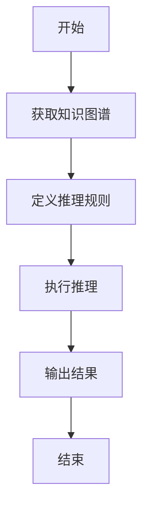
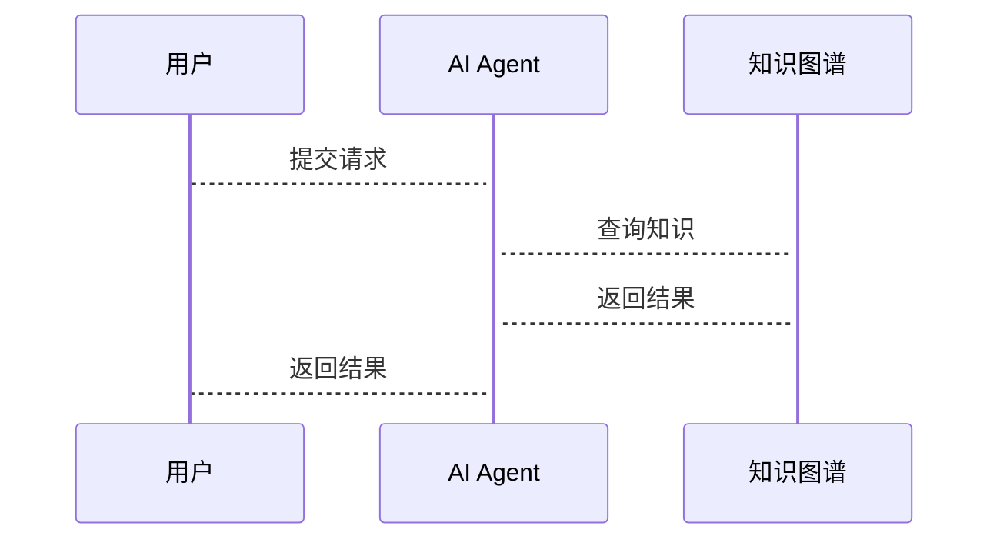

                 


# 知识图谱在AI Agent中的应用

## 关键词：知识图谱, AI Agent, 语义理解, 知识推理, 系统架构, 项目实战

## 摘要：  
知识图谱作为一种结构化的知识表示方法，为AI Agent提供了丰富的语义信息和推理能力，使其能够更好地理解和执行任务。本文将从知识图谱和AI Agent的核心概念出发，探讨它们之间的联系与应用，详细分析相关算法原理，设计系统架构，并通过实战案例展示知识图谱在AI Agent中的具体应用，最后总结其应用价值和发展前景。

---

## 第一部分：知识图谱与AI Agent的背景介绍

### 第1章：知识图谱与AI Agent的概述

#### 1.1 知识图谱的定义与特点
知识图谱是一种以图结构形式表示知识的数据库，节点表示实体或概念，边表示实体之间的关系。其特点包括：  
- **结构化**：以图结构组织知识，便于计算机理解和推理。  
- **语义丰富**：通过实体和关系的组合，提供深层次的语义信息。  
- **可扩展性**：支持动态更新和大规模扩展。  
- **应用场景广泛**：可用于搜索、推荐、问答、语义理解等领域。

#### 1.2 AI Agent的定义与特点
AI Agent是具有感知环境、自主决策和执行任务的智能体，其特点包括：  
- **自主性**：无需外部干预，自主完成任务。  
- **反应性**：能够实时感知环境并做出反应。  
- **目标导向**：基于目标驱动行为和决策。  
- **学习能力**：通过学习不断优化自身性能。

#### 1.3 知识图谱与AI Agent的联系
知识图谱为AI Agent提供了语义理解和知识推理的能力，使其能够更智能地完成任务。两者结合的关键在于：  
- 知识图谱为AI Agent提供知识库，支持其进行语义理解和知识推理。  
- AI Agent利用知识图谱进行决策和执行任务，提升智能性和效率。  

---

## 第二部分：知识图谱与AI Agent的核心概念与联系

### 第2章：知识图谱与AI Agent的核心概念

#### 2.1 知识表示
知识图谱通过实体、关系和属性三元组表示知识。例如，实体“张三”可以与关系“毕业于”连接到实体“北京大学”，并附加属性“成绩优秀”。知识图谱的构建过程包括数据抽取、实体识别、关系抽取和属性提取。

#### 2.2 语义理解
语义理解是AI Agent的核心能力之一，依赖知识图谱提供语义信息。例如，在自然语言处理中，AI Agent可以通过知识图谱理解上下文中的实体关系，从而更准确地回答问题。

#### 2.3 知识推理
知识推理是基于知识图谱进行逻辑推理的过程。例如，通过已知“张三毕业于北京大学”和“北京大学是中国的著名大学”，AI Agent可以推理出“张三在中国的著名大学学习”。

### 第3章：知识图谱与AI Agent的实体关系图

#### 3.1 实体关系图的构建
知识图谱的构建过程如下：  
1. 数据抽取：从文本或数据库中提取信息。  
2. 实体识别：识别文本中的实体。  
3. 关系抽取：识别实体之间的关系。  
4. 属性提取：提取实体的属性信息。  

#### 3.2 语义理解的实现方法
语义理解的实现方法包括：  
- **基于规则的方法**：通过预定义的规则匹配语义。  
- **基于统计的方法**：利用概率模型进行语义分析。  
- **基于深度学习的方法**：通过神经网络模型（如BERT）进行语义理解。  

---

## 第三部分：知识图谱与AI Agent的算法原理

### 第4章：知识图谱构建算法

#### 4.1 实体识别与关系抽取
实体识别可以通过正向最大匹配算法实现，关系抽取可以通过基于规则的模式匹配或基于深度学习的模型实现。

#### 4.2 知识图谱构建流程
知识图谱的构建流程包括：  
1. 数据预处理：清洗和格式化数据。  
2. 数据抽取：从数据中提取实体、关系和属性。  
3. 知识融合：合并重复实体和关系。  
4. 知识存储：将知识存储到图数据库中。  

### 第5章：AI Agent中的知识推理算法

#### 5.1 知识推理方法
知识推理方法包括：  
- **基于规则的推理**：通过预定义的逻辑规则进行推理。  
- **基于逻辑的推理**：通过逻辑推理引擎进行推理。  
- **基于概率的推理**：通过概率模型进行推理。  

#### 5.2 算法流程图
以下是基于规则的推理算法流程图：



#### 5.3 代码实现
以下是基于规则的推理算法的Python代码示例：

```python
def infer_knowledge_graph(kg, rule):
    result = []
    for triple in kg:
        if triple matches rule:
            result.append(infer_result(triple, rule))
    return result
```

---

## 第四部分：知识图谱与AI Agent的系统分析与架构设计

### 第6章：系统架构设计

#### 6.1 系统架构图
以下是知识图谱与AI Agent的系统架构图：


#### 6.2 系统功能设计
系统功能设计包括：  
- 知识图谱构建模块：负责构建和更新知识图谱。  
- AI Agent模块：负责接收请求、调用知识图谱进行推理并返回结果。  
- 用户交互模块：负责与用户交互并传递请求和结果。  

#### 6.3 接口设计
以下是系统接口设计：



---

## 第五部分：知识图谱与AI Agent的项目实战

### 第7章：项目实战

#### 7.1 环境安装
需要安装的知识图谱相关工具包括：  
- **Neo4j**：图数据库。  
- **SPARQL**：用于查询知识图谱的语⾔。  
- **Python库**：如networkx、py2neo。  

#### 7.2 核心代码实现
以下是知识图谱构建的核心代码实现：

```python
from py2neo import Graph, Node, Relationship

graph = Graph("http://localhost:7474", auth=("username", "password"))
node1 = Node("Person", name="张三")
node2 = Node("University", name="北京大学")
relationship = Relationship(node1, "毕业于", node2)
graph.create(node1)
graph.create(node2)
graph.create(relationship)
```

#### 7.3 案例分析
以智能问答系统为例，AI Agent可以根据知识图谱提供准确的答案。例如，用户询问“张三毕业于哪里？”，AI Agent可以根据知识图谱返回“北京大学”。

---

## 第六部分：总结与展望

### 第8章：总结与展望

#### 8.1 总结
知识图谱为AI Agent提供了丰富的知识库，支持其进行语义理解和知识推理，使其能够更智能地完成任务。本文详细讲解了知识图谱和AI Agent的核心概念、算法原理、系统架构和实战案例。

#### 8.2 展望
未来，知识图谱在AI Agent中的应用将更加广泛和深入。例如，动态知识图谱的构建和更新、多模态数据的融合、知识图谱的可解释性等，都将是研究的重点方向。

---

通过本文的讲解，读者可以深入了解知识图谱在AI Agent中的应用，并能够将其应用到实际项目中，提升AI Agent的智能性和效率。

