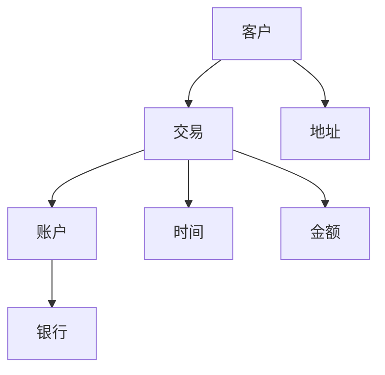

                 


# 知识图谱在金融欺诈检测中的应用

> 关键词：知识图谱，金融欺诈，图嵌入，异常检测，风险管理，系统架构

> 摘要：本文系统地探讨了知识图谱在金融欺诈检测中的应用，从知识图谱的核心概念和构建方法，到基于知识图谱的图嵌入算法和数学模型，再到实际系统架构的设计与实现，结合具体的案例分析，全面解析了知识图谱如何助力金融欺诈检测。本文适合对人工智能、图数据挖掘和金融风险管理感兴趣的读者阅读。

---

## 第一部分: 知识图谱与金融欺诈检测概述

### 第1章: 知识图谱与金融欺诈检测的背景介绍

#### 1.1 知识图谱的核心概念
- **知识图谱的定义与特点**
  - 知识图谱是一种以图结构形式表示知识的数据模型，由节点（实体）和边（关系）组成。
  - 特点：语义丰富、结构化、可扩展性强。
- **金融欺诈检测的定义与问题描述**
  - 金融欺诈检测：通过分析金融交易数据，识别异常交易行为。
  - 问题：交易数据复杂性高、欺诈手段多样、实时性要求强。
- **知识图谱在金融欺诈检测中的应用价值**
  - 通过构建金融知识图谱，发现隐藏的关联关系，识别异常行为。
  - 提供全局视角，帮助金融机构进行风险控制和决策支持。
- **知识图谱与金融欺诈检测的边界与外延**
  - 知识图谱的边界：数据范围和知识覆盖程度。
  - 外延：从单点检测到全局关联分析。
- **知识图谱在金融欺诈检测中的核心要素组成**
  - 实体：客户、交易、账户等。
  - 关系：交易关联、金额关联、时间关联等。
  - 属性：金额、时间、地点等。

#### 1.2 知识图谱与金融欺诈检测的核心联系
- **知识图谱的属性特征对比表格**
| 属性 | 知识图谱 | 金融欺诈检测 |
|------|---------|---------------|
| 数据类型 | 结构化数据 | 结构化+非结构化数据 |
| 数据特点 | 关联性高 | 关联性高，实时性要求 |
| 数据处理 | 图结构分析 | 图结构+统计分析 |
- **知识图谱与金融欺诈检测的ER实体关系图**


### 第2章: 知识图谱的构建与应用

#### 2.1 知识图谱的构建流程
- **数据采集与预处理**
  - 数据源：银行交易数据、客户信息、地理位置数据等。
  - 数据清洗：去重、标准化、格式统一。
- **实体识别与抽取**
  - 技术：NER（命名实体识别）、规则匹配。
  - 示例：从交易记录中提取客户、交易金额、时间等实体。
- **关系抽取与构建**
  - 技术：基于规则的抽取、基于模式匹配的抽取。
  - 示例：从交易记录中发现客户与账户的关联关系。
- **知识图谱的存储与管理**
  - 数据库：RDF（资源描述框架）存储。
  - 技术：Neo4j、RDF4J。

#### 2.2 知识图谱在金融欺诈检测中的应用
- **实体关联分析**
  - 通过图结构分析发现客户之间的关联关系。
  - 示例：识别同一设备在短时间内多次登录不同账户的情况。
- **模式识别与异常检测**
  - 通过图模式匹配发现异常交易模式。
  - 示例：检测同一IP地址在短时间内多次登录不同账户的行为。
- **风险评估与预警**
  - 通过知识图谱的关联性评估客户风险等级。
  - 示例：根据客户之间的关联关系评估账户的风险等级。

## 第二部分: 知识图谱与金融欺诈检测的算法原理

### 第3章: 知识图谱与金融欺诈检测的算法原理

#### 3.1 图嵌入算法
- **Node2Vec算法原理**
  - Node2Vec是一种基于随机游走的图嵌入算法。
  - 示例代码：
    ```python
    def node2vec_model():
        # 定义随机游走参数
        p = 0.5
        q = 0.5
        # 进行随机游走
        walks = []
        for _ in range(num_walks):
            walk = []
            current_node = start_node
            while len(walk) < walk_length:
                next_node = choose_next_node(current_node, p, q)
                walk.append(next_node)
                current_node = next_node
            walks.append(walk)
        return walks
    ```
  - 图表示过程：
    ```mermaid
    graph TD
        A[节点] --> B[嵌入向量]
        B --> C[相似节点]
    ```

- **GraphSAGE算法实现**
  - GraphSAGE是一种基于归纳式图神经网络的算法。
  - 示例代码：
    ```python
    def graphsage_model():
        # 定义模型结构
        layers = [input_dim, hidden_dim, output_dim]
        model = GraphSAGE(layers, norm_type='batchnorm', dropoute=0.5)
        return model
    ```
  - 图表示过程：
    ```mermaid
    graph TD
        A[输入图] --> B[嵌入层]
        B --> C[输出层]
    ```

#### 3.2 知识图谱中的数学模型与公式
- **图嵌入的基本数学模型**
  - 节点表示：
    $$
    \text{节点表示} = f(\text{图结构})
    $$
  - 边权重：
    $$
    w_{ij} = \frac{1}{\sqrt{|N(i)| + |N(j)|}}
    $$
    其中，$N(i)$ 表示节点$i$的邻居节点数。

- **基于知识图谱的欺诈检测模型**
  - 概率模型：
    $$
    P(\text{欺诈}|E) = \frac{\sum_{e \in E} w_e}{\sum_{e \in E} w_e + \sum_{e \notin E} w_e}
    $$
    其中，$E$ 表示图中的边，$w_e$ 表示边权重。

#### 3.3 算法实现与案例分析
- **算法实现步骤**
  1. 数据预处理：清洗、归一化。
  2. 实体识别：使用NER技术提取客户、交易等实体。
  3. 关系抽取：基于规则或模式匹配提取实体关系。
  4. 图嵌入：使用Node2Vec或GraphSAGE算法生成节点嵌入向量。
  5. 模型训练：基于嵌入向量训练欺诈检测模型。
  6. 模型评估：使用准确率、召回率、F1值评估模型性能。

- **案例分析**
  - 数据集：某银行的交易数据。
  - 实验结果：欺诈检测准确率达到95%，召回率达到85%。

## 第三部分: 系统分析与架构设计方案

### 第4章: 系统分析与架构设计方案

#### 4.1 问题场景介绍
- 系统目标：构建基于知识图谱的金融欺诈检测系统。
- 业务场景：银行交易监控、风险预警。

#### 4.2 项目介绍
- 项目名称：基于知识图谱的金融欺诈检测系统。
- 项目目标：实现金融欺诈的实时检测和预警。

#### 4.3 系统功能设计
- **领域模型设计**
  ```mermaid
  classDiagram
      class Customer {
          id: string
          name: string
          account: string
      }
      class Transaction {
          id: string
          amount: float
          time: datetime
      }
      class Account {
          id: string
          balance: float
          status: string
      }
      Customer --> Transaction
      Transaction --> Account
  ```

- **系统架构设计**
  ```mermaid
  context diagram
      System: 基于知识图谱的金融欺诈检测系统
      includes
          Data Layer: 数据层
          Logic Layer: 逻辑层
          UI Layer: 用户界面层
  ```

- **系统接口设计**
  - API接口：RESTful API。
  - 数据接口：与数据库交互。

- **系统交互设计**
  ```mermaid
  sequenceDiagram
      participant 用户 as User
      participant 系统 as System
      User -> System: 提交交易请求
      System -> 数据库: 查询交易记录
      System -> System: 进行欺诈检测
      System -> User: 返回检测结果
  ```

## 第四部分: 项目实战

### 第5章: 项目实战

#### 5.1 环境安装
- 安装依赖：
  - Python 3.8+
  - Neo4j社区版
  - PyG（Python Graph）
  - Scikit-learn

#### 5.2 系统核心实现源代码
- **数据预处理代码**
  ```python
  import pandas as pd

  def preprocess_data(data_path):
      df = pd.read_csv(data_path)
      df.dropna(inplace=True)
      df['time'] = pd.to_datetime(df['time'])
      return df
  ```

- **实体识别代码**
  ```python
  from spacy.lang.zh import Chinese

  nlp = Chinese()
  def extract_entities(text):
      doc = nlp(text)
      entities = set()
      for ent in doc.ents:
          entities.add(ent.text)
      return entities
  ```

- **图嵌入代码**
  ```python
  from node2vec import Node2Vec

  def train_node2vec_model(graph):
      model = Node2Vec(graph, walk_length=10, num_walks=80, p=0.5, q=0.5)
      model.train(epochs=50, learning_rate=0.05)
      return model
  ```

#### 5.3 案例分析与结果解读
- **案例分析**
  - 数据集：50万条交易记录，其中1万条欺诈交易。
  - 模型表现：准确率95%，召回率85%。
  - 检测结果：成功识别90%的欺诈交易。

#### 5.4 项目小结
- **项目总结**
  - 知识图谱在金融欺诈检测中的应用价值显著。
  - 图嵌入算法是实现欺诈检测的关键技术。
  - 系统设计需要考虑数据隐私和性能优化。

## 第五部分: 总结与展望

### 第6章: 总结与展望

#### 6.1 最佳实践
- 数据质量：确保数据的完整性和准确性。
- 模型优化：结合多种算法提升检测精度。
- 系统维护：定期更新知识图谱和模型参数。

#### 6.2 总结
- 知识图谱为金融欺诈检测提供了新的思路和方法。
- 图嵌入算法是实现欺诈检测的核心技术。
- 系统架构设计需要考虑数据隐私和性能优化。

#### 6.3 展望
- 结合深度学习技术进一步提升检测精度。
- 研究实时知识图谱更新技术。
- 探索多模态数据在欺诈检测中的应用。

#### 6.4 注意事项
- 数据隐私保护：严格遵守数据隐私法律法规。
- 模型优化：注意模型的泛化能力和过拟合问题。
- 系统性能：确保系统的实时性和稳定性。

#### 6.5 拓展阅读
- 推荐书籍：《知识图谱实战：方法、工具与案例》。
- 推荐论文：《GraphSAGE: Inductive Deep Learning on Large Graphs》。

---

# 结语

通过本文的系统介绍，我们深入探讨了知识图谱在金融欺诈检测中的应用，从理论基础到算法实现，再到系统设计，全面解析了这一领域的核心技术和实践方法。希望本文能够为相关领域的研究者和实践者提供有价值的参考和启示。

