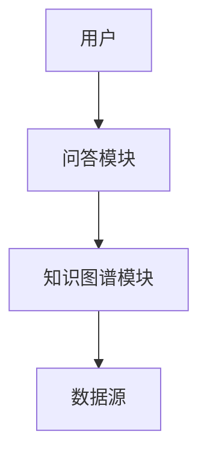

                 


# 知识图谱在金融领域知识问答中的应用

## 关键词：知识图谱、金融问答、自然语言处理、深度学习、实体识别、关系抽取

## 摘要：  
本文详细探讨了知识图谱在金融领域知识问答中的应用，从知识图谱的基本概念到其在金融问答系统中的构建与应用进行了全面分析。文章首先介绍了知识图谱在金融问答中的背景与重要性，接着深入讲解了知识图谱的核心概念与构建算法，随后详细分析了金融知识问答系统的架构设计与实现过程，并通过具体案例展示了知识图谱在金融问答中的实际应用。本文旨在为读者提供一个系统性的视角，帮助理解如何利用知识图谱技术提升金融领域的问答效率与准确性。

---

## 第1章：知识图谱与金融问答的背景介绍

### 1.1 知识图谱的基本概念

#### 1.1.1 知识图谱的定义与特点
知识图谱是一种以图结构形式表示知识的语义网络，由节点（实体）和边（关系）组成。其特点包括：
- **语义性**：节点和边具有明确的语义表示。
- **结构化**：通过图结构组织知识，便于机器理解和推理。
- **动态性**：能够实时更新以反映最新信息。

#### 1.1.2 知识图谱与传统数据库的区别
| 特性 | 知识图谱 | 传统数据库 |
|------|----------|-------------|
| 数据结构 | 图结构（节点与边） | 行列结构 |
| 表达能力 | 强语义关联 | 基于查询字段 |
| 查询效率 | 较低，依赖图遍历算法 | 较高，基于索引 |

#### 1.1.3 金融领域知识问答的需求与挑战
- **需求**：投资者需要快速获取准确的金融信息，如公司财报、市场动态等。
- **挑战**：信息分散、语义复杂、实时性要求高等。

### 1.2 知识图谱在金融中的应用背景

#### 1.2.1 金融领域知识问答的现状与痛点
- **现状**：传统问答系统依赖关键词匹配，难以理解语义。
- **痛点**：信息不全、语义理解不足、难以实时更新。

#### 1.2.2 知识图谱在金融问答中的优势
- **语义理解**：通过图结构能够准确理解用户意图。
- **知识关联**：能够关联多个实体之间的关系，提供更全面的答案。

#### 1.2.3 金融知识图谱的构建与应用
- **构建**：通过爬取金融数据、实体识别、关系抽取等步骤构建金融知识图谱。
- **应用**：用于智能投顾、风险评估等领域。

---

## 第2章：知识图谱的核心概念与联系

### 2.1 知识图谱的构建原理

#### 2.1.1 数据来源与预处理
- **数据来源**：包括新闻、财报、公告等。
- **预处理**：去重、清洗、格式统一。

#### 2.1.2 实体识别与抽取
- **规则方法**：基于金融领域的特定规则。
- **统计方法**：利用模式匹配。
- **深度学习方法**：使用BERT等模型。

#### 2.1.3 关系抽取与属性提取
- **关系抽取**：识别实体之间的关系（如“持有”、“投资”）。
- **属性提取**：提取实体的属性（如公司市值、成立时间）。

#### 2.1.4 实体关系图


---

## 第3章：知识图谱构建算法详解

### 3.1 实体识别与抽取算法

#### 3.1.1 基于规则的实体识别
- **规则**：定义特定关键词和模式。
- **优缺点**：简单但不够灵活。

#### 3.1.2 基于统计的实体识别
- **统计方法**：利用频率分析。
- **优缺点**：需要大量数据，准确性较高。

#### 3.1.3 基于深度学习的实体识别
- **模型**：使用BERT、LSTM等。
- **代码示例**：
  ```python
  import torch
  model = torch.hub.load('bert-base')
  ```

### 3.2 关系抽取与属性提取算法

#### 3.2.1 基于规则的关系抽取
- **规则**：定义关系模板。

#### 3.2.2 基于统计的关系抽取
- **统计方法**：利用共现矩阵。

#### 3.2.3 基于深度学习的关系抽取
- **模型**：使用RNN、Transformer。
- **代码示例**：
  ```python
  import torch
  model = torch.nn.Sequential(
      torch.nn.Linear(100, 50),
      torch.nn.ReLU(),
      torch.nn.Linear(50, 1)
  )
  ```

---

## 第4章：金融知识问答系统的架构设计

### 4.1 系统功能设计

#### 4.1.1 系统模块划分
- **数据处理模块**：负责数据预处理。
- **知识图谱构建模块**：负责构建和存储。
- **问答模块**：负责用户提问和答案生成。

#### 4.1.2 系统架构图


---

## 第5章：项目实战与系统实现

### 5.1 环境搭建与工具安装

#### 5.1.1 开发环境配置
- **工具**：Python、Jupyter Notebook。
- **安装命令**：
  ```bash
  pip install python-igraph neo4j
  ```

### 5.2 知识图谱构建的代码实现

#### 5.2.1 数据预处理与清洗代码示例
```python
import pandas as pd

# 读取数据
data = pd.read_csv('financial_data.csv')

# 清洗数据
data.dropna(inplace=True)
```

#### 5.2.2 实体识别与关系抽取的Python代码实现
```python
from spacy.lang.zh import Chinese

nlp = Chinese()
doc = nlp("公司A投资了公司B")
ents = list(doc.ents)
```

### 5.3 问答系统核心功能实现

#### 5.3.1 问题理解与解析代码示例
```python
def question_understanding(question):
    # 分词和实体识别
    tokens = word_tokenize(question)
    entities = extract_entities(tokens)
    return entities
```

---

## 第6章：系统分析与架构设计方案

### 6.1 系统可行性分析

#### 6.1.1 系统功能需求
- **用户需求**：快速获取金融信息。
- **技术需求**：高性能、高可用性。

#### 6.1.2 系统性能指标
- **响应时间**：小于1秒。
- **吞吐量**：每分钟处理100个请求。

### 6.2 系统设计原则

#### 6.2.1 模块化设计
- **模块划分**：数据处理、知识图谱构建、问答模块。

#### 6.2.2 可扩展性设计
- **数据源扩展**：支持多种数据源接入。

### 6.3 系统性能分析

#### 6.3.1 系统性能优化
- **索引优化**：在知识图谱中建立索引。
- **缓存机制**：缓存常用数据。

---

## 小结

本文系统地介绍了知识图谱在金融问答中的应用，从理论到实践，详细讲解了构建过程和系统设计。通过实际案例，展示了如何利用知识图谱技术提升金融领域的问答效率与准确性。未来，随着技术的不断发展，知识图谱在金融领域将发挥更大的作用。

---

## 最佳实践 Tips

1. 在构建知识图谱时，选择合适的数据源和算法是关键。
2. 系统设计时，注重模块化和可扩展性。
3. 定期更新知识图谱，确保信息的实时性。

---

## 参考文献

1. 《知识图谱：概念、方法与应用》
2. 《深度学习在自然语言处理中的应用》
3. 《金融数据分析与建模》

