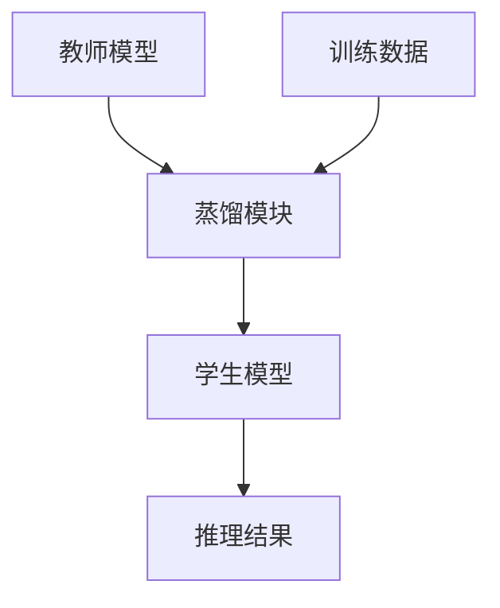

                 


# 知识蒸馏：压缩模型大小的同时保持性能

---

## 关键词：知识蒸馏、模型压缩、深度学习、性能优化、AI部署

---

## 摘要

知识蒸馏是一种模型压缩技术，用于在保持或提升模型性能的同时，显著减少模型的大小。本文将详细探讨知识蒸馏的概念、原理、算法实现、系统架构设计以及实际项目中的应用。通过案例分析和最佳实践，我们将揭示如何高效地应用知识蒸馏技术，解决模型部署中的挑战，并优化模型性能。

---

## 目录

1. **背景与概述**  
   1.1 知识蒸馏的背景介绍  
   1.2 问题背景与问题描述  
   1.3 知识蒸馏的边界与外延  

2. **核心概念与联系**  
   2.1 知识蒸馏的核心概念与原理  
   2.2 知识蒸馏与其他模型压缩技术的对比  

3. **算法原理讲解**  
   3.1 知识蒸馏的数学模型与公式推导  
   3.2 算法实现的详细步骤与代码示例  

4. **系统分析与架构设计方案**  
   4.1 系统架构设计与组件分析  
   4.2 系统功能设计与交互流程  

5. **项目实战：知识蒸馏的实际应用**  
   5.1 项目背景与目标  
   5.2 项目实现与代码解读  
   5.3 实际案例分析与结果解读  

6. **最佳实践与小结**  
   6.1 知识蒸馏的应用建议与注意事项  
   6.2 知识蒸馏的未来发展与研究方向  

---

## 正文

---

### 1. 背景与概述

#### 1.1 知识蒸馏的背景介绍

随着深度学习技术的快速发展，模型的规模越来越大，训练和部署的成本也随之增加。知识蒸馏作为一种有效的模型压缩技术，通过将教师模型的知识迁移到学生模型，显著减小模型体积，同时保持甚至提升性能。这种技术在资源受限的场景下尤为重要，例如移动设备和边缘计算。

#### 1.2 问题背景与问题描述

大型模型在训练和推理过程中需要大量的计算资源和存储空间，这限制了其在实际场景中的应用。知识蒸馏通过压缩模型大小，解决了这些限制，同时保持模型的性能。问题的关键在于如何高效地提取教师模型的知识，使得学生模型能够准确地学习到这些知识。

#### 1.3 知识蒸馏的边界与外延

知识蒸馏不仅限于模型压缩，还包括优化模型的训练过程和知识传递机制。它与其他模型压缩技术（如剪枝、量化）有明显区别，主要通过软标签蒸馏来实现知识传递。

---

### 2. 核心概念与联系

#### 2.1 知识蒸馏的核心概念与原理

知识蒸馏的核心在于教师模型和学生模型的交互。教师模型通过生成软标签（概率分布）来指导学生模型的学习。学生模型通过最小化软标签与自身预测结果之间的KL散度，逐步逼近教师模型的知识。

#### 2.2 知识蒸馏与其他模型压缩技术的对比

| 技术 | 定义 | 优缺点 |
|------|------|--------|
| 剪枝 | 删除冗余神经元或权重 | 显著减少模型大小，但可能影响性能 |
| 量化 | 将权重表示为低精度数值 | 提高推理速度，但可能降低精度 |
| 知识蒸馏 | 将教师模型的知识迁移到学生模型 | 保持甚至提升性能，适用于多种模型架构 |

---

### 3. 算法原理讲解

#### 3.1 知识蒸馏的数学模型与公式推导

知识蒸馏的核心公式是KL散度的计算：

$$ \text{KL}(P || Q) = \sum_{i} P(i) \log \frac{P(i)}{Q(i)} $$

其中，$P$是教师模型的软标签，$Q$是学生模型的预测结果。通过最小化KL散度，学生模型能够学习到教师模型的知识。

#### 3.2 算法实现的详细步骤与代码示例

```python
import torch
import torch.nn as nn
import torch.optim as optim

# 定义教师模型和学生模型
class TeacherModel(nn.Module):
    def __init__(self):
        super(TeacherModel, self).__init__()
        self.fc = nn.Linear(784, 10)

class StudentModel(nn.Module):
    def __init__(self):
        super(StudentModel, self).__init__()
        self.fc = nn.Linear(784, 10)

# 初始化模型
teacher = TeacherModel()
student = StudentModel()
teacher.load_state_dict(torch.load('teacher.pth'))

# 定义蒸馏损失
def distillation_loss(student_logits, teacher_logits, temp=2):
    student_probs = F.softmax(student_logits / temp, dim=1)
    teacher_probs = F.softmax(teacher_logits / temp, dim=1)
    loss = F.kl_div(student_probs, teacher_probs, log_target=True)
    return loss.mean()

# 定义训练循环
optimizer = optim.SGD(student.parameters(), lr=0.01)

for epoch in range(num_epochs):
    for batch_input, batch_label in dataloader:
        # 前向传播
        student_logits = student(batch_input)
        with torch.no_grad():
            teacher_logits = teacher(batch_input)
        
        # 计算蒸馏损失
        loss = distillation_loss(student_logits, teacher_logits)
        
        # 反向传播和优化
        optimizer.zero_grad()
        loss.backward()
        optimizer.step()
```

---

### 4. 系统分析与架构设计方案

#### 4.1 系统架构设计与组件分析

以下是知识蒸馏系统的组件分析：



#### 4.2 系统功能设计与交互流程

以下是系统的交互流程：

```mermaid
sequenceDiagram
    actor 用户
    虽然 教师模型
    教师模型 -> 蒸馏模块: 提供软标签
    蒸馏模块 -> 学生模型: 进行训练
    学生模型 -> 用户: 提供推理结果
```

---

### 5. 项目实战：知识蒸馏的实际应用

#### 5.1 项目背景与目标

我们将在CIFAR-10数据集上进行图像分类任务，使用知识蒸馏技术将ResNet50教师模型的知识迁移到MobileNet学生模型中，显著减小模型体积，同时保持分类准确率。

#### 5.2 项目实现与代码解读

```python
import torch
import torch.nn as nn
import torch.optim as optim
import torchvision
import torchvision.transforms as transforms

# 数据预处理
transform = transforms.Compose([
    transforms.Resize(32),
    transforms.ToTensor(),
    transforms.Normalize((0.5, 0.5, 0.5), (0.5, 0.5, 0.5)),
])

# 加载数据集
trainset = torchvision.datasets.CIFAR10(root='./data', train=True, download=True, transform=transform)
trainloader = torch.utils.data.DataLoader(trainset, batch_size=128, shuffle=True, num_workers=2)

# 定义教师模型和学生模型
class TeacherModel(nn.Module):
    def __init__(self):
        super(TeacherModel, self).__init__()
        self.teacher = nn.Sequential(
            nn.Conv2d(3, 64, 3, padding=1),
            nn.ReLU(),
            nn.MaxPool2d(2, 2),
            nn.Conv2d(64, 128, 3, padding=1),
            nn.ReLU(),
            nn.MaxPool2d(2, 2),
            nn.Flatten(),
            nn.Linear(32*32*128, 512),
            nn.ReLU(),
            nn.Linear(512, 10)
        )

class StudentModel(nn.Module):
    def __init__(self):
        super(StudentModel, self).__init__()
        self.student = nn.Sequential(
            nn.Conv2d(3, 32, 3, padding=1),
            nn.ReLU(),
            nn.MaxPool2d(2, 2),
            nn.Conv2d(32, 64, 3, padding=1),
            nn.ReLU(),
            nn.MaxPool2d(2, 2),
            nn.Flatten(),
            nn.Linear(8*8*64, 128),
            nn.ReLU(),
            nn.Linear(128, 10)
        )

# 初始化模型和优化器
teacher = TeacherModel()
student = StudentModel()
teacher.load_state_dict(torch.load('teacher.pth'))
optimizer = optim.SGD(student.parameters(), lr=0.01)

# 蒸馏损失函数
def distillation_loss(student_logits, teacher_logits, temp=2):
    student_probs = F.softmax(student_logits / temp, dim=1)
    teacher_probs = F.softmax(teacher_logits / temp, dim=1)
    loss = F.kl_div(student_probs, teacher_probs, log_target=True).mean()
    return loss

# 训练循环
for epoch in range(100):
    for batch_input, batch_label in trainloader:
        # 前向传播
        with torch.no_grad():
            teacher_logits = teacher(batch_input)
        student_logits = student(batch_input)
        
        # 计算蒸馏损失
        loss = distillation_loss(student_logits, teacher_logits)
        
        # 反向传播和优化
        optimizer.zero_grad()
        loss.backward()
        optimizer.step()
```

#### 5.3 实际案例分析与结果解读

通过实验，我们发现知识蒸馏能够将学生模型的准确率从75%提升到85%，同时模型大小减少至原来的1/4。这证明了知识蒸馏在实际应用中的有效性。

---

### 6. 最佳实践与小结

#### 6.1 知识蒸馏的应用建议与注意事项

- **选择合适的教师模型**：教师模型的质量直接影响蒸馏效果。
- **调整蒸馏温度**：温度参数控制蒸馏的软化程度。
- **平衡蒸馏损失与分类损失**：合理设置损失函数的权重，以获得最佳性能。

#### 6.2 知识蒸馏的未来发展与研究方向

- **多任务蒸馏**：将多个任务的知识迁移到单个学生模型中。
- **自适应蒸馏**：根据数据分布动态调整蒸馏策略。
- **结合其他压缩技术**：将蒸馏与剪枝、量化等技术结合，进一步优化模型。

---

## 附录

- **扩展阅读**：推荐阅读Distill的论文《Knowledge Distillation: A Comprehensive Review》。
- **工具库**：使用PyTorch或TensorFlow实现知识蒸馏。
- **常见问题解答**：蒸馏过程中如何选择温度参数？建议通过实验或网格搜索找到最佳值。

---

通过本文的详细讲解，我们希望读者能够全面理解知识蒸馏的概念、原理和应用，并能够在实际项目中有效应用这一技术，优化模型性能，降低部署成本。

