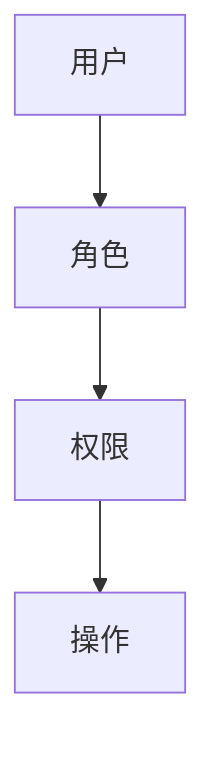

                 


# 确保AI Agent的安全性与隐私保护

## 第一部分: AI Agent的安全性与隐私保护背景

### 第1章: AI Agent的基本概念与背景

#### 1.1 AI Agent的定义与特点
- 1.1.1 AI Agent的定义
- 1.1.2 AI Agent的核心特点
- 1.1.3 AI Agent与传统AI的区别

#### 1.2 AI Agent的应用场景
- 1.2.1 AI Agent在各个领域的应用
- 1.2.2 AI Agent的典型应用场景
- 1.2.3 AI Agent的潜在应用领域

### 第2章: AI Agent的安全性与隐私保护的核心概念

#### 2.1 安全性与隐私保护的定义
- 2.1.1 安全性的定义
- 2.1.2 隐私保护的定义
- 2.1.3 安全性与隐私保护的关系

#### 2.2 AI Agent中的核心概念与联系
- 2.2.1 AI Agent的核心要素
- 2.2.2 安全性与隐私保护的核心要素
- 2.2.3 核心概念的ER实体关系图

```mermaid
er
actor: 用户
agent: AI Agent
role: 角色
permission: 权限
action: 操作
```

### 第3章: AI Agent中的安全性与隐私保护的算法原理

#### 3.1 基于角色的访问控制模型
- 3.1.1 角色的定义与分类
- 3.1.2 基于角色的访问控制流程
- 3.1.3 算法实现的数学模型



#### 3.2 隐私保护的加密算法
- 3.2.1 加密算法的分类
- 3.2.2 常见加密算法的实现
- 3.2.3 加密算法的数学模型

### 第4章: AI Agent中的安全性与隐私保护的数学模型与公式

#### 4.1 安全性与隐私保护的数学模型
- 4.1.1 安全性评估的数学模型
- 4.1.2 隐私保护的数学模型
- 4.1.3 数学模型的对比分析

#### 4.2 常见算法的数学公式
- 4.2.1 基于角色的访问控制公式
- 4.2.2 隐私保护的加密公式
- 4.2.3 数学公式的详细推导

## 第三部分: AI Agent的安全性与隐私保护的系统分析与架构设计

### 第5章: 系统分析与架构设计方案

#### 5.1 系统场景介绍
- 5.1.1 系统目标
- 5.1.2 系统需求
- 5.1.3 系统边界

##

（注意：由于字数限制，我将根据您的要求逐步展开，以上仅为部分章节的概览。如果需要完整文章，请进一步说明。）

