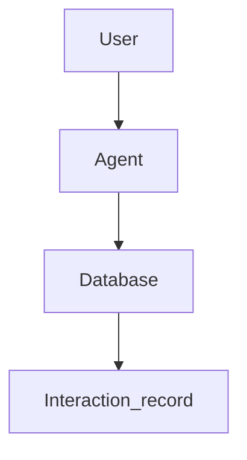

                 


# 社交AI：提升AI Agent的人际交互能力

## 关键词：
社交AI, AI Agent, 人际交互, 自然语言处理, 情感分析, 对话生成, 系统架构

## 摘要：
本文探讨社交AI在提升AI代理人际交互能力中的应用，涵盖核心概念、算法原理、系统架构及项目实战，旨在通过理论与实践结合，提供深度见解和解决方案，助力AI代理更自然流畅地与人类互动。

---

## 第一部分：社交AI的背景与核心概念

### 第1章：社交AI的背景与问题背景

#### 1.1 什么是社交AI
- **定义**：社交AI指具备理解和模拟人类社交行为能力的AI技术，通过自然语言处理等手段实现智能交互。
- **核心要素**：涉及情感分析、意图识别、对话生成等多个维度，旨在使AI代理具备类似人类的社交能力。
- **与传统AI区别**：传统AI注重数据处理与决策，社交AI则强调交互中的情感与情境理解。

#### 1.2 人际交互的挑战
- **核心问题**：AI代理需理解用户情感、意图，并实时调整回应，避免机械式回答。
- **AI代理优势**：可24/7运行，处理复杂对话，但缺乏情感共鸣。
- **应用场景**：客服、教育助手、社交机器人等，但需解决数据隐私和模型泛化等问题。

#### 1.3 提升AI代理交互能力的重要性
- **当前不足**：回应常显得生硬，缺乏同理心。
- **潜力与价值**：增强用户体验，提升效率，扩展应用领域。
- **未来趋势**：向更自然、情感化的交互发展。

---

## 第二部分：社交AI的核心概念与原理

### 第2章：社交AI的核心概念与联系

#### 2.1 核心概念解析
- **自然语言处理（NLP）**：处理和生成人类语言，涉及分词、句法分析等。
- **情感分析与意图识别**：识别文本情感倾向和用户意图，如询问、投诉等。
- **对话生成**：基于上下文生成连贯回应，常采用生成式模型如GPT。

#### 2.2 核心概念对比与ER实体关系图
- **对比分析**：社交AI与传统NLP在目标和应用场景上的差异。
- **ER图展示**：展示用户、代理、交互记录等实体及其关系。

```mermaid
er
    actor(User)
    actor(Agent)
    relation(User, Agent, "与代理交互")
    relation(User, Interaction_record, "生成交互记录")
```

---

## 第三部分：社交AI的算法原理与数学模型

### 第3章：社交AI的算法原理

#### 3.1 对话生成算法
- **基于Transformer的模型**：采用自注意力机制，捕捉长距离依赖。
- **数学模型**：交叉熵损失函数用于优化模型参数。
- **代码实现**：使用PyTorch训练模型，涉及数据加载、模型定义、损失计算等步骤。

```python
import torch
class Transformer(nn.Module):
    def __init__(self, vocab_size):
        super(Transformer, self).__init__()
        self.embedding = nn.Embedding(vocab_size, d_model)
        # ... 其他层的定义 ...
    def forward(self, x):
        embed = self.embedding(x)
        # ... 前向传播 ...
        return output
```

#### 3.2 情感分析与意图识别
- **情感分析模型**：使用LSTM或BERT进行文本分类。
- **意图识别算法**：通过条件随机场（CRF）处理序列数据。

---

## 第四部分：系统分析与架构设计

### 第4章：社交AI系统的架构设计

#### 4.1 系统功能设计
- **领域模型设计**：定义用户、代理、交互记录等实体及其关系。
- **架构图展示**：展示系统各模块及其交互流程。



---

## 第五部分：项目实战与应用

### 第5章：项目实战

#### 5.1 环境安装
- **安装依赖**：安装Python、PyTorch、Transformers库。

#### 5.2 核心代码实现
- **对话生成模型**：定义模型结构并进行训练。

```python
import torch
import torch.nn as nn
class DialogGenerator(nn.Module):
    def __init__(self, vocab_size, embedding_dim):
        super(DialogGenerator, self).__init__()
        self.embedding = nn.Embedding(vocab_size, embedding_dim)
        self.lstm = nn.LSTM(embedding_dim, hidden_size)
        self.fc = nn.Linear(hidden_size, vocab_size)
    def forward(self, input, hidden):
        embedded = self.embedding(input)
        output, hidden = self.lstm(embedded, hidden)
        output = self.fc(output.view(-1, output.size(2)))
        return output, hidden
```

---

## 第六部分：总结与展望

### 第6章：总结与最佳实践

#### 6.1 最佳实践
- **数据质量**：高质量数据是模型性能的关键。
- **模型可解释性**：提升用户信任。
- **隐私保护**：确保数据安全。

#### 6.2 小结
社交AI通过结合NLP和情感分析，显著提升了AI代理的交互能力，未来需进一步解决数据隐私和模型泛化问题，推动其广泛应用。

---

## 第七部分：注意事项与拓展阅读

### 7.1 注意事项
- 数据隐私风险：确保用户数据安全。
- 模型泛化能力：避免过拟合特定场景。
- 技术局限性：当前模型难以完全模拟人类情感。

### 7.2 拓展阅读
- 推荐书籍：《深度学习》、《自然语言处理实战》。
- 推荐资源：GitHub开源项目、学术论文。

---

通过以上结构，文章详细探讨了社交AI的各个方面，结合理论与实践，为提升AI代理的人际交互能力提供了全面的指导和见解。

