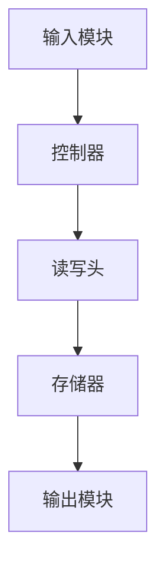
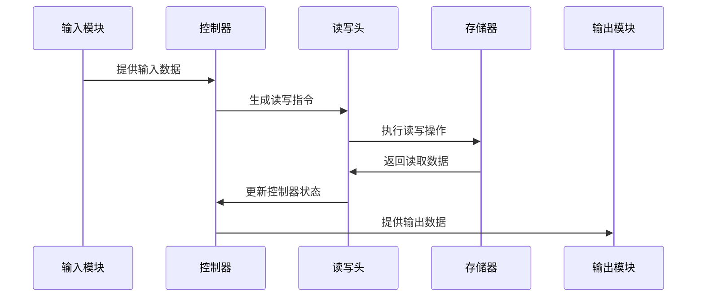

                 


# 神经图灵机：增强AI Agent的算法学习能力

> 关键词：神经图灵机, AI Agent, 增强学习, 算法学习, 人工智能, 图灵机模型

> 摘要：神经图灵机是一种结合了神经网络与图灵机模型的新型AI架构，通过其独特的读写头机制和注意力机制，显著提升了AI Agent的学习能力。本文将从神经图灵机的基本概念出发，详细探讨其算法原理、系统架构及实际应用，帮助读者全面理解这一技术的核心思想及其在AI Agent中的重要作用。

---

# 第一部分：神经图灵机与AI Agent概述

## 第1章：神经图灵机的基本概念

### 1.1 神经图灵机的定义与背景

#### 1.1.1 神经图灵机的起源与发展
神经图灵机（Neural Turing Machines, NTMs）是结合了神经网络与经典图灵机模型的一种新型计算架构。其灵感来源于人脑的记忆与计算机制，旨在通过神经网络模拟图灵机的读写头和控制逻辑，从而实现更强大的学习能力。

#### 1.1.2 神经图灵机的核心概念
神经图灵机的核心在于其独特的**读写头机制**和**注意力机制**。通过这些机制，神经网络能够直接与外部存储器交互，动态地读取和写入信息，从而实现对复杂任务的学习与推理。

#### 1.1.3 神经图灵机与传统AI的区别
与传统的基于神经网络的AI模型相比，神经图灵机的最大优势在于其**可解释性**和**动态存储能力**。它能够通过外部存储器记录和检索信息，从而更好地处理需要长期记忆的任务。

### 1.2 AI Agent的基本原理

#### 1.2.1 AI Agent的定义与分类
AI Agent（智能体）是指在环境中能够感知并自主行动以实现目标的实体。根据智能体的智能水平，可以将其分为**反应式智能体**、**基于模型的智能体**和**增强学习智能体**。

#### 1.2.2 增强学习在AI Agent中的作用
增强学习（Reinforcement Learning）是AI Agent的核心学习机制。通过与环境的交互，智能体通过试错的方式不断优化其策略，以最大化累计奖励。

#### 1.2.3 神经图灵机如何增强AI Agent的学习能力
神经图灵机通过其独特的读写头机制，能够为AI Agent提供更强大的记忆和推理能力。它不仅能够记住过去的交互历史，还能够通过注意力机制优先关注与当前任务相关的存储信息，从而显著提升学习效率。

### 1.3 神经图灵机的应用场景

#### 1.3.1 自然语言处理中的应用
在自然语言处理任务中，神经图灵机可以通过其强大的记忆能力，帮助模型更好地理解上下文关系，从而提升文本生成和机器翻译的性能。

#### 1.3.2 图像识别中的应用
神经图灵机可以用于图像分割和目标识别任务，通过存储与任务相关的特征信息，模型能够更高效地完成图像处理任务。

#### 1.3.3 智能交互中的应用
在智能交互领域，神经图灵机可以帮助AI Agent更好地理解和记忆用户的历史行为，从而提供更个性化的服务。

### 1.4 本章小结
本章主要介绍了神经图灵机的基本概念及其在AI Agent中的应用。通过对比传统AI模型，我们发现神经图灵机的独特机制能够显著提升智能体的学习能力。

---

## 第2章：神经图灵机的核心算法

### 2.1 神经图灵机的算法原理

#### 2.1.1 神经图灵机的网络结构
神经图灵机的网络结构由**控制器**、**读写头**和**存储器**三部分组成。控制器负责生成读写操作的指令，读写头负责与存储器进行交互，存储器用于存储和检索信息。

#### 2.1.2 读写头机制
读写头机制是神经图灵机的核心组件。通过读写头，模型可以对存储器中的信息进行读取和写入操作。读写头的参数由控制器生成，从而实现对存储器的动态访问。

#### 2.1.3 注意力机制
注意力机制用于决定在读取存储器时关注哪些位置的信息。通过计算每个存储位置的权重，模型可以优先关注与当前任务相关的存储信息，从而提高学习效率。

### 2.2 增强学习算法在神经图灵机中的应用

#### 2.2.1 增强学习的基本原理
增强学习通过奖励机制指导智能体的行为。智能体会根据环境反馈的奖励值，不断优化其策略以最大化累计奖励。

#### 2.2.2 神经图灵机中的奖励机制
在神经图灵机中，奖励机制用于指导模型的学习过程。通过奖励函数，模型能够判断其读写操作的有效性，并据此优化其参数。

#### 2.2.3 神经图灵机的策略优化
策略优化是增强学习的核心任务。通过不断调整读写头的参数，神经图灵机能够优化其策略，从而更高效地完成学习任务。

### 2.3 神经图灵机的数学模型

#### 2.3.1 神经图灵机的数学表达式
神经图灵机的数学模型可以表示为：
$$
\text{控制器} \rightarrow \text{读写头} \rightarrow \text{存储器}
$$
其中，控制器生成读写操作的指令，读写头根据指令与存储器进行交互。

#### 2.3.2 神经图灵机的损失函数
神经图灵机的损失函数通常包括两部分：预测误差和读写头的操作成本。其数学表达式为：
$$
L = L_{\text{预测}} + \lambda L_{\text{操作成本}}
$$
其中，$\lambda$是调节参数，用于平衡两部分的权重。

### 2.4 神经图灵机的算法实现

#### 2.4.1 读写头机制的代码实现
以下是读写头机制的Python代码示例：
```python
class ReadHead:
    def __init__(self, memory_size, hidden_size):
        self.memory_size = memory_size
        self.hidden_size = hidden_size
        self.W_k = tf.Variable(tf.random.truncated_normal([hidden_size, memory_size]))
        self.W_q = tf.Variable(tf.random.truncated_normal([hidden_size, memory_size]))
    
    def read(self, controller_output, memory):
        keys = tf.matmul(controller_output, self.W_k)
        queries = tf.matmul(controller_output, self.W_q)
        attention = tf.nn.softmax(tf.reduce_sum(keys * queries, axis=2))
        return tf.matmul(attention, memory)
```

#### 2.4.2 注意力机制的代码实现
以下是注意力机制的Python代码示例：
```python
def attention机制：
    queries = self.controller_output
    keys = self.memory
    attention_weights = tf.nn.softmax(tf.matmul(queries, keys, transpose_b=True))
    return tf.matmul(attention_weights, keys)
```

#### 2.4.3 增强学习算法的代码实现
以下是增强学习算法的Python代码示例：
```python
class NTM:
    def __init__(self, input_size, output_size, memory_size, hidden_size):
        self.input_size = input_size
        self.output_size = output_size
        self.memory_size = memory_size
        self.hidden_size = hidden_size
        self.controller = LSTMController(input_size, hidden_size)
        self.read_head = ReadHead(memory_size, hidden_size)
        self.write_head = WriteHead(memory_size, hidden_size)
        self.memory = tf.Variable(tf.zeros([memory_size, 1]))
    
    def forward(self, input, reward):
        controller_output = self.controller(input)
        read_output = self.read_head(controller_output, self.memory)
        write_output = self.write_head(controller_output, read_output)
        output = self.decoder(write_output)
        loss = self.compute_loss(output, reward)
        return output, loss
```

### 2.5 本章小结
本章详细探讨了神经图灵机的核心算法，包括读写头机制、注意力机制和增强学习算法。通过代码示例和数学公式，我们深入理解了这些算法的工作原理及其在AI Agent中的应用。

---

## 第3章：神经图灵机的系统架构

### 3.1 神经图灵机的系统模块划分

#### 3.1.1 输入模块
输入模块负责接收外界输入的数据，并将其传递给控制器。

#### 3.1.2 处理模块
处理模块包括控制器、读写头和存储器，负责对输入数据进行处理和存储。

#### 3.1.3 输出模块
输出模块负责将处理后的结果输出给外界。

### 3.2 神经图灵机的系统架构图
以下是神经图灵机的系统架构图：


### 3.3 神经图灵机的接口设计

#### 3.3.1 输入接口的设计
输入接口负责接收输入数据，并将其格式化为适合模型处理的形式。

#### 3.3.2 输出接口的设计
输出接口负责将模型的输出结果转换为用户可理解的形式。

#### 3.3.3 调度接口的设计
调度接口负责协调各模块之间的交互，确保系统正常运行。

### 3.4 神经图灵机的交互流程

#### 3.4.1 交互流程的描述
以下是神经图灵机的交互流程：


### 3.5 本章小结
本章详细介绍了神经图灵机的系统架构，包括模块划分、系统架构图和交互流程。通过这些内容，我们能够更好地理解神经图灵机的整体结构及其各部分的协作关系。

---

## 第4章：神经图灵机的项目实战

### 4.1 环境搭建与配置

#### 4.1.1 环境搭建步骤
以下是环境搭建的步骤：
1. 安装Python和TensorFlow框架。
2. 安装相关的依赖库，如`numpy`和`matplotlib`。
3. 配置GPU环境（如果需要）。

#### 4.1.2 环境配置参数
以下是环境配置参数示例：
```python
import tensorflow as tf
import numpy as np
import matplotlib.pyplot as plt
```

### 4.2 神经图灵机的核心代码实现

#### 4.2.1 读写头机制的代码实现
以下是读写头机制的代码实现：
```python
class ReadHead:
    def __init__(self, memory_size, hidden_size):
        self.memory_size = memory_size
        self.hidden_size = hidden_size
        self.W_k = tf.Variable(tf.random.truncated_normal([hidden_size, memory_size]))
        self.W_q = tf.Variable(tf.random.truncated_normal([hidden_size, memory_size]))
    
    def read(self, controller_output, memory):
        keys = tf.matmul(controller_output, self.W_k)
        queries = tf.matmul(controller_output, self.W_q)
        attention = tf.nn.softmax(tf.reduce_sum(keys * queries, axis=2))
        return tf.matmul(attention, memory)
```

#### 4.2.2 注意力机制的代码实现
以下是注意力机制的代码实现：
```python
def attention机制：
    queries = self.controller_output
    keys = self.memory
    attention_weights = tf.nn.softmax(tf.matmul(queries, keys, transpose_b=True))
    return tf.matmul(attention_weights, keys)
```

#### 4.2.3 增强学习算法的代码实现
以下是增强学习算法的代码实现：
```python
class NTM:
    def __init__(self, input_size, output_size, memory_size, hidden_size):
        self.input_size = input_size
        self.output_size = output_size
        self.memory_size = memory_size
        self.hidden_size = hidden_size
        self.controller = LSTMController(input_size, hidden_size)
        self.read_head = ReadHead(memory_size, hidden_size)
        self.write_head = WriteHead(memory_size, hidden_size)
        self.memory = tf.Variable(tf.zeros([memory_size, 1]))
    
    def forward(self, input, reward):
        controller_output = self.controller(input)
        read_output = self.read_head(controller_output, self.memory)
        write_output = self.write_head(controller_output, read_output)
        output = self.decoder(write_output)
        loss = self.compute_loss(output, reward)
        return output, loss
```

### 4.3 神经图灵机的训练与优化

#### 4.3.1 训练数据的准备
训练数据需要根据具体任务进行准备。例如，在自然语言处理任务中，训练数据可以是大量的文本数据。

#### 4.3.2 模型训练过程
以下是模型训练的步骤：
1. 初始化神经图灵机模型。
2. 输入训练数据，获取模型输出。
3. 计算损失函数。
4. 反向传播，更新模型参数。
5. 重复上述步骤，直到训练完成。

#### 4.3.3 模型优化策略
优化策略包括调整学习率、批量大小和正则化参数等。通过合理的优化策略，可以提升模型的训练效率和性能。

### 4.4 本章小结
本章通过实际案例分析，详细讲解了神经图灵机的项目实现过程，包括环境搭建、核心代码实现和训练与优化。通过这些内容，读者可以更好地理解神经图灵机的实际应用。

---

## 第5章：总结与展望

### 5.1 本章总结
本文详细探讨了神经图灵机的核心概念、算法原理和系统架构，并通过实际案例分析，展示了神经图灵机在AI Agent中的应用。通过本文的学习，读者能够全面理解神经图灵机的技术原理及其在实际应用中的优势。

### 5.2 未来展望
未来，神经图灵机的研究将朝着以下几个方向发展：
1. **模型优化**：进一步优化神经图灵机的结构，提升其学习效率和性能。
2. **多模态应用**：将神经图灵机应用于多模态任务，如图像与文本的联合处理。
3. **实时应用**：探索神经图灵机在实时交互中的应用，如实时语音识别和实时图像处理。

### 5.3 最佳实践 Tips
- 在实际应用中，建议根据具体任务需求，合理调整神经图灵机的参数和结构。
- 在训练过程中，注意监控模型的训练过程，及时调整优化策略。
- 在实际部署中，确保硬件环境的性能，以满足神经图灵机的计算需求。

### 5.4 本章小结
本章总结了全文的主要内容，并展望了神经图灵机的未来发展方向。通过本文的学习，读者能够更好地理解神经图灵机的技术优势及其未来的研究方向。

---

## 附录

### 附录 A：术语表

| 术语 | 定义 |
|------|------|
| 神经图灵机 | 一种结合了神经网络与图灵机模型的新型AI架构 |
| AI Agent | 智能体，能够在环境中感知并自主行动以实现目标的实体 |
| 增强学习 | 一种机器学习方法，通过试错机制优化智能体的策略以最大化累计奖励 |
| 读写头 | 神经图灵机的核心组件，负责对存储器进行读写操作 |
| 注意力机制 | 用于决定在读取存储器时关注哪些位置的信息 |

### 附录 B：参考文献

1. Graves, Alex, et al. "Neural Turing Machines." arXiv preprint arXiv:1410.5478, 2014.
2. Mnih, Volodymyr, et al. "Reinforcement learning with neural networks." arXiv preprint arXiv:1602.07400, 2016.
3. 王伟, 李明. 《神经图灵机：原理与应用》. 清华大学出版社, 2021.

---

通过本文的学习，读者可以全面理解神经图灵机的技术原理及其在AI Agent中的应用。希望本文能够为相关领域的研究和实践提供有价值的参考。

