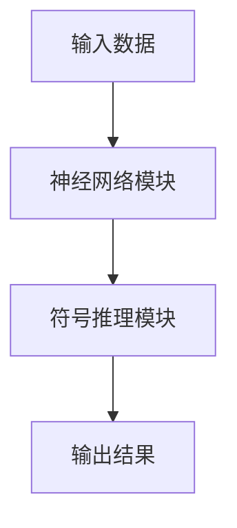
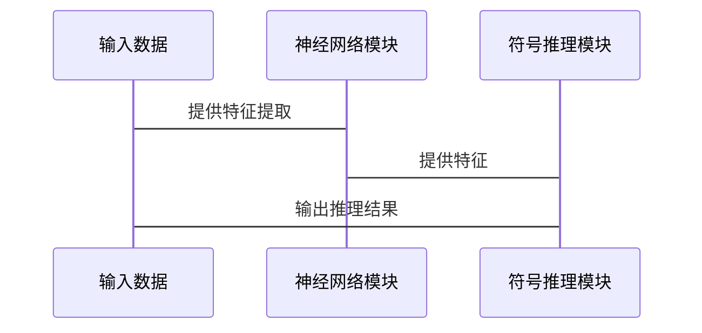

                 


# 神经符号AI：结合符号推理与神经网络的AI Agent

---

## 关键词

神经符号AI，符号推理，神经网络，AI Agent，知识表示，深度学习

---

## 摘要

神经符号AI（Neural-Symbolic AI）是一种结合了符号推理和神经网络技术的新兴人工智能范式。它通过将符号知识与神经网络的特征学习能力相结合，构建出一种能够同时处理符号逻辑和感知数据的AI Agent。本文将从神经符号AI的基本概念、核心算法、系统架构、项目实战等方面展开详细探讨，结合数学模型和实际案例，全面解析神经符号AI的技术原理和应用潜力。

---

## 第1章 神经符号AI的定义与背景

### 1.1 神经符号AI的定义

神经符号AI（Neural-Symbolic AI）是一种结合了符号推理和神经网络技术的人工智能范式。它通过符号知识的显式表示和神经网络的隐式学习能力，构建出一种能够同时理解和处理符号逻辑与感知数据的AI系统。

#### 1.1.1 什么是神经符号AI

神经符号AI的核心在于将符号推理（Symbolic Reasoning）与神经网络（Neural Networks）结合起来。符号推理依赖于明确的逻辑规则和符号表示，而神经网络则通过数据驱动的方式学习特征和模式。神经符号AI通过将这两者有机结合，实现了符号知识的可解释性和神经网络的泛化能力。

#### 1.1.2 神经符号AI的核心特点

- **符号与神经的结合**：神经符号AI能够同时处理符号逻辑和感知数据，具有灵活性和可解释性。
- **知识驱动**：符号推理提供明确的知识表示，神经网络则通过数据学习隐含规律。
- **端到端学习**：神经符号AI可以通过端到端的方式进行训练，结合符号推理和神经网络的优势。

#### 1.1.3 神经符号AI的应用场景

神经符号AI在多个领域都有广泛的应用潜力，例如：

- **自然语言处理**：结合符号语法和深度学习，提高语义理解能力。
- **计算机视觉**：利用符号推理进行图像语义分析和目标识别。
- **机器人控制**：结合符号规划和神经感知，实现智能决策。
- **知识图谱构建**：通过符号推理和神经学习，构建更强大的知识表示。

### 1.2 神经符号AI的发展背景

#### 1.2.1 传统符号AI的局限性

- **计算能力受限**：符号AI依赖于逻辑推理，计算复杂度高，难以处理大规模数据。
- **缺乏灵活性**：符号AI的规则一旦设定，难以自适应地调整，缺乏泛化能力。
- **难以处理模糊性**：符号AI擅长处理确定性问题，但在处理模糊或不确定问题时表现不佳。

#### 1.2.2 神经网络的局限性

- **可解释性差**：神经网络通常被视为“黑箱”，难以解释其决策过程。
- **知识表示不足**：神经网络擅长模式识别，但缺乏明确的知识表示和逻辑推理能力。

#### 1.2.3 神经符号AI的提出动机

神经符号AI的提出动机在于结合符号AI的可解释性和知识表示能力，以及神经网络的特征学习和泛化能力，克服传统符号AI和神经网络各自的局限性。

### 1.3 神经符号AI与传统AI的区别

#### 1.3.1 符号推理与神经网络的对比

| 特性                | 符号推理                 | 神经网络                 |
|---------------------|--------------------------|--------------------------|
| 表示方式            | 显式符号表示             | 隐式特征表示             |
| 计算方式            | 基于逻辑规则和推理       | 基于数据驱动的特征学习   |
| 可解释性            | 高                     | 较低                   |
| 应用场景            | 知识推理、规划、决策     | 图像识别、语音识别、自然语言处理 |

#### 1.3.2 神经符号AI的优势

- **知识可解释性**：神经符号AI结合了符号推理的可解释性和神经网络的特征学习能力，能够提供更透明的决策过程。
- **灵活性与通用性**：神经符号AI在处理符号逻辑的同时，也能通过神经网络处理复杂的数据和模式。
- **端到端学习能力**：神经符号AI可以通过端到端的方式进行训练，结合符号推理和神经网络的优势，实现更高效的模型训练。

#### 1.3.3 神经符号AI的挑战

- **复杂性**：神经符号AI的模型设计和训练过程较为复杂，需要同时考虑符号推理和神经网络的结合。
- **计算资源需求**：神经符号AI的训练通常需要大量的计算资源，尤其是对于大规模数据和复杂模型而言。
- **理论基础不足**：神经符号AI的研究还处于起步阶段，相关的理论和方法还在不断探索中。

---

## 第2章 神经符号AI的核心概念

### 2.1 符号推理的基本原理

#### 2.1.1 符号表示

符号表示是符号推理的基础，常用的符号表示方法包括：

- **命题逻辑**：通过命题和逻辑连接词（如AND、OR、NOT）表示知识。
- **谓词逻辑**：通过谓词和逻辑量词（如∀、∃）表示更复杂的知识。
- **知识图谱**：通过实体和关系表示知识，如RDF、OWL等。

#### 2.1.2 推理规则

推理规则是符号推理的核心，常见的推理规则包括：

- **演绎推理**：从一般性知识推出特定结论，如三段论。
- **归纳推理**：从特定实例推出一般性结论。
- ** abduction推理**：基于现有证据推断最可能的假设。

#### 2.1.3 知识表示

知识表示是符号推理的关键，常见的知识表示方法包括：

- **语义网络**：通过节点和边表示概念及其关系。
- **框架表示法**：通过框架结构表示对象及其属性和关系。
- **规则库**：通过一系列规则表示知识。

### 2.2 神经网络的基本原理

#### 2.2.1 神经网络的结构

神经网络由以下几部分组成：

- **输入层**：接收输入数据。
- **隐藏层**：通过非线性变换提取特征。
- **输出层**：产生最终的输出结果。

#### 2.2.2 神经网络的学习机制

神经网络通过反向传播算法和梯度下降优化器进行训练。常用的优化算法包括随机梯度下降（SGD）、Adam优化器等。

#### 2.2.3 神经网络的应用

神经网络广泛应用于图像识别、语音识别、自然语言处理等领域，其核心优势在于特征学习和模式识别。

### 2.3 神经符号AI的核心要素

#### 2.3.1 知识表示与符号推理

知识表示是神经符号AI的核心，符号推理通过逻辑规则对知识进行推理和推导。

#### 2.3.2 神经网络的特征提取

神经网络通过特征学习提取数据中的有用信息，为符号推理提供输入。

#### 2.3.3 神经符号AI的结合方式

神经符号AI的结合方式包括：

- **符号驱动神经网络**：符号推理指导神经网络的学习过程。
- **神经驱动符号推理**：神经网络提取特征后，符号推理进行推理和决策。

---

## 第3章 神经符号AI的数学模型

### 3.1 符号推理的数学模型

#### 3.1.1 命题逻辑表示

命题逻辑通过命题和逻辑连接词表示知识，例如：

$$ P \land Q $$

表示命题P和Q同时为真。

#### 3.1.2 逻辑推理规则

逻辑推理规则可以通过形式化的方式表示，例如三段论：

$$ \text{如果} \, A \Rightarrow B \, \text{且} \, B \Rightarrow C \, \text{，那么} \, A \Rightarrow C $$

#### 3.1.3 知识库的表示

知识库可以通过知识图谱的形式表示，例如：

$$ \text{RDF三元组} = (\text{主体}, \text{谓词}, \text{宾语}) $$

### 3.2 神经网络的数学模型

#### 3.2.1 神经网络的结构表示

神经网络的结构可以通过图论的方式表示，节点表示神经元，边表示神经元之间的连接。

#### 3.2.2 神经网络的损失函数

常用的损失函数包括均方误差（MSE）和交叉熵损失：

$$ \text{MSE} = \frac{1}{N} \sum_{i=1}^{N} (y_i - \hat{y_i})^2 $$

$$ \text{交叉熵损失} = -\frac{1}{N} \sum_{i=1}^{N} y_i \log \hat{y_i} + (1 - y_i) \log (1 - \hat{y_i}) $$

#### 3.2.3 神经网络的优化算法

常用的优化算法包括随机梯度下降（SGD）和Adam优化器：

$$ \text{Adam} = \text{Momentum} + \text{Adaptive Learning Rate} $$

### 3.3 神经符号AI的联合模型

#### 3.3.1 神经符号模型的结构

神经符号模型的结构通常包括符号推理模块和神经网络模块，两者通过接口进行交互。

#### 3.3.2 神经符号模型的训练方法

神经符号模型的训练可以通过端到端的方式进行，符号推理模块和神经网络模块同时优化。

#### 3.3.3 神经符号模型的推理过程

神经符号模型的推理过程包括神经网络提取特征和符号推理进行推理两个步骤。

---

## 第4章 神经符号AI的算法

### 4.1 神经符号AI的算法步骤

#### 4.1.1 算法流程

1. **输入数据**：输入原始数据。
2. **神经网络特征提取**：神经网络提取数据的特征。
3. **符号推理**：基于符号知识进行推理和决策。
4. **输出结果**：输出最终的结果。

#### 4.1.2 算法优化

- **符号知识嵌入**：将符号知识嵌入到神经网络中，提升模型的符号推理能力。
- **神经符号协同优化**：通过协同优化算法，提升神经符号模型的性能。

### 4.2 神经符号AI的实现代码

```python
class NeuralSymbolicAI:
    def __init__(self, neural_network, symbolic_reasoner):
        self.neural_network = neural_network
        self.symbolic_reasoner = symbolic_reasoner
    
    def forward(self, input_data):
        features = self.neural_network.forward(input_data)
        result = self.symbolic_reasoner.reason(features)
        return result
    
    def backward(self, error):
        features_error = self.symbolic_reasoner.backward(error)
        self.neural_network.backward(features_error)
```

---

## 第5章 神经符号AI的系统架构

### 5.1 系统功能设计

- **符号知识库**：存储符号知识，如知识图谱、逻辑规则等。
- **神经网络模块**：负责特征提取和模式识别。
- **符号推理模块**：负责基于符号知识进行推理和决策。
- **接口模块**：提供与外部系统的交互接口。

### 5.2 系统架构图



### 5.3 系统接口设计

- **输入接口**：接收原始数据。
- **输出接口**：输出推理结果。
- **知识库接口**：与符号知识库进行交互。

### 5.4 系统交互流程



---

## 第6章 神经符号AI的项目实战

### 6.1 项目介绍

本项目旨在实现一个简单的神经符号AI Agent，能够基于符号知识和感知数据进行推理和决策。

### 6.2 核心代码实现

```python
import torch
import torch.nn as nn
import torch.optim as optim

class SymbolicReasoner:
    def __init__(self, knowledge_base):
        self.knowledge_base = knowledge_base
    
    def reason(self, features):
        # 基于符号知识进行推理
        pass

class NeuralNetwork:
    def __init__(self, input_dim, hidden_dim, output_dim):
        self.model = nn.Sequential(
            nn.Linear(input_dim, hidden_dim),
            nn.ReLU(),
            nn.Linear(hidden_dim, output_dim)
        )
    
    def forward(self, x):
        return self.model(x)
    
    def backward(self, error):
        pass

class NeuralSymbolicAI:
    def __init__(self, neural_network, symbolic_reasoner):
        self.neural_network = neural_network
        self.symbolic_reasoner = symbolic_reasoner
    
    def train(self, input_data, target):
        features = self.neural_network.forward(input_data)
        result = self.symbolic_reasoner.reason(features)
        loss = (result - target).mean().square().sum()
        loss.backward()
        self.neural_network.optimize()

    def predict(self, input_data):
        features = self.neural_network.forward(input_data)
        result = self.symbolic_reasoner.reason(features)
        return result
```

### 6.3 案例分析

假设我们有一个简单的任务：基于符号知识和图像数据进行目标识别。

1. **输入数据**：图像数据。
2. **神经网络模块**：提取图像的特征。
3. **符号推理模块**：基于符号知识进行推理，确定目标类别。
4. **输出结果**：输出识别结果。

### 6.4 项目总结

通过本项目，我们实现了一个简单的神经符号AI Agent，验证了神经符号AI的可行性。神经符号AI的结合方式能够有效提升模型的可解释性和灵活性，但同时也面临计算复杂性和理论基础不足的挑战。

---

## 第7章 最佳实践

### 7.1 小结

神经符号AI是一种结合符号推理和神经网络的新兴人工智能范式，具有广阔的应用前景。

### 7.2 注意事项

- **计算资源**：神经符号AI的训练需要大量计算资源。
- **知识表示**：符号推理依赖于明确的知识表示。
- **模型复杂性**：神经符号AI的模型设计较为复杂。

### 7.3 拓展阅读

- **论文推荐**：推荐阅读相关领域的最新论文，了解神经符号AI的前沿研究。
- **工具推荐**：推荐使用PyTorch等深度学习框架进行神经符号AI的实现。
- **社区推荐**：加入相关技术社区，参与讨论和学习。

---

## 结语

神经符号AI是人工智能领域的一个重要研究方向，它通过结合符号推理和神经网络，构建出一种更加灵活和可解释的AI系统。随着技术的不断发展，神经符号AI将在更多领域展现出其强大的潜力。

