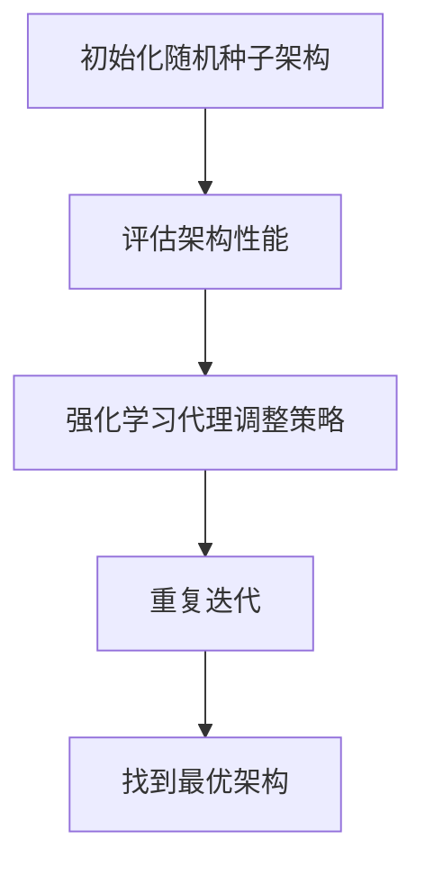
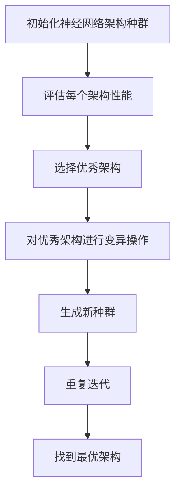
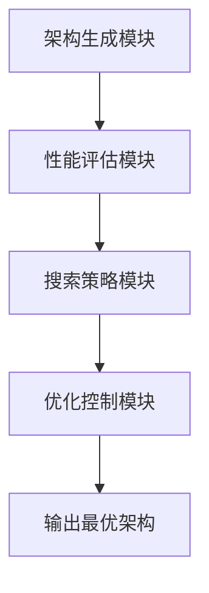

                 


# 神经网络架构搜索在AI Agent优化中的应用

> 关键词：神经网络架构搜索，AI Agent，强化学习，进化策略，系统优化

> 摘要：本文深入探讨了神经网络架构搜索（Neural Architecture Search, NAS）在AI Agent优化中的应用。通过分析NAS的核心原理和AI Agent的优化需求，本文提出了结合NAS技术提升AI Agent性能的新方法，详细介绍了相关算法、系统架构设计及实际案例，为AI Agent的优化提供了新的思路。

---

## 第一部分: 神经网络架构搜索与AI Agent优化背景

### 第1章: 神经网络架构搜索与AI Agent概述

#### 1.1 神经网络架构搜索的背景与意义

##### 1.1.1 传统神经网络架构设计的局限性
传统神经网络架构设计依赖人工经验，存在设计效率低、可扩展性差、优化空间有限等问题。神经网络架构搜索（NAS）通过自动化寻找最优架构，解决了这些问题。

##### 1.1.2 神经网络架构搜索的提出与目标
NAS的目标是通过搜索算法自动发现性能最优的神经网络架构，减少人工试错成本，提升模型性能。

##### 1.1.3 神经网络架构搜索在AI Agent中的应用价值
AI Agent需要在复杂环境中自主决策，其性能依赖于感知和决策模块的优化。NAS可以显著提升AI Agent的感知能力和决策效率。

#### 1.2 AI Agent的基本概念与特点

##### 1.2.1 AI Agent的定义与分类
AI Agent是具有感知环境、自主决策和执行任务能力的智能体，分为简单反射型、基于模型的反应型、目标驱动型和实用驱动型。

##### 1.2.2 AI Agent的核心功能与任务
AI Agent的核心功能包括感知环境、知识表示、推理决策、规划与执行。其任务是通过高效感知和决策提升任务执行效率。

##### 1.2.3 AI Agent与传统AI的区别
AI Agent强调自主性和适应性，能够动态调整策略；传统AI依赖于静态规则，适应性较差。

#### 1.3 神经网络架构搜索与AI Agent的结合

##### 1.3.1 神经网络架构搜索在AI Agent优化中的作用
NAS通过自动优化神经网络架构，提升AI Agent的感知和决策能力，进而提高其整体性能。

##### 1.3.2 AI Agent优化的挑战与机遇
AI Agent优化面临环境复杂性高、任务多样性大等挑战，而NAS为其提供了一种高效的解决方案。

##### 1.3.3 神经网络架构搜索在AI Agent优化中的应用案例
本文通过具体案例展示了NAS在提升AI Agent感知能力和决策效率中的应用。

#### 1.4 本章小结

---

## 第二部分: 神经网络架构搜索的核心概念与原理

### 第2章: 神经网络架构搜索的核心概念

#### 2.1 神经网络架构搜索的定义与分类

##### 2.1.1 神经网络架构搜索的定义
NAS是一种通过搜索算法自动寻找最优神经网络架构的方法，旨在减少人工设计的试错成本。

##### 2.1.2 基于强化学习的架构搜索
通过强化学习（Reinforcement Learning, RL）代理，将神经网络架构搜索转化为一个策略优化问题。

##### 2.1.3 基于进化策略的架构搜索
模仿生物进化机制，通过变异和选择操作生成和优化神经网络架构。

##### 2.1.4 基于搜索算法的架构搜索
使用遗传算法（Genetic Algorithm, GA）等搜索算法，探索神经网络架构空间。

#### 2.2 AI Agent优化的核心要素

##### 2.2.1 AI Agent的感知与决策机制
AI Agent通过感知环境信息，利用内部模型进行推理和决策，最终选择最优行动策略。

##### 2.2.2 神经网络在AI Agent中的作用
神经网络作为AI Agent的核心计算单元，负责处理感知数据并生成决策信号。

##### 2.2.3 神经网络架构对AI Agent性能的影响
不同的神经网络架构对AI Agent的感知能力和决策效率有显著影响，优化架构可以提升整体性能。

#### 2.3 神经网络架构搜索与AI Agent优化的关系

##### 2.3.1 神经网络架构搜索如何提升AI Agent性能
通过自动化优化神经网络架构，NAS显著提升了AI Agent的感知和决策能力。

##### 2.3.2 神经网络架构搜索在AI Agent优化中的具体应用
本文通过具体案例展示了NAS在提升AI Agent性能中的应用。

##### 2.3.3 神经网络架构搜索对AI Agent优化的未来影响
NAS技术的进一步发展将推动AI Agent在更多领域中的应用。

#### 2.4 本章小结

---

## 第三部分: 神经网络架构搜索的算法原理

### 第3章: 神经网络架构搜索的算法原理

#### 3.1 基于强化学习的NAS算法

##### 3.1.1 算法原理
通过强化学习代理选择最优操作，逐步构建神经网络架构。具体步骤如下：
1. 初始化随机种子架构；
2. 使用强化学习代理评估架构性能；
3. 根据性能反馈调整搜索策略；
4. 重复迭代直至找到最优架构。

##### 3.1.2 算法流程图


##### 3.1.3 算法实现代码
```python
import numpy as np
import tensorflow as tf

class NASAgent:
    def __init__(self, state_space, action_space):
        self.state_space = state_space
        self.action_space = action_space
        # 初始化策略网络
        self.policy_net = self.build_policy_net()
    
    def build_policy_net(self):
        model = tf.keras.Sequential([
            tf.keras.layers.Dense(64, activation='relu', input_dim=self.state_space),
            tf.keras.layers.Dense(self.action_space, activation='softmax')
        ])
        return model
    
    def act(self, state):
        # 根据策略网络选择动作
        action_probs = self.policy_net.predict(np.array([state]))[0]
        action = np.random.choice(self.action_space, p=action_probs)
        return action
    
    def update_policy(self, rewards):
        # 更新策略网络参数
        pass  # 具体实现依赖于具体奖励机制
```

#### 3.2 基于进化策略的NAS算法

##### 3.2.1 算法原理
模仿生物进化机制，通过变异和选择操作生成和优化神经网络架构。具体步骤如下：
1. 初始化神经网络架构种群；
2. 评估每个架构的性能；
3. 根据性能评估结果选择优秀架构；
4. 对优秀架构进行变异操作生成新种群；
5. 重复迭代直至找到最优架构。

##### 3.2.2 算法流程图


##### 3.2.3 算法实现代码
```python
import numpy as np
import tensorflow as tf

class EvolutionStrategyNAS:
    def __init__(self, population_size, mutation_rate):
        self.population_size = population_size
        self.mutation_rate = mutation_rate
    
    def initialize_population(self):
        # 初始化神经网络架构种群
        pass
    
    def evaluate_architecture(self, architecture):
        # 评估神经网络架构性能
        pass
    
    def select_elite(self, architectures, evaluations):
        # 选择优秀架构
        pass
    
    def mutate_architecture(self, architecture):
        # 对架构进行变异操作
        pass
    
    def evolve_population(self, current_population):
        # 进化种群
        pass
```

#### 3.3 神经网络架构搜索的数学模型

##### 3.3.1 强化学习NAS的数学模型
通过强化学习代理选择最优操作，逐步构建神经网络架构。具体数学模型如下：
$$
P(a|s) = \text{softmax}(\theta^T s)
$$
其中，$$a$$ 是动作，$$s$$ 是状态，$$\theta$$ 是策略参数。

##### 3.3.2 进化策略NAS的数学模型
通过变异和选择操作生成和优化神经网络架构。具体数学模型如下：
$$
p_{\theta}(a|s) = \text{softmax}(\theta^T s)
$$
其中，$$a$$ 是动作，$$s$$ 是状态，$$\theta$$ 是策略参数。

#### 3.4 本章小结

---

## 第四部分: 神经网络架构搜索的系统设计与实现

### 第4章: 神经网络架构搜索的系统分析与设计

#### 4.1 系统功能设计

##### 4.1.1 系统功能模块划分
系统功能模块包括架构生成模块、性能评估模块、搜索策略模块和优化控制模块。

##### 4.1.2 系统功能流程图


#### 4.2 系统架构设计

##### 4.2.1 系统架构图


#### 4.3 系统接口设计

##### 4.3.1 系统接口描述
系统主要接口包括架构生成接口、性能评估接口、搜索策略接口和优化控制接口。

##### 4.3.2 系统接口交互流程图


#### 4.4 系统实现细节

##### 4.4.1 神经网络架构生成
通过随机生成或变异操作生成初始神经网络架构。

##### 4.4.2 神经网络架构评估
使用预定义的评估指标评估神经网络架构性能。

##### 4.4.3 神经网络架构搜索
根据评估结果调整搜索策略，生成新的神经网络架构。

#### 4.5 本章小结

---

## 第五部分: 项目实战与应用案例

### 第5章: 神经网络架构搜索的项目实战

#### 5.1 环境安装与配置

##### 5.1.1 安装依赖库
安装必要的Python库，如TensorFlow、Keras、numpy等。

##### 5.1.2 配置开发环境
配置Jupyter Notebook或IDE，确保所有库版本兼容。

#### 5.2 系统核心实现

##### 5.2.1 架构生成模块
实现随机生成或变异操作生成初始神经网络架构。

##### 5.2.2 性能评估模块
实现神经网络架构性能评估函数，如准确率、F1分数等。

##### 5.2.3 搜索策略模块
实现基于强化学习或进化策略的搜索策略。

##### 5.2.4 优化控制模块
实现优化控制逻辑，确保搜索过程高效收敛。

#### 5.3 代码实现与解读

##### 5.3.1 强化学习NAS实现
```python
def nas_with_reinforcement_learning():
    # 初始化随机种子架构
    initial_architecture = generate_initial_architecture()
    # 使用强化学习代理选择最优架构
    best_architecture = reinforcement_learning_search(initial_architecture)
    return best_architecture
```

##### 5.3.2 进化策略NAS实现
```python
def nas_with_evolution_strategy():
    # 初始化神经网络架构种群
    population = initialize_population()
    # 进化策略搜索最优架构
    best_architecture = evolution_strategy_search(population)
    return best_architecture
```

#### 5.4 案例分析与应用

##### 5.4.1 案例分析
通过具体案例展示NAS在AI Agent优化中的应用效果。

##### 5.4.2 应用场景
展示NAS在图像识别、自然语言处理等领域的具体应用。

#### 5.5 项目小结

---

## 第六部分: 总结与展望

### 第6章: 总结与展望

#### 6.1 本章总结
总结全文内容，回顾NAS在AI Agent优化中的应用，强调其重要性和有效性。

#### 6.2 未来研究方向

##### 6.2.1 提升NAS算法效率
进一步优化NAS算法，降低计算成本。

##### 6.2.2 拓展NAS应用领域
探索NAS在更多领域的应用，如自动驾驶、智能机器人等。

##### 6.2.3 结合多目标优化
将多目标优化方法融入NAS，提升AI Agent的综合性能。

#### 6.3 最佳实践tips

##### 6.3.1 算法选择建议
根据具体需求选择合适的NAS算法，如强化学习或进化策略。

##### 6.3.2 系统设计建议
确保系统架构合理，模块化设计，便于维护和扩展。

##### 6.3.3 代码实现建议
遵循良好的编程习惯，注重视代码的可读性和可维护性。

#### 6.4 本章小结

---

## 第七部分: 参考文献与拓展阅读

### 第7章: 参考文献与拓展阅读

#### 7.1 参考文献
1. [1] Zoph B, Le Q V, Kozyrsky B, et al. Neural network architecture search with reinforcement learning. arXiv preprint arXiv:1611.09915, 2016.
2. [2] Yoo J, Tarlow D, Kohli P, et al. Neural architecture search: A survey. arXiv preprint arXiv:1808.05348, 2018.
3. [3] Liu C, et al. Efficient neural architecture search via multi-objective evolutionary strategy. arXiv preprint arXiv:1812.09018, 2018.

#### 7.2 拓展阅读
建议读者阅读相关领域的最新研究论文，关注NAS技术的发展动态。

#### 7.3 本章小结

---

通过以上章节的详细内容，您可以逐步深入了解神经网络架构搜索在AI Agent优化中的应用。每一章节都从基础概念到具体实现，再到实际案例，帮助您全面掌握这一技术的核心要点和实际应用。

