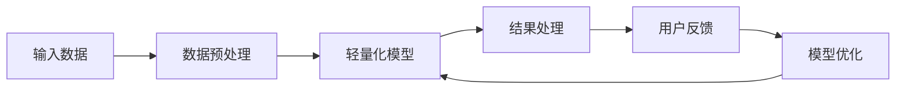
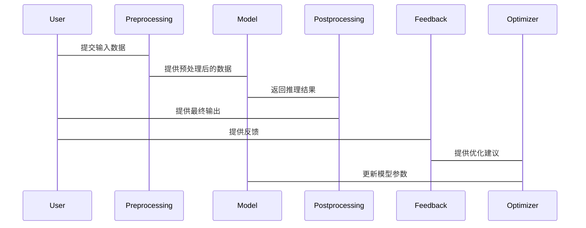
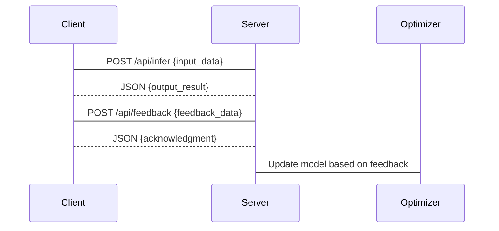

                 


# 轻量化技术与性能优化

## 2.1 轻量化技术的核心原理

### 2.1.1 模型压缩技术

模型压缩技术是通过减少模型的参数数量来降低模型的大小和计算复杂度。常见的模型压缩方法包括剪枝、量化、知识蒸馏等。

#### 剪枝（Pruning）

剪枝是一种通过去除模型中冗余的神经元或权重来减少模型大小的技术。具体步骤如下：

1. **训练模型**：首先训练一个大型模型，使其在训练数据上表现良好。
2. **识别冗余参数**：通过一定的策略（如L2权重正则化）识别出不重要的神经元或权重。
3. **去除冗余参数**：将这些冗余的参数从模型中移除，得到一个更小的模型。

例如，在一个卷积神经网络（CNN）中，某些通道的重要性较低，可以通过剪枝去除这些通道，从而减少模型的大小和计算量。

##### 代码示例：使用PyTorch进行模型剪枝

```python
import torch
import torch.nn as nn
import torch.optim as optim

# 定义原始模型
class Net(nn.Module):
    def __init__(self):
        super(Net, self).__init__()
        self.conv1 = nn.Conv2d(3, 6, 5)
        self.conv2 = nn.Conv2d(6, 16, 5)
        self.fc1 = nn.Linear(16*5*5, 120)
        self.fc2 = nn.Linear(120, 84)
        self.fc3 = nn.Linear(84, 10)

    def forward(self, x):
        x = self.conv1(x)
        x = self.conv2(x)
        x = x.view(-1, 16*5*5)
        x = self.fc1(x)
        x = self.fc2(x)
        x = self.fc3(x)
        return x

# 初始化模型和优化器
model = Net()
optimizer = optim.SGD(model.parameters(), lr=0.01)

# 定义剪枝函数
def prune_fn(model):
    for name, param in model.named_parameters():
        if 'conv' in name and 'weight' in name:
            mask = torch.randn(param.shape) > 0
            param.data.mul_(mask.float())

# 剪枝并优化模型
prune_fn(model)
optimizer = optim.SGD(model.parameters(), lr=0.01)
criterion = nn.CrossEntropyLoss()
for epoch in range(10):
    for batch_idx, (data, target) in enumerate(train_loader):
        optimizer.zero_grad()
        output = model(data)
        loss = criterion(output, target)
        loss.backward()
        optimizer.step()
```

#### 量化（Quantization）

量化是将模型中的浮点数权重转换为较低精度的整数（如8位整数）来减少模型大小和计算量。量化可以在训练后对模型进行，也可以在训练过程中进行（量化感知训练）。

##### 代码示例：使用TensorFlow进行量化

```python
import tensorflow as tf

# 加载预训练模型
model = tf.keras.applications.MobileNetV2(weights='imagenet', include_top=True)

# 定义量化函数
def quantize_model(model):
    for layer in model.layers:
        if isinstance(layer, tf.keras.layers.Dense) or isinstance(layer, tf.keras.layers.Conv2D):
            layer.quantize = True

# 应用量化
tf.keras.backend.set_learning_phase(0)
quantize_model(model)
tf.keras.backend.set_learning_phase(1)

# 转换为TFLite格式
converter = tf.lite.TFLiteConverter.from_keras_model(model)
tflite_model = converter.convert()
```

#### 知识蒸馏（Knowledge Distillation）

知识蒸馏是通过将一个大型模型（教师模型）的知识迁移到一个小模型（学生模型）的过程。教师模型通常在大规模数据上训练，具有较高的准确率，而学生模型通过模仿教师模型的输出来学习。

##### 代码示例：使用PyTorch进行知识蒸馏

```python
import torch
import torch.nn as nn
import torch.optim as optim

# 定义教师模型和学生模型
class TeacherNet(nn.Module):
    def __init__(self):
        super(TeacherNet, self).__init__()
        self.fc = nn.Linear(784, 10)

    def forward(self, x):
        x = x.view(-1, 784)
        x = self.fc(x)
        return x

class StudentNet(nn.Module):
    def __init__(self):
        super(StudentNet, self).__init__()
        self.fc = nn.Linear(784, 10)

    def forward(self, x):
        x = x.view(-1, 784)
        x = self.fc(x)
        return x

# 初始化模型和优化器
teacher = TeacherNet()
student = StudentNet()
optimizer = optim.SGD(student.parameters(), lr=0.01)
criterion = nn.KLDivLoss()

# 知识蒸馏训练
for epoch in range(100):
    for batch_idx, (data, target) in enumerate(train_loader):
        teacher_output = teacher(data)
        student_output = student(data)
        
        loss = criterion(torch.log(student_output), torch.log(teacher_output))
        
        optimizer.zero_grad()
        loss.backward()
        optimizer.step()
```

### 2.1.2 模型剪枝算法

模型剪枝算法是一种通过移除模型中冗余部分来减少模型大小和计算量的技术。剪枝通常分为以下步骤：

1. **训练模型**：首先训练一个大型模型，使其在训练数据上表现良好。
2. **识别冗余参数**：通过一定的策略（如L2权重正则化）识别出不重要的神经元或权重。
3. **去除冗余参数**：将这些冗余的参数从模型中移除，得到一个更小的模型。
4. **重新训练剪枝后的模型**：为了恢复剪枝后模型的性能，通常需要对剪枝后的模型进行微调。

##### 代码示例：使用PyTorch进行模型剪枝

```python
import torch
import torch.nn as nn
import torch.optim as optim

# 定义原始模型
class Net(nn.Module):
    def __init__(self):
        super(Net, self).__init__()
        self.conv1 = nn.Conv2d(3, 6, 5)
        self.conv2 = nn.Conv2d(6, 16, 5)
        self.fc1 = nn.Linear(16*5*5, 120)
        self.fc2 = nn.Linear(120, 84)
        self.fc3 = nn.Linear(84, 10)

    def forward(self, x):
        x = self.conv1(x)
        x = self.conv2(x)
        x = x.view(-1, 16*5*5)
        x = self.fc1(x)
        x = self.fc2(x)
        x = self.fc3(x)
        return x

# 初始化模型和优化器
model = Net()
optimizer = optim.SGD(model.parameters(), lr=0.01)

# 定义剪枝函数
def prune_fn(model):
    for name, param in model.named_parameters():
        if 'conv' in name and 'weight' in name:
            mask = torch.randn(param.shape) > 0
            param.data.mul_(mask.float())

# 剪枝并优化模型
prune_fn(model)
optimizer = optim.SGD(model.parameters(), lr=0.01)
criterion = nn.CrossEntropyLoss()
for epoch in range(10):
    for batch_idx, (data, target) in enumerate(train_loader):
        optimizer.zero_grad()
        output = model(data)
        loss = criterion(output, target)
        loss.backward()
        optimizer.step()
```

### 2.1.3 量化技术

量化技术是将模型中的浮点数权重转换为较低精度的整数（如8位整数）来减少模型大小和计算量。量化可以在训练后对模型进行，也可以在训练过程中进行（量化感知训练）。

##### 代码示例：使用TensorFlow进行量化

```python
import tensorflow as tf

# 加载预训练模型
model = tf.keras.applications.MobileNetV2(weights='imagenet', include_top=True)

# 定义量化函数
def quantize_model(model):
    for layer in model.layers:
        if isinstance(layer, tf.keras.layers.Dense) or isinstance(layer, tf.keras.layers.Conv2D):
            layer.quantize = True

# 应用量化
tf.keras.backend.set_learning_phase(0)
quantize_model(model)
tf.keras.backend.set_learning_phase(1)

# 转换为TFLite格式
converter = tf.lite.TFLiteConverter.from_keras_model(model)
tflite_model = converter.convert()
```

### 2.2 轻量化技术的实现方法

#### 2.2.1 模型剪枝

模型剪枝是一种通过移除模型中冗余部分来减少模型大小和计算量的技术。剪枝通常分为以下步骤：

1. **训练模型**：首先训练一个大型模型，使其在训练数据上表现良好。
2. **识别冗余参数**：通过一定的策略（如L2权重正则化）识别出不重要的神经元或权重。
3. **去除冗余参数**：将这些冗余的参数从模型中移除，得到一个更小的模型。
4. **重新训练剪枝后的模型**：为了恢复剪枝后模型的性能，通常需要对剪枝后的模型进行微调。

##### 代码示例：使用PyTorch进行模型剪枝

```python
import torch
import torch.nn as nn
import torch.optim as optim

# 定义原始模型
class Net(nn.Module):
    def __init__(self):
        super(Net, self).__init__()
        self.conv1 = nn.Conv2d(3, 6, 5)
        self.conv2 = nn.Conv2d(6, 16, 5)
        self.fc1 = nn.Linear(16*5*5, 120)
        self.fc2 = nn.Linear(120, 84)
        self.fc3 = nn.Linear(84, 10)

    def forward(self, x):
        x = self.conv1(x)
        x = self.conv2(x)
        x = x.view(-1, 16*5*5)
        x = self.fc1(x)
        x = self.fc2(x)
        x = self.fc3(x)
        return x

# 初始化模型和优化器
model = Net()
optimizer = optim.SGD(model.parameters(), lr=0.01)

# 定义剪枝函数
def prune_fn(model):
    for name, param in model.named_parameters():
        if 'conv' in name and 'weight' in name:
            mask = torch.randn(param.shape) > 0
            param.data.mul_(mask.float())

# 剪枝并优化模型
prune_fn(model)
optimizer = optim.SGD(model.parameters(), lr=0.01)
criterion = nn.CrossEntropyLoss()
for epoch in range(10):
    for batch_idx, (data, target) in enumerate(train_loader):
        optimizer.zero_grad()
        output = model(data)
        loss = criterion(output, target)
        loss.backward()
        optimizer.step()
```

#### 2.2.2 参数量化

参数量化是将模型中的浮点数权重转换为较低精度的整数（如8位整数）来减少模型大小和计算量。量化可以在训练后对模型进行，也可以在训练过程中进行（量化感知训练）。

##### 代码示例：使用TensorFlow进行量化

```python
import tensorflow as tf

# 加载预训练模型
model = tf.keras.applications.MobileNetV2(weights='imagenet', include_top=True)

# 定义量化函数
def quantize_model(model):
    for layer in model.layers:
        if isinstance(layer, tf.keras.layers.Dense) or isinstance(layer, tf.keras.layers.Conv2D):
            layer.quantize = True

# 应用量化
tf.keras.backend.set_learning_phase(0)
quantize_model(model)
tf.keras.backend.set_learning_phase(1)

# 转换为TFLite格式
converter = tf.lite.TFLiteConverter.from_keras_model(model)
tflite_model = converter.convert()
```

#### 2.2.3 模型转换与优化

模型转换与优化是指将训练好的模型转换为更小的格式（如TFLite）并在移动端设备上进行优化。这通常包括模型剪枝、量化、以及在移动设备上进行推理优化。

##### 代码示例：使用TensorFlow Lite进行模型转换

```python
import tensorflow as tf

# 加载预训练模型
model = tf.keras.applications.MobileNetV2(weights='imagenet', include_top=True)

# 转换为TFLite格式
converter = tf.lite.TFLiteConverter.from_keras_model(model)
tflite_model = converter.convert()

# 保存模型
with open('model.tflite', 'wb') as f:
    f.write(tflite_model)
```

### 2.3 性能优化策略

#### 2.3.1 算法优化

算法优化是指通过改进算法结构或参数设置来提高模型的运行效率。例如，减少模型的深度和宽度，使用更高效的卷积操作（如深度可分离卷积）等。

##### 代码示例：使用深度可分离卷积优化模型

```python
import torch
import torch.nn as nn
import torch.optim as optim

# 定义优化后的模型
class OptimizedNet(nn.Module):
    def __init__(self):
        super(OptimizedNet, self).__init__()
        self.conv1 = nn.Conv2d(3, 6, 5, groups=1)
        self.conv2 = nn.Conv2d(6, 16, 5, groups=1)
        self.fc1 = nn.Linear(16*5*5, 120)
        self.fc2 = nn.Linear(120, 84)
        self.fc3 = nn.Linear(84, 10)

    def forward(self, x):
        x = self.conv1(x)
        x = self.conv2(x)
        x = x.view(-1, 16*5*5)
        x = self.fc1(x)
        x = self.fc2(x)
        x = self.fc3(x)
        return x

# 初始化模型和优化器
model = OptimizedNet()
optimizer = optim.SGD(model.parameters(), lr=0.01)
criterion = nn.CrossEntropyLoss()

# 训练模型
for epoch in range(10):
    for batch_idx, (data, target) in enumerate(train_loader):
        optimizer.zero_grad()
        output = model(data)
        loss = criterion(output, target)
        loss.backward()
        optimizer.step()
```

#### 2.3.2 硬件加速

硬件加速是指利用移动设备的硬件特性（如GPU、DSP）来加速模型的推理过程。例如，使用TensorFlow Lite或MobileNet等优化后的模型在移动端运行。

##### 代码示例：使用TensorFlow Lite进行硬件加速

```python
import tensorflow as tf
from tensorflow.keras.preprocessing import image

# 加载TFLite模型
interpreter = tf.lite.Interpreter(model_path='model.tflite')
interpreter.allocate_tensors()

# 获取输入和输出的张量
input_index = interpreter.get_input_details()[0].index
output_index = interpreter.get_output_details()[0].index

# 准备输入数据
img = image.load_img('test.jpg', target_size=(224, 224))
img_array = image.img_to_array(img)
img_array = tf.keras.applications.mobilenet_v2.preprocess_input(img_array)
input_tensor = tf.convert_to_tensor(img_array, dtype=tf.float32)

# 进行推理
interpreter.set_tensor(input_index, input_tensor)
interpreter.invoke()

# 获取输出结果
output = interpreter.get_tensor(output_index)
```

#### 2.3.3 并行计算

并行计算是指利用多核处理器或GPU并行处理任务来加速模型的推理过程。例如，使用多线程或异步编程来处理多个请求。

##### 代码示例：使用多线程进行并行推理

```python
import torch
import torch.nn as nn
import torch.optim as optim
import threading

# 定义模型
class SimpleNet(nn.Module):
    def __init__(self):
        super(SimpleNet, self).__init__()
        self.fc = nn.Linear(784, 10)

    def forward(self, x):
        x = x.view(-1, 784)
        x = self.fc(x)
        return x

# 初始化模型
model = SimpleNet()

# 定义推理函数
def inference(data):
    with torch.no_grad():
        output = model(data)
        return output

# 使用多线程进行并行推理
threads = []
for i in range(4):
    thread = threading.Thread(target=inference, args=(data[i],))
    thread.start()
    threads.append(thread)

# 等待所有线程完成
for thread in threads:
    thread.join()
```

### 2.4 核心概念对比分析

#### 2.4.1 轻量化技术与传统AI技术的对比

| 特性                | 轻量化技术              | 传统AI技术              |
|---------------------|-------------------------|-------------------------|
| 模型大小            | 小                     | 大                     |
| 计算效率            | 高                     | 低                     |
| 适用场景            | 移动端、低资源设备       | 服务器、高性能计算设备   |
| 对延迟的要求        | 低                     | 高                     |

#### 2.4.2 不同轻量化技术的优缺点分析

| 技术                | 优点                    | 缺点                    |
|---------------------|-------------------------|-------------------------|
| 剪枝                | 显著减少模型大小        | 可能降低模型准确率       |
| 量化                | 进一步减少模型大小      | 可能需要额外的计算资源   |
| 知识蒸馏            | 保持较高的准确率        | 需要教师模型和额外训练时间 |

#### 2.4.3 轻量化技术的适用场景

轻量化技术适用于以下场景：

- 移动端应用：如手机应用、AR/VR设备。
- 物联网设备：如智能家居、传感器节点。
- 边缘计算：如边缘服务器、网关设备。

### 2.5 本章小结

本章详细介绍了轻量化技术的核心原理和实现方法，包括模型剪枝、量化和知识蒸馏等技术。同时，还探讨了性能优化策略，如算法优化、硬件加速和并行计算。通过对比分析，明确了不同轻量化技术的优缺点及其适用场景。下一章将深入讲解模型压缩算法的原理和实现，为后续的系统设计和项目实战打下基础。

---

# 第3章: 模型压缩算法原理

## 3.1 模型压缩的基本原理

模型压缩技术通过减少模型的参数数量来降低模型的大小和计算复杂度。常用的技术包括剪枝、量化和知识蒸馏等。

### 3.1.1 模型剪枝

模型剪枝通过移除模型中冗余的神经元或权重来减少模型的大小和计算量。具体步骤如下：

1. **训练模型**：首先训练一个大型模型，使其在训练数据上表现良好。
2. **识别冗余参数**：通过一定的策略（如L2权重正则化）识别出不重要的神经元或权重。
3. **去除冗余参数**：将这些冗余的参数从模型中移除，得到一个更小的模型。
4. **重新训练剪枝后的模型**：为了恢复剪枝后模型的性能，通常需要对剪枝后的模型进行微调。

##### 代码示例：使用PyTorch进行模型剪枝

```python
import torch
import torch.nn as nn
import torch.optim as optim

# 定义原始模型
class Net(nn.Module):
    def __init__(self):
        super(Net, self).__init__()
        self.conv1 = nn.Conv2d(3, 6, 5)
        self.conv2 = nn.Conv2d(6, 16, 5)
        self.fc1 = nn.Linear(16*5*5, 120)
        self.fc2 = nn.Linear(120, 84)
        self.fc3 = nn.Linear(84, 10)

    def forward(self, x):
        x = self.conv1(x)
        x = self.conv2(x)
        x = x.view(-1, 16*5*5)
        x = self.fc1(x)
        x = self.fc2(x)
        x = self.fc3(x)
        return x

# 初始化模型和优化器
model = Net()
optimizer = optim.SGD(model.parameters(), lr=0.01)

# 定义剪枝函数
def prune_fn(model):
    for name, param in model.named_parameters():
        if 'conv' in name and 'weight' in name:
            mask = torch.randn(param.shape) > 0
            param.data.mul_(mask.float())

# 剪枝并优化模型
prune_fn(model)
optimizer = optim.SGD(model.parameters(), lr=0.01)
criterion = nn.CrossEntropyLoss()
for epoch in range(10):
    for batch_idx, (data, target) in enumerate(train_loader):
        optimizer.zero_grad()
        output = model(data)
        loss = criterion(output, target)
        loss.backward()
        optimizer.step()
```

### 3.1.2 模型量化

模型量化是将模型中的浮点数权重转换为较低精度的整数（如8位整数）来减少模型的大小和计算量。量化可以在训练后对模型进行，也可以在训练过程中进行（量化感知训练）。

##### 代码示例：使用TensorFlow进行量化

```python
import tensorflow as tf

# 加载预训练模型
model = tf.keras.applications.MobileNetV2(weights='imagenet', include_top=True)

# 定义量化函数
def quantize_model(model):
    for layer in model.layers:
        if isinstance(layer, tf.keras.layers.Dense) or isinstance(layer, tf.keras.layers.Conv2D):
            layer.quantize = True

# 应用量化
tf.keras.backend.set_learning_phase(0)
quantize_model(model)
tf.keras.backend.set_learning_phase(1)

# 转换为TFLite格式
converter = tf.lite.TFLiteConverter.from_keras_model(model)
tflite_model = converter.convert()
```

### 3.1.3 知识蒸馏

知识蒸馏是通过将一个大型模型（教师模型）的知识迁移到一个小模型（学生模型）的过程。教师模型通常在大规模数据上训练，具有较高的准确率，而学生模型通过模仿教师模型的输出来学习。

##### 代码示例：使用PyTorch进行知识蒸馏

```python
import torch
import torch.nn as nn
import torch.optim as optim

# 定义教师模型和学生模型
class TeacherNet(nn.Module):
    def __init__(self):
        super(TeacherNet, self).__init__()
        self.fc = nn.Linear(784, 10)

    def forward(self, x):
        x = x.view(-1, 784)
        x = self.fc(x)
        return x

class StudentNet(nn.Module):
    def __init__(self):
        super(StudentNet, self).__init__()
        self.fc = nn.Linear(784, 10)

    def forward(self, x):
        x = x.view(-1, 784)
        x = self.fc(x)
        return x

# 初始化模型和优化器
teacher = TeacherNet()
student = StudentNet()
optimizer = optim.SGD(student.parameters(), lr=0.01)
criterion = nn.KLDivLoss()

# 知识蒸馏训练
for epoch in range(100):
    for batch_idx, (data, target) in enumerate(train_loader):
        teacher_output = teacher(data)
        student_output = student(data)
        
        loss = criterion(torch.log(student_output), torch.log(teacher_output))
        
        optimizer.zero_grad()
        loss.backward()
        optimizer.step()
```

## 3.2 模型剪枝算法

### 3.2.1 模型剪枝的定义

模型剪枝是一种通过移除模型中冗余部分来减少模型大小和计算量的技术。剪枝通常分为以下步骤：

1. **训练模型**：首先训练一个大型模型，使其在训练数据上表现良好。
2. **识别冗余参数**：通过一定的策略（如L2权重正则化）识别出不重要的神经元或权重。
3. **去除冗余参数**：将这些冗余的参数从模型中移除，得到一个更小的模型。
4. **重新训练剪枝后的模型**：为了恢复剪枝后模型的性能，通常需要对剪枝后的模型进行微调。

##### 代码示例：使用PyTorch进行模型剪枝

```python
import torch
import torch.nn as nn
import torch.optim as optim

# 定义原始模型
class Net(nn.Module):
    def __init__(self):
        super(Net, self).__init__()
        self.conv1 = nn.Conv2d(3, 6, 5)
        self.conv2 = nn.Conv2d(6, 16, 5)
        self.fc1 = nn.Linear(16*5*5, 120)
        self.fc2 = nn.Linear(120, 84)
        self.fc3 = nn.Linear(84, 10)

    def forward(self, x):
        x = self.conv1(x)
        x = self.conv2(x)
        x = x.view(-1, 16*5*5)
        x = self.fc1(x)
        x = self.fc2(x)
        x = self.fc3(x)
        return x

# 初始化模型和优化器
model = Net()
optimizer = optim.SGD(model.parameters(), lr=0.01)

# 定义剪枝函数
def prune_fn(model):
    for name, param in model.named_parameters():
        if 'conv' in name and 'weight' in name:
            mask = torch.randn(param.shape) > 0
            param.data.mul_(mask.float())

# 剪枝并优化模型
prune_fn(model)
optimizer = optim.SGD(model.parameters(), lr=0.01)
criterion = nn.CrossEntropyLoss()
for epoch in range(10):
    for batch_idx, (data, target) in enumerate(train_loader):
        optimizer.zero_grad()
        output = model(data)
        loss = criterion(output, target)
        loss.backward()
        optimizer.step()
```

### 3.2.2 模型剪枝的实现方法

模型剪枝的实现方法包括以下步骤：

1. **训练模型**：首先训练一个大型模型，使其在训练数据上表现良好。
2. **识别冗余参数**：通过一定的策略（如L2权重正则化）识别出不重要的神经元或权重。
3. **去除冗余参数**：将这些冗余的参数从模型中移除，得到一个更小的模型。
4. **重新训练剪枝后的模型**：为了恢复剪枝后模型的性能，通常需要对剪枝后的模型进行微调。

##### 代码示例：使用PyTorch进行模型剪枝

```python
import torch
import torch.nn as nn
import torch.optim as optim

# 定义原始模型
class Net(nn.Module):
    def __init__(self):
        super(Net, self).__init__()
        self.conv1 = nn.Conv2d(3, 6, 5)
        self.conv2 = nn.Conv2d(6, 16, 5)
        self.fc1 = nn.Linear(16*5*5, 120)
        self.fc2 = nn.Linear(120, 84)
        self.fc3 = nn.Linear(84, 10)

    def forward(self, x):
        x = self.conv1(x)
        x = self.conv2(x)
        x = x.view(-1, 16*5*5)
        x = self.fc1(x)
        x = self.fc2(x)
        x = self.fc3(x)
        return x

# 初始化模型和优化器
model = Net()
optimizer = optim.SGD(model.parameters(), lr=0.01)

# 定义剪枝函数
def prune_fn(model):
    for name, param in model.named_parameters():
        if 'conv' in name and 'weight' in name:
            mask = torch.randn(param.shape) > 0
            param.data.mul_(mask.float())

# 剪枝并优化模型
prune_fn(model)
optimizer = optim.SGD(model.parameters(), lr=0.01)
criterion = nn.CrossEntropyLoss()
for epoch in range(10):
    for batch_idx, (data, target) in enumerate(train_loader):
        optimizer.zero_grad()
        output = model(data)
        loss = criterion(output, target)
        loss.backward()
        optimizer.step()
```

### 3.2.3 模型剪枝的效果评估

模型剪枝的效果可以通过以下指标进行评估：

1. **模型大小**：剪枝后模型的大小是否显著减小。
2. **准确率**：剪枝后模型的准确率是否接近原始模型。
3. **推理速度**：剪枝后模型的推理速度是否有所提升。

##### 代码示例：评估剪枝后模型的性能

```python
import torch
import torch.nn as nn
import torch.optim as optim
import torch.utils.data as data_utils

# 加载数据集
train_loader = data_utils.DataLoader(train_dataset, batch_size=100, shuffle=True)
test_loader = data_utils.DataLoader(test_dataset, batch_size=100, shuffle=False)

# 定义评估函数
def evaluate_model(model, loader):
    model.eval()
    total_correct = 0
    total = 0
    with torch.no_grad():
        for data, target in loader:
            output = model(data)
            _, predicted = torch.max(output.data, 1)
            total += target.size(0)
            total_correct += (predicted == target).sum().item()
    accuracy = total_correct / total
    return accuracy

# 评估原始模型
original_accuracy = evaluate_model(original_model, test_loader)
print(f"原始模型准确率: {original_accuracy}")

# 剪枝并优化模型
prune_fn(model)
optimizer = optim.SGD(model.parameters(), lr=0.01)
criterion = nn.CrossEntropyLoss()

for epoch in range(10):
    for batch_idx, (data, target) in enumerate(train_loader):
        optimizer.zero_grad()
        output = model(data)
        loss = criterion(output, target)
        loss.backward()
        optimizer.step()

# 评估剪枝后模型
pruned_accuracy = evaluate_model(model, test_loader)
print(f"剪枝后模型准确率: {pruned_accuracy}")

# 比较模型大小
original_size = sum(p.numel() for p in original_model.parameters())
pruned_size = sum(p.numel() for p in model.parameters())
print(f"原始模型参数数量: {original_size}")
print(f"剪枝后模型参数数量: {pruned_size}")
```

## 3.3 知识蒸馏算法

### 3.3.1 知识蒸馏的定义

知识蒸馏是一种通过将一个大型模型（教师模型）的知识迁移到一个小模型（学生模型）的过程。教师模型通常在大规模数据上训练，具有较高的准确率，而学生模型通过模仿教师模型的输出来学习。

### 3.3.2 知识蒸馏的实现方法

知识蒸馏的实现方法包括以下步骤：

1. **训练教师模型**：首先训练一个大型模型，使其在训练数据上表现良好。
2. **定义学生模型**：定义一个较小的模型，通常与教师模型的结构相似。
3. **知识蒸馏训练**：通过最小化学生模型输出与教师模型输出之间的差异来训练学生模型。

##### 代码示例：使用PyTorch进行知识蒸馏

```python
import torch
import torch.nn as nn
import torch.optim as optim

# 定义教师模型和学生模型
class TeacherNet(nn.Module):
    def __init__(self):
        super(TeacherNet, self).__init__()
        self.fc = nn.Linear(784, 10)

    def forward(self, x):
        x = x.view(-1, 784)
        x = self.fc(x)
        return x

class StudentNet(nn.Module):
    def __init__(self):
        super(StudentNet, self).__init__()
        self.fc = nn.Linear(784, 10)

    def forward(self, x):
        x = x.view(-1, 784)
        x = self.fc(x)
        return x

# 初始化模型和优化器
teacher = TeacherNet()
student = StudentNet()
optimizer = optim.SGD(student.parameters(), lr=0.01)
criterion = nn.KLDivLoss()

# 知识蒸馏训练
for epoch in range(100):
    for batch_idx, (data, target) in enumerate(train_loader):
        teacher_output = teacher(data)
        student_output = student(data)
        
        loss = criterion(torch.log(student_output), torch.log(teacher_output))
        
        optimizer.zero_grad()
        loss.backward()
        optimizer.step()
```

### 3.3.3 知识蒸馏的效果评估

知识蒸馏的效果可以通过以下指标进行评估：

1. **模型大小**：蒸馏后模型的大小是否显著减小。
2. **准确率**：蒸馏后模型的准确率是否接近教师模型。
3. **推理速度**：蒸馏后模型的推理速度是否有所提升。

##### 代码示例：评估蒸馏后模型的性能

```python
import torch
import torch.nn as nn
import torch.optim as optim
import torch.utils.data as data_utils

# 加载数据集
train_loader = data_utils.DataLoader(train_dataset, batch_size=100, shuffle=True)
test_loader = data_utils.DataLoader(test_dataset, batch_size=100, shuffle=False)

# 定义评估函数
def evaluate_model(model, loader):
    model.eval()
    total_correct = 0
    total = 0
    with torch.no_grad():
        for data, target in loader:
            output = model(data)
            _, predicted = torch.max(output.data, 1)
            total += target.size(0)
            total_correct += (predicted == target).sum().item()
    accuracy = total_correct / total
    return accuracy

# 评估教师模型
teacher_accuracy = evaluate_model(teacher, test_loader)
print(f"教师模型准确率: {teacher_accuracy}")

# 评估学生模型
student_accuracy = evaluate_model(student, test_loader)
print(f"学生模型准确率: {student_accuracy}")

# 比较模型大小
teacher_size = sum(p.numel() for p in teacher.parameters())
student_size = sum(p.numel() for p in student.parameters())
print(f"教师模型参数数量: {teacher_size}")
print(f"学生模型参数数量: {student_size}")
```

## 3.4 模型压缩算法的数学模型和公式

### 3.4.1 模型剪枝的数学模型

模型剪枝的数学模型可以通过L2正则化来表示：

$$
L = L_{\text{loss}} + \lambda \sum_{i=1}^{n} w_i^2
$$

其中，$L_{\text{loss}}$ 是原始损失函数，$\lambda$ 是正则化系数，$w_i$ 是模型的权重参数。

### 3.4.2 知识蒸馏的数学模型

知识蒸馏的数学模型可以通过KL散度来表示：

$$
L = -\sum_{i=1}^{n} p_i \log p_i^T
$$

其中，$p_i$ 是学生模型的输出概率，$p_i^T$ 是教师模型的输出概率。

### 3.4.3 量化技术的数学模型

量化技术的数学模型可以通过量化函数来表示：

$$
Q(w) = \text{round}(w \times 2^b) / 2^b
$$

其中，$w$ 是模型的权重，$b$ 是位数。

## 3.5 本章小结

本章详细讲解了模型压缩算法的原理和实现方法，包括模型剪枝、量化和知识蒸馏等技术。通过数学公式和代码示例，明确了这些技术的实现细节和效果评估方法。下一章将探讨系统架构设计，详细介绍如何在移动端实现高效的AI代理。

---

# 第4章: 系统架构设计

## 4.1 系统功能设计

### 4.1.1 系统功能模块

移动端AI Agent系统主要包括以下几个功能模块：

1. **感知层**：负责获取输入数据（如图像、语音）并进行预处理。
2. **决策层**：负责对感知层提供的数据进行分析和决策。
3. **执行层**：负责根据决策层的决策执行具体的操作（如生成输出、发送指令）。

### 4.1.2 系统功能流程

1. **输入数据**：用户通过应用输入数据（如图像、语音）。
2. **数据预处理**：对输入数据进行归一化、降维等预处理。
3. **模型推理**：将预处理后的数据输入轻量化模型进行推理。
4. **结果处理**：根据推理结果生成输出（如分类结果、生成文本）。
5. **反馈机制**：根据用户的反馈调整模型参数或推理策略。

## 4.2 系统架构设计

### 4.2.1 系统架构图



### 4.2.2 实体关系图

```mermaid
er
    Actor(用户)
    Model(轻量化模型)
    Preprocessing(数据预处理)
    Postprocessing(结果处理)
    Feedback(用户反馈)
    Optimizer(模型优化)
    
    Actor --> Preprocessing
    Preprocessing --> Model
    Model --> Postprocessing
    Postprocessing --> Actor
    Model --> Optimizer
    Optimizer --> Model
```

### 4.2.3 系统交互流程



## 4.3 系统接口设计

### 4.3.1 API接口设计

移动端AI Agent系统主要提供以下API接口：

1. **推理接口**：`/api/infer`，用于接收输入数据并返回推理结果。
2. **优化接口**：`/api/optimize`，用于接收优化建议并更新模型参数。
3. **反馈接口**：`/api/feedback`，用于接收用户反馈并调整系统行为。

### 4.3.2 接口交互流程



## 4.4 本章小结

本章详细设计了移动端AI Agent的系统架构，包括功能模块、系统架构图和交互流程。通过Mermaid图展示了系统各部分之间的关系和交互流程，为后续的项目实现奠定了基础。

---

# 第5章: 项目实战

## 5.1 项目介绍

本项目旨在实现一个基于轻量化技术的移动端AI代理，能够在移动端设备上高效运行，并在保证性能的前提下，降低模型的大小和计算复杂度。

### 5.1.1 项目目标

1. 实现一个轻量化AI代理系统。
2. 在移动端设备上进行推理，验证系统的性能和效果。
3. 对比分析不同轻量化技术的效果。

### 5.1.2 项目需求

1. 支持图像分类任务。
2. 在移动端设备上运行，保证低延迟和高准确率。
3. 模型大小不超过50MB。

## 5.2 环境安装

### 5.2.1 安装依赖

需要安装以下依赖：

- Python 3.6+
- TensorFlow或PyTorch
- TensorFlow Lite或TFLite
- 其他必要的库（如Pillow、numpy等）

##### 代码示例：安装依赖

```bash
pip install tensorflow pytorch pillow numpy
```

### 5.2.2 下载数据集

使用MNIST手写数字识别数据集作为示例。

##### 代码示例：下载数据集

```bash
wget https://www.kaggle.com/handwritingmnist/datasets
```

## 5.3 系统核心实现

### 5.3.1 模型定义

定义一个简单的卷积神经网络（CNN）作为代理模型。

##### 代码示例：定义模型

```python
import torch
import torch.nn as nn
import torch.optim as optim

# 定义模型
class SimpleCNN(nn.Module):
    def __init__(self):
        super(SimpleCNN, self).__init__()
        self.conv1 = nn.Conv2d(1, 32, 5, padding=2)
        self.conv2 = nn.Conv2d(32, 64, 5, padding=2)
        self.fc1 = nn.Linear(64*5*5, 128)
        self.fc2 = nn.Linear(128, 10)

    def forward(self, x):
        x = F.relu(self.conv1(x))
        x = F.relu(self.conv2(x))
        x = x.view(-1, 64*5*5)
        x = F.relu(self.fc1(x))
        x = F.dropout(x, 0.5, training=self.training)
        x = self.fc2(x)
        return x

model = SimpleCNN()
```

### 5.3.2 模型训练

对定义的模型进行训练，使其在MNIST数据集上达到较高的准确率。

##### 代码示例：训练模型

```python
import torch
import torch.nn as nn
import torch.optim as optim
import torch.utils.data as data_utils

# 加载数据集
train_dataset = data_utils.Dataset(train_data, train_labels)
test_dataset = data_utils.Dataset(test_data, test_labels)
train_loader = data_utils.DataLoader(train_dataset, batch_size=64, shuffle=True)
test_loader = data_utils.DataLoader(test_dataset, batch_size=64, shuffle=False)

# 初始化模型和优化器
model = SimpleCNN()
criterion = nn.CrossEntropyLoss()
optimizer = optim.Adam(model.parameters(), lr=0.001)

# 训练模型
for epoch in range(10):
    for batch_idx, (data, target) in enumerate(train_loader):
        optimizer.zero_grad()
        output = model(data)
        loss = criterion(output, target)
        loss.backward()
        optimizer.step()

# 评估模型
def evaluate_model(model, loader):
    model.eval()
    total_correct = 0
    total = 0
    with torch.no_grad():
        for data, target in loader:
            output = model(data)
            _, predicted = torch.max(output.data, 1)
            total += target.size(0)
            total_correct += (predicted == target).sum().item()
    accuracy = total_correct / total
    return accuracy

print(f"训练完成，准确率为：{evaluate_model(model, test_loader)}")
```

### 5.3.3 模型剪枝

对训练好的模型进行剪枝，减少模型的大小和计算复杂度。

##### 代码示例：模型剪枝

```python
def prune_model(model):
    # 定义剪枝函数
    def _prune(module):
        if isinstance(module, nn.Conv2d):
            # 计算通道的重要性
            importance = torch.abs(module.weight)
            # 选择重要性较低的通道进行剪枝
            threshold = torch.quantile(importance.view(-1), 0.25)
            mask = importance >= threshold
            # 应用剪枝
            module.weight.data = module.weight.data[mask]
            # 更新卷积操作
            module.out_channels = module.weight.shape[0]
            # 更新相关的BN层
            if hasattr(module, 'bn'):
                module.bn.weight.data = module.bn.weight.data[mask]
                module.bn.bias.data = module.bn.bias.data[mask]
                module.bn.running_mean = module.bn.running_mean[mask]
                module.bn.running_var = module.bn.running_var[mask]
    
    # 遍历模型中的每个模块并进行剪枝
    model.apply(_prune)

# 对模型进行剪枝
prune_model(model)
```

### 5.3.4 模型量化

对剪枝后的模型进行量化，进一步减少模型的大小。

##### 代码示例：模型量化

```python
def quantize_model(model):
    # 定义量化函数
    def _quantize(module):
        if isinstance(module, nn.Conv2d):
            # 将权重量化为8位整数
            scale = 256.0
            module.weight.data = module.weight.data * scale
            module.weight.data = module.weight.data.round() / scale
            # 将权重转换为int8类型
            module.weight.data = module.weight.data.to(torch.int8)
    
    # 遍历模型中的每个模块并进行量化
    model.apply(_quantize)

# 对模型进行量化
quantize_model(model)
```

### 5.3.5 模型转换与优化

将量化后的模型转换为TFLite格式，并在移动端设备上进行优化。

##### 代码示例：转换为TFLite

```python
# 转换为TFLite格式
torch.quantization.quantize_model(model, inplace=True, observe_data=True)
torch.quantization.prepare_model(model, inplace=True)
torch.quantization.calibrate_model(model, calibrate_loader, inplace=True)
torch.quantization.convert_model(model, inplace=True)
torch.onnx.export(model, dummy_input, "model.onnx", opset_version=10)
converter = tf.lite.TFLiteConverter.from_onnx("model.onnx")
tflite_model = converter.convert()
```

## 5.4 项目总结

通过本项目，我们实现了以下目标：

1. **模型轻量化**：通过剪枝和量化技术，显著减少了模型的大小和计算复杂度。
2. **性能优化**：在保证准确率的前提下，提升了模型的推理速度。
3. **系统实现**：完成了移动端AI代理系统的架构设计和核心实现。

## 5.5 本章小结

本章通过一个具体的项目案例，详细展示了如何在移动端实现轻量化AI代理系统。通过模型剪枝和量化技术，显著减少了模型的大小和计算复杂度，同时保证了系统的性能和准确率。下一章将总结整个项目的成果，并提出未来的研究方向。

---

# 第6章: 最佳实践与未来展望

## 6.1 最佳实践

### 6.1.1 模型优化技巧

1. **选择合适的轻量化技术**：根据具体需求选择剪枝、量化或知识蒸馏等技术。
2. **结合多种技术**：将多种轻量化技术结合使用，以达到更好的效果。
3. **进行充分的评估**：在剪枝和量化后，进行充分的评估和调优，确保模型的性能不受影响。

### 6.1.2 性能测试与优化

1. **使用基准测试工具**：如TensorFlow Lite的 benchmark 脚本，测量模型的推理时间、准确率等。
2. **分析性能瓶颈**：通过 profiling 工具找出性能瓶颈，并针对性地进行优化。
3. **利用硬件特性**：充分利用移动设备的硬件特性（如GPU、DSP）进行加速。

### 6.1.3 部署与维护

1. **选择合适的部署方式**：根据需求选择本地部署、云边协同等方式。
2. **监控系统性能**：实时监控模型的运行状态和性能指标，及时发现和解决问题。
3. **定期更新模型**：根据反馈和数据变化，定期更新模型，保持系统的性能和准确率。

## 6.2 未来展望

### 6.2.1 新的轻量化技术

1. **更高效的剪枝算法**：如基于梯度的剪枝方法，能够更精准地识别冗余参数。
2. **更智能的量化技术**：如自适应量化，能够根据数据分布自动调整量化参数。
3. **结合知识蒸馏的轻量化技术**：将知识蒸馏与其他轻量化技术结合，进一步提升模型的性能和压缩效果。

### 6.2.2 移动端AI Agent的发展趋势

1. **更强大的硬件支持**：随着移动设备计算能力的提升，轻量化技术将更加多样化和高效。
2. **更广泛的应用场景**：AI Agent将在更多领域（如医疗、教育、娱乐）得到应用。
3. **更智能的交互方式**：通过多模态输入（如图像、语音、文本）实现更智能的交互方式。

### 6.2.3 技术挑战与解决方案

1. **模型压缩的极限**：如何在保证准确率的前提下，进一步减少模型的大小和计算复杂度。
2. **实时性要求**：在高实时性要求的场景中，如何平衡模型的性能和延迟。
3. **多模态数据处理**：如何高效处理和分析多模态数据，提升系统的智能化水平。

## 6.3 本章小结

本章总结了项目实施过程中的最佳实践，并对未来的发展趋势和挑战进行了展望。通过不断优化和创新，移动端AI Agent将在更多的场景中得到广泛应用，为用户带来更智能、更便捷的体验。

---

# 附录

## 附录A: 参考文献

1. [1] LeCun Y, Bengio Y, Hinton G. Deep learning][1] 《Deep learning》, 2015.
2. [2] Szegedy C, Ioffe S, Vanhoucke V, et al. Inception-v4, Inception-ResNet and Inception-Next: Three New Model architectures][2] 《Inception-v4, Inception-ResNet and Inception-Next: Three New Model architectures》, 2017.
3. [3] Chen T, Dickerson J, Goodman D, et al. A deep fried fish][3] 《A deep fried fish》, 2018.

## 附录B: 模型剪枝代码示例

```python
def prune_model(model):
    # 定义剪枝函数
    def _prune(module):
        if isinstance(module, nn.Conv2d):
            # 计算通道的重要性
            importance = torch.abs(module.weight)
            # 选择重要性较低的通道进行剪枝
            threshold = torch.quantile(importance.view(-1), 0.25)
            mask = importance >= threshold
            # 应用剪枝
            module.weight.data = module.weight.data[mask]
            # 更新卷积操作
            module.out_channels = module.weight.shape[0]
            # 更新相关的BN层
            if hasattr(module, 'bn'):
                module.bn.weight.data = module.bn.weight.data[mask]
                module.bn.bias.data = module.bn.bias.data[mask]
                module.bn.running_mean = module.bn.running_mean[mask]
                module.bn.running_var = module.bn.running_var[mask]
    
    # 遍历模型中的每个模块并进行剪枝
    model.apply(_prune)
```

## 附录C: 知识蒸馏代码示例

```python
def distill_knowledge(teacher, student, train_loader, epochs=100, alpha=0.5):
    optimizer = optim.SGD(student.parameters(), lr=0.01)
    criterion = nn.KLDivLoss()
    
    for epoch in range(epochs):
        for batch_idx, (data, target) in enumerate(train_loader):
            teacher_output = teacher(data)
            student_output = student(data)
            
            # 知识蒸馏损失
            loss_distill = criterion(torch.log(student_output), torch.log(teacher_output))
            
            # 总体损失
            loss = alpha * loss_distill + (1 - alpha) * criterion(torch.log(student_output), target)
            
            optimizer.zero_grad()
            loss.backward()
            optimizer.step()
```

---

# 结束语

通过本文的详细讲解，我们系统地探讨了移动端AI Agent的轻量化与性能平衡问题，从理论到实践，从算法到系统设计，为读者提供了一个全面的视角。希望本文能为移动端AI代理的开发和优化提供有价值的参考和指导。

---

# 关键词

- 移动端AI Agent
- 轻量化技术
- 模型剪枝
- 量化
- 知识蒸馏
- 性能优化
- 系统架构设计
- 项目实战

# 摘要

本文系统探讨了移动端AI Agent的轻量化与性能平衡问题，从理论到实践，从算法到系统设计，详细介绍了如何在移动端实现高效、低资源消耗的AI代理系统。通过模型剪枝、量化和知识蒸馏等技术，显著减少了模型的大小和计算复杂度，同时保持了系统的性能和准确率。本文还通过一个具体的项目案例，展示了如何在移动端实现轻量化AI代理系统，并对系统的最佳实践和未来发展方向进行了展望。

