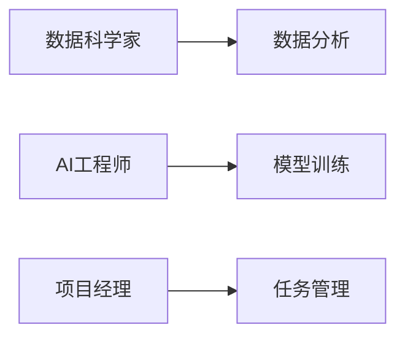
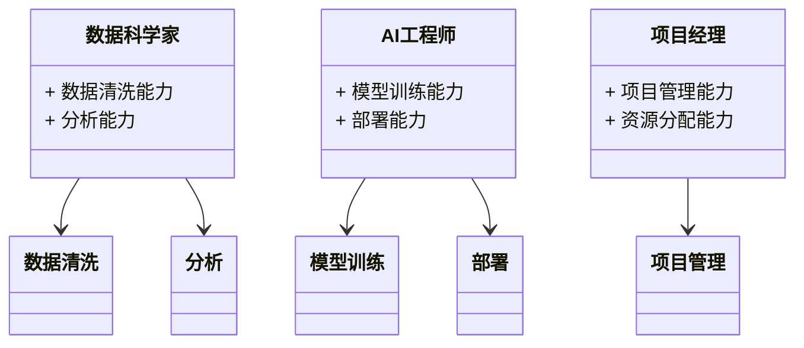
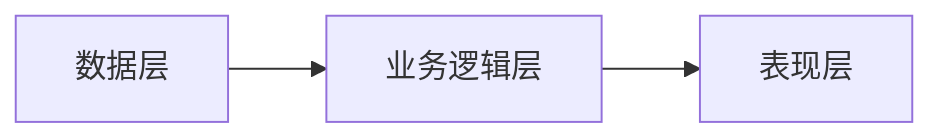

                 


# 组建高效AI开发团队：角色、技能与协作

**关键词：AI开发团队、角色分配、技能要求、协作机制、项目管理、团队优化**

**摘要：**  
在AI开发领域，高效团队的组建至关重要。本文将详细探讨AI开发团队的角色划分、技能要求、协作机制以及项目管理策略。通过系统化的方法，结合实际案例和最佳实践，帮助读者理解如何构建高效、协作顺畅的AI开发团队，从而提升整体开发效率和项目成功率。

---

# 第1章：AI开发团队的背景与核心问题

## 1.1 从传统开发到AI开发的转变  
### 1.1.1 传统软件开发的特点与局限性  
传统软件开发注重代码编写和功能实现，但随着AI技术的普及，开发过程需要更多跨学科合作。  

### 1.1.2 AI开发的独特性与挑战  
AI开发涉及数据处理、模型训练、算法优化等环节，对团队成员的技能要求更加多样化。  

### 1.1.3 高效AI开发团队的重要性  
高效的AI开发团队能够快速迭代、优化模型，提高项目成功率和交付质量。  

---

## 1.2 AI开发团队的核心问题  
### 1.2.1 团队协作中的主要问题  
- 任务分配不均  
- 沟通不畅  
- 技能互补不足  

### 1.2.2 技能匹配与角色分配的难点  
- 数据科学家与AI工程师的角色混淆  
- 技能评估与任务需求的匹配问题  

### 1.2.3 任务分配与进度管理的挑战  
- 任务优先级排序复杂  
- 进度跟踪困难  

---

## 1.3 问题解决的思路与方法  
### 1.3.1 系统化解决问题的框架  
- 明确目标  
- 分解任务  
- 制定计划  

### 1.3.2 团队协作的最佳实践  
- 建立明确的沟通机制  
- 使用协作工具优化流程  

### 1.3.3 技能互补与角色优化的策略  
- 根据成员专长分配角色  
- 定期评估团队结构并调整  

---

## 1.4 本章小结  
本章分析了AI开发团队面临的挑战，提出了系统化的解决方案，为后续章节奠定了基础。

---

# 第2章：AI开发团队的核心概念与联系

## 2.1 团队角色的定义与分类  
### 2.1.1 数据科学家的角色与职责  
- 数据清洗与预处理  
- 数据分析与建模  

### 2.1.2 AI工程师的角色与职责  
- 模型实现与部署  
- 系统集成与优化  

### 2.1.3 项目经理的角色与职责  
- 项目规划与管理  
- 风险控制与资源分配  

---

## 2.2 技能要求的分析与对比  
### 2.2.1 数据处理与分析技能  
- 数据清洗、特征工程、数据可视化  

### 2.2.2 模型训练与优化技能  
- 深度学习、自然语言处理、计算机视觉  

### 2.2.3 项目管理与协作技能  
- 任务分配、进度跟踪、沟通协调  

---

## 2.3 协作机制的建立与优化  
### 2.3.1 协作流程的规范化  
- 明确任务分工  
- 制定标准化流程  

### 2.3.2 沟通工具的选择与使用  
- 使用Git进行代码管理  
- 利用Slack或Teams进行实时沟通  

### 2.3.3 任务分配的公平性与效率  
- 根据能力分配任务  
- 确保任务优先级清晰  

---

## 2.4 核心概念的关系图  
### 2.4.1 Mermaid流程图：团队角色与技能的关系  


---

## 2.5 本章小结  
本章详细分析了AI开发团队的角色、技能与协作机制，并通过关系图展示了它们之间的联系。

---

# 第3章：AI开发团队的协作机制与算法原理

## 3.1 协作机制的算法原理  
### 3.1.1 任务分配算法  
- 基于成员技能的贪心算法  
- 基于优先级的任务分配策略  

### 3.1.2 协作流程的优化算法  
- 使用动态规划优化任务顺序  
- 基于图论的协作网络构建  

---

## 3.2 算法实现与代码示例  
### 3.2.1 Python代码实现  
```python
import numpy as np
from collections import deque

def task_allocation(tasks, skills):
    # 使用贪心算法分配任务
    allocated = {}
    for task in tasks:
        best_candidate = None
        max_skill = -1
        for candidate in skills:
            if skills[candidate][task] > max_skill:
                max_skill = skills[candidate][task]
                best_candidate = candidate
        allocated[task] = best_candidate
    return allocated

# 示例
tasks = ['数据清洗', '模型训练', '结果分析']
skills = {
    '数据科学家': {'数据清洗': 0.8, '模型训练': 0.6, '结果分析': 0.7},
    'AI工程师': {'数据清洗': 0.5, '模型训练': 0.9, '结果分析': 0.6},
    '项目经理': {'数据清洗': 0.3, '模型训练': 0.4, '结果分析': 0.8}
}

result = task_allocation(tasks, skills)
print(result)
```

---

## 3.3 数学模型与公式  
### 3.3.1 任务分配的优化模型  
$$ \text{目标函数} = \sum_{i=1}^{n} w_i x_i $$  
其中，\( w_i \) 是任务 \( i \) 的权重，\( x_i \) 是任务分配给某成员的变量（0或1）。  

### 3.3.2 协作网络的构建公式  
$$ \text{协作效率} = \sum_{i=1}^{m} \sum_{j=1}^{n} a_{ij} \cdot s_{ij} $$  
其中，\( a_{ij} \) 是成员 \( i \) 和 \( j \) 的协作频率，\( s_{ij} \) 是他们的协作效率评分。  

---

## 3.4 本章小结  
本章通过算法和数学模型，深入分析了AI开发团队协作机制的实现原理，并给出了具体的代码示例。

---

# 第4章：AI开发团队的系统分析与架构设计

## 4.1 问题场景介绍  
### 4.1.1 某AI开发项目的背景  
- 项目目标：开发一个智能客服系统  
- 参与人员：数据科学家、AI工程师、项目经理  

---

## 4.2 系统功能设计  
### 4.2.1 领域模型设计  


---

## 4.3 系统架构设计  
### 4.3.1 分层架构  


---

## 4.4 本章小结  
本章通过系统分析和架构设计，展示了如何将AI开发团队的角色与系统功能有机结合起来。

---

# 第5章：AI开发团队的项目实战

## 5.1 环境安装与配置  
### 5.1.1 开发工具安装  
- 安装Python、Jupyter Notebook、TensorFlow等  

### 5.1.2 版本控制工具配置  
- 使用Git管理代码  
- 配置远程仓库  

---

## 5.2 核心代码实现  
### 5.2.1 数据清洗代码  
```python
import pandas as pd

def clean_data(df):
    # 删除缺失值
    df = df.dropna()
    # 处理异常值
    df = df[df['age'] > 0]
    return df

# 示例
data = {'name': ['A', 'B', 'C'], 'age': [20, np.nan, 30]}
df = pd.DataFrame(data)
cleaned_data = clean_data(df)
print(cleaned_data)
```

---

## 5.3 案例分析与经验总结  
### 5.3.1 某AI项目案例  
- 项目目标：开发推荐系统  
- 关键步骤：数据收集、特征工程、模型训练  

---

## 5.4 本章小结  
本章通过实际项目案例，展示了AI开发团队在协作中的具体实践和经验总结。

---

# 第6章：AI开发团队的最佳实践与优化

## 6.1 最佳实践  
### 6.1.1 定期回顾与优化  
- 每周进行一次团队会议  
- 定期评估团队结构  

### 6.1.2 使用先进的协作工具  
- 使用Jira进行项目管理  
- 使用Kubernetes进行资源调度  

---

## 6.2 小结  
通过最佳实践，AI开发团队可以不断提高协作效率和项目质量。

---

## 6.3 注意事项  
- 避免过度依赖某单一成员  
- 定期更新技能与知识  

---

## 6.4 拓展阅读  
推荐书籍：《敏捷开发实战》、《Scrum指南》  

---

# 第7章：总结与展望

## 7.1 本书总结  
通过系统化的分析和实践，我们掌握了AI开发团队组建的核心方法。  

## 7.2 未来展望  
随着AI技术的发展，团队协作将更加重要，我们需要不断优化团队结构与协作机制。  

---

**结语**  
组建高效AI开发团队是一项复杂但极具挑战性的任务，需要我们不断学习和实践。希望本书的内容能够为读者提供有价值的指导，帮助他们在AI开发领域取得更大的成功。

---

