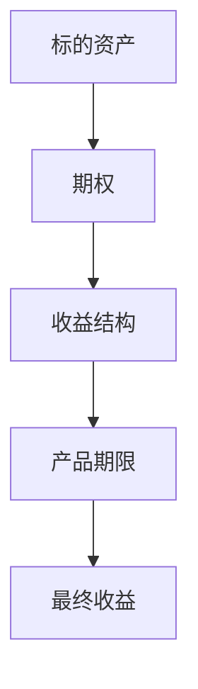
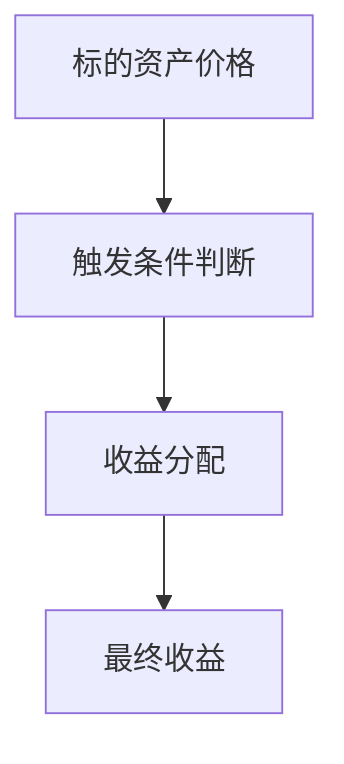
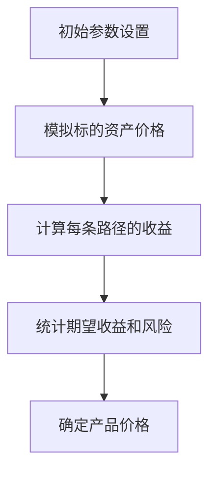
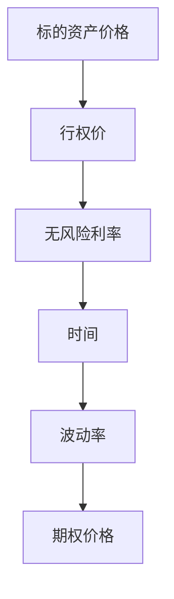
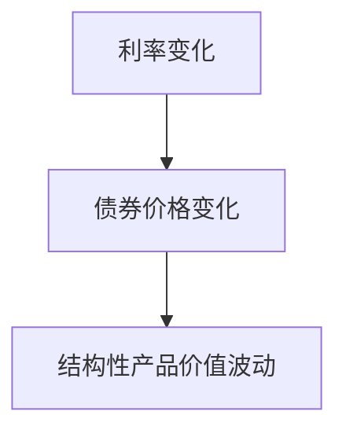
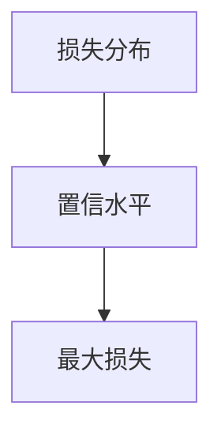
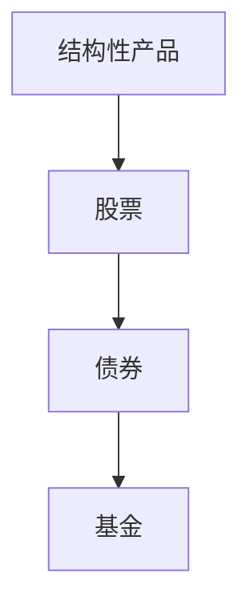

                 


# 结构性产品：定制化投资解决方案

---

## 关键词：
结构性产品、定制化投资、风险管理、金融衍生工具、收益增强、保本策略

---

## 摘要：
结构性产品是一种结合了传统金融资产和衍生工具的复杂投资工具，旨在为投资者提供定制化的收益结构和风险管理方案。本文将从结构性产品的基本定义、设计原理、风险评估与管理等方面展开分析，结合实际案例和数学模型，深入探讨结构性产品在现代投资组合中的应用及其优势。通过对结构性产品的系统性研究，本文旨在为投资者和金融专业人士提供理论支持和实践指导，帮助他们在复杂多变的市场环境中制定更加科学的投资策略。

---

# 第二章: 结构性产品的基本结构

## 2.1 结构性产品的基本组成部分

### 2.1.1 核心资产的选择

结构性产品的核心资产通常是股票、债券、指数或其他金融资产。选择核心资产时，需要考虑以下因素：

- **资产的相关性**：核心资产应与市场波动或投资者需求高度相关。
- **流动性**：资产的流动性越高，产品的流动性风险越低。
- **风险收益特征**：不同资产的风险收益曲线不同，需根据投资者目标选择合适资产。

#### 示例：股票型结构性产品
假设某结构性产品以沪深300指数为标的资产，投资者可以根据指数的波动性获得收益或本金保障。

### 2.1.2 衍生工具的设计

衍生工具是结构性产品的重要组成部分，常见的包括期权、互换和期货等。衍生工具的设计决定了产品的收益结构和风险敞口。

- **期权**：最常见的衍生工具，用于对冲或增强收益。
  - 看涨期权：赋予投资者在特定价格和时间内买入标的资产的权利。
  - 看跌期权：赋予投资者卖出标的资产的权利。

- **互换**：用于调整产品的现金流结构。

#### 示例：基于期权的收益增强型产品
通过购买标的资产的看涨期权，投资者可以在资产价格上涨时获得超额收益，同时通过期权费的收取降低整体成本。

### 2.1.3 产品期限与收益结构

产品期限是结构性产品的重要参数，通常分为短期（1年以内）和中长期（1-5年）。收益结构则根据产品设计分为固定收益、浮动收益或混合收益。

- **固定收益**：投资者在产品到期时获得固定收益，通常与本金保障型产品结合使用。
- **浮动收益**：收益与标的资产的表现挂钩，具有较高的风险收益比。
- **混合收益**：结合固定收益和浮动收益，兼顾风险控制和收益增强。

#### 图2-1: 结构性产品基本结构的组成部分



---

## 2.2 结构性产品的收益分配机制

### 2.2.1 收益计算公式

结构性产品的收益通常由以下公式计算：

$$
\text{最终收益} = \text{本金} \times (1 + \text{收益比率})
$$

其中，收益比率取决于标的资产的表现和产品设计。

#### 示例：保本型结构性产品
$$
\text{收益比率} = \begin{cases}
r - k & \text{如果 } r > k \\
0 & \text{否则}
\end{cases}
$$
其中，\( r \) 是标的资产的收益率，\( k \) 是最低保障收益率。

### 2.2.2 收益分配的触发条件

收益分配的触发条件是结构性产品设计的关键部分，常见的触发条件包括：

- **价格触及上限**：当标的资产价格触及设定的上限时，投资者获得超额收益。
- **价格触及下限**：当标的资产价格触及下限时，投资者获得最低收益保障。
- **时间触发**：产品到期时自动分配收益。

#### 图2-2: 收益分配的触发条件



### 2.2.3 收益与风险的平衡

结构性产品的设计需要在收益和风险之间找到平衡点。通常，收益越高，风险越大，反之亦然。

#### 示例：风险收益曲线
$$
\text{风险} = \text{收益} \times \text{波动率}
$$

---

## 2.3 结构性产品的定价模型

### 2.3.1 基于蒙特卡洛模拟的定价方法

蒙特卡洛模拟是一种常用的金融工具定价方法，通过模拟标的资产的价格波动，计算结构性产品的期望收益和风险。

#### 图2-3: 蒙特卡洛模拟流程



#### 代码示例：蒙特卡洛模拟

```python
import numpy as np

def monte_carlo_simulation(S0, r, sigma, T, N=1000):
    # 参数：S0=初始价格，r=无风险利率，sigma=波动率，T=时间，N=模拟次数
    # 返回：期望收益和波动率
    np.random.seed(42)
    dt = 1/252
    paths = S0 * np.exp((r - 0.5*sigma**2)*dt + sigma*np.sqrt(dt)*np.random.randn(N))
    returns = np.log(paths[-1]/paths[0])
    return np.mean(returns), np.std(returns)
```

### 2.3.2 Black-Scholes模型在结构性产品定价中的应用

Black-Scholes模型是衍生工具定价的经典模型，适用于欧式期权的定价。

#### 公式：Black-Scholes定价公式

$$
C = S_0 N(d_1) - K e^{-rT} N(d_2)
$$

其中：
- \( C \) 是期权价格
- \( S_0 \) 是标的资产价格
- \( K \) 是行权价
- \( r \) 是无风险利率
- \( T \) 是时间到到期日
- \( N(d) \) 是标准正态分布的累积分布函数
- \( d_1 = \frac{\ln(S_0/K) + (r + \sigma^2/2)T}{\sigma \sqrt{T}} \)
- \( d_2 = d_1 - \sigma \sqrt{T} \)

#### 图2-4: Black-Scholes模型的应用



### 2.3.3 其他定价模型的对比分析

除了蒙特卡洛模拟和Black-Scholes模型，还有其他定价模型，如GARCH模型和Copula模型。这些模型在不同市场条件下表现各异。

#### 表2-1: 不同定价模型的对比

| 模型名称      | 适用场景                     | 优点                               | 缺点                               |
|---------------|------------------------------|------------------------------------|------------------------------------|
| Black-Scholes | 欧式期权定价                 | 简单易用，理论基础扎实             | 无法直接应用于美式期权             |
| 蒙特卡洛      | 复杂衍生工具定价             | 能处理高维问题                     | 计算量大，耗时长                   |
| GARCH        | 金融时间序列预测             | 能捕捉波动性                       | 对非线性关系处理能力有限           |
| Copula        | 多资产相关性分析             | 能处理复杂相关性结构               | 参数估计困难                     |

---

## 2.4 本章小结

本章详细介绍了结构性产品的基本组成部分、收益分配机制和定价模型。通过蒙特卡洛模拟和Black-Scholes模型的分析，我们了解了结构性产品定价的核心原理。在实际应用中，需要根据市场环境和投资者需求选择合适的定价模型，并结合风险管理措施确保产品的稳健性。

---

# 第三章: 结构性产品的风险管理

## 3.1 结构性产品的主要风险类型

### 3.1.1 市场风险

市场风险是指由于市场价格波动导致结构性产品价值下降的风险。

#### 表3-1: 常见市场风险因素

| 风险类型 | 描述                     | 影响因素                     |
|----------|--------------------------|------------------------------|
| 利率风险 | 利率变动影响产品价值     | 中央银行货币政策、市场供需   |
| 汇率风险 | 汇率波动影响产品价值     | 外汇市场波动、国际贸易政策   |
| 汇率风险 | 股票价格波动影响产品价值 | 市场情绪、公司业绩、宏观经济 |

### 3.1.2 利率风险

利率风险是结构性产品面临的重要风险之一，尤其是固定收益类结构性产品。

#### 图3-1: 利率风险的影响



### 3.1.3 信用风险

信用风险是指由于交易对手或发行方违约导致的损失风险。

#### 表3-2: 信用风险的来源

| 来源       | 描述                     |
|------------|--------------------------|
| 发行方违约 | 结构性产品发行方无法履行合同义务 |
| 交易对手违约 | 交易对手无法履行衍生工具的义务 |

---

## 3.2 结构性产品的风险评估方法

### 3.2.1 VaR（Value at Risk）模型

VaR模型是金融风险中最常用的度量方法之一，用于估计在给定置信水平下可能的最大损失。

#### 公式：VaR计算公式

$$
\text{VaR} = \text{P}_{\alpha}(\text{损失} > x)
$$

其中：
- \( P_{\alpha} \) 是置信水平
- \( x \) 是损失金额

#### 图3-2: VaR模型的应用



### 3.2.2 CVaR（Conditional Value at Risk）模型

CVaR模型是对VaR模型的补充，用于估计在VaR超过一定阈值时的平均损失。

#### 公式：CVaR计算公式

$$
\text{CVaR} = \frac{1}{P_{\alpha}} \int_{x}^{\infty} x \, dP(x)
$$

---

## 3.3 结构性产品的风险控制策略

### 3.3.1 对冲交易

通过做空相关资产或衍生工具，降低结构性产品的市场风险。

#### 示例：基于期权的对冲策略

$$
\text{对冲比例} = \frac{\text{结构性产品价值}}{\text{期权价值}}
$$

### 3.3.2 产品组合管理

将结构性产品与其他资产组合，分散风险。

#### 图3-3: 产品组合管理



---

## 3.4 本章小结

本章分析了结构性产品的主要风险类型，包括市场风险、利率风险和信用风险，并介绍了VaR和CVaR等风险评估方法。最后，提出了对冲交易和产品组合管理等风险控制策略，帮助投资者在复杂市场中降低风险敞口。

---

# 总结

通过以上章节的详细分析，我们可以看到结构性产品作为一种复杂的金融工具，具有高度的定制化和灵活性，能够满足不同投资者的需求。然而，结构性产品也伴随着较高的风险，需要投资者和金融机构具备专业的知识和风险管理能力。未来，随着金融市场的不断发展，结构性产品将在财富管理和风险管理中发挥更加重要的作用。

---

## 拓展阅读

1. "The Theory of Financial Risk Management" by John C. Hull
2. "Monte Carlo Methods in Financial Economics" by Peter J. Hunt and José L. Ortiz
3. "Structured Products: Design, Pricing and Risk Management" by Thomas S. Kim

---

## 注意事项

- 投资者在购买结构性产品前，应充分了解产品的风险和收益结构。
- 结构性产品的设计和定价需要结合市场环境和投资者需求，避免一刀切。
- 风险管理是结构性产品投资的核心，建议投资者定期评估和调整投资组合。

---

通过本文的系统分析，读者可以更好地理解结构性产品的设计原理和风险管理方法，为实际投资决策提供有力支持。

