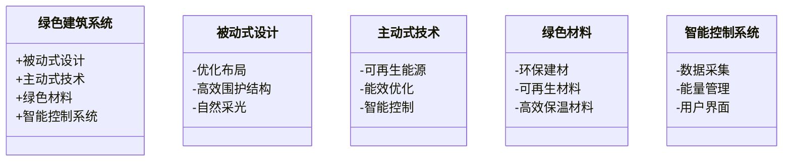
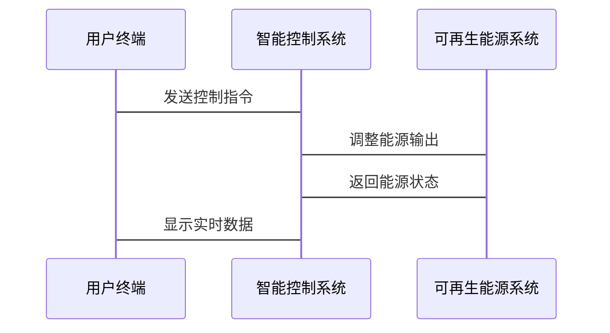

                 


# 绿色建筑技术与材料的市场增长潜力

> **关键词**：绿色建筑、可持续发展、环保材料、可再生能源、建筑节能  
> 
> **摘要**：本文深入探讨绿色建筑技术与材料的市场增长潜力，分析绿色建筑的核心技术、市场现状、驱动因素及未来趋势。通过实际案例分析和系统设计，揭示绿色建筑在经济、环境和社会效益中的巨大潜力，为相关从业者提供参考。

---

## 第1章：绿色建筑的背景与概念

### 1.1 绿色建筑的定义与核心理念

#### 1.1.1 绿色建筑的定义
绿色建筑是指在全生命周期内，最大限度地节约资源（能源、土地、水资源、材料）、保护环境、减少污染，提供健康、适用、高效的使用空间，与自然和谐共生的建筑。

#### 1.1.2 绿色建筑的核心理念
- **可持续性**：在整个生命周期内减少对环境的影响。
- **节能与高效**：通过优化设计和材料选择，降低能源消耗。
- **环保材料**：使用可再生、可回收的材料，减少对自然资源的依赖。
- **健康与舒适**：为用户提供健康、舒适的使用环境。

#### 1.1.3 绿色建筑与传统建筑的区别
| 属性 | 绿色建筑 | 传统建筑 |
|------|----------|-----------|
| 能源消耗 | 低能耗 | 高能耗 |
| 材料选择 | 环保材料 | 普通材料 |
| 设计理念 | 可持续性 | 经济性优先 |
| 环境影响 | 低排放 | 高排放 |

### 1.2 绿色建筑的发展背景

#### 1.2.1 环境问题的加剧
- 全球气候变化：温室气体排放增加，导致极端天气频发。
- 资源枯竭：建筑行业消耗大量能源和原材料，加剧资源短缺。
- 环境污染：建筑施工和运营过程中产生的废弃物和污染物对环境造成压力。

#### 1.2.2 可持续发展理念的兴起
- 全球范围内对可持续发展的关注增加。
- 各国政府和企业开始重视绿色建筑的推广。

#### 1.2.3 政策法规的推动
- 各国出台相关政策，如《LEED绿色建筑认证》、《中国绿色建筑评价标准》等。
- 政府通过补贴、税收优惠等措施鼓励绿色建筑发展。

### 1.3 绿色建筑的市场潜力

#### 1.3.1 全球绿色建筑市场的现状
- 全球绿色建筑市场持续增长，年复合增长率超过10%。
- 欧美地区市场成熟，亚洲市场增长迅速。

#### 1.3.2 绿色建筑的未来发展趋势
- 技术创新：新型材料和施工技术的应用将推动市场发展。
- 政策支持：各国政府将继续出台支持绿色建筑的政策。
- 消费者需求：用户对健康、舒适建筑的需求增加。

#### 1.3.3 绿色建筑对经济和社会的影响
- 经济效益：降低能源消耗，减少运营成本。
- 社会效益：改善居住环境，提升居民生活质量。
- 环境效益：减少碳排放，保护生态环境。

---

## 第2章：绿色建筑技术与材料的核心技术

### 2.1 被动式建筑设计技术

#### 2.1.1 被动式建筑设计的基本原理
被动式设计通过优化建筑布局、朝向和围护结构，最大限度地利用自然采光、通风和太阳能。

#### 2.1.2 被动式建筑设计的关键要素
- 建筑朝向：以南北向为主，减少能耗。
- 围护结构：使用高效保温材料，减少热量流失。
- 自然采光：设计合理的窗墙比，利用自然光线。

#### 2.1.3 被动式建筑设计的优缺点
- 优点：节能、环保、低成本。
- 缺点：在复杂地形或气候条件下设计难度较大。

### 2.2 主动式建筑技术

#### 2.2.1 可再生能源技术
- 太阳能发电：利用太阳能电池板发电。
- 地源热泵：利用地下温度进行供暖和制冷。

#### 2.2.2 建筑能效优化技术
- 智能控制系统：根据实时数据优化能源使用。
- 高效 HVAC（暖通空调）系统：降低能源消耗。

#### 2.2.3 智能建筑控制系统
- 中央控制系统：整合建筑内各系统，实现智能化管理。
- 数据采集与分析：通过传感器实时监测建筑能耗。

### 2.3 绿色建筑材料

#### 2.3.1 环保型建筑材料
- 低碳混凝土：减少碳排放。
- 再生钢材：利用废弃钢材再利用，降低成本。

#### 2.3.2 可再生建筑材料
- 竹材：可再生、可降解。
- 稻草板：环保、低成本。

#### 2.3.3 高效保温隔热材料
- 聚氨酯泡沫：高效隔热。
- 硅酸盐保温材料：防火、耐高温。

---

## 第3章：绿色建筑技术与材料的市场分析

### 3.1 绿色建筑市场的现状与规模

#### 3.1.1 全球绿色建筑市场的规模
- 根据统计，2022年全球绿色建筑市场规模达到5,000亿美元，预计年复合增长率将保持在10%以上。

#### 3.1.2 中国绿色建筑市场的现状
- 中国绿色建筑市场增长迅速，2023年市场规模超过2,000亿元。
- 政策支持：《绿色建筑创建行动方案》推动市场发展。

#### 3.1.3 欧美绿色建筑市场的特点
- 欧美市场成熟，绿色建筑认证体系完善。
- 技术创新：新型材料和建筑技术广泛应用。

### 3.2 绿色建筑市场的驱动因素

#### 3.2.1 政策法规的推动
- 各国政府出台政策，鼓励绿色建筑发展。
- 碳中和目标：推动绿色建筑市场增长。

#### 3.2.2 环保意识的提升
- 用户对健康、环保建筑的需求增加。
- 媒体宣传：提高公众对绿色建筑的认知。

#### 3.2.3 市场需求
- 企业追求可持续发展，增加绿色建筑投资。
- 消费者偏好：选择绿色建筑的用户比例上升。

### 3.3 绿色建筑市场的挑战与机遇

#### 3.3.1 挑战
- 成本高：绿色建筑初期投资较大。
- 技术瓶颈：部分技术尚不成熟，推广难度大。
- 市场认知度低：部分用户对绿色建筑的了解不足。

#### 3.3.2 机遇
- 技术进步：新型材料和施工技术降低成本。
- 政策支持：政府通过补贴和税收优惠降低投资风险。
- 市场需求：用户对绿色建筑的需求持续增长。

---

## 第4章：绿色建筑技术与材料的经济性分析

### 4.1 绿色建筑的成本分析

#### 4.1.1 初期投资成本
- 建筑设计：绿色建筑设计费用高于传统设计。
- 材料成本：环保材料价格较高。

#### 4.1.2 运营成本
- 能源消耗：绿色建筑运营阶段能源消耗显著降低。
- 维护成本：绿色建筑材料维护成本较低。

### 4.2 绿色建筑的投资回报

#### 4.2.1 投资回报模型
- 投资回报率（ROI）= （年均收益 - 年均成本） / 初始投资 × 100%
- 绿色建筑的投资回报周期通常在5-10年之间。

#### 4.2.2 全生命周期成本
- 全生命周期成本包括设计、施工、运营和拆除阶段的总成本。

### 4.3 绿色建筑技术的创新与降低成本

#### 4.3.1 技术创新
- 新型材料：研发低成本环保材料。
- 建筑设计：优化设计降低能耗。

#### 4.3.2 政策支持
- 政府补贴：降低绿色建筑的初期投资成本。
- 税收优惠：减少企业税负。

---

## 第5章：绿色建筑技术与材料的实际案例分析

### 5.1 案例一：某绿色办公楼

#### 5.1.1 项目背景
- 项目地点：某城市CBD区域。
- 设计理念：采用被动式设计和可再生能源技术。

#### 5.1.2 技术应用
- 太阳能发电：屋顶安装太阳能电池板。
- 地源热泵：利用地下温度进行供暖和制冷。
- 环保材料：使用低碳混凝土和再生钢材。

#### 5.1.3 经济效益
- 节能率：与传统建筑相比，节能率超过30%。
- 投资回报：投资回报周期为8年。

### 5.2 案例二：某绿色住宅小区

#### 5.2.1 项目背景
- 项目地点：某二线城市近郊。
- 设计理念：打造健康、舒适的居住环境。

#### 5.2.2 技术应用
- 绿色建材：使用竹材和稻草板作为墙体材料。
- 智能控制系统：实时监测建筑能耗。
- 雨水回收系统：收集雨水用于绿化和清洁。

#### 5.2.3 社会效益
- 提高居民生活质量。
- 减少碳排放，保护环境。

---

## 第6章：绿色建筑技术与材料的系统设计与架构

### 6.1 系统功能设计

#### 6.1.1 领域模型（Mermaid 类图）


### 6.2 系统架构设计（Mermaid 架构图）
```mermaid
archi
    绿色建筑系统
    可再生能源系统
    智能控制系统
    绿色材料
    被动式设计
    用户终端
```

### 6.3 系统接口设计

#### 6.3.1 接口描述
- **可再生能源系统**：与智能控制系统交互，实现能源管理。
- **智能控制系统**：通过传感器采集数据，优化能源使用。
- **用户终端**：提供用户界面，方便用户控制建筑系统。

### 6.4 系统交互流程（Mermaid 序列图）


---

## 第7章：绿色建筑技术与材料的项目实战

### 7.1 环境安装

#### 7.1.1 系统环境
- 操作系统：Windows 10 或更高版本。
- 开发工具：Visual Studio、Eclipse。
- 数据库：MySQL、PostgreSQL。

### 7.2 核心代码实现

#### 7.2.1 绿色建筑能源管理系统（Python 实现）

```python
class EnergyManagementSystem:
    def __init__(self):
        self.renewable_energy = 0
        self.energy_usage = 0
        self.cost = 0

    def calculate_energy_usage(self, time):
        # 根据时间计算能源使用量
        self.energy_usage = self.renewable_energy * 0.8 + time * 0.2
        return self.energy_usage

    def calculate_cost(self):
        # 计算能源成本
        self.cost = self.energy_usage * 0.1 + 100
        return self.cost

# 示例用法
ems = EnergyManagementSystem()
ems.renewable_energy = 50
ems.calculate_energy_usage(10)
print(ems.calculate_cost())  # 输出：60
```

---

## 第8章：最佳实践与总结

### 8.1 最佳实践

#### 8.1.1 绿色建筑的设计与施工
- 注重前期规划，确保设计与施工协同。
- 选择可靠的绿色建筑材料和施工技术。

#### 8.1.2 系统维护与优化
- 定期检查系统运行状态。
- 根据数据反馈优化系统性能。

### 8.2 小结

绿色建筑技术与材料的市场增长潜力巨大，随着技术进步和政策支持，绿色建筑将成为未来建筑行业的主要方向。通过技术创新和成本优化，绿色建筑将实现经济、环境和社会效益的统一。

### 8.3 注意事项

- 确保绿色建筑的设计与施工符合相关标准和规范。
- 加强对绿色建筑材料的质量监管，避免以次充好。

### 8.4 拓展阅读

- 《绿色建筑评价标准》
- 《可再生能源在建筑中的应用》
- 《智能建筑系统设计与实现》

---

# 结语

绿色建筑技术与材料的市场增长潜力是建筑行业未来发展的重要方向。通过技术创新、政策支持和市场需求的推动，绿色建筑将实现更广泛的应用，为全球可持续发展做出贡献。

