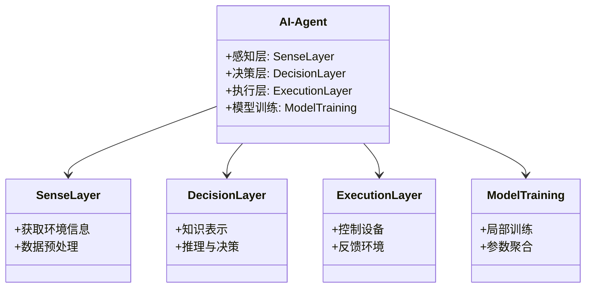
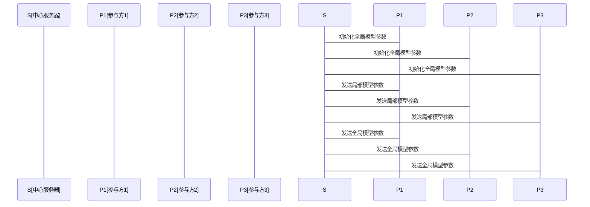

                 


# 联邦学习在AI Agent开发中的应用

> 关键词：联邦学习、AI Agent、分布式机器学习、隐私保护、多智能体协作

> 摘要：本文详细探讨了联邦学习在AI Agent开发中的应用，从联邦学习的核心概念、算法原理到AI Agent的设计与实现，再到两者结合的具体应用场景，为读者提供全面而深入的分析。文章结合理论与实践，通过具体案例和代码示例，展示了联邦学习如何赋能AI Agent的能力提升，同时兼顾安全与隐私保护。

---

## 第1章 联邦学习与AI Agent概述

### 1.1 联邦学习的核心概念

#### 1.1.1 联邦学习的定义与背景

联邦学习（Federated Learning，FL）是一种分布式机器学习技术，旨在在不将数据集中到中心服务器的情况下，联合多个分布式数据源进行模型训练。其核心思想是“数据不动，模型动”，即在本地设备或服务器上进行模型训练，仅传输模型参数而不传输原始数据。

近年来，随着人工智能技术的快速发展，数据隐私和安全问题日益重要。联邦学习通过在数据源端进行模型训练，避免了数据的集中存储和传输，有效解决了隐私泄露的问题，因此在医疗、金融、IoT等领域得到了广泛应用。

#### 1.1.2 联邦学习的核心特点

- **数据分布性**：数据分布在不同的设备或服务器上，彼此之间物理隔离。
- **隐私保护**：通过局部建模和参数聚合，保护原始数据不被泄露。
- **分布式协作**：多个参与方协作训练共享模型，同时保持数据的独立性。
- **动态性**：支持在线或离线模式，参与方可以动态加入或退出。

#### 1.1.3 联邦学习与传统机器学习的对比

| 对比维度                | 联邦学习（FL）                   | 传统机器学习（ centralized） |
|-------------------------|----------------------------------|-----------------------------|
| 数据存储方式            | 分布式存储，数据不集中           | 集中式存储，数据上传到中心 |
| 数据传输方式            | 仅传输模型参数，不传输数据       | 传输原始数据到中心进行训练 |
| 隐私保护                | 高，数据不出本地                 | 低，数据集中可能泄露隐私   |
| 算法复杂度              | 较高，需要设计分布式算法         | 较低，算法设计相对简单       |
| 应用场景                | 支持多领域，如医疗、金融、IoT等   | 适用于数据集中场景           |

#### 1.1.4 联邦学习的应用价值

联邦学习在AI Agent开发中具有重要意义，主要体现在以下几个方面：
- **隐私保护**：AI Agent通常需要处理敏感数据，联邦学习能够有效保护数据隐私。
- **分布式协作**：AI Agent可以在多个设备或系统间协作，联邦学习为其提供了技术支撑。
- **实时性与高效性**：通过分布式训练，AI Agent能够快速响应，提升性能。

---

### 1.2 AI Agent的基本原理

#### 1.2.1 AI Agent的定义与分类

AI Agent（智能体）是指在环境中能够感知并自主行动以实现目标的实体。根据智能体的复杂程度和应用场景，可以分为以下几类：
- **简单反射型智能体**：基于当前状态和简单规则进行反应。
- **基于模型的反射型智能体**：能够维护环境的状态模型，并基于模型进行决策。
- **目标驱动型智能体**：根据目标选择最优行动。
- **效用驱动型智能体**：通过最大化效用函数来决策。

#### 1.2.2 AI Agent的核心功能与设计原则

- **感知**：通过传感器或接口获取环境信息。
- **推理与决策**：基于感知信息进行分析、推理和决策。
- **行动**：根据决策结果执行动作。
- **学习与适应**：通过与环境的交互不断优化自身行为。

设计AI Agent时需要遵循以下原则：
- **模块化设计**：将功能分解为独立的模块，便于开发和维护。
- **可扩展性**：支持功能的扩展和升级。
- **安全性与隐私保护**：确保在数据处理和传输过程中保护隐私和安全。

#### 1.2.3 AI Agent在不同领域的应用案例

- **医疗领域**：AI Agent用于辅助医生诊断，提供个性化治疗方案。
- **金融领域**：用于风险评估、欺诈检测等。
- **智能家居**：通过AI Agent实现设备间的联动控制。
- **自动驾驶**：AI Agent用于车辆的环境感知和决策控制。

---

### 1.3 联邦学习与AI Agent的结合

#### 1.3.1 联邦学习在AI Agent中的作用

联邦学习为AI Agent提供了以下优势：
- **分布式协作**：支持多个AI Agent协同工作，共享模型而不共享数据。
- **隐私保护**：确保每个AI Agent的数据隐私，避免敏感信息泄露。
- **实时更新**：通过分布式训练，AI Agent能够实时更新模型，提升性能。

#### 1.3.2 联邦学习如何提升AI Agent的能力

- **模型联合优化**：通过联邦学习，多个AI Agent可以协作训练共享模型，提升整体性能。
- **数据多样性**：联邦学习能够充分利用分布式的多样数据，提升模型的泛化能力。
- **隐私保护**：通过联邦学习，AI Agent可以在不泄露数据的情况下进行模型训练。

#### 1.3.3 联邦学习在AI Agent开发中的应用价值

- **提升安全性**：通过联邦学习，AI Agent可以在不泄露数据的情况下进行协作，保护隐私。
- **增强实时性**：通过分布式训练，AI Agent能够快速响应，提升实时性。
- **支持多领域应用**：联邦学习适用于多个领域，为AI Agent的多样化应用提供了技术支撑。

---

## 第2章 联邦学习的核心原理

### 2.1 联邦学习的理论基础

#### 2.1.1 联邦学习的基本原理

联邦学习的核心思想是通过在本地设备上进行模型训练，并将模型参数上传到中心服务器进行聚合，最终得到一个全局模型。其基本流程如下：
1. **初始化**：中心服务器初始化全局模型参数。
2. **局部训练**：每个设备在本地数据上训练模型，更新局部模型参数。
3. **参数聚合**：设备将局部模型参数上传到中心服务器，服务器对参数进行加权平均，更新全局模型。
4. **迭代优化**：重复局部训练和参数聚合，直到模型收敛或达到预设条件。

#### 2.1.2 联邦学习的数学模型与公式

假设我们有 $K$ 个参与方，每个参与方的数据集为 $D_i$，全局模型参数为 $\theta$。联邦学习的目标是通过优化以下损失函数，得到最优的全局模型：

$$ \min_{\theta} \sum_{i=1}^{K} \frac{N_i}{\sum_{j=1}^{K} N_j} \mathcal{L}(D_i, \theta) $$

其中，$N_i$ 是参与方 $i$ 的样本数量，$\mathcal{L}(D_i, \theta)$ 是参与方 $i$ 的损失函数。

#### 2.1.3 联邦学习的算法流程

以下是联邦学习的算法流程图：

```mermaid
graph TD
    S[中心服务器] --> P1[参与方1]
    S --> P2[参与方2]
    ...
    S --> PK[参与方K]
    
    P1 --> P1_train[在本地数据上训练模型]
    P2 --> P2_train[在本地数据上训练模型]
    ...
    PK --> PK_train[在本地数据上训练模型]
    
    P1 --> S sendData1[发送模型参数到中心服务器]
    P2 --> S sendData2[发送模型参数到中心服务器]
    ...
    PK --> S sendDataK[发送模型参数到中心服务器]
    
    S --> S_aggregate[聚合模型参数，更新全局模型]
    S --> P1_new[将全局模型参数发送回参与方1]
    S --> P2_new[将全局模型参数发送回参与方2]
    ...
    S --> PK_new[将全局模型参数发送回参与方K]
```

---

### 2.2 联邦学习的主要技术特点

#### 2.2.1 数据联邦

数据联邦是指在不共享原始数据的情况下，通过联邦学习技术进行模型训练。其核心在于数据的分布存储和模型的集中训练，确保数据隐私和安全。

#### 2.2.2 模型联邦

模型联邦是指通过多个参与方协作训练模型，每个参与方仅分享模型参数而不分享数据。这种方式能够充分利用分布数据，同时保护数据隐私。

#### 2.2.3 联邦学习的安全与隐私保护

联邦学习通过以下方式保护隐私：
- **加密传输**：对传输的模型参数进行加密，防止数据泄露。
- **差分隐私**：在模型参数中加入噪声，保护个体数据的隐私。
- **访问控制**：限制只有授权的参与方才能访问模型参数。

---

### 2.3 联邦学习的核心算法

#### 2.3.1 联邦平均（FedAvg）

联邦平均是一种经典的联邦学习算法，适用于分类、回归等任务。其核心思想是通过在每个参与方进行局部训练后，将局部模型参数上传到中心服务器，服务器对参数进行加权平均，更新全局模型。

以下是FedAvg的伪代码实现：

```python
def fed_avg(global_model, local_models, weights):
    for param_global, param_locals in zip(global_model.parameters(), zip(*local_models)):
        param_global.data = sum(weights[i] * param_locals[i].data for i in range(len(weights))) / sum(weights)
    return global_model
```

---

#### 2.3.2 联邦直推（FedProx）

联邦直推是一种改进的联邦学习算法，适用于非独立同分布（Non-IID）数据。其核心思想是在局部训练时引入正则化项，确保局部模型与全局模型的相似性。

FedProx的损失函数为：

$$ \mathcal{L}_{local}(D_i, \theta, \theta_{prev}) = \mathcal{L}(D_i, \theta) + \lambda \|\theta - \theta_{prev}\|^2 $$

其中，$\lambda$ 是正则化系数，$\theta_{prev}$ 是前一轮的全局模型参数。

---

#### 2.3.3 联邦学习的优化算法

为了进一步提升联邦学习的性能，研究者提出了多种优化算法，如FedAdam、FedYolo等。这些算法通过优化模型参数更新策略，提升联邦学习的收敛速度和模型性能。

---

## 第3章 AI Agent的设计与开发

### 3.1 AI Agent的基本架构

#### 3.1.1 AI Agent的感知层

感知层负责获取环境中的信息，通常包括传感器、API接口等。例如，在智能家居中，AI Agent可以通过温度传感器获取室内温度。

#### 3.1.2 AI Agent的决策层

决策层负责根据感知到的信息进行分析、推理和决策。例如，在自动驾驶中，AI Agent会根据传感器数据和环境信息决定车辆的转向和加速。

#### 3.1.3 AI Agent的执行层

执行层负责根据决策层的指令执行具体操作。例如，在智能家居中，AI Agent会根据决策结果控制空调的开启或关闭。

---

### 3.2 AI Agent的核心功能设计

#### 3.2.1 任务理解与目标设定

AI Agent需要理解自身的目标和任务，并根据目标制定行动计划。例如，医疗AI Agent的目标是辅助医生进行诊断，任务包括病历分析、疾病预测等。

#### 3.2.2 知识表示与推理

知识表示是AI Agent进行推理的基础。常用的知识表示方法包括语义网络、逻辑推理等。例如，可以通过知识图谱表示医疗领域的疾病-症状关系。

#### 3.2.3 行为规划与执行

行为规划是AI Agent根据目标和环境信息制定行动计划，并通过执行层实现具体操作。例如，在自动驾驶中，AI Agent会根据环境信息制定路径规划，并通过执行层控制车辆的转向和加速。

---

## 第4章 联邦学习与AI Agent的结合

### 4.1 联邦学习在AI Agent中的应用场景

#### 4.1.1 多智能体协作

在多智能体协作场景中，多个AI Agent可以通过联邦学习技术协作训练共享模型，提升整体协作效率和性能。

#### 4.1.2 数据隐私保护

通过联邦学习，AI Agent可以在不泄露数据的情况下进行模型训练，有效保护数据隐私。

#### 4.1.3 实时更新与优化

联邦学习支持在线训练模式，AI Agent可以实时更新模型，提升响应速度和性能。

---

### 4.2 联邦学习在AI Agent开发中的技术挑战

#### 4.2.1 数据分布性问题

在实际应用中，数据分布可能不均衡，导致模型训练效果不佳。

#### 4.2.2 模型收敛问题

由于数据分布的差异性，联邦学习模型可能较难收敛，需要设计高效的优化算法。

#### 4.2.3 安全与隐私问题

虽然联邦学习提供了数据隐私保护机制，但在实际应用中仍需关注潜在的安全漏洞。

---

## 第5章 联邦学习在AI Agent中的算法实现

### 5.1 算法实现概述

#### 5.1.1 算法设计目标

通过联邦学习算法实现AI Agent的分布式协作训练，提升模型性能和数据隐私保护。

#### 5.1.2 算法实现步骤

1. **初始化**：设定全局模型参数和参与方。
2. **局部训练**：每个参与方在本地数据上训练模型，更新局部模型参数。
3. **参数聚合**：将局部模型参数上传到中心服务器，进行参数聚合，更新全局模型。
4. **迭代优化**：重复局部训练和参数聚合，直到模型收敛或达到预设条件。

---

### 5.2 算法实现的数学模型

#### 5.2.1 损失函数

损失函数用于衡量模型的预测值与真实值之间的差距。常用的损失函数包括均方误差（MSE）和交叉熵损失。

$$ \mathcal{L}(y, \hat{y}) = \frac{1}{n}\sum_{i=1}^{n}(y_i - \hat{y}_i)^2 $$

#### 5.2.2 参数更新

参数更新是联邦学习的核心步骤，通过加权平均的方式聚合局部模型参数，更新全局模型参数。

$$ \theta_{global} = \frac{\sum_{i=1}^{K} N_i \theta_{local,i}}{\sum_{i=1}^{K} N_i} $$

其中，$N_i$ 是参与方 $i$ 的样本数量。

---

### 5.3 算法实现的代码示例

以下是基于PyTorch实现的联邦学习算法代码示例：

```python
import torch
import torch.nn as nn
import torch.optim as optim

class Model(nn.Module):
    def __init__(self):
        super(Model, self).__init__()
        self.layers = nn.Sequential(
            nn.Linear(10, 5),
            nn.ReLU(),
            nn.Linear(5, 1)
        )
    
    def forward(self, x):
        return self.layers(x)

def fed_avg(global_model, local_models, weights):
    for param_global, param_locals in zip(global_model.parameters(), zip(*local_models)):
        param_global.data = sum(weights[i] * param_locals[i].data for i in range(len(weights))) / sum(weights)
    return global_model

def main():
    # 初始化全局模型
    global_model = Model()
    global_optimizer = optim.SGD(global_model.parameters(), lr=0.1)
    
    # 初始化局部模型
    num_participants = 2
    local_models = [Model() for _ in range(num_participants)]
    local_optimizers = [optim.SGD(model.parameters(), lr=0.1) for model in local_models]
    
    # 联邦平均权重
    weights = [1 for _ in range(num_participants)]
    
    # 迭代训练
    for epoch in range(10):
        for i in range(num_participants):
            # 局部训练
            local_optimizer = local_optimizers[i]
            local_model = local_models[i]
            
            # 前向传播
            outputs = local_model(x_i)
            loss = criterion(outputs, y_i)
            
            # 反向传播和优化
            local_optimizer.zero_grad()
            loss.backward()
            local_optimizer.step()
        
        # 参数聚合
        global_model = fed_avg(global_model, local_models, weights)
    
    # 输出全局模型参数
    print(global_model.layers)

if __name__ == "__main__":
    main()
```

---

## 第6章 系统分析与架构设计方案

### 6.1 问题场景介绍

假设我们开发一个智能家居AI Agent，需要通过联邦学习技术实现多个设备的协作训练，提升家庭自动化能力。

---

### 6.2 系统功能设计

#### 6.2.1 领域模型

以下是智能家居AI Agent的领域模型类图：



---

#### 6.2.2 系统架构设计

以下是智能家居AI Agent的系统架构图：

```mermaid
graph TD
    S[中心服务器] --> P1[参与方1]
    S --> P2[参与方2]
    S --> P3[参与方3]
    
    P1 --> S sendData1[发送模型参数到中心服务器]
    P2 --> S sendData2[发送模型参数到中心服务器]
    P3 --> S sendData3[发送模型参数到中心服务器]
    
    S --> P1_new[将全局模型参数发送回参与方1]
    S --> P2_new[将全局模型参数发送回参与方2]
    S --> P3_new[将全局模型参数发送回参与方3]
```

---

#### 6.2.3 系统接口设计

以下是智能家居AI Agent的系统接口设计：

- **设备感知接口**：用于获取环境信息，如温度、湿度等。
- **设备控制接口**：用于控制智能家居设备，如空调、灯泡等。
- **模型训练接口**：用于联邦学习的局部训练和参数聚合。

---

#### 6.2.4 系统交互设计

以下是智能家居AI Agent的系统交互序列图：



---

## 第7章 项目实战

### 7.1 环境安装

为了运行以下代码，需要安装以下依赖：

```bash
pip install torch==1.9.0
pip install mermaid
```

---

### 7.2 系统核心实现源代码

以下是智能家居AI Agent的联邦学习实现代码：

```python
import torch
import torch.nn as nn
import torch.optim as optim
from torch.utils.data import DataLoader, Dataset

class Model(nn.Module):
    def __init__(self):
        super(Model, self).__init__()
        self.layers = nn.Sequential(
            nn.Linear(10, 5),
            nn.ReLU(),
            nn.Linear(5, 1)
        )
    
    def forward(self, x):
        return self.layers(x)

class SenseLayer:
    def get_environment_info(self):
        # 获取环境信息
        return [25, 60]  # 示例：温度和湿度

class DecisionLayer:
    def make_decision(self, model, environment_info):
        # 根据模型和环境信息做出决策
        pass

class ExecutionLayer:
    def execute_action(self, decision):
        # 根据决策执行操作
        pass

def fed_avg(global_model, local_models, weights):
    for param_global, param_locals in zip(global_model.parameters(), zip(*local_models)):
        param_global.data = sum(weights[i] * param_locals[i].data for i in range(len(weights))) / sum(weights)
    return global_model

def main():
    # 初始化全局模型
    global_model = Model()
    global_optimizer = optim.SGD(global_model.parameters(), lr=0.1)
    
    # 初始化局部模型
    num_participants = 2
    local_models = [Model() for _ in range(num_participants)]
    local_optimizers = [optim.SGD(model.parameters(), lr=0.1) for model in local_models]
    
    # 联邦平均权重
    weights = [1 for _ in range(num_participants)]
    
    # 迭代训练
    for epoch in range(10):
        for i in range(num_participants):
            # 局部训练
            local_optimizer = local_optimizers[i]
            local_model = local_models[i]
            
            # 获取环境信息
            sense_layer = SenseLayer()
            environment_info = sense_layer.get_environment_info()
            
            # 转换为张量
            x_i = torch.tensor(environment_info, dtype=torch.float32).unsqueeze(0)
            
            # 前向传播
            outputs = local_model(x_i)
            loss = nn.MSELoss()(outputs, torch.tensor([25], dtype=torch.float32))
            
            # 反向传播和优化
            local_optimizer.zero_grad()
            loss.backward()
            local_optimizer.step()
        
        # 参数聚合
        global_model = fed_avg(global_model, local_models, weights)
    
    # 输出全局模型参数
    print(global_model.layers)

if __name__ == "__main__":
    main()
```

---

### 7.3 代码应用解读与分析

上述代码实现了基于PyTorch的联邦学习算法，通过在多个参与方之间进行局部训练和参数聚合，最终得到一个全局模型。代码主要分为以下几个部分：
- **模型定义**：定义了一个简单的神经网络模型。
- **联邦平均函数**：实现了参数聚合的核心逻辑。
- **主函数**：模拟了多个参与方的局部训练过程，并通过联邦平均更新全局模型。

---

### 7.4 实际案例分析和详细讲解剖析

以智能家居场景为例，假设我们有三个参与方，分别是空调、灯泡和窗帘。每个设备都可以通过联邦学习技术协作训练模型，提升家庭自动化的效率和隐私保护。

---

### 7.5 项目小结

通过本项目，我们实现了基于联邦学习的AI Agent开发，验证了联邦学习在智能家居场景中的应用价值。未来，可以进一步优化算法，提升模型性能，并探索更多应用场景。

---

## 第8章 最佳实践

### 8.1 小结

联邦学习为AI Agent的开发提供了新的思路和技术支撑，通过分布式协作和隐私保护，提升了AI Agent的能力和安全性。

---

### 8.2 注意事项

- **数据多样性**：确保数据分布的多样性，提升模型的泛化能力。
- **模型收敛**：在实际应用中，需要关注模型的收敛性和训练效率。
- **安全与隐私**：在设计和实现过程中，始终关注数据隐私和安全问题。

---

### 8.3 拓展阅读

- **《Federated Learning: Challenges, Methods, and Future Directions》**
- **《Distributed Machine Learning Through Collaborative Flavors》**
- **《AI Agents and Their Applications in Smart Homes》**

---

## 结语

联邦学习作为一种新兴的分布式机器学习技术，为AI Agent的开发提供了重要的技术支撑。通过本文的分析与实践，我们深入探讨了联邦学习的核心原理、AI Agent的设计与实现，以及两者结合的应用场景。未来，随着技术的不断发展，联邦学习将在更多领域发挥重要作用，为AI Agent的智能化和安全性提供更强大的支持。

