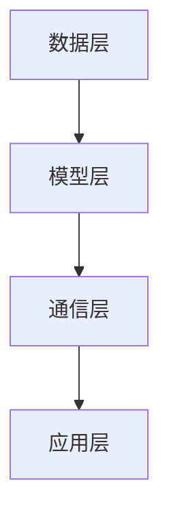
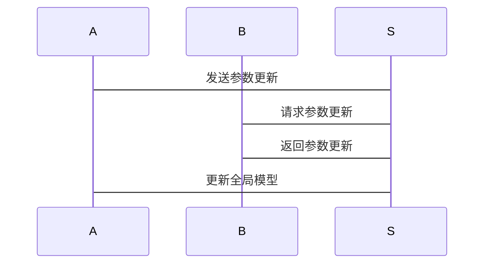

                 


# 联邦学习在AI Agent隐私保护中的应用

## 关键词：联邦学习，AI Agent，隐私保护，分布式学习，多Agent协作

## 摘要：  
随着人工智能技术的快速发展，AI Agent在各个领域的应用越来越广泛。然而，AI Agent在协作过程中面临数据隐私保护的挑战。联邦学习作为一种分布式学习技术，能够在保护数据隐私的前提下实现模型协作。本文深入探讨联邦学习在AI Agent隐私保护中的应用，分析其核心原理、系统架构、算法实现以及实际案例，为AI Agent的安全协作提供理论支持和实践指导。

---

# 第一部分: 联邦学习与AI Agent隐私保护概述

## 第1章: 联邦学习与AI Agent基础

### 1.1 联邦学习的定义与背景

#### 1.1.1 数据隐私保护的重要性  
在数字化时代，数据是核心资产。随着AI技术的普及，数据的收集、存储和使用变得更加频繁。然而，数据泄露和滥用的问题也随之增加。保护数据隐私不仅是法律要求，更是企业和社会的责任。  

#### 1.1.2 联邦学习的定义与核心思想  
联邦学习（Federated Learning）是一种分布式机器学习技术，允许多个参与方在不共享原始数据的前提下，协作训练模型。其核心思想是通过局部模型更新和参数交换，实现全局模型的优化，同时保护数据隐私。  

#### 1.1.3 联邦学习与传统协作学习的对比  
传统的协作学习要求所有参与方共享原始数据，而联邦学习仅交换模型参数或中间结果，避免了数据泄露的风险。此外，联邦学习支持异步和去中心化的协作方式，更加灵活和高效。  

### 1.2 AI Agent的基本概念

#### 1.2.1 AI Agent的定义与分类  
AI Agent是一种具有感知环境、自主决策和执行任务能力的智能体。根据功能和应用场景，AI Agent可以分为任务型Agent、服务型Agent和社交型Agent。  

#### 1.2.2 AI Agent的核心功能与架构  
AI Agent的核心功能包括感知、决策、执行和反馈。其架构通常包含感知层、决策层和执行层，能够根据环境信息做出最优决策。  

#### 1.2.3 AI Agent在协作环境中的隐私挑战  
在多Agent协作场景中，每个Agent可能需要共享部分数据或模型信息，这可能导致敏感信息泄露。因此，如何在协作中保护隐私成为关键问题。  

### 1.3 联邦学习在AI Agent中的应用前景

#### 1.3.1 联邦学习如何解决AI Agent的隐私问题  
联邦学习通过局部模型更新和参数交换，避免了原始数据的共享，有效保护了隐私。  

#### 1.3.2 联邦学习在多Agent协作中的优势  
联邦学习支持去中心化协作，适合AI Agent的分布式部署。同时，其异步更新机制能够提高协作效率。  

#### 1.3.3 联邦学习的未来发展趋势  
随着技术进步，联邦学习将更加智能化和自动化，应用场景也将更加广泛，尤其是在AI Agent领域。  

---

## 第2章: 联邦学习的核心概念与原理

### 2.1 联邦学习的核心概念

#### 2.1.1 数据联邦  
数据联邦是指多个参与方在本地数据上训练模型，并通过通信协议同步模型参数。  

#### 2.1.2 模型联邦  
模型联邦是指多个模型在不同数据源上进行联合优化，形成一个全局模型。  

#### 2.1.3 算法联邦  
算法联邦是指在分布式环境下，通过算法协调实现模型优化。  

### 2.2 联邦学习的原理与机制

#### 2.2.1 联邦学习的通信机制  
联邦学习通过安全通道交换模型参数或梯度信息，确保数据隐私。  

#### 2.2.2 联邦学习的同步与异步模式  
同步模式要求所有参与方同时更新模型，异步模式允许参与方异步更新。  

#### 2.2.3 联邦学习的隐私保护技术  
通过加密、差分隐私和同态加密等技术，进一步增强数据隐私保护。  

### 2.3 联邦学习的数学模型与公式

#### 2.3.1 联邦学习的数学模型  
$$ \text{损失函数} = \sum_{i=1}^{n} \text{损失函数}_i(\theta) $$  
其中，$\theta$ 是模型参数，$n$ 是参与方数量。  

#### 2.3.2 联邦学习的优化算法  
$$ \theta_{t+1} = \theta_t - \eta \nabla L(\theta_t) $$  
其中，$\eta$ 是学习率，$\nabla L$ 是损失函数的梯度。  

#### 2.3.3 联邦学习的收敛性分析  
通过数学证明，联邦学习算法在一定条件下能够收敛到全局最优解。  

---

## 第3章: 联邦学习与AI Agent的结合

### 3.1 AI Agent的协作需求

#### 3.1.1 多Agent协作的必要性  
在复杂环境中，单个AI Agent难以完成所有任务，需要与其他Agent协作。  

#### 3.1.2 AI Agent协作中的数据共享问题  
协作需要共享数据或模型信息，可能导致隐私泄露。  

#### 3.1.3 AI Agent协作中的隐私保护需求  
通过联邦学习实现数据隐私保护，同时保持协作效率。  

### 3.2 联邦学习在AI Agent协作中的应用

#### 3.2.1 联邦学习如何实现AI Agent的协作  
通过联邦学习，AI Agent可以在本地数据上训练模型，并通过参数交换实现协作。  

#### 3.2.2 联邦学习在AI Agent协作中的优势  
- 保护数据隐私  
- 支持去中心化协作  
- 提高模型泛化能力  

#### 3.2.3 联邦学习在AI Agent协作中的挑战  
- 数据异质性问题  
- 模型收敛速度慢  
- 通信开销大  

---

## 第4章: 联邦学习在AI Agent中的系统架构设计

### 4.1 系统功能设计

#### 4.1.1 系统功能模块  
- 数据采集模块  
- 模型训练模块  
- 参数同步模块  
- 隐私保护模块  

#### 4.1.2 系统功能流程  
1. 数据采集：AI Agent收集本地数据。  
2. 模型训练：在本地数据上训练模型，生成梯度或参数。  
3. 参数同步：通过通信协议交换模型参数。  
4. 模型优化：全局模型参数更新，返回给各AI Agent。  

### 4.2 系统架构设计

#### 4.2.1 系统架构图  
使用mermaid图表示系统架构，包括数据层、模型层、通信层和应用层。  



#### 4.2.2 系统接口设计  
- 数据接口：AI Agent与数据源的交互接口。  
- 模型接口：AI Agent与模型训练模块的交互接口。  
- 通信接口：AI Agent与其他Agent或服务器的交互接口。  

### 4.3 系统交互流程

#### 4.3.1 交互流程图  
使用mermaid序列图表示系统交互流程。  



---

## 第5章: 联邦学习在AI Agent中的项目实战

### 5.1 环境配置

#### 5.1.1 安装必要的库  
- TensorFlow Federated  
- Flax  
- JAX  

```bash
pip install tensorflow-federated
pip install flax
pip installjax
```

### 5.2 数据准备

#### 5.2.1 数据集划分  
将数据集划分为多个本地数据集，每个AI Agent持有部分数据。  

#### 5.2.2 数据预处理  
对数据进行清洗、归一化等预处理操作。  

### 5.3 模型实现

#### 5.3.1 模型定义  
定义一个简单的神经网络模型。  

```python
import tensorflow as tf
from tensorflow import keras

model = keras.Sequential([
    keras.layers.Dense(64, activation='relu'),
    keras.layers.Dense(1)
])
```

#### 5.3.2 联邦学习算法实现  
使用TensorFlow Federated库实现联邦学习算法。  

```python
import tensorflow_federated as tff

# 定义联邦学习策略
strategy = tff.federated_computation(lambda: ...)()
```

### 5.4 通信协议设计

#### 5.4.1 安全通信协议  
使用加密技术确保通信过程中的数据安全。  

#### 5.4.2 差分隐私机制  
在模型更新中加入噪声，保护数据隐私。  

### 5.5 隐私保护机制

#### 5.5.1 同态加密  
在加密状态下进行模型训练，确保数据隐私。  

#### 5.5.2 差分隐私  
通过添加噪声，确保模型更新的隐私性。  

---

## 第6章: 联邦学习在AI Agent中的最佳实践

### 6.1 小结

#### 6.1.1 联邦学习的优势  
- 保护数据隐私  
- 支持分布式协作  
- 提高模型泛化能力  

#### 6.1.2 联邦学习的局限性  
- 数据异质性问题  
- 模型收敛速度慢  
- 通信开销大  

### 6.2 注意事项

#### 6.2.1 数据质量  
确保数据质量和多样性，避免模型性能下降。  

#### 6.2.2 通信效率  
优化通信协议，降低通信开销。  

#### 6.2.3 模型鲁棒性  
通过数据增强和模型优化，提高模型鲁棒性。  

### 6.3 未来展望

#### 6.3.1 研究方向  
- 更高效的通信协议  
- 更强大的隐私保护技术  
- 更智能的模型优化算法  

#### 6.3.2 应用前景  
联邦学习将在AI Agent领域发挥更大的作用，推动人工智能技术的发展。  

---

## 第7章: 结语

随着人工智能技术的不断进步，联邦学习在AI Agent隐私保护中的应用前景广阔。通过本文的分析，我们深入了解了联邦学习的核心原理、系统架构和实际应用。未来，随着技术的进一步发展，联邦学习将为AI Agent的安全协作提供更强大的支持。

--- 

**关键词**：联邦学习，AI Agent，隐私保护，分布式学习，多Agent协作

