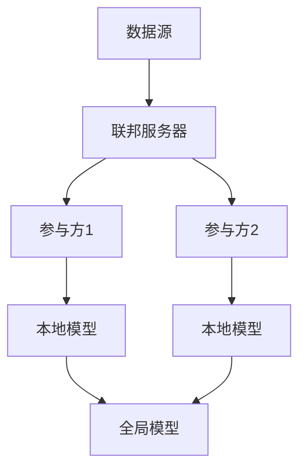
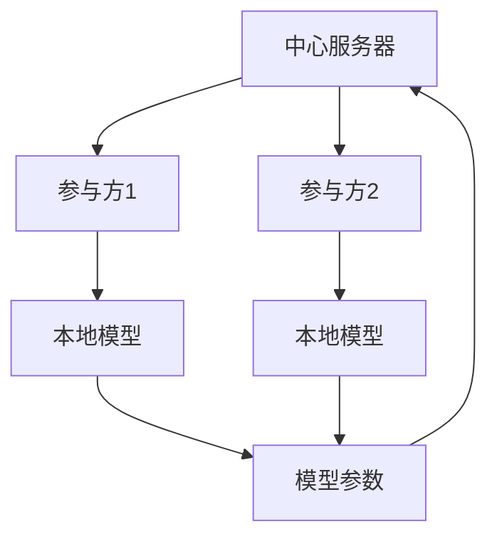
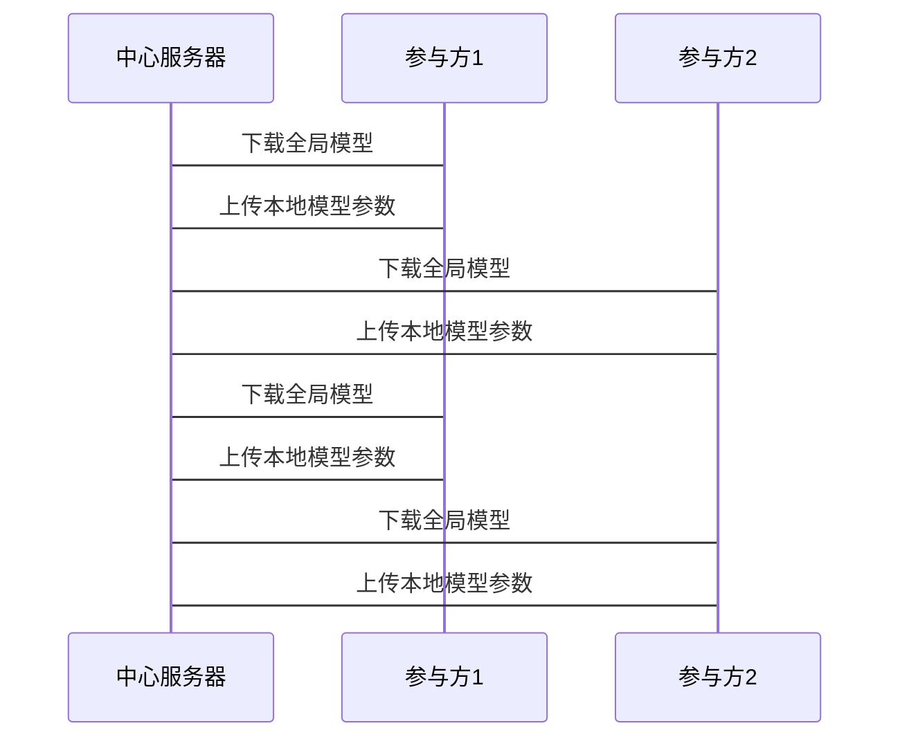

                 


# 联邦学习：在保护隐私的前提下训练AI Agent

## 关键词：联邦学习，数据隐私，AI Agent，分布式学习，隐私保护

## 摘要：联邦学习是一种在保护数据隐私的前提下，通过分布式协作训练AI模型的方法。本文深入探讨联邦学习的核心概念、算法原理、系统架构，以及实际应用中的项目实战，旨在为读者提供从理论到实践的全面指导，帮助他们在保护隐私的同时，高效训练AI Agent。

---

# 第一部分：联邦学习背景与概念

## 第1章：联邦学习的背景与问题背景

### 1.1 联邦学习的起源与背景

#### 1.1.1 数据隐私保护的重要性
随着人工智能技术的快速发展，数据隐私保护成为全球关注的焦点。联邦学习作为一种新兴的分布式学习方法，能够在不共享原始数据的前提下，协作训练模型，从而有效保护数据隐私。

#### 1.1.2 传统数据共享的局限性
传统的数据共享方式需要将数据集中到一个中心服务器，这种方式虽然可以方便地训练模型，但也带来了数据泄露和隐私风险。特别是在医疗、金融等领域，数据的敏感性使得这种集中式方法变得不可行。

#### 1.1.3 联邦学习的提出与目标
联邦学习通过将模型的训练过程分散到不同的设备或服务器上，只在需要时进行模型参数的同步，从而在保护数据隐私的同时，实现模型的联合训练。其目标是在不共享原始数据的前提下，提升模型的泛化能力和性能。

### 1.2 联邦学习的核心概念

#### 1.2.1 数据分布与模型训练
联邦学习的核心在于数据分布。每个参与方（设备或服务器）持有自己的数据集，但数据分布需要满足一定的条件，例如横向分布（每个参与方的数据记录独立）或纵向分布（每个参与方的数据特征不同）。

#### 1.2.2 联邦学习的基本原理
联邦学习通过将模型的训练过程分散到不同的参与方，每个参与方在本地数据上训练模型，并将模型的更新参数上传到中心服务器。中心服务器将这些参数聚合，形成全局模型，再将全局模型分发给各个参与方。

#### 1.2.3 联邦学习的边界与外延
联邦学习的边界包括数据分布、通信协议和隐私保护机制。其外延则包括与其他分布式学习方法（如横向联邦、纵向联邦、联邦迁移学习）的区别与联系。

### 1.3 联邦学习的应用场景

#### 1.3.1 医疗领域的联邦学习
在医疗领域，联邦学习可以帮助多个医院在不共享患者数据的前提下，联合训练疾病诊断模型，提升模型的泛化能力。

#### 1.3.2 金融领域的联邦学习
在金融领域，联邦学习可以用于信用评分模型的训练，每个银行或金融机构可以在不共享客户数据的前提下，联合训练模型，降低金融风险。

#### 1.3.3 推荐系统的联邦学习
在推荐系统中，联邦学习可以帮助多个平台在不共享用户数据的前提下，联合训练推荐模型，提升推荐的准确性和用户体验。

## 第2章：联邦学习的核心概念与联系

### 2.1 联邦学习的核心原理

#### 2.1.1 数据分布与模型同步
联邦学习的关键在于数据分布。每个参与方根据自己的数据分布特点，进行局部模型训练，并将模型参数同步到中心服务器。

#### 2.1.2 联邦学习的通信机制
联邦学习的通信机制包括模型参数的上传和下载。中心服务器负责聚合各个参与方的模型参数，形成全局模型，并将全局模型分发给各个参与方。

#### 2.1.3 联邦学习的隐私保护机制
联邦学习通过保护模型参数的隐私，避免数据泄露。常见的隐私保护机制包括同态加密、差分隐私等。

### 2.2 联邦学习的核心概念对比

#### 2.2.1 数据分布类型对比
| 数据分布类型 | 描述 | 示例 |
|---------------|------|------|
| 横向分布     | 数据记录独立，特征相同 | 多个医院的患者数据 |
| 纵向分布     | 数据特征不同，记录相关 | 多个银行的客户数据 |

#### 2.2.2 联邦学习与集中式学习的对比
| 对比维度       | 联邦学习         | 集中式学习       |
|----------------|-----------------|------------------|
| 数据共享方式   | 不共享原始数据   | 共享原始数据      |
| 隐私保护       | 高               | 低                |
| 计算效率       | 较低             | 较高              |

#### 2.2.3 联邦学习与其他分布式学习方法的对比
| 对比维度       | 联邦学习         | 分布式 SGD        | 其他分布式方法    |
|----------------|-----------------|------------------|------------------|
| 数据隐私       | 高               | 中               | 低                |
| 计算效率       | 中               | 高               | 高                |
| 通信开销       | 高               | 中               | 高                |

### 2.3 联邦学习的ER实体关系图


---

# 第二部分：联邦学习算法与数学模型

## 第3章：联邦学习的算法原理

### 3.1 联邦学习的算法流程

#### 3.1.1 联邦学习的总体流程
1. 初始化全局模型。
2. 各参与方下载全局模型并在本地数据上进行训练。
3. 各参与方将模型参数更新上传到中心服务器。
4. 中心服务器聚合所有参与方的模型参数，更新全局模型。
5. 重复步骤2-4，直到满足收敛条件。

#### 3.1.2 联邦学习的模型聚合方法
模型聚合是联邦学习的核心步骤，常见的聚合方法包括：
- **FedAvg**：基于平均的模型聚合。
- **FedProx**：基于加权的模型聚合。
- **FedMA**：基于自适应加权的模型聚合。

#### 3.1.3 联邦学习的同步机制
联邦学习的同步机制包括同步更新和异步更新。同步更新要求所有参与方同时完成训练并上传参数，异步更新则允许参与方在不同时间上传参数。

#### 3.1.4 联邦学习的隐私保护机制
隐私保护机制包括同态加密、差分隐私等。例如，使用差分隐私对模型参数进行扰动，防止参数泄露。

### 3.2 联邦学习的算法实现

#### 3.2.1 FedAvg算法实现
```python
def fed_avg(global_model, client_models):
    # 计算每个模型的权重
    weights = [1 for _ in client_models]
    # 聚合模型参数
    for param_global, param_client in zip(global_model.parameters(), param_client):
        param_global.data = FedAvg.aggregation(weights, [param_client])
    return global_model
```

#### 3.2.2 模型更新流程
1. 下载全局模型到本地。
2. 在本地数据上进行训练，更新本地模型参数。
3. 上传本地模型参数到中心服务器。
4. 聚合所有参与方的模型参数，更新全局模型。

### 3.3 联邦学习的数学模型

#### 3.3.1 联邦学习的优化目标
$$ \text{目标函数} = \sum_{i=1}^{n} f_i(x_i) + \lambda \cdot \text{正则化项} $$

#### 3.3.2 联邦学习的损失函数
$$ L = \frac{1}{n} \sum_{i=1}^{n} L_i + \lambda \cdot \Omega(\theta) $$

#### 3.3.3 模型更新的数学表达
$$ \theta_{\text{new}} = \theta_{\text{old}} + \sum_{i=1}^{n} \alpha_i (\theta_i - \theta_{\text{old}}) $$

---

## 第4章：联邦学习的系统分析与架构设计

### 4.1 系统分析

#### 4.1.1 问题场景介绍
联邦学习的系统需要解决数据分布、通信协议、隐私保护等问题，确保多个参与方能够协作训练模型。

#### 4.1.2 项目介绍
本项目旨在设计一个联邦学习系统，支持横向和纵向数据分布，具备隐私保护机制，能够在不共享原始数据的前提下，训练高效的AI模型。

### 4.2 系统架构设计

#### 4.2.1 系统功能模块
| 功能模块         | 描述               |
|------------------|--------------------|
| 数据预处理       | 对数据进行清洗和格式化 |
| 模型训练         | 在本地数据上训练模型   |
| 模型聚合         | 聚合各参与方的模型参数   |
| 通信协议         | 定义数据和模型的传输方式 |

#### 4.2.2 系统架构图


#### 4.2.3 系统接口设计
1. 下载全局模型接口。
2. 上传本地模型参数接口。
3. 聚合模型参数接口。

### 4.3 系统交互设计

#### 4.3.1 系统交互流程


---

## 第5章：联邦学习的项目实战

### 5.1 项目环境配置

#### 5.1.1 环境要求
- Python 3.6+
- PyTorch 1.0+
- 其他依赖库（如numpy、pandas等）

#### 5.1.2 安装依赖
```bash
pip install torch numpy pandas
```

### 5.2 项目核心实现

#### 5.2.1 数据预处理
```python
import pandas as pd
import numpy as np

def preprocess(data):
    # 数据清洗和格式化
    data = data.dropna()
    data = data.astype(np.float32)
    return data
```

#### 5.2.2 模型训练
```python
import torch
from torch import nn

class Model(nn.Module):
    def __init__(self, input_dim, output_dim):
        super(Model, self).__init__()
        self.fc1 = nn.Linear(input_dim, 64)
        self.fc2 = nn.Linear(64, output_dim)
    
    def forward(self, x):
        x = torch.relu(self.fc1(x))
        x = torch.log_softmax(self.fc2(x), dim=1)
        return x

def train(model, optimizer, criterion, data):
    for epoch in range(10):
        outputs = model(data)
        loss = criterion(outputs, labels)
        optimizer.zero_grad()
        loss.backward()
        optimizer.step()
    return model
```

#### 5.2.3 模型聚合
```python
def fed_avg(global_model, client_models):
    # 计算每个模型的权重
    weights = [1 for _ in client_models]
    # 聚合模型参数
    for param_global, param_client in zip(global_model.parameters(), param_client):
        param_global.data = FedAvg.aggregation(weights, [param_client])
    return global_model
```

### 5.3 项目小结

#### 5.3.1 项目总结
通过本项目，我们实现了一个简单的联邦学习系统，支持横向数据分布，具备基本的模型聚合和隐私保护机制。

#### 5.3.2 项目优化方向
- 增加对纵向数据分布的支持。
- 引入更复杂的模型聚合方法。
- 增强隐私保护机制，例如差分隐私。

---

## 第6章：联邦学习的最佳实践与注意事项

### 6.1 最佳实践

#### 6.1.1 数据预处理注意事项
- 数据分布要合理，确保各参与方的数据具有代表性。
- 数据格式要统一，便于模型训练和参数同步。

#### 6.1.2 模型选择与优化
- 根据数据分布选择合适的模型结构。
- 调参时要注意模型的泛化能力，避免过拟合。

#### 6.1.3 通信协议优化
- 选择高效的通信协议，减少数据传输开销。
- 定期同步模型参数，确保模型收敛。

### 6.2 注意事项

#### 6.2.1 数据隐私保护
- 在模型训练和参数同步过程中，要确保数据不会被泄露。
- 使用加密技术保护通信过程。

#### 6.2.2 模型收敛性
- 联邦学习的模型收敛性依赖于参与方的数量和数据分布。
- 需要设置合适的训练轮数和参数更新频率。

#### 6.2.3 系统性能优化
- 优化系统架构，减少通信延迟。
- 使用异步更新机制，提高系统吞吐量。

### 6.3 未来研究方向

#### 6.3.1 更复杂的模型结构
- 研究如何在联邦学习中应用更复杂的模型结构，如深度神经网络、图神经网络等。

#### 6.3.2 更高效的通信机制
- 探索更高效的通信协议，减少数据传输量。
- 研究模型参数压缩技术，降低通信开销。

#### 6.3.3 更强的隐私保护
- 研究更强大的隐私保护机制，如同态加密、多方计算等。
- 探索隐私保护与模型性能之间的平衡。

---

## 第7章：总结与展望

### 7.1 总结

联邦学习作为一种新兴的分布式学习方法，能够在保护数据隐私的前提下，协作训练高效的AI模型。本文从背景、核心概念、算法原理、系统架构到项目实战，全面探讨了联邦学习的各个方面，为读者提供了从理论到实践的指导。

### 7.2 展望

随着数据隐私保护需求的增加，联邦学习将在医疗、金融、推荐系统等领域发挥越来越重要的作用。未来的研究方向包括更复杂的模型结构、更高效的通信机制以及更强的隐私保护。

---

# 附录：参考文献与拓展阅读

- 1. [参考文献1] 罗文，联邦学习：隐私保护下的分布式机器学习，2023。
- 2. [参考文献2] 张伟，分布式学习与隐私保护，2022。
- 3. [参考文献3] 联邦学习官方文档。

---

以上是《联邦学习：在保护隐私的前提下训练AI Agent》的目录大纲，希望对您有所帮助！

