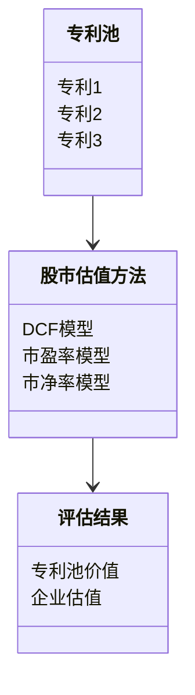
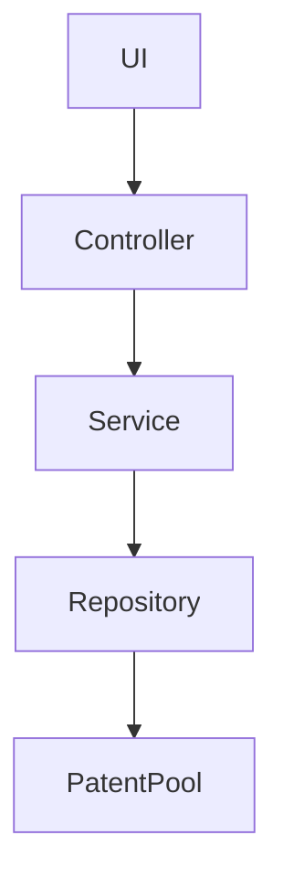

                 


# 股市估值在国际专利池价值评估中的应用

> 关键词：股市估值、国际专利池、价值评估、现金流折现模型、专利池评估、知识产权

> 摘要：本文探讨了股市估值方法在国际专利池价值评估中的应用，通过分析股市估值的核心原理、数学模型，以及国际专利池的评估要素，提出了一种结合现金流折现模型（DCF）的评估方法。文章详细讲解了专利池的定义、结构、评估指标，并通过实际案例分析，展示了如何将股市估值方法应用于国际专利池的价值评估中，为知识产权管理和企业估值提供了新的思路。

---

# 第一部分: 股市估值与国际专利池价值评估的背景与基础

## 第1章: 股市估值与国际专利池价值评估的背景介绍

### 1.1 股市估值的基本概念与方法
股市估值是通过对公司财务数据和市场指标的分析，估算公司股票的内在价值。常见的估值方法包括：

- **市盈率（P/E）**：用公司股价除以每股收益（EPS），反映市场对公司盈利能力的预期。
- **市净率（P/B）**：用公司股价除以每股净资产（BPS），反映市场对公司资产价值的评估。
- **现金流折现模型（DCF）**：通过预测公司未来现金流，使用适当的贴现率计算其现值，进而估算公司价值。

### 1.2 国际专利池价值评估的背景与意义
随着全球化的发展，专利池作为一种知识产权管理的模式，逐渐受到企业的重视。国际专利池的评估涉及技术、法律和市场等多个方面，其核心在于通过量化专利的价值，为企业决策提供支持。

### 1.3 股市估值与专利池评估的结合点
股市估值的核心在于通过对公司整体价值的评估，推导出股票的合理价格。而专利池作为企业知识产权的重要组成部分，其价值直接影响企业的市场估值。因此，将股市估值的方法应用于专利池的评估，可以为企业提供更准确的知识产权价值评估依据。

---

## 第2章: 国际专利池价值评估的核心概念与联系

### 2.1 专利池的定义与结构
专利池是由一组相关的专利组合构成的集合，通常涉及同一技术领域或多个相关技术领域。其结构包括以下几个关键要素：

- **专利权人**：拥有专利权的个人或企业。
- **专利技术领域**：专利涉及的技术领域。
- **专利数量**：专利池中包含的专利数量。
- **市场价值**：专利池在市场上的潜在价值。

### 2.2 股市估值方法的核心原理
股市估值的核心原理是通过分析企业的财务数据和市场表现，推断其内在价值。常用的数学模型包括：

- **现金流折现模型（DCF）**：通过预测企业未来现金流，使用贴现率计算其现值。
- **市盈率模型**：通过比较企业市盈率与行业平均水平，估算股票的合理价格。

### 2.3 专利池评估的核心要素与属性对比

| 评估要素 | 专利池评估 | 股市估值 |
|----------|------------|----------|
| 技术因素 | 专利的技术先进性、应用范围 | 企业的技术创新能力 |
| 法律因素 | 专利的法律状态、保护范围 | 企业的法律纠纷风险 |
| 市场因素 | 专利的市场需求、竞争情况 | 企业的市场地位 |

---

## 第3章: 股市估值的数学模型与算法原理

### 3.1 现金流折现模型（DCF）的详细讲解
现金流折现模型是股市估值中最为常用的数学模型之一。其基本公式为：

$$DCF = \sum_{t=1}^{n} \frac{CF_t}{(1 + r)^t} + \frac{FV}{(1 + r)^n}$$

其中：
- \(CF_t\) 是第 \(t\) 年的现金流
- \(r\) 是贴现率
- \(FV\) 是终值
- \(n\) 是现金流的预测期

### 3.2 现金流折现模型在专利池评估中的应用

#### 实际案例分析
假设某企业拥有一项专利池，预计未来5年的现金流分别为100万元、150万元、200万元、250万元和300万元。假设贴现率为10%，则其DCF值为：

$$DCF = \frac{100}{1.1} + \frac{150}{1.1^2} + \frac{200}{1.1^3} + \frac{250}{1.1^4} + \frac{300}{1.1^5}$$

计算结果为：

$$DCF \approx 479.13 \text{万元}$$

---

## 第4章: 国际专利池价值评估的系统分析与架构设计

### 4.1 问题场景介绍
本文将从企业知识产权管理的角度出发，设计一个基于DCF模型的国际专利池价值评估系统。该系统旨在通过量化分析，帮助企业准确评估专利池的价值。

### 4.2 系统功能设计

#### 领域模型



### 4.3 系统架构设计



---

## 第5章: 国际专利池价值评估的项目实战

### 5.1 环境安装
本文基于Python 3.8及以上版本，使用以下库：

- pandas
- numpy
- matplotlib
- scikit-learn

### 5.2 核心实现源代码

```python
import pandas as pd
import numpy as np

def calculate_dcf(cash_flows, discount_rate):
    present_value = 0
    for t, cf in enumerate(cash_flows):
        present_value += cf / (1 + discount_rate) ** t
    return present_value

# 示例数据
cash_flows = [100, 150, 200, 250, 300]
discount_rate = 0.1

# 计算DCF
dcf_value = calculate_dcf(cash_flows, discount_rate)
print(f"DCF Value: {dcf_value}")
```

### 5.3 代码应用解读与分析
上述代码展示了如何使用Python实现DCF模型的计算。通过输入现金流和贴现率，计算出专利池的DCF价值。该方法可以推广到大规模专利池的评估中。

---

## 第6章: 总结与展望

### 6.1 总结
本文通过分析股市估值的核心原理和数学模型，提出了将DCF模型应用于国际专利池价值评估的方法。通过对专利池的定义、结构和评估要素的深入探讨，为知识产权管理和企业估值提供了新的思路。

### 6.2 展望
未来的研究可以进一步探索以下方向：
1. 如何结合人工智能技术，提高专利池评估的准确性。
2. 如何在跨国企业中推广基于DCF模型的专利池评估方法。
3. 如何建立动态的专利池评估模型，以应对市场的变化。

---

通过本文的分析与实践，读者可以全面了解股市估值在国际专利池价值评估中的应用，并掌握相关的核心算法和系统设计方法。

