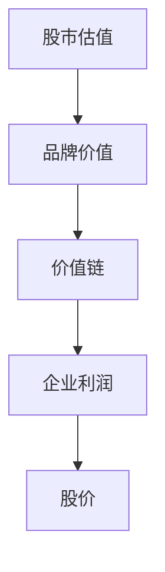

                 


# 股市估值在国际品牌价值链分析中的应用

> 关键词：股市估值，国际品牌价值链，品牌价值，股价影响，价值链分析

> 摘要：本文探讨了股市估值在国际品牌价值链分析中的应用，通过层次分析法和回归分析法，结合实际案例，分析品牌价值对股市估值的影响，提出了优化股市估值的方法和策略。

---

## 第一部分：背景介绍

### 第1章：股市估值与国际品牌价值链概述

#### 1.1 问题背景
- 1.1.1 股市估值的基本概念
  - 股市估值是通过对公司财务数据、市场环境等多因素的分析，确定股票的合理价格。
- 1.1.2 国际品牌价值链的定义
  - 品牌价值链是指从原材料采购到最终产品销售的过程中，品牌价值在其各个环节的体现和传递。
- 1.1.3 问题解决的意义与价值
  - 通过分析品牌价值对股市估值的影响，优化企业的价值评估和资本运作。

#### 1.2 问题描述
- 1.2.1 股市估值的核心要素
  - 包括市盈率、市净率、股息率等。
- 1.2.2 品牌价值链的构成与作用
  - 包括生产、分销、消费等环节，品牌价值在每个环节中的作用。
- 1.2.3 问题解决的路径与方法
  - 通过分析品牌价值在价值链中的作用，建立股市估值模型。

#### 1.3 问题解决
- 1.3.1 股市估值与品牌价值链的结合
  - 品牌价值是影响股价的重要因素。
- 1.3.2 品牌价值对股市估值的影响
  - 品牌价值高的企业，其股价通常较高。
- 1.3.3 优化股市估值的方法
  - 结合品牌价值和其他财务指标，建立综合评估模型。

#### 1.4 边界与外延
- 1.4.1 股市估值的适用范围
  - 适用于上市公司，尤其是知名品牌企业。
- 1.4.2 品牌价值链的局限性
  - 品牌价值难以量化，受主观因素影响较大。
- 1.4.3 应用中的注意事项
  - 结合行业特点，避免单一指标误导。

#### 1.5 概念结构与核心要素
- 1.5.1 股市估值的核心要素
  - 包括盈利能力、成长能力、财务状况等。
- 1.5.2 品牌价值链的关键环节
  - 包括品牌建设、产品生产、市场推广等。
- 1.5.3 两者结合的逻辑关系
  - 品牌价值通过价值链传递，影响企业的财务表现，从而影响股市估值。

---

## 第二部分：核心概念与联系

### 第2章：核心概念原理

#### 2.1 股市估值的原理
- 2.1.1 市盈率与市净率的计算
  - 市盈率 = 股价 / 每股收益
  - 市净率 = 股价 / 每股净资产
- 2.1.2 股息率与投资回报
  - 股息率 = 每股股息 / 股价
- 2.1.3 股价与企业价值的关系
  - 股价反映市场对企业价值的评估。

#### 2.2 品牌价值链的原理
- 2.2.1 品牌价值的构成
  - 包括品牌知名度、品牌忠诚度、品牌声誉等。
- 2.2.2 价值链的传递机制
  - 品牌价值通过生产、分销、消费等环节传递给消费者。
- 2.2.3 品牌价值与企业利润的关系
  - 品牌价值高的企业通常具有较高的利润率。

#### 2.3 核心概念对比
- 2.3.1 股市估值与品牌价值的异同
  - 相同点：都是企业价值的体现。
  - 不同点：股市估值是市场行为，品牌价值是企业资产。
- 2.3.2 价值链中的品牌价值与股价的关系
  - 品牌价值通过价值链传递，影响企业的财务表现，进而影响股价。
- 2.3.3 品牌价值对股市估值的影响路径
  - 品牌价值影响企业的盈利能力，进而影响股价。

### 第3章：概念属性特征对比表格

| 概念       | 属性           | 特征对比       |
|------------|----------------|---------------|
| 股市估值   | 计算方法       | 市盈率、市净率等 |
| 品牌价值   | 评估维度       | 品牌知名度、忠诚度等 |
| 价值链     | 传递环节       | 生产、分销、消费等 |

### 第4章：ER实体关系图



---

## 第三部分：算法原理讲解

### 第5章：算法原理

#### 5.1 层次分析法（AHP）
- 5.1.1 算法步骤
  1. 确定影响股市估值的因素。
  2. 构建层次分析模型。
  3. 计算各因素的权重。
  4. 进行一致性检验。
- 5.1.2 应用场景
  - 适用于多因素综合评估。
- 5.1.3 示例分析
  - 通过层次分析法评估某公司的股市估值。

#### 5.2 回归分析法
- 5.2.1 算法原理
  - 通过回归模型分析品牌价值对股价的影响。
- 5.2.2 应用实例
  - 以苹果公司为例，分析品牌价值对股价的影响。
- 5.2.3 代码实现
  ```python
  import statsmodels.api as sm
  model = sm.OLS(y, X).fit()
  print(model.summary())
  ```

### 第6章：数学模型与公式

#### 6.1 股市估值模型
$$ P = \frac{E}{E_P} $$
其中，P为市盈率，E为净利润，E_P为每股收益。

#### 6.2 品牌价值评估模型
$$ BV = k \times (R - r) $$
其中，BV为品牌价值，k为常数，R为品牌相关收入，r为成本率。

---

## 第四部分：系统分析与架构设计

### 第7章：系统分析与架构设计方案

#### 7.1 问题场景介绍
- 分析某国际品牌企业，评估其品牌价值对股市估值的影响。

#### 7.2 系统功能设计
- 领域模型：
  ```mermaid
  classDiagram
    class 股市估值 {
        市盈率
        市净率
        股息率
    }
    class 品牌价值 {
        品牌知名度
        品牌忠诚度
        品牌声誉
    }
    class 价值链 {
        生产环节
        分销环节
        消费环节
    }
    股市估值 --> 品牌价值
    品牌价值 --> 价值链
  ```

#### 7.3 系统架构设计
- 系统架构图：
  ```mermaid
  architecture
  股市估值模块 --> 品牌价值模块 --> 价值链模块
  ```

#### 7.4 系统接口设计
- API接口：
  - GET /stock_valuation
  - POST /brand_value
  - GET /value_chain

#### 7.5 系统交互设计
- 序列图：
  ```mermaid
  sequenceDiagram
    股市估值模块 -> 品牌价值模块: 获取品牌价值数据
    品牌价值模块 -> 价值链模块: 获取价值链数据
    价值链模块 -> 股市估值模块: 返回综合评估结果
  ```

---

## 第五部分：项目实战

### 第8章：项目实战

#### 8.1 环境安装
- 安装Python和相关库（如pandas、statsmodels）。

#### 8.2 系统核心实现源代码
```python
import pandas as pd
import statsmodels.api as sm

# 数据准备
data = pd.read_csv('brand_value.csv')
X = data[['brand_value', 'revenue_growth']]
X = sm.add_constant(X)
y = data['stock_price']

# 回归分析
model = sm.OLS(y, X).fit()
print(model.summary())
```

#### 8.3 代码应用解读与分析
- 分析回归结果，解读品牌价值对股价的影响系数。

#### 8.4 实际案例分析
- 以苹果公司为例，分析品牌价值对股价的影响。

#### 8.5 项目小结
- 总结项目成果，提出改进建议。

---

## 第六部分：总结与展望

### 第9章：总结与展望

#### 9.1 本章总结
- 总结全文内容，强调品牌价值对股市估值的重要性。

#### 9.2 未来研究方向
- 建议结合更多因素，如市场环境、行业趋势等，进一步优化估值模型。

#### 9.3 最佳实践 tips
- 提醒读者在实际应用中注意数据的准确性和模型的适用性。

#### 9.4 注意事项
- 强调行业差异性，避免直接复制模型。

#### 9.5 拓展阅读
- 推荐相关领域的书籍和论文，供读者深入学习。

---

## 第七部分：参考文献

- 列出文章中引用的文献和资料。

---

以上为《股市估值在国际品牌价值链分析中的应用》的技术博客目录大纲，确保每部分内容详实，逻辑清晰，便于读者理解和应用。

