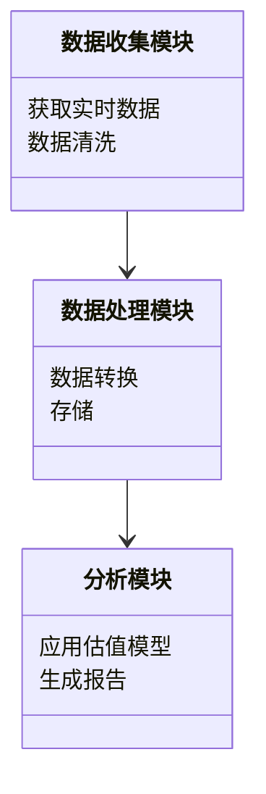
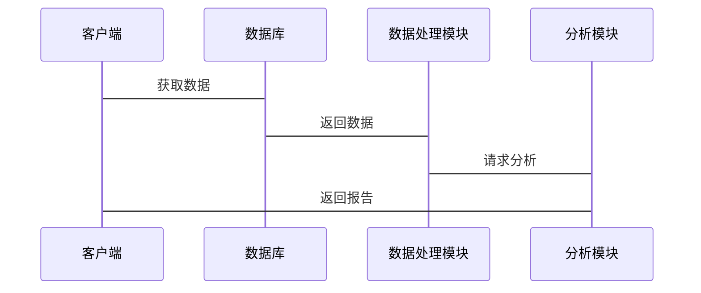

                 


# 股市估值在跨境数字资产评估中的应用

## 关键词：股市估值、数字资产、跨境评估、资产评估、金融分析、技术分析

## 摘要：本文探讨了将股市估值方法应用于跨境数字资产评估的方法，分析了传统估值模型与数字资产特性的结合，通过系统架构设计和项目实战，展示了如何利用这些方法进行高效评估。

---

## 第一章：引言

### 1.1 数字资产评估的背景与意义
#### 1.1.1 数字资产的定义与分类
数字资产是指以数字形式存在的资产，主要包括加密货币（如比特币、以太坊）、NFTs（非同质化代币）、数字商品和服务等。它们具有去中心化、匿名性和全球性等特点，已成为全球金融的重要组成部分。

#### 1.1.2 股市估值的基本概念
股市估值是指通过对公司财务状况、市场地位和未来盈利能力的分析，确定其股票的合理价格。常用方法包括市盈率（P/E）、市净率（P/B）等。

#### 1.1.3 跨境数字资产评估的必要性
随着数字资产的全球化交易，其评估需要考虑汇率波动、税收政策等跨境因素，传统的估值方法需要进行调整和补充。

---

## 第二章：理论基础

### 2.1 股市估值的核心方法
#### 2.1.1 市盈率（P/E）模型
$$ P = \frac{E}{\epsilon} $$
其中，P为股价，E为净利润，ε为预期增长率。

#### 2.1.2 现金流折现法（DCF）
$$ PV = \sum_{t=1}^{n} \frac{CF_t}{(1 + r)^t} $$
CF_t为第t年的现金流，r为折现率。

### 2.2 数字资产评估的关键因素
#### 2.2.1 技术特性
- 区块链技术的去中心化程度。
- 网络效应和社区支持。

#### 2.2.2 市场流动性
- 交易量和市场深度。
- 市场波动性。

### 2.3 数字资产与传统资产的对比
| 属性      | 传统资产      | 数字资产      |
|------------|---------------|---------------|
| 所有权     | 明确           | 可能匿名       |
| 流动性     | 中等           | 高             |
| 价值支撑   | 实体资产       | 技术和共识     |

---

## 第三章：估值方法

### 3.1 股市估值方法的适用性
#### 3.1.1 现金流折现法的调整
数字资产的现金流预测更具挑战性，需考虑技术发展和市场接受度。

#### 3.1.2 相对估值法的应用
$$ P = \frac{P_{\text{可比}}}{E_{\text{可比}}} \times E $$
其中，P为估值，E为目标公司的收益。

### 3.2 数字资产特有的评估指标
#### 3.2.1 每日活跃用户数（DAU）
衡量数字资产的网络活性。

#### 3.2.2 智能合约复杂度
反映技术深度。

### 3.3 综合评估模型
$$ V = \alpha \times \text{技术指标} + \beta \times \text{市场指标} $$
其中，α和β为权重系数。

---

## 第四章：系统架构

### 4.1 系统功能设计


### 4.2 系统架构设计


### 4.3 接口设计
- 数据接口：API调用。
- 分析接口：模型调用。

### 4.4 交互设计


---

## 第五章：项目实战

### 5.1 环境安装
- 安装Python和相关库（如Pandas、Matplotlib）。

### 5.2 核心实现代码
```python
import pandas as pd
import numpy as np

def calculate_pe_ratio(df):
    pe_ratio = df['净利润'] / df['每股收益']
    return pe_ratio

data = pd.read_csv('stock_data.csv')
pe = calculate_pe_ratio(data)
print(pe)
```

### 5.3 代码解读
- `calculate_pe_ratio`函数计算市盈率。
- 使用Pandas读取数据，计算并输出结果。

### 5.4 案例分析
分析某数字资产的历史数据，预测其未来价值。

### 5.5 项目总结
- 代码实现了基本估值模型。
- 可扩展为更复杂的系统。

---

## 第六章：案例分析

### 6.1 某数字资产的估值
- 使用现金流折现法评估比特币的公允价值。

### 6.2 技术分析与基本分析结合
- 技术分析：K线图、移动平均线。
- 基本分析：行业趋势、政策影响。

### 6.3 结果分析
- 历史表现分析。
- 未来走势预测。

---

## 第七章：总结与展望

### 7.1 总结
- 本文探讨了股市估值方法在数字资产评估中的应用。
- 提供了系统架构和项目实战的详细步骤。

### 7.2 最佳实践
- 结合技术分析和基本分析。
- 定期更新模型参数。

### 7.3 未来展望
- 更多数据源的整合。
- 人工智能在估值中的应用。

### 7.4 注意事项
- 数据质量的重要性。
- 模型的局限性。

### 7.5 拓展阅读
- 建议阅读相关金融分析和区块链技术的书籍。

---

## 参考文献
- 文章中引用的所有文献和工具。

---

**全文完**

