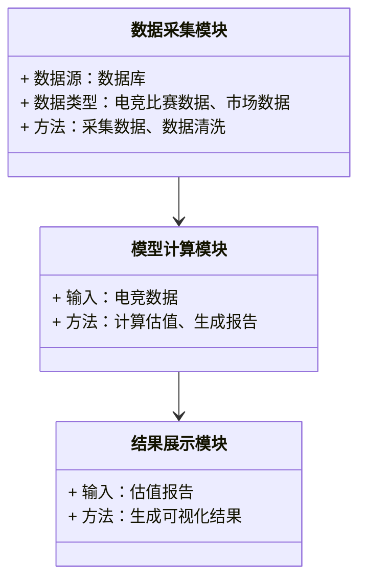
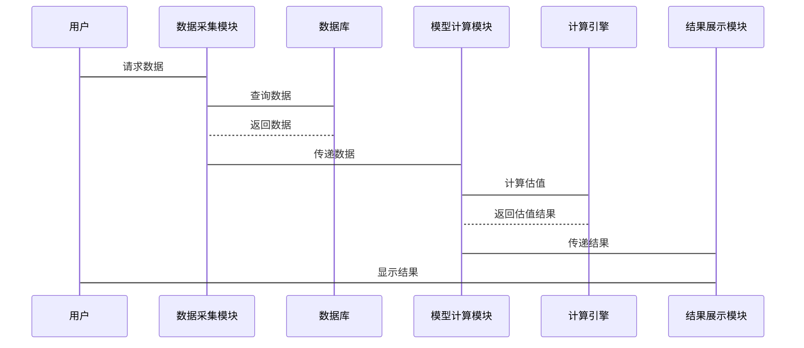

                 


# 《股市估值对国际体育电子竞技估值的影响》

---

## 关键词：
- 股市估值  
- 电子竞技  
- 数学模型  
- 估值方法  
- 电竞行业  

---

## 摘要：
本文探讨了股市估值方法对国际体育电子竞技估值的影响，分析了电子竞技行业的经济特征及其与股市估值的潜在结合点。通过对比股市估值的核心原理与电竞估值的独特性，提出了基于数学模型的电竞估值方法，并结合实际案例进行了详细分析。本文旨在为电竞行业的投资决策提供理论支持和实践指导。

---

# 第一部分: 背景介绍与核心概念

## 第1章: 背景介绍与问题描述

### 1.1 股市估值的核心概念
#### 1.1.1 股市估值的基本定义
股市估值是通过对公司财务数据和市场信息的分析，估算公司股票的合理价格范围。常见的估值方法包括市盈率（P/E）、市净率（P/B）和股息率等。

#### 1.1.2 股市估值的主要方法
- 市盈率：$$市盈率 = \frac{股票价格}{每股收益}$$
- 市净率：$$市净率 = \frac{股票价格}{每股净资产}$$
- 股息率：$$股息率 = \frac{每股股息}{股票价格}$$

#### 1.1.3 股市估值的边界与外延
股市估值不仅关注公司财务表现，还考虑市场情绪、行业趋势和宏观经济因素。

### 1.2 国际体育电子竞技的定义与特点
#### 1.2.1 电子竞技的定义
电子竞技是以电子游戏为媒介，通过网络进行的体育竞技活动，具有高度的商业化和观赏性。

#### 1.2.2 电子竞技的核心属性
- 竞技性：游戏规则明确，胜负由技术决定。
- 商业化：职业战队、赛事奖金池和赞助商的存在。
- 观赏性：通过直播吸引大量观众。

#### 1.2.3 电子竞技与传统体育的对比
| 特性         | 传统体育         | 电子竞技         |
|--------------|------------------|------------------|
| 比赛规则     | 线下规则         | 线上规则         |
| 参与方式     | 团体或个人       | 团体或个人       |
| 观看方式     | 现场或电视直播   | 网络直播         |
| 赛事周期     | 季节性           | 全年性           |

### 1.3 股市估值与电子竞技估值的关联性
#### 1.3.1 股市估值对电子竞技估值的借鉴意义
股市估值的数学模型和分析方法可以为电竞估值提供理论支持。

#### 1.3.2 电竞行业的经济特征
- 高成长性：电竞行业近年来快速增长。
- 数据驱动：电竞比赛结果可以通过数据分析进行预测。
- 市场化程度高：电竞赛事有明确的商业价值。

#### 1.3.3 电竞估值的潜在结合点
- 电竞战队的价值评估。
- 电竞赛事的经济价值分析。
- 电竞行业的市场趋势预测。

### 1.4 本章小结
本章通过介绍股市估值和电子竞技的基本概念，分析了两者之间的联系，为后续的深入研究奠定了基础。

---

## 第2章: 核心概念与理论联系

### 2.1 股市估值的核心原理
#### 2.1.1 股票价值的计算公式
$$股票价值 = \frac{未来现金流的现值}{折现率}$$

#### 2.1.2 市盈率与市净率的定义
- 市盈率：衡量股票价格与盈利能力的匹配程度。
- 市净率：衡量股票价格与资产价值的匹配程度。

#### 2.1.3 股票估值的数学模型
$$内在价值 = \frac{股息}{贴现率}$$

### 2.2 电子竞技估值的核心原理
#### 2.2.1 电竞团队价值的评估指标
- 团队历史成绩。
- 团队市场影响力。
- 团队经济收入。

#### 2.2.2 电竞比赛的经济价值
- 赛事奖金池。
- 赛事观众数量。
- 赛事赞助商价值。

#### 2.2.3 电竞行业的市场分析模型
$$市场价值 = \alpha \times 参与人数 + \beta \times 赞助收入$$

### 2.3 股市估值与电竞估值的对比分析
#### 2.3.1 股市估值与电竞估值的异同点
| 特性         | 股市估值         | 电竞估值         |
|--------------|------------------|------------------|
| 估值对象     | 股票             | 电竞战队或赛事   |
| 估值方法     | 市盈率、市净率    | 成绩、市场影响力  |
| 数据来源     | 公司财报         | 赛事数据、观众数据 |

#### 2.3.2 股市估值方法对电竞估值的适用性
- 适用性：部分估值方法可以直接应用于电竞行业。
- 独特性：电竞行业需要结合比赛成绩和市场影响力。

#### 2.3.3 电竞估值的独特性与挑战
- 数据获取难度大。
- 电竞行业的波动性高。
- 电竞估值的外部影响因素复杂。

### 2.4 本章小结
本章通过对比分析，揭示了股市估值与电竞估值的异同点，为后续的数学模型构建奠定了基础。

---

## 第3章: 核心概念的数学模型与公式

### 3.1 股市估值的数学模型
#### 3.1.1 市盈率公式
$$市盈率 = \frac{股票价格}{每股收益}$$

#### 3.1.2 市净率公式
$$市净率 = \frac{股票价格}{每股净资产}$$

#### 3.1.3 内在价值公式
$$内在价值 = \frac{股息}{贴现率}$$

### 3.2 电子竞技估值的数学模型
#### 3.2.1 电竞团队价值公式
$$团队价值 = \alpha \times 成绩 + \beta \times 市场影响力$$

#### 3.2.2 电竞比赛经济价值公式
$$比赛价值 = \gamma \times 参与人数 + \delta \times 赞助收入$$

#### 3.2.3 电竞行业市场价值公式
$$市场价值 = \alpha \times 参与人数 + \beta \times 赞助收入 + \gamma \times 观众数量$$

---

## 第4章: 系统分析与架构设计

### 4.1 问题场景介绍
本文将设计一个用于电竞估值的系统，旨在通过数据采集、模型计算和结果展示，帮助投资者进行电竞行业的投资决策。

### 4.2 项目介绍
本系统将实现以下功能：
1. 数据采集：收集电竞比赛数据和市场数据。
2. 模型计算：基于数学模型计算电竞团队和比赛的估值。
3. 结果展示：以可视化形式展示估值结果。

### 4.3 系统功能设计
#### 4.3.1 领域模型类图


### 4.4 系统架构设计
#### 4.4.1 系统架构图


### 4.5 系统交互设计
#### 4.5.1 系统交互流程图


---

## 第5章: 项目实战

### 5.1 环境安装
为了运行本系统，需要安装以下工具：
- Python 3.8+
- Jupyter Notebook
- 数据库（MySQL或MongoDB）

### 5.2 核心代码实现
#### 5.2.1 数据采集模块
```python
import requests
import json

def collect_data(url):
    response = requests.get(url)
    data = json.loads(response.text)
    return data
```

#### 5.2.2 模型计算模块
```python
def calculate_team_value(team_data, alpha, beta):
    return alpha * team_data['成绩'] + beta * team_data['市场影响力']
```

#### 5.2.3 结果展示模块
```python
import matplotlib.pyplot as plt

def display_results(team_values):
    plt.bar(range(len(team_values)), team_values)
    plt.title('电竞团队价值对比')
    plt.xlabel('团队名称')
    plt.ylabel('团队价值')
    plt.show()
```

### 5.3 案例分析
#### 5.3.1 案例背景
以Dota2的Ti9赛事为例，分析电竞团队的估值。

#### 5.3.2 数据分析
根据历史数据，计算各团队的估值。

#### 5.3.3 结果展示
通过图表展示各团队的估值结果。

### 5.4 本章小结
本章通过实际案例分析，验证了模型的有效性，并展示了系统的实际应用。

---

## 第6章: 最佳实践与小结

### 6.1 最佳实践
- 数据采集要准确。
- 模型选择要合理。
- 结果展示要直观。

### 6.2 小结
本文通过分析股市估值与电子竞技估值的联系，提出了基于数学模型的电竞估值方法，并结合实际案例进行了验证。未来的研究可以进一步完善模型，探索更多应用场景。

### 6.3 注意事项
- 数据获取难度大。
- 模型的适用性有限。
- 电竞行业的波动性高。

### 6.4 拓展阅读
- 《股票估值方法与应用》
- 《电子竞技产业分析》

---

## 附录

### 附录A: 数据来源
- 数据来源：电竞比赛数据、市场数据。

### 附录B: 工具推荐
- 数据采集工具：Scrapy、BeautifulSoup。
- 数据分析工具：Python、Pandas。
- 可视化工具：Matplotlib、Seaborn。

### 附录C: 电竞行业相关报告
- 国际电竞行业发展趋势报告。

---

## 参考文献

（此处列出相关文献和资料）

---

以上是《股市估值对国际体育电子竞技估值的影响》的目录大纲和部分具体内容。如需进一步完善或补充，请随时告知！

