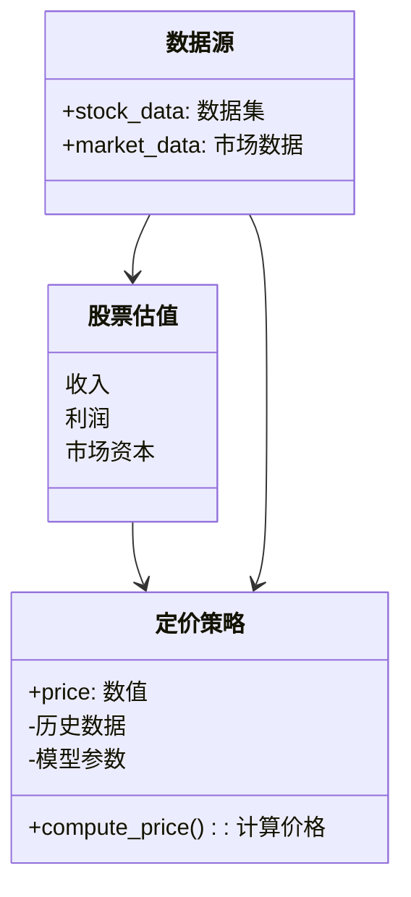

                 


# 股市估值对跨境数字服务定价的影响

> **关键词**：股市估值、跨境数字服务、定价模型、股票定价、数字服务定价、算法分析

> **摘要**：本文探讨了股市估值对跨境数字服务定价的影响，分析了股市估值的核心概念与定价模型之间的联系，结合实际案例和数学模型，深入剖析了跨境数字服务定价的关键因素及其实现机制，为读者提供了从理论到实践的全面指导。

---

# 第1章：背景介绍

## 1.1 股市估值的基本概念

股市估值是通过对上市公司财务数据和市场因素的分析，评估其股票的内在价值。核心要素包括：

1. **市场数据**：如股价、成交量等，反映市场参与者的交易行为。
2. **财务数据**：如收入、利润、现金流等，是评估公司价值的基础。
3. **市场假设**：如无风险利率、风险溢价，影响折现率的计算。

## 1.2 跨境数字服务的特点

跨境数字服务涉及跨国交易，具有以下特点：

1. **服务范围**：覆盖多个市场，用户分布广泛。
2. **价格敏感性**：价格弹性较高，受市场波动影响较大。
3. **竞争环境**：国际竞争激烈，价格受全球市场影响。

## 1.3 股市估值与跨境数字服务的关系

股市估值通过影响市场预期和投资者情绪，直接或间接影响跨境数字服务的定价。例如，股市波动可能导致服务提供商调整定价策略以适应市场需求。

---

# 第2章：核心概念与联系

## 2.1 股市估值的核心原理

### 2.1.1 股市估值的关键模型

1. **市盈率模型**：通过比较股票价格与每股收益的比率来评估股票价值。
2. **市净率模型**：比较股票价格与每股净资产的比率，适用于资产密集型行业。
3. **现金流折现模型**：通过未来现金流的现值来评估企业整体价值。

### 2.1.2 股市估值与定价的联系

股市估值不仅影响股票价格，还影响企业的定价策略。例如，高市盈率可能意味着市场对公司未来增长的预期较高，从而影响其服务定价。

## 2.2 跨境数字服务定价的影响因素

1. **市场需求**：不同市场的消费者行为差异影响定价策略。
2. **成本结构**：包括研发投入、运营成本等，影响定价的下限。
3. **竞争环境**：竞争对手的定价策略直接影响企业的定价决策。

---

# 第3章：算法原理讲解

## 3.1 基于回归分析的股市估值模型

### 3.1.1 回归分析的实现步骤

1. **数据收集**：获取相关财务数据和市场数据。
2. **特征选择**：筛选影响股票价值的关键变量。
3. **模型训练**：使用回归算法拟合数据。
4. **模型评估**：通过交叉验证评估模型的准确性。

### 3.1.2 Python代码实现

```python
import pandas as pd
import numpy as np
from sklearn.linear_model import LinearRegression
from sklearn.model_selection import train_test_split
from sklearn.metrics import mean_squared_error

# 数据加载
data = pd.read_csv('stock_data.csv')

# 特征与目标变量分离
X = data[['revenue', 'profit', 'market_cap']]
y = data['price']

# 数据分割
X_train, X_test, y_train, y_test = train_test_split(X, y, test_size=0.2, random_state=42)

# 模型训练
model = LinearRegression()
model.fit(X_train, y_train)

# 预测与评估
y_pred = model.predict(X_test)
mse = mean_squared_error(y_test, y_pred)
print(f'均方误差: {mse}')
```

---

# 第4章：数学模型与定价分析

## 4.1 股市估值的数学模型

### 4.1.1 市盈率模型

$$ P/E = \frac{P}{E} $$

其中，P为股票价格，E为每股收益。

### 4.1.2 现金流折现模型

$$ V = \sum_{t=1}^{n} \frac{CF_t}{(1+r)^t} $$

其中，CF_t为第t年的现金流，r为折现率。

## 4.2 跨境数字服务定价的数学模型

$$ P = \alpha E + \beta $$

其中，P为定价，α和β为模型参数，E为相关变量。

---

# 第5章：系统分析与架构设计

## 5.1 问题场景介绍

跨境数字服务定价系统需要处理多市场数据，实时调整定价策略，确保价格在不同市场中具有竞争力。

## 5.2 系统功能设计

### 5.2.1 领域模型设计（Mermaid 类图）



## 5.3 系统架构设计（Mermaid 架构图）


---

# 第6章：项目实战

## 6.1 环境安装

安装必要的Python库，如Pandas、NumPy、Scikit-learn。

## 6.2 核心代码实现

```python
import pandas as pd
import numpy as np
from sklearn.linear_model import LinearRegression
from sklearn.model_selection import train_test_split
from sklearn.metrics import mean_squared_error

# 数据加载
data = pd.read_csv('stock_data.csv')

# 特征与目标变量分离
X = data[['revenue', 'profit', 'market_cap']]
y = data['price']

# 数据分割
X_train, X_test, y_train, y_test = train_test_split(X, y, test_size=0.2, random_state=42)

# 模型训练
model = LinearRegression()
model.fit(X_train, y_train)

# 预测与评估
y_pred = model.predict(X_test)
mse = mean_squared_error(y_test, y_pred)
print(f'均方误差: {mse}')
```

---

# 第7章：总结与展望

## 7.1 最佳实践 tips

- 定期更新模型，适应市场变化。
- 结合实际业务场景，优化定价策略。

## 7.2 小结

本文通过理论分析和实际案例，深入探讨了股市估值对跨境数字服务定价的影响，为读者提供了从理论到实践的全面指导。

## 7.3 注意事项

- 数据质量影响模型准确性。
- 模型需定期更新，以反映市场变化。

## 7.4 拓展阅读

建议阅读相关书籍和论文，深入理解股市估值和定价策略的最新研究。

---

通过以上分析，我们详细探讨了股市估值对跨境数字服务定价的影响，结合理论与实践，为读者提供了全面的指导。

