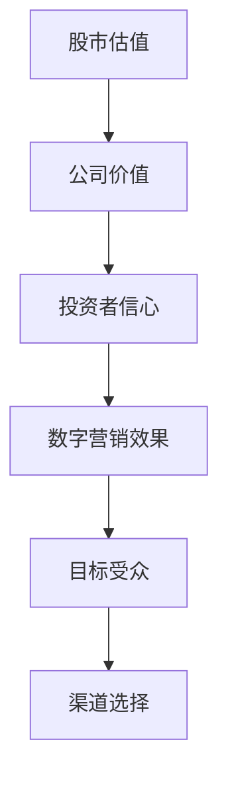
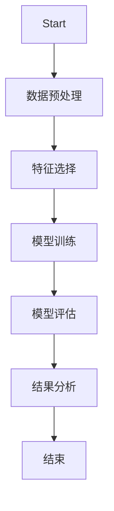
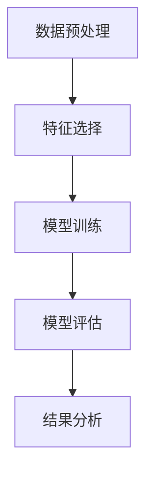

                 


# 股市估值对跨境数字营销效果评估的影响

> 关键词：股市估值、数字营销、效果评估、数据建模、机器学习

> 摘要：本文探讨股市估值如何影响跨境数字营销的效果评估。通过分析股市波动对营销预算和策略的影响，结合机器学习模型，提出一套跨学科的评估方法，帮助企业在复杂市场环境中优化数字营销策略。

---

## 第一部分：背景介绍

### 第1章：股市估值与跨境数字营销概述

#### 1.1 问题背景

- **股市估值的基本概念**：股市估值是通过市盈率、市净率等指标评估公司价值的过程。这些指标反映了市场的信心和公司潜力。
- **跨境数字营销的定义与特点**：跨境数字营销指通过数字渠道进行跨国营销活动，具有实时性、数据驱动性和全球化的特点。
- **问题解决**：股市波动影响公司预算，进而影响营销效果。如何量化这种影响，优化营销策略，是本文的核心问题。

#### 1.2 核心概念

- **核心要素**：
  - 股市估值：市盈率（P/E）、市净率（P/B）、股息率等。
  - 数字营销：点击率（CTR）、转化率、投资回报率（ROI）。
  - 边界与外延：聚焦于股市波动对营销预算的影响，延伸至消费者行为分析。

---

## 第二部分：核心概念与联系

### 第2章：股市估值与数字营销的关系

#### 2.1 核心概念原理

- **股市估值的驱动因素**：宏观经济、公司业绩、市场情绪等。
- **数字营销效果的评估指标**：如广告点击率、转化率等。

#### 2.2 概念属性特征对比

| 概念         | 特性                | 示例指标         |
|--------------|---------------------|------------------|
| 股市估值     | 市盈率、市净率       | 影响投资者信心    |
| 数字营销效果 | 点击率、转化率       | 影响企业收入增长 |

#### 2.3 ER实体关系图



---

## 第三部分：算法原理讲解

### 第3章：评估模型的构建与算法

#### 3.1 算法原理

- **回归分析**：用于预测股市估值对营销效果的影响。
  $$ y = \beta_0 + \beta_1x_1 + \beta_2x_2 + \epsilon $$
  其中，\( y \) 是营销 ROI，\( x_1 \) 是市盈率，\( x_2 \) 是市净率。

- **机器学习模型**：随机森林用于分类任务，预测营销活动的成功概率。

#### 3.2 算法流程图



#### 3.3 Python 实现

```python
import pandas as pd
from sklearn.ensemble import RandomForestClassifier
from sklearn.metrics import accuracy_score

# 示例数据加载
data = pd.read_csv('marketing_data.csv')

# 特征与目标变量
X = data[['市盈率', '市净率']]
y = data['营销成功']  # 0或1

# 模型训练
model = RandomForestClassifier()
model.fit(X, y)

# 预测与评估
predicted = model.predict(X)
print("准确率:", accuracy_score(y, predicted))
```

---

## 第四部分：系统分析与架构设计

### 第4章：系统架构与实现

#### 4.1 系统架构图



#### 4.2 接口设计

- 数据输入接口：接收实时股市数据和营销数据。
- 模型接口：调用训练好的模型进行预测。
- 结果输出接口：返回预测结果和优化建议。

---

## 第五部分：项目实战

### 第5章：项目实战与案例分析

#### 5.1 环境安装

```bash
pip install pandas sklearn matplotlib
```

#### 5.2 核心代码实现

```python
import pandas as pd
import matplotlib.pyplot as plt

# 数据可视化
data = pd.read_csv('marketing_data.csv')
plt.scatter(data['市盈率'], data['营销ROI'])
plt.xlabel('市盈率')
plt.ylabel('营销ROI')
plt.title('市盈率与营销ROI的关系')
plt.show()
```

#### 5.3 案例分析

- 数据预处理：清洗和转换数据，确保模型输入。
- 模型训练：使用历史数据训练模型，评估准确率。
- 结果分析：根据预测结果优化营销策略。

---

## 第六部分：最佳实践

### 第6章：总结与建议

#### 6.1 小结

- 股市估值与数字营销的结合为企业提供了新的视角。
- 机器学习模型能有效预测和优化营销效果。

#### 6.2 注意事项

- 数据质量至关重要，需确保数据准确性和完整性。
- 模型需定期更新，以适应市场变化。

#### 6.3 拓展阅读

- 推荐书籍：《金融时间序列分析》、《数据驱动的营销策略》
- 在线课程：Coursera上的相关机器学习课程。

---

通过以上结构，本文系统地探讨了股市估值对跨境数字营销的影响，提供了理论支持和实践指导，帮助企业优化营销策略，提升投资回报。

