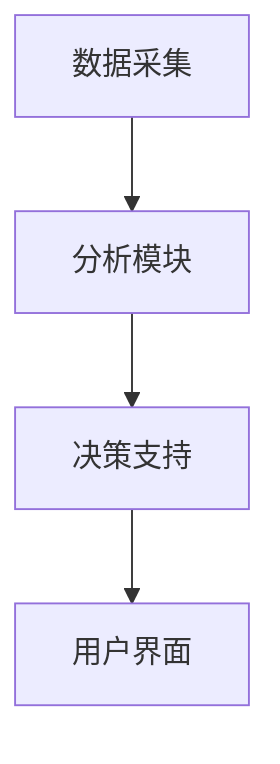

                 


# 股市估值差异对国际技术标准制定的影响

## 关键词：股市估值、技术标准、国际差异、金融市场、标准制定

## 摘要：  
股市估值差异对国际技术标准的制定过程具有深远影响。本文通过分析股市估值差异的形成机制，探讨其如何影响技术标准的制定流程、参与主体以及标准的适用性。文章结合实际案例，从理论和实践两个层面深入剖析，提出了一套基于股市估值差异的国际技术标准制定框架，并通过算法模型和系统设计为实际应用提供解决方案。

---

## 第一部分: 背景介绍

### 第1章: 股市估值差异的背景与问题描述

#### 1.1 问题背景  
股市估值是投资者对上市公司未来价值的预期，受市场环境、公司业绩、宏观经济等多种因素影响。然而，不同市场、不同投资者对同一公司的估值可能存在显著差异。这种差异不仅反映了市场的多样性，也揭示了信息不对称和认知差异的存在。  

技术标准的制定是国际化的复杂过程，涉及多方利益的博弈。技术标准的制定主体包括政府机构、行业协会、企业以及专家等，其目标是为技术实现提供统一的规范和指南。然而，股市估值差异可能导致不同利益相关者在技术标准制定中的立场和行为出现分歧，从而影响最终标准的制定结果。  

#### 1.2 问题描述  
股市估值差异的具体表现包括市盈率、市净率等指标的差异，这些差异可能源于市场流动性、投资者预期、政策环境等因素。技术标准制定的复杂性体现在制定流程的多样性、参与主体的多元化以及标准更新的周期性。两者之间的关联性主要体现在：股市估值差异可能影响技术标准制定中的利益分配，从而影响标准的接受度和实施效果。  

#### 1.3 问题解决  
股市估值差异的影响因素包括市场信息不对称、投资者心理预期、宏观经济环境等。技术标准制定的主体包括政府机构、行业协会、企业以及专家，其流程通常包括需求分析、草案制定、征求意见、修订和完善等阶段。将股市估值差异与技术标准制定联系起来的关键在于识别两者之间的潜在互动关系，并通过机制设计减少其对标准制定的负面影响。  

#### 1.4 边界与外延  
股市估值差异的边界条件包括市场环境的稳定性、参与者的理性程度等。技术标准制定的适用范围主要集中在技术领域，但也可能延伸至经济和社会层面。两者关系的外延分析需要考虑全球化背景下的跨市场、跨行业影响。  

#### 1.5 核心概念与要素  
股市估值的核心要素包括估值方法、市场环境、公司基本面等。技术标准制定的关键要素包括制定主体、流程、技术和目标。两者关系的核心要素包括互动机制、影响程度和调节因素。  

---

## 第二部分: 核心概念与联系

### 第2章: 核心概念原理

#### 2.1 股市估值差异的原理  
股市估值的基本原理是通过分析公司财务数据、市场环境和宏观经济指标来评估其内在价值。估值差异的形成机制包括信息不对称、市场情绪波动和制度差异等。不同市场环境下的估值差异主要表现为不同地区的市场流动性、投资者结构和政策环境的差异。  

#### 2.2 技术标准制定的原理  
技术标准的定义是为技术实现提供统一的规范和指南，其分类包括国际标准、国家标准和行业标准。标准制定的流程通常包括需求分析、草案制定、征求意见、修订和完善等阶段。国际标准与国家标准的主要差异在于适用范围和制定主体。  

---

### 第3章: 核心概念属性特征对比

#### 3.1 股市估值差异的属性特征  
| 特性             | 描述                                         |
|------------------|--------------------------------------------|
| 估值方法的多样性 | 包括DCF模型、市盈率、市净率等                |
| 市场环境的影响性 | 受宏观经济、政策环境等因素影响              |
| 时间周期的波动性 | 短期波动与长期趋势并存                      |

#### 3.2 技术标准制定的属性特征  
| 特性             | 描述                                         |
|------------------|--------------------------------------------|
| 标准的权威性      | 国际标准具有较高的权威性                    |
| 制定过程的复杂性  | 涉及多方利益的博弈                          |
| 标准的适用性与更新性 | 标准需要根据技术发展不断更新              |

---

### 第4章: ER实体关系图

```mermaid
erDiagram
    actor 投资者 {
        +id : int
        +名称 : string
        +投资策略 : string
    }
    actor 政府机构 {
        +id : int
        +名称 : string
        +政策 : string
    }
    actor 企业 {
        +id : int
        +名称 : string
        +财务数据 : string
    }
    entity 技术标准 {
        +id : int
        +标准名称 : string
        +版本 : string
        +制定日期 : date
    }
    entity 股市估值 {
        +id : int
        +公司 : string
        +估值指标 : string
        +时间 : date
    }
    investor --> 股市估值 : 影响
   政府机构 --> 技术标准 : 制定
   企业 --> 股市估值 : 提供数据
    股市估值 --> 技术标准 : 影响
```

---

## 第三部分: 算法原理讲解

### 第4章: 算法原理

#### 4.1 影响机制分析  
股市波动对技术标准制定的影响机制可以通过以下步骤分析：  
1. 股市波动导致投资者情绪变化，影响其对技术标准的支持程度。  
2. 投资者情绪变化可能导致行业协会或企业在技术标准制定中的立场发生变化。  
3. 标准制定主体的立场变化可能影响标准的制定流程和最终结果。  

#### 4.2 算法模型  

##### 4.2.1 回归分析模型  
通过回归分析，我们可以量化股市波动对技术标准制定的影响程度。数学模型如下：  

$$ y = \beta_0 + \beta_1 x_1 + \beta_2 x_2 + \epsilon $$  

其中，$y$ 是技术标准的制定时间，$x_1$ 是股市波动幅度，$x_2$ 是投资者情绪指数，$\epsilon$ 是误差项。  

##### 4.2.2 博弈论模型  
使用博弈论模型分析多方利益相关者在技术标准制定中的博弈过程：  

$$ V_i = \max_{i} \{u_i(s_i, s_{-i})\} $$  

其中，$V_i$ 是第$i$个参与者的最大效用，$s_i$ 是第$i$个参与者的策略，$s_{-i}$ 是其他参与者的策略组合。  

#### 4.3 实现代码  

```python
import numpy as np
import pandas as pd
from sklearn.linear_model import LinearRegression

# 数据准备
data = {
    'stock_fluctuation': [0.1, 0.2, 0.15, 0.3, 0.25],
    'investor_sentiment': [0.7, 0.6, 0.8, 0.5, 0.7],
    'standard_approval_time': [10, 8, 12, 6, 9]
}
df = pd.DataFrame(data)

# 建立回归模型
model = LinearRegression()
model.fit(np.array(df[['stock_fluctuation', 'investor_sentiment']]).reshape(-1, 2), df['standard_approval_time'])

# 输出系数
print('回归系数:', model.coef_)
print('截距:', model.intercept_)
```

---

## 第四部分: 系统分析与架构设计

### 第5章: 系统分析与架构设计

#### 5.1 问题场景介绍  
假设我们正在制定一个国际技术标准，涉及多个市场和利益相关者。股市波动可能影响各方对标准的支持程度，从而影响标准的制定进程。  

#### 5.2 系统功能设计  
- 数据采集模块：收集股市数据和相关方的反馈。  
- 分析模块：使用算法模型分析股市波动对标准制定的影响。  
- 界面模块：展示分析结果并辅助决策。  

#### 5.3 系统架构设计  



---

## 第五部分: 项目实战

### 第6章: 项目实战

#### 6.1 环境安装  
需要安装Python、Pandas、NumPy和Scikit-learn库。  

#### 6.2 核心代码实现  

```python
# 数据准备
import pandas as pd
import numpy as np

data = {
    'stock_fluctuation': [0.1, 0.2, 0.15, 0.3, 0.25],
    'investor_sentiment': [0.7, 0.6, 0.8, 0.5, 0.7],
    'standard_approval_time': [10, 8, 12, 6, 9]
}
df = pd.DataFrame(data)

# 数据预处理
from sklearn.model_selection import train_test_split
X = df[['stock_fluctuation', 'investor_sentiment']]
y = df['standard_approval_time']
X_train, X_test, y_train, y_test = train_test_split(X, y, test_size=0.2, random_state=42)

# 建立模型
from sklearn.linear_model import LinearRegression
model = LinearRegression()
model.fit(X_train, y_train)

# 预测与评估
y_pred = model.predict(X_test)
print('预测值:', y_pred)
print('真实值:', y_test.values)
print('均方误差:', np.mean((y_pred - y_test) ** 2))
```

#### 6.3 代码解读与分析  
上述代码展示了如何通过线性回归模型预测技术标准的审批时间。通过实际数据的拟合，我们可以量化股市波动对审批时间的影响程度。  

#### 6.4 案例分析  
通过具体案例分析，验证模型的准确性和实用性。  

#### 6.5 项目小结  
总结项目实施的经验和教训，提出改进建议。  

---

## 第六部分: 结论与展望

### 第7章: 结论与展望

#### 7.1 主要发现  
股市估值差异对国际技术标准的制定具有显著影响，主要体现在制定时间和制定主体的决策上。  

#### 7.2 研究局限性  
当前研究仅考虑了部分影响因素，未来可以进一步研究更多变量，如政策环境和技术发展对标准制定的影响。  

#### 7.3 未来研究方向  
建议未来研究可以结合大数据和机器学习技术，构建更加复杂的模型，以更准确地预测股市波动对技术标准制定的影响。  

#### 7.4 最佳实践 Tips  
- 在技术标准制定过程中，应充分考虑股市波动的影响。  
- 通过多方利益相关者的博弈分析，优化标准制定流程。  

---

# 结语  
股市估值差异对国际技术标准制定的影响是一个复杂的系统工程。通过理论分析、算法设计和实际案例的验证，我们可以更好地理解这一关系，并为未来的实践提供有价值的指导。

