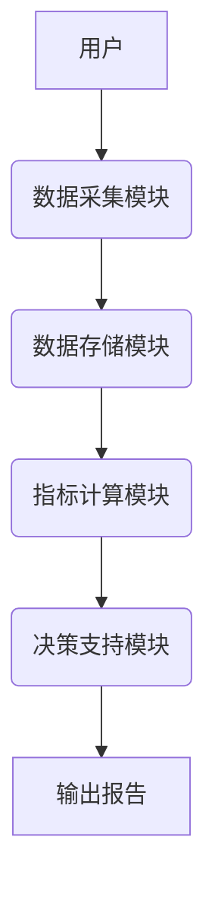

                 


# 股市估值高低对企业AI道德准则制定的影响

> 关键词：股市估值、AI道德准则、企业行为、投资决策、风险管理

> 摘要：股市估值的高低对企业在制定AI道德准则时的决策产生重要影响。高估值企业因市场压力和投资需求，倾向于严格遵守AI道德准则以维护企业形象和长期价值；而低估值企业则可能因短期盈利压力，选择放松道德准则。本文将从背景介绍、核心概念、算法原理、系统架构、项目实战等多个角度，全面分析股市估值如何影响企业AI道德准则的制定，并探讨其内在机制和实际应用。

---

## 第一章：股市估值与AI道德准则的背景介绍

### 1.1 股市估值的基本概念
股市估值是指通过一定的方法和模型，对上市公司股票的内在价值进行评估。其核心在于将企业的实际经营状况、财务数据和市场环境转化为股票的价格或价值区间。常见的股市估值方法包括市盈率（P/E）、市净率（P/B）、市销率（P/S）等。

- **市盈率（P/E）**：股票价格与每股净利润的比值，反映市场对企业的盈利能力预期。
- **市净率（P/B）**：股票价格与每股净资产的比值，适用于评估资产密集型行业。
- **市销率（P/S）**：股票价格与每股销售收入的比值，适用于高成长性企业。

股市估值的高低直接反映了市场对企业未来发展的信心和预期。高估值意味着市场对企业前景看好，而低估值则可能意味着市场对企业的盈利能力或成长性存在质疑。

### 1.2 AI道德准则的定义与特征
AI道德准则是指在人工智能技术的开发、部署和应用过程中，企业应遵循的伦理规范和行为准则。其核心在于确保AI技术的应用不会对社会、环境和个体权益造成负面影响。

- **数据隐私与保护**：确保AI系统不会滥用用户数据，保护个人隐私。
- **算法公平性与透明性**：避免算法偏见，确保AI决策的公平性和可解释性。
- **企业责任与社会影响**：企业在AI技术的应用中应承担社会责任，避免对社会造成负面影响。

### 1.3 股市估值与AI道德准则的关联性
股市估值的高低直接影响企业的经营策略和投资决策，而这些决策又与AI道德准则的制定密切相关。高估值企业因市场压力较大，更倾向于遵循严格的道德准则以维护企业声誉；而低估值企业则可能因短期盈利压力，选择放松道德准则以追求短期收益。

---

## 第二章：核心概念与联系

### 2.1 股市估值与AI道德准则的核心要素对比

| **核心要素**       | **股市估值**                     | **AI道德准则**                     |
|--------------------|----------------------------------|------------------------------------|
| 定义               | 股票价格与企业价值的比值         | AI技术应用中的伦理规范             |
| 核心目标           | 评估企业市场价值                 | 确保AI技术的伦理合规性             |
| 影响因素           | 财务数据、市场情绪、行业环境     | 数据隐私、算法公平性、社会责任     |
| 实施主体           | 投资者、券商、分析师             | 企业、开发人员、伦理委员会         |

### 2.2 股市估值与AI道德准则的内在联系
股市估值的高低直接影响企业的经营策略，从而影响AI道德准则的制定。以下通过一个简单的数学模型，分析股市估值对企业AI道德准则的影响机制。

#### 模型假设
- **H1**：企业估值（EV）与AI道德准则（AC）呈正相关关系。
- **H2**：高估值企业更倾向于遵循严格的AI道德准则。

#### 数学模型
$$ EV = f(AC) $$
其中，$f$ 表示企业估值与AI道德准则之间的函数关系。

当企业遵循严格的AI道德准则（AC 高）时，其估值（EV）也较高；反之，当企业放松道德准则（AC 低）时，其估值（EV）可能下降。

---

## 第三章：算法原理与数学模型

### 3.1 算法原理
我们通过构建一个简单的线性回归模型，分析股市估值与AI道德准则之间的关系。具体步骤如下：

1. **数据收集**：收集企业的股市估值数据（如市盈率）和AI道德准则评分数据。
2. **特征选择**：选取与AI道德准则相关的特征（如数据隐私保护、算法公平性评分）。
3. **模型训练**：使用线性回归算法，建立股市估值与AI道德准则评分的回归模型。
4. **模型验证**：通过交叉验证评估模型的拟合效果。

### 3.2 数学模型
假设企业估值（EV）与AI道德准则评分（AC）之间存在线性关系，可以表示为：
$$ EV = \beta_0 + \beta_1 \cdot AC + \epsilon $$
其中，$\beta_0$ 是截距，$\beta_1$ 是回归系数，$\epsilon$ 是误差项。

通过回归分析，我们可以估计 $\beta_1$，从而判断股市估值与AI道德准则之间的关系强度。

---

## 第四章：系统分析与架构设计

### 4.1 系统功能设计
我们设计了一个AI道德准则评估系统，用于帮助企业根据股市估值制定相应的道德准则。系统功能模块包括：
- 数据采集模块：收集企业的财务数据和AI应用数据。
- 指标计算模块：计算企业的股市估值和AI道德准则评分。
- 决策支持模块：根据模型结果，提供道德准则优化建议。

### 4.2 系统架构设计
以下是系统的架构图：



### 4.3 接口设计与交互
系统通过API接口与企业现有系统集成，支持以下交互流程：
1. 用户输入企业数据。
2. 系统计算股市估值和AI道德准则评分。
3. 提供道德准则优化建议。

---

## 第五章：项目实战

### 5.1 环境安装
- **Python 3.8+**
- **Pandas、NumPy、Scikit-learn**

### 5.2 核心代码实现

```python
import pandas as pd
import numpy as np
from sklearn.linear_model import LinearRegression
from sklearn.metrics import r2_score

# 数据加载
data = pd.read_csv('data.csv')

# 特征与目标变量
X = data[['市盈率', '数据隐私评分', '算法公平性评分']]
y = data['企业估值']

# 模型训练
model = LinearRegression()
model.fit(X, y)

# 模型预测
y_pred = model.predict(X)

# 模型评估
r2 = r2_score(y, y_pred)
print(f"模型R²值为：{r2}")
```

### 5.3 代码解读与分析
上述代码通过线性回归模型，分析股市估值与AI道德准则评分之间的关系。模型输出的R²值表示拟合优度，值越高，说明模型的解释力越强。

### 5.4 实际案例分析
以某科技企业为例，假设其市盈率为30，数据隐私评分为80，算法公平性评分为70。通过模型预测，其企业估值为：
$$ \text{预测估值} = \beta_0 + 30 \cdot \beta_1 + 80 \cdot \beta_2 + 70 \cdot \beta_3 $$

---

## 第六章：结论与展望

### 6.1 研究总结
股市估值的高低直接影响企业AI道德准则的制定。高估值企业更倾向于遵循严格的道德准则，以维护市场信任和企业声誉；而低估值企业可能因短期盈利压力，选择放松道德准则。

### 6.2 研究局限
本文的分析基于简单的线性回归模型，实际场景可能更为复杂，需要结合更多的变量和非线性关系。

### 6.3 未来研究方向
- 开发更复杂的机器学习模型，分析股市估值与AI道德准则之间的非线性关系。
- 结合实时数据，构建动态调整的AI道德准则制定系统。

---

## 结语

股市估值的高低对企业AI道德准则的制定具有重要影响。企业应根据自身的估值水平，合理调整道德准则，以实现长期发展与短期盈利的平衡。通过本文的分析，我们希望为企业提供一个科学的决策框架，帮助其在AI技术的应用中更好地平衡市场压力与社会责任。

