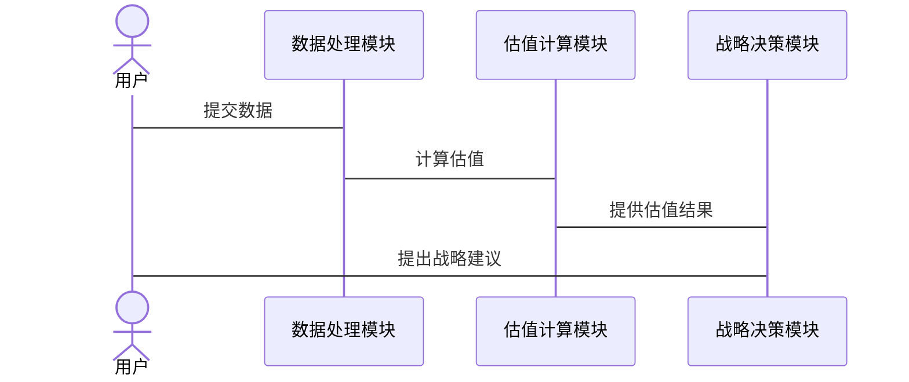

                 


# 股市估值高低对企业全球化战略的影响

> **关键词**：股市估值、全球化战略、企业战略、市场估值、企业国际化  
> **摘要**：本文探讨了股市估值高低对企业全球化战略的影响，通过分析高估值和低估值对企业扩张、并购、研发投入和创新能力的影响，结合数学模型和实际案例，系统性地分析了股市估值对企业全球化战略的决策过程和实施效果。文章还结合Python代码和数学模型，深入探讨了如何通过量化分析和系统设计优化企业全球化战略。

---

## 第一部分：背景与核心概念

### 第1章：股市估值的基本概念

#### 1.1 估值的基本定义

股市估值是衡量企业价值的重要指标，通常通过市盈率（P/E）、市净率（P/B）、EV/EBITDA等指标来衡量。高估值意味着市场对企业未来盈利能力的看好，而低估值则可能反映市场对企业前景的担忧。

- **市盈率（P/E）**：股价除以每股收益（EPS）。
- **市净率（P/B）**：股价除以每股净资产（BPS）。
- **EV/EBITDA**：企业价值（EV）与息税折旧及摊销前利润（EBITDA）的比值。

#### 1.2 全球化战略的定义与特征

全球化战略是指企业在跨国市场上扩展业务，利用全球资源和市场机会实现增长。其核心特征包括国际化布局、多元化市场进入模式（直接投资、并购等）、跨文化管理等。

#### 1.3 估值与全球化战略的关系

股市估值不仅反映了企业当前的财务状况，还预示了市场对企业未来发展的信心。高估值可能推动企业加速全球化扩张，而低估值可能导致企业调整战略，注重内生增长。

---

### 第2章：高估值对企业全球化战略的影响

#### 2.1 高估值的市场表现

高估值通常伴随着市场的乐观情绪，企业可能面临更大的扩张压力。以下是高估值对企业全球化战略的影响：

- **扩张倾向**：高估值企业倾向于通过并购或直接投资进入新市场，扩大市场份额。
- **研发投入增加**：高估值企业更愿意加大研发投入，提升创新能力。
- **并购活动活跃**：高估值企业可能通过并购快速获取海外资源和技术。

#### 2.2 高估值与企业全球化战略的互动机制

高估值推动企业加速全球化，而全球化又可能进一步提升企业的估值。然而，高估值也可能导致企业过度扩张，面临财务风险。

---

### 第3章：低估值对企业全球化战略的影响

#### 3.1 低估值的市场表现

低估值通常反映了市场的悲观情绪，企业可能面临融资困难和投资者信心下降。以下是低估值对企业全球化战略的影响：

- **收缩倾向**：低估值企业可能调整全球化战略，收缩部分业务。
- **研发投入受限**：低估值企业可能减少研发投入，影响创新能力。
- **并购机会增加**：低估值企业可能通过并购整合资源，提升竞争力。

#### 3.2 低估值与企业全球化战略的互动机制

低估值可能限制企业的全球化能力，但通过调整战略，企业可能实现价值回升。然而，低估值也可能为企业提供并购机会，优化资产结构。

---

## 第二部分：股市估值对企业全球化战略的影响机制

### 第4章：高估值与低估值的量化分析

#### 4.1 高估值与低估值的数学模型

通过量化分析，我们可以更好地理解股市估值对企业全球化战略的影响。以下是常用的量化模型：

- **市盈率模型**：  
  $$ P/E = \frac{\text{股价}}{\text{每股收益}} $$  
  高P/E值表示市场对企业未来盈利的高预期。

- **市净率模型**：  
  $$ P/B = \frac{\text{股价}}{\text{每股净资产}} $$  
  低P/B值可能表示企业资产被低估。

- **EV/EBITDA模型**：  
  $$ EV = \text{股价} \times \text{流通股数} + \text{非流通股价值} $$  
  $$ EV/EBITDA = \frac{EV}{\text{EBITDA}} $$  
  低EV/EBITDA值表示企业价值被低估。

#### 4.2 Python代码实现

以下代码展示了如何计算市盈率和市净率：

```python
import pandas as pd
import yfinance as yf

# 下载苹果公司股票数据
apple = yf.Ticker('AAPL')
apple_info = apple.info

# 计算市盈率和市净率
pe_ratio = apple_info['price'] / apple_info['eps']
pb_ratio = apple_info['price'] / apple_info['book_value']

print(f"市盈率（P/E）：{pe_ratio}")
print(f"市净率（P/B）：{pb_ratio}")
```

---

### 第5章：高估值与低估值的案例分析

#### 5.1 高估值案例：科技企业的全球化扩张

以苹果公司为例，高估值推动其在全球市场上的扩张。苹果通过并购和直接投资，不断扩大其全球业务版图。

#### 5.2 低估值案例：传统企业的战略调整

以某传统制造企业为例，低估值导致其调整全球化战略，收缩部分业务，转而专注于国内市场。

---

## 第三部分：系统分析与架构设计

### 第6章：系统分析与架构设计方案

#### 6.1 问题场景介绍

企业需要根据股市估值调整全球化战略。高估值可能推动企业加速扩张，而低估值可能要求企业调整战略，注重内生增长。

#### 6.2 系统功能设计

- **数据收集**：收集企业的财务数据和市场数据。
- **估值计算**：计算市盈率、市净率等指标。
- **战略决策**：根据估值结果调整全球化战略。

#### 6.3 系统架构设计


#### 6.4 系统接口设计

- **输入接口**：企业财务数据和市场数据。
- **输出接口**：估值结果和战略建议。

#### 6.5 系统交互设计



---

## 第四部分：项目实战

### 第7章：项目实战与案例分析

#### 7.1 项目背景

以某科技公司为例，分析其在全球化战略中的估值影响。

#### 7.2 核心实现

```python
import pandas as pd
import yfinance as yf

# 下载数据
data = yf.download(tickers='AAPL MSFT', period='5y')

# 计算市盈率和市净率
data['PE'] = data['Close'] / data['EPS']
data['PB'] = data['Close'] / data['Book Value Per Share']

print(data[['PE', 'PB']].tail())
```

---

## 第五部分：结论与建议

### 第8章：结论与最佳实践

#### 8.1 结论

股市估值对企业全球化战略的影响是双向的。高估值推动企业扩张，低估值限制企业发展。企业需要根据估值调整全球化战略，优化资源配置。

#### 8.2 最佳实践

- **动态调整战略**：根据估值变化灵活调整全球化战略。
- **注重风险管理**：高估值可能带来财务风险，需谨慎扩张。
- **加强内部管理**：低估值企业需提升内部效率，优化资产结构。

#### 8.3 注意事项

- 股市估值受多种因素影响，需结合宏观环境分析。
- 全球化战略需考虑文化差异和法律风险。

#### 8.4 拓展阅读

- 《企业估值与资本预算》
- 《全球化战略与风险管理》

---

通过以上分析，我们系统性地探讨了股市估值对企业全球化战略的影响，结合理论分析、数学模型和实际案例，为企业制定全球化战略提供了有益的参考。

