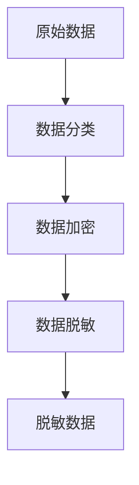
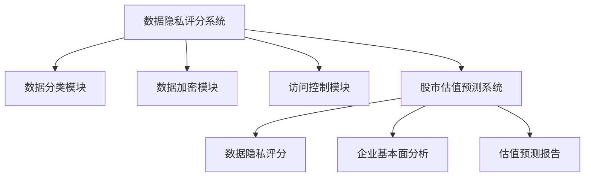

                 


# 股市估值高低对企业数据隐私保护投资的影响

## 关键词：股市估值，数据隐私保护，企业投资，数据安全，隐私评分，数据分类

## 摘要：随着数字化时代的到来，数据隐私保护已成为企业的重要资产。本文探讨股市估值高低对企业在数据隐私保护方面投资的影响，分析数据隐私保护与企业价值的关系，并通过数学模型和算法揭示数据隐私保护对企业估值的具体影响，为企业制定数据隐私保护策略提供科学依据。

---

## 第1章：背景介绍

### 1.1 问题背景

#### 1.1.1 数据隐私保护的重要性
数据隐私保护是企业在数字化转型中面临的核心挑战之一。企业的数据资产（如客户信息、财务数据、知识产权）是其核心竞争力的体现，一旦泄露，可能导致企业声誉受损、财务损失甚至法律风险。

#### 1.1.2 股市估值与企业价值的关系
股市估值是投资者对企业未来盈利能力的预期，通常通过市盈率（P/E）、市净率（P/B）等指标衡量。企业估值的高低直接影响投资者的信心和市场的资本分配。

#### 1.1.3 数据隐私与企业价值的关联
数据隐私保护不仅是合规要求，更是企业核心竞争力的体现。良好的数据隐私保护措施可以增强客户信任，降低运营风险，从而提升企业估值。

### 1.2 问题描述

#### 1.2.1 数据隐私保护对企业估值的影响
数据泄露可能导致企业估值大幅下降。例如，2018年Facebook因数据隐私问题股价一度下跌超过8%。

#### 1.2.2 投资者对数据隐私的关注
随着数据隐私法规（如GDPR）的普及，投资者越来越关注企业的数据隐私保护措施，这已成为投资决策的重要因素之一。

### 1.3 问题解决

#### 1.3.1 数据隐私保护的解决方案
- 数据分类与分级管理
- 加密技术的应用
- 访问控制策略

#### 1.3.2 提高企业估值的策略
- 加强数据隐私保护
- 提升数据治理能力
- 优化信息披露机制

### 1.4 边界与外延

#### 1.4.1 数据隐私保护的边界
- 数据隐私保护的范围（如员工数据、客户数据）
- 数据隐私保护的法律边界（如GDPR、CCPA）

#### 1.4.2 企业估值的外延
- 企业估值的行业差异
- 企业估值的市场波动

### 1.5 核心概念结构

#### 1.5.1 核心要素组成
- 数据资产
- 数据隐私保护措施
- 企业估值指标

---

## 第2章：核心概念与联系

### 2.1 核心概念原理

#### 2.1.1 数据隐私保护的原理
- 数据分类与分级
- 数据加密与脱敏
- 访问控制

#### 2.1.2 股市估值的计算方法
- 市盈率（P/E）= 股价 / 每股净利润
- 市净率（P/B）= 股价 / 每股净资产

### 2.2 数据隐私与企业估值的关系

#### 2.2.1 数据隐私对企业信用的影响
- 数据隐私保护良好的企业更容易获得投资者的信任
- 数据泄露事件可能导致企业信用评级下降

#### 2.2.2 数据隐私对投资者信心的影响
- 投资者更倾向于投资数据隐私保护能力强的企业
- 数据隐私保护能力是企业核心竞争力的体现

### 2.3 核心概念对比

| 属性         | 数据隐私保护 | 股市估值 |
|--------------|--------------|----------|
| 核心目标     | 保护数据安全 | 反映企业价值 |
| 关键因素     | 数据分类、加密、访问控制 | 市盈率、市净率、营业收入增长率 |
| 影响范围     | 企业内部数据管理 | 市场资本分配 |
| 关联性       | 数据隐私保护能力影响企业信用和估值 |

### 2.4 ER实体关系图

```mermaid
er
    %% ER Entity-Relationship Diagram for Data Privacy and Stock Valuation
    %% 实体：企业、数据、隐私措施、估值指标
    %% 关系：企业拥有数据，数据受到隐私措施保护，隐私措施影响估值指标

    entity 企业
    entity 数据
    entity 隐私措施
    entity 估值指标

    relation 企业-数据：拥有关系
    relation 数据-隐私措施：保护关系
    relation 隐私措施-估值指标：影响关系
```

---

## 第3章：算法原理讲解

### 3.1 数据隐私保护算法

#### 3.1.1 数据脱敏算法



#### 3.1.2 数据加密算法

```python
import hashlib

def encrypt_data(data, key):
    # 使用AES加密算法
    cipher = AES.new(key, AES.MODE_ECB)
    encrypted_data = cipher.encrypt(data)
    return encrypted_data

# 示例
key = b'secret_key'
data = b'sensitive_data'
encrypted = encrypt_data(data, key)
print(encrypted)
```

### 3.2 股市估值预测算法

#### 3.2.1 数据隐私评分模型

$$ \text{数据隐私评分} = \frac{\text{数据分类准确率} \times \text{数据加密强度} + \text{访问控制能力}}{3} $$

#### 3.2.2 股市估值预测模型

$$ \text{预测股价} = \beta_0 + \beta_1 \times \text{数据隐私评分} + \beta_2 \times \text{净利润增长率} + \epsilon $$

### 3.3 算法实现

#### 3.3.1 数据隐私评分算法

```python
def calculate_privacy_score(data_classification, data_encryption, access_control):
    score = (data_classification + data_encryption + access_control) / 3
    return score

# 示例
classification = 90  # 分数：0-100
encryption = 85
control = 95
score = calculate_privacy_score(classification, encryption, control)
print(f"数据隐私评分为：{score}")
```

---

## 第4章：数学模型与公式

### 4.1 数据隐私保护的数学模型

$$ \text{数据隐私评分} = \frac{\sum_{i=1}^{n} w_i \times x_i}{\sum_{i=1}^{n} w_i} $$

其中：
- \( w_i \) 是第 \( i \) 项的权重
- \( x_i \) 是第 \( i \) 项的评分

### 4.2 股市估值预测模型

$$ \text{预测股价} = \beta_0 + \beta_1 \times \text{数据隐私评分} + \beta_2 \times \text{净利润增长率} + \epsilon $$

---

## 第5章：系统分析与架构设计方案

### 5.1 问题场景介绍

企业需要构建一个数据隐私保护系统，同时通过数据分析预测股市估值的变化，优化数据隐私保护投资。

### 5.2 系统功能设计

#### 5.2.1 数据隐私评分系统

- 数据分类与分级
- 数据加密与脱敏
- 访问控制管理

#### 5.2.2 股市估值预测系统

- 数据隐私评分
- 企业基本面分析
- 估值预测报告

### 5.3 系统架构设计



---

## 第6章：项目实战

### 6.1 环境安装

- Python 3.8+
- Pandas、Scikit-learn、Matplotlib

### 6.2 核心代码实现

#### 6.2.1 数据隐私评分系统

```python
import pandas as pd

def calculate_privacy_score(df):
    # 假设df包含数据分类、加密强度、访问控制评分
    score = df[['数据分类', '数据加密', '访问控制']].mean(axis=1)
    return score

# 示例数据
data = {
    '数据分类': [80, 85, 90],
    '数据加密': [75, 90, 85],
    '访问控制': [90, 85, 80]
}
df = pd.DataFrame(data)
print(calculate_privacy_score(df))
```

#### 6.2.2 股市估值预测系统

```python
from sklearn.linear_model import LinearRegression

def predict_stock_price(df):
    model = LinearRegression()
    model.fit(df[['数据隐私评分', '净利润增长率']], df['股价'])
    return model.predict(df[['数据隐私评分', '净利润增长率']])

# 示例数据
data = {
    '数据隐私评分': [80, 85, 90],
    '净利润增长率': [10, 15, 20],
    '股价': [100, 110, 120]
}
df = pd.DataFrame(data)
print(predict_stock_price(df))
```

---

## 第7章：总结与展望

### 7.1 最佳实践

- 数据隐私保护是企业长期价值的基石
- 数据隐私评分与股市估值预测模型为企业提供科学依据
- 投资者应关注企业的数据隐私保护能力

### 7.2 小结

本文通过分析股市估值与数据隐私保护的关系，提出了数据隐私评分与股市估值预测的数学模型和算法，为企业制定数据隐私保护策略提供了科学依据。

### 7.3 注意事项

- 数据隐私保护需结合企业实际情况
- 股市估值预测模型需根据市场变化调整
- 数据隐私保护是长期工程，需持续优化

### 7.4 拓展阅读

- GDPR合规指南
- 数据隐私保护技术前沿
- 股市估值分析方法

---

通过本文的分析，企业可以更好地理解数据隐私保护对估值的影响，并制定相应的投资策略，从而在数字化时代中保持竞争优势。

