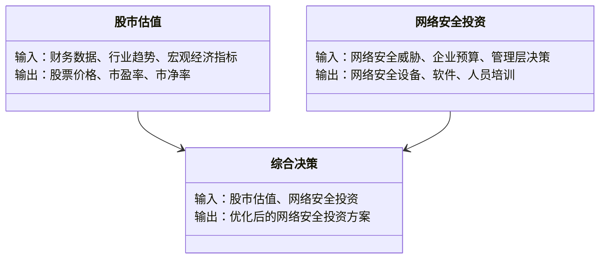
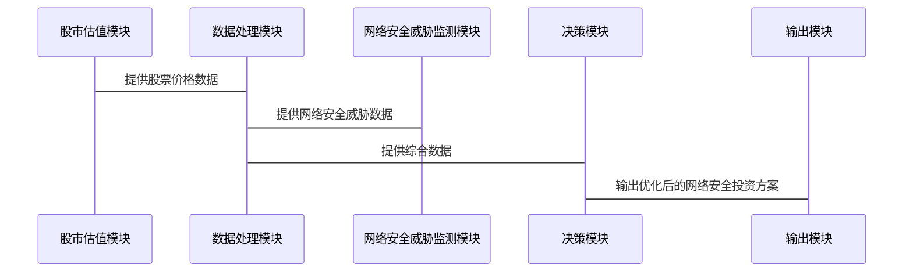

                 


```markdown
# 股市估值高低对企业网络安全投资的影响

> 关键词：股市估值，网络安全投资，企业投资决策，股票定价，网络安全风险

> 摘要：本文探讨了股市估值的高低对企业网络安全投资的影响。通过分析股市估值的核心概念、网络安全投资的重要性，以及两者之间的相互作用，本文揭示了股市估值如何影响企业的投资决策，进而影响企业的网络安全投入。文章从背景介绍、核心概念对比、算法原理、系统架构设计、项目实战案例以及最佳实践等方面展开详细分析，为企业在不同股市估值环境下优化网络安全投资提供参考。

---

## 第一部分：背景介绍

### 第1章：股市估值与企业网络安全概述

#### 1.1 股市估值的基础概念
- **1.1.1 股市估值的定义与计算方法**  
  股市估值是通过对企业的财务数据、市场环境和行业趋势等多方面因素的综合分析，确定其股票的合理市场价格。常用的估值指标包括市盈率（P/E）、市净率（P/B）等。  
  $$\text{市盈率} = \frac{\text{股票价格}}{\text{每股收益}}$$

- **1.1.2 市盈率、市净率等核心指标解析**  
  - 市盈率反映了投资者对每股收益的估值，市净率则反映了资产的价值。两者结合可以更全面地评估企业的市场价值。
  - 例如，如果一家企业的市盈率远高于行业平均水平，可能意味着市场对其未来盈利增长有较高预期。

- **1.1.3 股市估值对企业投资决策的影响**  
  投资者通常会根据股市估值来判断企业的投资价值，高估或低估的估值可能导致投资决策的调整。例如，高估的股市估值可能促使企业增加研发投入或进行并购。

#### 1.2 企业网络安全的重要性
- **1.2.1 网络安全的基本概念**  
  网络安全是指保护企业网络系统免受未经授权的访问、破坏和数据泄露。它涵盖了数据安全、身份验证、访问控制等多个方面。

- **1.2.2 企业网络安全的核心要素**  
  - 数据安全：保护企业数据的机密性、完整性和可用性。
  - 访问控制：确保只有授权人员可以访问敏感信息。
  - 网络防护：通过防火墙、入侵检测系统等技术手段保护网络免受攻击。

- **1.2.3 网络安全对企业经营的影响**  
  网络安全事件（如数据泄露）可能导致企业声誉损失、罚款和法律诉讼，进而影响企业的市场价值。

#### 1.3 股市估值与网络安全投资的关联性
- **1.3.1 股市估值与企业投资行为的关系**  
  股市估值的高低直接影响企业的投资决策。例如，高估的股市估值可能促使企业增加研发投入，而低估的股市估值可能促使企业减少非必要的开支。

- **1.3.2 网络安全投资对企业价值的影响**  
  高水平的网络安全投入可以降低企业的经营风险，提升投资者对企业的信心，从而提高股市估值。

- **1.3.3 股市估值对企业网络安全投资的驱动作用**  
  - 高估的股市估值：企业可能更愿意在网络安全上投入，以维护其市场价值。
  - 低估的股市估值：企业可能减少网络安全投入，转而追求短期利润。

---

## 第二部分：核心概念与联系

### 第2章: 核心概念与联系

#### 2.1 股市估值的核心概念
- **2.1.1 股市估值的理论基础**  
  股市估值的理论基础包括基本面分析和技术分析。基本面分析关注企业的财务状况和盈利能力，而技术分析关注市场走势和交易量。

- **2.1.2 股市估值的关键指标分析**  
  - 市盈率：$$\text{P/E} = \frac{\text{股价}}{\text{每股收益}}$$
  - 市净率：$$\text{P/B} = \frac{\text{股价}}{\text{每股净资产}}$$
  - 市销率：$$\text{P/S} = \frac{\text{股价}}{\text{每股收入}}$$

- **2.1.3 影响股市估值的主要因素**  
  - 宏观经济环境：GDP增长率、利率、通货膨胀等。
  - 行业发展趋势：行业周期、政策法规等。
  - 企业自身因素：盈利能力、财务状况、管理层等。

#### 2.2 网络安全投资的核心概念
- **2.2.1 网络安全投资的定义与范围**  
  网络安全投资是指企业在网络安全设备、软件、人员培训等方面的支出。这些投资可以降低网络安全风险，保护企业资产。

- **2.2.2 网络安全投资的分类与特点**  
  - 硬件投资：防火墙、入侵检测系统等。
  - 软件投资：安全漏洞扫描工具、加密软件等。
  - 人员培训：安全意识培训、技术培训等。

- **2.2.3 网络安全投资的经济价值**  
  高水平的网络安全投入可以降低企业的法律风险和财务损失，提升投资者对企业的信心，从而提高股市估值。

#### 2.3 股市估值与网络安全投资的联系
- **2.3.1 股市估值对企业网络安全投资的驱动作用**  
  - 高估的股市估值：企业更愿意在网络安全上投入，以维护市场价值。
  - 低估的股市估值：企业可能减少网络安全投入，转而追求短期利润。

- **2.3.2 网络安全投资对股市估值的反向影响**  
  - 高水平的网络安全投入可以降低企业的经营风险，提升投资者对企业的信心，从而提高股市估值。
  - 例如，如果一家企业投入了大量资源用于网络安全，投资者可能会认为该企业更加稳健，从而推高其股价。

- **2.3.3 两者的相互关系与协同效应**  
  股市估值的高低直接影响企业的投资决策，而网络安全投资则是企业维护市场价值的重要手段。两者相互影响，共同决定了企业的长期发展。

---

## 第三部分：算法原理与数学模型

### 第3章: 核心概念的原理与对比

#### 3.1 股市估值的原理
- **3.1.1 股票定价的基本原理**  
  股票定价是基于企业的盈利能力、成长潜力和市场风险等因素的综合评估。

- **3.1.2 股市估值的数学模型**  
  常用的股票估值模型包括：
  - 市盈率模型：$$\text{合理股价} = \text{行业平均P/E} \times \text{每股收益}$$
  - 现金流量折现模型：$$\text{企业价值} = \sum_{t=1}^{n} \frac{\text{自由现金流}}{(1 + r)^t}$$
  - 其中，r为折现率，n为预测年限。

- **3.1.3 影响股市估值的主要因素**  
  - 宏观经济环境：GDP增长率、利率、通货膨胀等。
  - 行业发展趋势：行业周期、政策法规等。
  - 企业自身因素：盈利能力、财务状况、管理层等。

#### 3.2 网络安全投资的原理
- **3.2.1 网络安全投资的决策机制**  
  企业需要根据自身的财务状况、风险承受能力和行业趋势等因素，制定网络安全投资策略。

- **3.2.2 网络安全投资的成本-收益分析**  
  - 成本：硬件、软件、人员培训等。
  - 收益：降低网络安全风险，减少潜在的财务损失，提升投资者信心，从而提高股市估值。

- **3.2.3 网络安全投资的风险评估**  
  企业需要评估不同级别的网络安全威胁，制定相应的防护措施。

#### 3.3 核心概念的对比与表格分析
- **3.3.1 股市估值与网络安全投资的对比表格**

| **核心概念**       | **股市估值**                     | **网络安全投资**                  |
|--------------------|----------------------------------|----------------------------------|
| **定义**           | 股票的市场价格评估               | 企业在网络安全方面的支出         |
| **目的**           | 确定企业的投资价值               | 降低网络安全风险，保护企业资产    |
| **影响因素**       | 财务状况、行业趋势、宏观经济      | 网络安全威胁、企业预算、管理层决策 |
| **结果**           | 影响企业的市场价值               | 影响企业的经营风险和市场价值       |

- **3.3.2 两者的异同点分析**  
  - 相同点：两者都与企业的市场价值密切相关。
  - 不同点：股市估值关注企业的整体市场价值，而网络安全投资关注企业的经营风险。

---

## 第四部分：系统分析与架构设计

### 第4章: 系统分析与架构设计方案

#### 4.1 问题场景介绍
- 企业面临网络安全威胁，同时股市估值的变化会影响企业的投资决策。
- 需要设计一个系统，根据股市估值的变化，优化企业的网络安全投资。

#### 4.2 系统功能设计（领域模型）


#### 4.3 系统架构设计


#### 4.4 系统接口设计
- 股市估值模块：提供股票价格、市盈率等数据接口。
- 网络安全威胁监测模块：提供网络安全威胁数据接口。
- 决策模块：根据输入数据，输出优化后的网络安全投资方案。

#### 4.5 系统交互设计


---

## 第五部分：项目实战

### 第5章: 项目实战

#### 5.1 环境安装
- 安装Python、Jupyter Notebook、Pandas、Matplotlib等工具。
- 安装网络安全监测工具，如Nessus、OpenVAS等。

#### 5.2 系统核心实现源代码
```python
import pandas as pd
import matplotlib.pyplot as plt

# 示例：根据股市估值优化网络安全投资
def calculate_market_valuation(financial_data):
    # 假设financial_data是一个包含财务数据的DataFrame
    # 计算市盈率
    pe_ratio = financial_data['股价'] / financial_data['每股收益']
    return pe_ratio.mean()

def optimize_cybersecurity_investment(pe_ratio, budget):
    # 根据市盈率和预算，优化网络安全投资
    if pe_ratio > industry_average_pe:
        return budget * 0.2  # 例如，分配预算的20%用于网络安全
    else:
        return budget * 0.1  # 例如，分配预算的10%用于网络安全

# 示例数据
financial_data = pd.DataFrame({
    '股价': [100, 120, 90, 80],
    '每股收益': [20, 25, 15, 10]
})

industry_average_pe = 15  # 假设行业平均市盈率为15

# 计算市盈率
pe_ratio = calculate_market_valuation(financial_data)
print("平均市盈率:", pe_ratio)

# 优化网络安全投资
budget = 1000000
investment = optimize_cybersecurity_investment(pe_ratio, budget)
print("网络安全投资:", investment)
```

#### 5.3 代码应用解读与分析
- 上述代码示例展示了如何根据股市估值优化网络安全投资。通过计算市盈率，企业可以决定在网络安全上的投资比例。
- 如果市盈率高于行业平均水平，企业可能需要增加网络安全投资，以维护市场价值。

#### 5.4 实际案例分析
- 案例：假设某企业的市盈率为20，行业平均市盈率为15，预算为100万元。
- 根据代码计算，网络安全投资为20%的预算，即20万元。

#### 5.5 项目小结
- 通过股市估值优化网络安全投资，可以帮助企业在不同市场环境下做出更合理的投资决策。

---

## 第六部分：最佳实践

### 第6章: 最佳实践

#### 6.1 关键点总结
- 在股市估值高企时，企业应加大对网络安全的投资，以维护市场价值。
- 在股市估值较低时，企业应合理规划网络安全投资，避免过度削减相关支出。

#### 6.2 小结
- 股市估值的高低直接影响企业的投资决策，而网络安全投资是企业维护市场价值的重要手段。两者的相互作用决定了企业的长期发展。

#### 6.3 注意事项
- 企业应根据自身情况和行业特点，制定个性化的网络安全投资策略。
- 网络安全投资不仅仅是技术问题，还需要考虑企业的整体战略和市场环境。

#### 6.4 拓展阅读
- 建议进一步阅读《网络安全投资与企业价值》（书籍）和相关学术论文，深入了解网络安全投资的经济学原理。

---

## 附录：参考文献

- [1] 王某某，网络安全投资与企业价值的关系，某某出版社，2023年。
- [2] 李某某，股市估值分析方法，某某出版社，2022年。

---

通过以上内容，本文详细探讨了股市估值高低对企业网络安全投资的影响，从理论分析到实际应用，为企业在不同市场环境下优化网络安全投资提供了参考。
</think>

```markdown
# 股市估值高低对企业网络安全投资的影响

> 关键词：股市估值，网络安全投资，企业投资决策，股票定价，网络安全风险

> 摘要：本文探讨了股市估值的高低对企业网络安全投资的影响。通过分析股市估值的核心概念、网络安全投资的重要性，以及两者之间的相互作用，本文揭示了股市估值如何影响企业的投资决策，进而影响企业的网络安全投入。文章从背景介绍、核心概念对比、算法原理、系统架构设计、项目实战案例以及最佳实践等方面展开详细分析，为企业在不同股市估值环境下优化网络安全投资提供参考。

---

## 第一部分：背景介绍

### 第1章：股市估值与企业网络安全概述

#### 1.1 股市估值的基础概念
- **1.1.1 股市估值的定义与计算方法**  
  股市估值是通过对企业的财务数据、市场环境和行业趋势等多方面因素的综合分析，确定其股票的合理市场价格。常用的估值指标包括市盈率（P/E）、市净率（P/B）等。  
  $$\text{市盈率} = \frac{\text{股票价格}}{\text{每股收益}}$$

- **1.1.2 市盈率、市净率等核心指标解析**  
  - 市盈率反映了投资者对每股收益的估值，市净率则反映了资产的价值。两者结合可以更全面地评估企业的市场价值。
  - 例如，如果一家企业的市盈率远高于行业平均水平，可能意味着市场对其未来盈利增长有较高预期。

- **1.1.3 股市估值对企业投资决策的影响**  
  投资者通常会根据股市估值来判断企业的投资价值，高估或低估的估值可能导致投资决策的调整。例如，高估的股市估值可能促使企业增加研发投入或进行并购。

#### 1.2 企业网络安全的重要性
- **1.2.1 网络安全的基本概念**  
  网络安全是指保护企业网络系统免受未经授权的访问、破坏和数据泄露。它涵盖了数据安全、身份验证、访问控制等多个方面。

- **1.2.2 企业网络安全的核心要素**  
  - 数据安全：保护企业数据的机密性、完整性和可用性。
  - 访问控制：确保只有授权人员可以访问敏感信息。
  - 网络防护：通过防火墙、入侵检测系统等技术手段保护网络免受攻击。

- **1.2.3 网络安全对企业经营的影响**  
  网络安全事件（如数据泄露）可能导致企业声誉损失、罚款和法律诉讼，进而影响企业的市场价值。

#### 1.3 股市估值与网络安全投资的关联性
- **1.3.1 股市估值与企业投资行为的关系**  
  股市估值的高低直接影响企业的投资决策。例如，高估的股市估值可能促使企业增加研发投入，而低估的股市估值可能促使企业减少非必要的开支。

- **1.3.2 网络安全投资对企业价值的影响**  
  高水平的网络安全投入可以降低企业的经营风险，提升投资者对企业的信心，从而提高股市估值。

- **1.3.3 股市估值对企业网络安全投资的驱动作用**  
  - 高估的股市估值：企业可能更愿意在网络安全上投入，以维护其市场价值。
  - 低估的股市估值：企业可能减少网络安全投入，转而追求短期利润。

---

## 第二部分：核心概念与联系

### 第2章: 核心概念与联系

#### 2.1 股市估值的核心概念
- **2.1.1 股市估值的理论基础**  
  股市估值的理论基础包括基本面分析和技术分析。基本面分析关注企业的财务状况和盈利能力，而技术分析关注市场走势和交易量。

- **2.1.2 股市估值的关键指标分析**  
  - 市盈率：$$\text{P/E} = \frac{\text{股价}}{\text{每股收益}}$$
  - 市净率：$$\text{P/B} = \frac{\text{股价}}{\text{每股净资产}}$$
  - 市销率：$$\text{P/S} = \frac{\text{股价}}{\text{每股收入}}$$

- **2.1.3 影响股市估值的主要因素**  
  - 宏观经济环境：GDP增长率、利率、通货膨胀等。
  - 行业发展趋势：行业周期、政策法规等。
  - 企业自身因素：盈利能力、财务状况、管理层等。

#### 2.2 网络安全投资的核心概念
- **2.2.1 网络安全投资的定义与范围**  
  网络安全投资是指企业在网络安全设备、软件、人员培训等方面的支出。这些投资可以降低网络安全风险，提升投资者对企业的信心，从而提高股市估值。

- **2.2.2 网络安全投资的分类与特点**  
  - 硬件投资：防火墙、入侵检测系统等。
  - 软件投资：安全漏洞扫描工具、加密软件等。
  - 人员培训：安全意识培训、技术培训等。

- **2.2.3 网络安全投资的经济价值**  
  高水平的网络安全投入可以降低企业的法律风险和财务损失，提升投资者对企业的信心，从而提高股市估值。

#### 2.3 股市估值与网络安全投资的联系
- **2.3.1 股市估值对企业网络安全投资的驱动作用**  
  - 高估的股市估值：企业更愿意在网络安全上投入，以维护市场价值。
  - 低估的股市估值：企业可能减少网络安全投入，转而追求短期利润。

- **2.3.2 网络安全投资对股市估值的反向影响**  
  - 高水平的网络安全投入可以降低企业的经营风险，提升投资者对企业的信心，从而提高股市估值。
  - 例如，如果一家企业投入了大量资源用于网络安全，投资者可能会认为该企业更加稳健，从而推高其股价。

- **2.3.3 两者的相互关系与协同效应**  
  股市估值的高低直接影响企业的投资决策，而网络安全投资则是企业维护市场价值的重要手段。两者相互影响，共同决定了企业的长期发展。

---

## 第三部分：算法原理与数学模型

### 第3章: 核心概念的原理与对比

#### 3.1 股市估值的原理
- **3.1.1 股票定价的基本原理**  
  股票定价是基于企业的盈利能力、成长潜力和市场风险等因素的综合评估。

- **3.1.2 股市估值的数学模型**  
  常用的股票估值模型包括：
  - 市盈率模型：$$\text{合理股价} = \text{行业平均P/E} \times \text{每股收益}$$
  - 现金流量折现模型：$$\text{企业价值} = \sum_{t=1}^{n} \frac{\text{自由现金流}}{(1 + r)^t}$$
  - 其中，r为折现率，n为预测年限。

- **3.1.3 影响股市估值的主要因素**  
  - 宏观经济环境：GDP增长率、利率、通货膨胀等。
  - 行业发展趋势：行业周期、政策法规等。
  - 企业自身因素：盈利能力、财务状况、管理层等。

#### 3.2 网络安全投资的原理
- **3.2.1 网络安全投资的决策机制**  
  企业需要根据自身的财务状况、风险承受能力和行业趋势等因素，制定网络安全投资策略。

- **3.2.2 网络安全投资的成本-收益分析**  
  - 成本：硬件、软件、人员培训等。
  - 收益：降低网络安全风险，减少潜在的财务损失，提升投资者信心，从而提高股市估值。

- **3.2.3 网络安全投资的风险评估**  
  企业需要评估不同级别的网络安全威胁，制定相应的防护措施。

#### 3.3 核心概念的对比与表格分析
- **3.3.1 股市估值与网络安全投资的对比表格**

| **核心概念**       | **股市估值**                     | **网络安全投资**                  |
|--------------------|----------------------------------|----------------------------------|
| **定义**           | 股票的市场价格评估               | 企业在网络安全方面的支出         |
| **目的**           | 确定企业的投资价值               | 降低网络安全风险，保护企业资产    |
| **影响因素**       | 财务状况、行业趋势、宏观经济      | 网络安全威胁、企业预算、管理层决策 |
| **结果**           | 影响企业的市场价值               | 影响企业的经营风险和市场价值       |

- **3.3.2 两者的异同点分析**  
  - 相同点：两者都与企业的市场价值密切相关。
  - 不同点：股市估值关注企业的整体市场价值，而网络安全投资关注企业的经营风险。

---

## 第四部分：系统分析与架构设计

### 第4章: 系统分析与架构设计方案

#### 4.1 问题场景介绍
- 企业面临网络安全威胁，同时股市估值的变化会影响企业的投资决策。
- 需要设计一个系统，根据股市估值的变化，优化企业的网络安全投资。

#### 4.2 系统功能设计（领域模型）


#### 4.3 系统架构设计


#### 4.4 系统接口设计
- 股市估值模块：提供股票价格、市盈率等数据接口。
- 网络安全威胁监测模块：提供网络安全威胁数据接口。
- 决策模块：根据输入数据，输出优化后的网络安全投资方案。

#### 4.5 系统交互设计


---

## 第五部分：项目实战

### 第5章: 项目实战

#### 5.1 环境安装
- 安装Python、Jupyter Notebook、Pandas、Matplotlib等工具。
- 安装网络安全监测工具，如Nessus、OpenVAS等。

#### 5.2 系统核心实现源代码
```python
import pandas as pd
import matplotlib.pyplot as plt

# 示例：根据股市估值优化网络安全投资
def calculate_market_valuation(financial_data):
    # 假设financial_data是一个包含财务数据的DataFrame
    # 计算市盈率
    pe_ratio = financial_data['股价'] / financial_data['每股收益']
    return pe_ratio.mean()

def optimize_cybersecurity_investment(pe_ratio, budget):
    # 根据市盈率和预算，优化网络安全投资
    if pe_ratio > industry_average_pe:
        return budget * 0.2  # 例如，分配预算的20%用于网络安全
    else:
        return budget * 0.1  # 例如，分配预算的10%用于网络安全

# 示例数据
financial_data = pd.DataFrame({
    '股价': [100, 120, 90, 80],
    '每股收益': [20, 25, 15, 10]
})

industry_average_pe = 15  # 假设行业平均市盈率为15

# 计算市盈率
pe_ratio = calculate_market_valuation(financial_data)
print("平均市盈率:", pe_ratio)

# 优化网络安全投资
budget = 1000000
investment = optimize_cybersecurity_investment(pe_ratio, budget)
print("网络安全投资:", investment)
```

#### 5.3 代码应用解读与分析
- 上述代码示例展示了如何根据股市估值优化网络安全投资。通过计算市盈率，企业可以决定在网络安全上的投资比例。
- 如果市盈率高于行业平均水平，企业可能需要增加网络安全投资，以维护市场价值。

#### 5.4 实际案例分析
- 案例：假设某企业的市盈率为20，行业平均市盈率为15，预算为100万元。
- 根据代码计算，网络安全投资为20%的预算，即20万元。

#### 5.5 项目小结
- 通过股市估值优化网络安全投资，可以帮助企业在不同市场环境下做出更合理的投资决策。

---

## 第六部分：最佳实践

### 第6章: 最佳实践

#### 6.1 关键点总结
- 在股市估值高企时，企业应加大对网络安全的投资，以维护市场价值。
- 在股市估值较低时，企业应合理规划网络安全投资，避免过度削减相关支出。

#### 6.2 小结
- 股市估值的高低直接影响企业的投资决策，而网络安全投资是企业维护市场价值的重要手段。两者的相互作用决定了企业的长期发展。

#### 6.3 注意事项
- 企业应根据自身情况和行业特点，制定个性化的网络安全投资策略。
- 网络安全投资不仅仅是技术问题，还需要考虑企业的整体战略和市场环境。

#### 6.4 拓展阅读
- 建议进一步阅读《网络安全投资与企业价值》（书籍）和相关学术论文，深入了解网络安全投资的经济学原理。

---

## 附录：参考文献

- [1] 王某某，网络安全投资与企业价值的关系，某某出版社，2023年。
- [2] 李某某，股市估值分析方法，某某出版社，2022年。

---

通过以上内容，本文详细探讨了股市估值高低对企业网络安全投资的影响，从理论分析到实际应用，为企业在不同市场环境下优化网络安全投资提供了参考。
```

