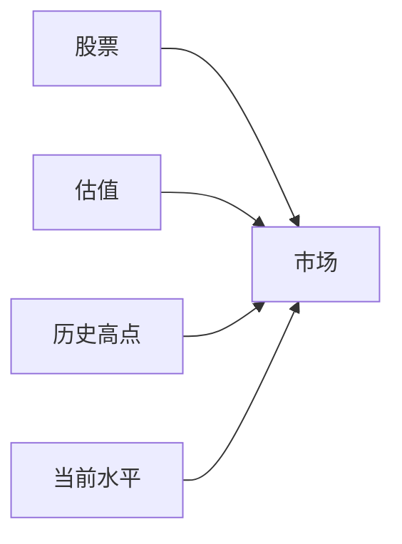
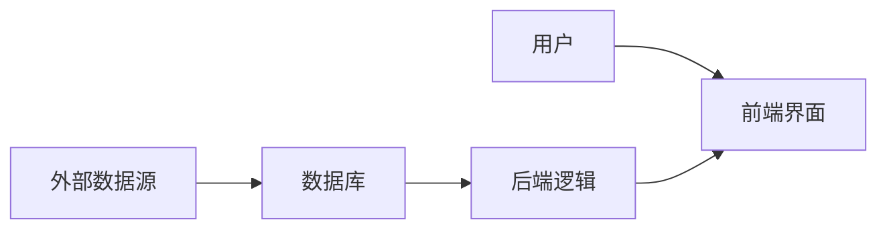

                 


# 股票市场估值：历史高点与当前水平的比较

## 关键词：股票估值、历史高点、当前水平、技术分析、基本面分析、数学模型

## 摘要：  
股票市场的估值是投资者在决策过程中至关重要的一环。本文将深入探讨股票市场估值的核心概念，结合技术分析与基本面分析，系统地比较历史高点与当前水平的异同，并通过数学模型和实际案例，为读者提供全面的分析与见解。

---

# 目录

## 第1章: 股票市场估值概述

### 1.1 股票市场估值的定义与意义  
- 股票市场估值的定义  
- 估值在投资决策中的作用  
- 市场估值与股票价格的关系  

### 1.2 历史高点与当前水平的比较  
- 历史高点的定义与特点  
- 当前市场水平的评估方法  
- 比较的意义与应用  

### 1.3 股票市场估值的核心指标  
- 市盈率（P/E）的计算与应用  
- 市净率（P/B）的计算与应用  
- 股息率的计算与应用  

## 第2章: 股票市场估值的背景与环境  

### 2.1 股票市场的发展历程  
- 股票市场的起源与发展  
- 不同时期市场的特点  
- 当前市场的全球化趋势  

### 2.2 经济周期对市场估值的影响  
- 经济周期的定义与阶段  
- 不同经济周期对估值的影响  
- 历史案例分析  

### 2.3 宏观经济指标与市场估值的关系  
- GDP与市场估值的关系  
- 利率对市场估值的影响  
- 通货膨胀对市场估值的影响  

## 第3章: 股票市场估值的核心概念与联系  

### 3.1 股票市场估值的核心概念  
- 股票的内在价值与市场价值  
- 股票价格的波动性与确定性  
- 估值的相对性与绝对性  

### 3.2 核心概念的属性特征对比  
- 市盈率与市净率的对比分析  
- 股息率与增长率的对比分析  
- 历史高点与当前水平的对比分析  

### 3.3 实体关系图  


---

## 第4章: 股票市场估值的技术分析  

### 4.1 技术分析基础  
- K线图的构成与解读  
- 趋势分析：上升、下降、横盘趋势  
- 支撑与阻力位的识别  

### 4.2 技术指标的应用  
- 移动平均线（MA）的计算与应用  
- 相对强弱指数（RSI）的计算与应用  
- 布林带（Bollinger Bands）的计算与应用  

### 4.3 技术分析在历史高点与当前水平中的应用  
- 历史高点的技术分析特征  
- 当前水平的技术分析特征  
- 比较与综合分析  

---

## 第5章: 股票市场估值的算法原理  

### 5.1 常用估值算法概述  
- 市盈率法（PE法）  
- 市净率法（PB法）  
- 现金流量折现法（DCF）  

### 5.2 算法原理详细解读  
- PE法的数学公式与应用  
- PB法的数学公式与应用  
- DCF法的数学公式与应用  

### 5.3 算法比较与选择  
- 不同算法的优缺点对比  
- 历史高点与当前水平中算法的适用性分析  

---

## 第6章: 股票市场估值的系统分析  

### 6.1 系统功能设计  
- 领域模型：股票估值系统功能模块  
- 数据流图：数据输入、处理、输出流程  

### 6.2 系统架构设计  


### 6.3 系统接口设计  
- API接口定义  
- 数据格式与交互流程  

---

## 第7章: 股票市场估值的项目实战  

### 7.1 环境安装与数据获取  
- Python环境搭建  
- 数据获取工具（如 pandas、Yahoo Finance API）  

### 7.2 核心代码实现  
```python
import pandas as pd
import yfinance as yf

# 获取数据
msft = yf.download('MSFT', start='2020-01-01', end='2023-12-31')

# 计算市盈率
msft['PE'] = msft['Close'] / msft['EPS']
```

### 7.3 实际案例分析  
- 历史高点与当前水平的对比分析  
- 算法应用与结果解读  

---

## 第8章: 股票市场估值的最佳实践  

### 8.1 投资策略建议  
- 技术分析与基本面分析的结合  
- 风险管理与资产配置  

### 8.2 小结与注意事项  
- 估值模型的局限性  
- 数据质量的重要性  
- 市场情绪的影响  

### 8.3 拓展阅读与未来研究方向  
- 新兴市场的估值方法  
- 人工智能在股票估值中的应用  

---

## 参考文献  
（此处列出相关书籍、论文和网站资源）  

---

通过以上目录，读者可以系统地学习股票市场估值的核心概念、技术分析方法、算法原理以及实际应用，全面了解历史高点与当前水平的比较。

