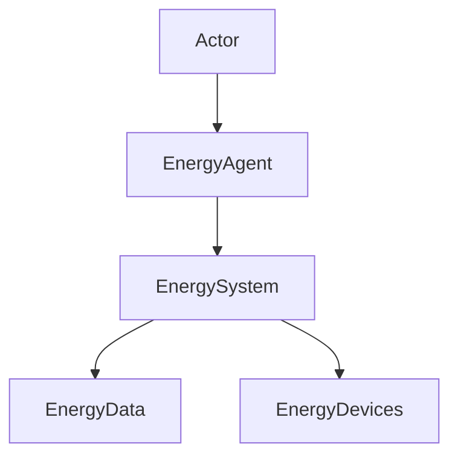

                 


# 能源行业AI Agent解决方案

> 关键词：能源行业、AI Agent、人工智能、能源优化、智能系统

> 摘要：本文探讨了AI Agent在能源行业的应用，从背景介绍到核心概念，再到算法原理、系统架构设计、项目实战和最佳实践，详细分析了如何利用AI Agent提升能源行业的智能化水平，优化能源管理和利用效率。

---

## 第一章：能源行业的数字化转型与AI Agent的引入

### 1.1 能源行业的现状与挑战
- 1.1.1 传统能源行业的痛点：效率低下、资源浪费、环境问题
- 1.1.2 数字化转型的必要性：技术进步与政策驱动
- 1.1.3 AI技术如何改变能源行业：智能化、数据驱动决策

### 1.2 AI Agent的基本概念与特点
- 1.2.1 什么是AI Agent：定义、功能与分类
- 1.2.2 AI Agent的核心特点：自主性、反应性、协作性
- 1.2.3 AI Agent与传统自动化系统的区别：智能性、适应性

### 1.3 能源行业AI Agent的应用场景
- 1.3.1 智能调度与优化：实时调整能源分配
- 1.3.2 设备预测性维护：减少停机时间，降低成本
- 1.3.3 能源消费行为分析：个性化服务与需求预测
- 1.3.4 碳中和目标下的AI Agent应用：绿色能源管理

## 第二章：AI Agent的核心概念与系统架构

### 2.1 核心概念的深入理解
- 2.1.1 多智能体系统（MAS）：系统构成与协作机制
- 2.1.2 能源AI Agent的系统架构：分层设计与模块化
- 2.1.3 决策机制：基于规则、基于模型、基于学习的决策

### 2.2 系统架构的Mermaid流程图


### 2.3 实体关系图（ER图）
```mermaid
er
actor: 能源企业
agent: AI Agent
|------------------|
| actor            |
|------------------|
| agent            |
|------------------|
```

## 第三章：AI Agent算法原理与数学模型

### 3.1 算法原理
- 3.1.1 强化学习：Q-learning算法的应用
- 3.1.2 监督学习：回归与分类模型
- 3.1.3 聚类分析：能源数据的分群优化

### 3.2 数学模型与公式
- 3.2.1 Q-learning算法：状态-动作-奖励的数学表达
  $$ Q(s,a) = Q(s,a) + \alpha (r + \gamma \max Q(s',a') - Q(s,a)) $$
- 3.2.2 聚类模型：K-means算法
  $$ \text{目标函数} = \sum_{i=1}^n \sum_{j=1}^k (y_{ij})^2 $$

### 3.3 Python实现示例
```python
# Q-learning算法实现
class AI_Agent:
    def __init__(self, state_space, action_space):
        self.state_space = state_space
        self.action_space = action_space
        self.Q = defaultdict(lambda: defaultdict(int))

    def choose_action(self, state):
        # 探索与利用策略
        if random.random() < 0.1:
            return random.choice(self.action_space)
        else:
            return max(self.Q[state], key=lambda k: self.Q[state][k])

    def update_Q(self, state, action, reward, next_state):
        self.Q[state][action] += 0.1 * (reward + 0.9 * max(self.Q[next_state].values() - self.Q[state][action]))
```

## 第四章：系统分析与架构设计

### 4.1 问题场景介绍
- 4.1.1 能源调度系统：实时数据处理与决策
- 4.1.2 设备管理：预测性维护与故障诊断
- 4.1.3 用户行为分析：个性化服务与需求预测

### 4.2 项目介绍与系统功能设计
- 4.2.1 领域模型：能源系统中的实体与关系
  ```mermaid
  classDiagram
  class EnergyAgent {
    +state: string
    +action: string
    -Q_table: dictionary
    ++choose_action()
    ++update_Q()
  }
  ```

### 4.3 系统架构设计
- 4.3.1 分层架构：感知层、决策层、执行层
  ```mermaid
  graph TD
  A[感知层] --> B[决策层]
  B --> C[执行层]
  ```

### 4.4 接口设计与交互流程
- 4.4.1 接口设计：RESTful API
- 4.4.2 交互流程：用户请求、Agent处理、系统反馈
  ```mermaid
  sequenceDiagram
  participant User
  participant Agent
  participant System
  User -> Agent: 请求优化方案
  Agent -> System: 获取数据
  Agent --> User: 返回结果
  ```

## 第五章：项目实战与案例分析

### 5.1 环境安装与配置
- 5.1.1 系统环境：Python 3.8+
- 5.1.2 工具安装：pip install numpy, pandas, scikit-learn, matplotlib

### 5.2 核心代码实现
```python
# 示例代码：AI Agent实现能源调度优化
import numpy as np
from sklearn import linear_model

class EnergyScheduler:
    def __init__(self, data):
        self.data = data
        self.model = linear_model.LinearRegression()

    def train_model(self):
        # 训练模型
        X = self.data[['demand', 'price']]
        y = self.data['consumption']
        self.model.fit(X, y)

    def predict_consumption(self, demand, price):
        # 预测能源消耗
        return self.model.predict([[demand, price]])[0]

# 使用示例
data = {'demand': [100, 200, 300], 'price': [0.5, 0.6, 0.7], 'consumption': [150, 250, 350]}
scheduler = EnergyScheduler(data)
scheduler.train_model()
print(scheduler.predict_consumption(150, 0.6))  # 输出预测结果
```

### 5.3 案例分析与结果解读
- 5.3.1 案例背景：某地区能源调度优化
- 5.3.2 数据分析与模型训练
- 5.3.3 实验结果与优化效果

## 第六章：最佳实践与未来展望

### 6.1 最佳实践
- 6.1.1 数据质量管理：确保数据的准确性和完整性
- 6.1.2 模型优化：持续迭代与更新
- 6.1.3 安全与隐私保护：数据加密与访问控制

### 6.2 本章小结
- 6.2.1 全书总结：AI Agent在能源行业的应用价值
- 6.2.2 未来展望：技术进步与行业发展的结合

### 6.3 注意事项
- 6.3.1 模型局限性：数据依赖性与泛化能力
- 6.3.2 伦理与法律问题：AI决策的透明性与责任归属

### 6.4 拓展阅读
- 6.4.1 推荐书籍：《AI for Energy Systems》
- 6.4.2 技术博客：深入探讨AI Agent的最新研究

---

通过以上目录结构，本文系统地介绍了AI Agent在能源行业的应用，从理论到实践，为读者提供了全面的知识和实用的解决方案。

