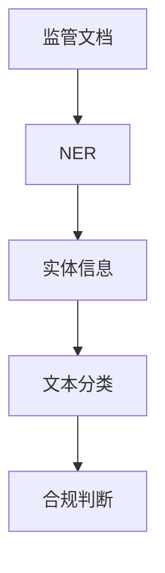
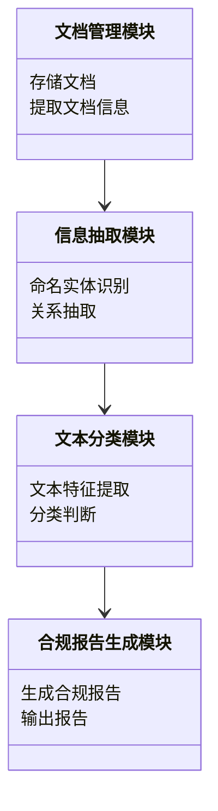

                 


# 自然语言处理在监管合规自动化中的应用

## 关键词：自然语言处理，监管合规，自动化，文本分类，实体识别，机器学习，深度学习

## 摘要：  
本文探讨了自然语言处理技术在监管合规自动化中的应用，分析了NLP的核心原理及其在监管文档处理、风险识别和合规报告生成中的具体应用。通过实际案例和系统架构设计，展示了NLP如何提升监管合规的效率和准确性。

---

## 第一部分: 自然语言处理与监管合规自动化概述

## 第1章: 自然语言处理与监管合规自动化背景

### 1.1 自然语言处理的基本概念

#### 1.1.1 自然语言处理的定义  
自然语言处理（NLP）是计算机科学、人工智能和语言学的交叉领域，旨在让计算机能够理解、处理和生成人类语言。NLP的核心任务包括文本分析、信息提取、机器翻译、问答系统和文本生成等。

#### 1.1.2 自然语言处理的核心技术  
- **文本预处理**：分词、词干提取、停用词处理、词向量化。  
- **特征提取**：词袋模型、词嵌入（如Word2Vec、GloVe、FastText）、位置嵌入。  
- **模型训练**：基于规则的模型（如正则表达式）、统计模型（如朴素贝叶斯、支持向量机）和深度学习模型（如LSTM、Transformer、BERT）。  

#### 1.1.3 自然语言处理的应用领域  
- **文本分类**：垃圾邮件识别、情感分析、新闻主题分类。  
- **信息抽取**：实体识别（NER）、关系抽取、事件抽取。  
- **问答系统**：基于规则的问答、基于检索的问答、基于生成的问答。  
- **对话系统**：任务导向对话、开放域对话。  

---

### 1.2 监管合规自动化的概念

#### 1.2.1 监管合规的基本定义  
监管合规是指企业或组织在经营活动中遵守相关法律法规、行业标准和内部政策。监管合规的核心目标是降低法律风险、避免行政处罚、提升企业声誉。  

#### 1.2.2 监管合规的自动化需求  
随着法律法规的复杂化和监管力度的加强，传统的人工合规审查效率低、成本高、误差率高。通过自动化技术，可以实现文档智能审查、风险预警、合规报告自动生成。  

#### 1.2.3 监管合规自动化的目标与意义  
- **目标**：提高合规审查效率，降低合规成本，减少人为错误，实时监控合规风险。  
- **意义**：帮助企业在复杂多变的监管环境中保持合规，提升运营效率，增强企业竞争力。  

---

### 1.3 自然语言处理在监管合规自动化中的结合

#### 1.3.1 NLP技术在监管合规中的应用场景  
- **文档审查**：自动识别文档中的关键信息（如合同条款、法律条文）。  
- **风险识别**：通过NLP分析文本，识别潜在的合规风险（如关联交易风险、反洗钱风险）。  
- **合规报告生成**：基于NLP提取的结构化数据，自动生成合规报告。  

#### 1.3.2 监管合规自动化的核心问题  
- 如何高效准确地从监管文档中提取关键信息？  
- 如何利用NLP技术实现跨语言、跨领域的合规审查？  
- 如何处理监管文档中的模糊性和歧义性？  

#### 1.3.3 自然语言处理如何解决监管合规问题  
- **信息提取**：通过NER（命名实体识别）提取监管文档中的机构名称、日期、金额等信息。  
- **文本分类**：将监管文档分类为合规或不合规。  
- **问答系统**：基于NLP构建监管问答系统，解答合规相关问题。  

---

### 1.4 本章小结  
本章介绍了自然语言处理的基本概念、监管合规自动化的背景及需求，分析了NLP在监管合规自动化中的应用场景和核心问题。通过结合NLP技术，可以显著提升监管合规的效率和准确性。

---

## 第二部分: 核心概念与联系

## 第2章: 自然语言处理的核心原理

### 2.1 文本表示与特征提取

#### 2.1.1 词袋模型  
词袋模型将文本表示为单词的集合，不考虑单词顺序。例如，文本“我爱自然语言处理”可以表示为{“我”：1，“爱”：1，“自然”：1，“语言”：1，“处理”：1}。

#### 2.1.2 词嵌入技术  
- **Word2Vec**：通过神经网络训练词向量，捕捉单词的语义信息。  
- **GloVe**：基于全局词向量的子词嵌入，通过矩阵分解生成词向量。  
- **FastText**：基于子词的快速文本表示方法，适合处理 rare words。  

#### 2.1.3 上下文表示  
- **BERT**：基于Transformer的双向编码器，捕捉文本的上下文信息。  
- **GPT**：生成式预训练模型，擅长捕捉文本的上下文关系。  

---

### 2.2 语言模型与文本生成

#### 2.2.1 基于规则的文本生成  
- 通过预定义的规则生成文本，适用于简单的场景（如生成固定格式的报告）。  

#### 2.2.2 基于统计的文本生成  
- 使用统计模型（如n-gram模型）生成文本，依赖于训练数据的频率统计。  

#### 2.2.3 基于深度学习的文本生成  
- **RNN/LSTM**：循环神经网络，适合处理序列数据。  
- **Transformer**：基于自注意力机制，适合长文本生成。  

---

### 2.3 自然语言理解与文本分类

#### 2.3.1 文本分类的基本原理  
文本分类是将文本划分为预定义的类别（如正面、负面、中性）。常见的分类算法包括：  
- **朴素贝叶斯**：基于概率论的分类方法，简单高效。  
- **支持向量机（SVM）**：基于线性分隔的分类方法，适合高维数据。  
- **随机森林**：基于树模型的集成学习方法，适合处理小规模数据。  
- **神经网络**：基于深度学习的分类方法，适合大规模数据。  

#### 2.3.2 基于NLP的文本分类方法  
- **TF-IDF**：计算文本中关键词的权重，常用于文本分类特征提取。  
- **Word2Vec**：将文本表示为词向量，输入到分类模型中。  
- **BERT**：基于预训练的上下文表示，输入到分类模型中。  

#### 2.3.3 常见的文本分类算法  
- **TF-IDF + SVM**：适用于邮件分类、新闻主题分类。  
- **Word2Vec + LSTM**：适用于长文本分类。  
- **BERT + FC Layer**：适用于细粒度文本分类。  

---

## 第3章: 监管合规自动化的核心要素

### 3.1 监管合规自动化的核心要素

#### 3.1.1 文本预处理  
- 分词：将文本分割成词语或短语。  
- 去停用词：移除对文本理解无用的词汇（如“的”、“了”）。  
- 词向量化：将文本转换为向量表示。  

#### 3.1.2 信息提取  
- **NER（命名实体识别）**：识别文本中的实体（如人名、机构名、日期）。  
- **关系抽取**：识别文本中的关系（如“公司A与公司B签订合同”）。  
- **事件抽取**：识别文本中的事件（如“公司发布新产品”）。  

#### 3.1.3 文本分类  
- 将监管文档分类为合规或不合规。  
- 分类依据：关键词匹配、上下文理解。  

#### 3.1.4 合规报告生成  
- 基于提取的信息，自动生成合规报告。  
- 报告内容：合规风险、问题描述、建议措施。  

---

## 第4章: 核心概念与联系

### 4.1 NLP技术在监管合规中的应用结构

#### 4.1.1 对比分析  
| 技术 | 描述 | 应用场景 |  
|------|------|----------|  
| NER  | 命名实体识别 | 识别监管文档中的机构名称、日期等。 |  
| 文本分类 | 文本分类 | 判断监管文档是否合规。 |  
| BERT | 上下文表示 | 理解监管文档中的复杂语义。 |  

#### 4.1.2 实体关系图  


---

## 第三部分: 算法原理讲解

## 第5章: 算法原理与实现

### 5.1 TF-IDF算法原理

#### 5.1.1 TF-IDF公式  
$$ \text{TF-IDF}(w, d) = \text{TF}(w, d) \times \text{IDF}(w, D) $$  
- **TF**：单词w在文档d中的词频。  
- **IDF**：单词w在文档集合D中的逆文档频率。  

#### 5.1.2 实现步骤  
1. 统计每个单词在文档中的词频。  
2. 统计每个单词在所有文档中的逆文档频率。  
3. 计算每个单词的TF-IDF值。  

#### 5.1.3 Python代码示例  
```python
from sklearn.feature_extraction.text import TfidfVectorizer

texts = ["我爱自然语言处理", "自然语言处理是人工智能的核心技术"]
vectorizer = TfidfVectorizer()
tfidf_matrix = vectorizer.fit_transform(texts)
print(tfidf_matrix.toarray())
```

---

### 5.2 BERT模型原理

#### 5.2.1 BERT模型架构  
BERT基于Transformer架构，包含编码器层，通过自注意力机制捕捉文本的上下文信息。  

#### 5.2.2 预训练目标  
1. **Masked LM**：随机遮蔽部分单词，预测遮蔽单词的值。  
2. **Next Sentence Prediction**：预测下一句是否是原文中的下一句。  

#### 5.2.3 使用BERT进行文本分类  
```python
import torch
from transformers import BertTokenizer, BertModel

tokenizer = BertTokenizer.from_pretrained('bert-base-chinese')
model = BertModel.from_pretrained('bert-base-chinese')

text = "我爱自然语言处理"
inputs = tokenizer(text, return_tensors='pt')
outputs = model(**inputs)
last_layer = outputs.last_hidden_state
print(last_layer.shape)  # 输出：[batch_size, seq_length, hidden_size]
```

---

## 第四部分: 系统分析与架构设计

## 第6章: 系统分析与架构设计

### 6.1 系统分析

#### 6.1.1 应用场景  
- 监管文档智能审查：识别文档中的关键信息。  
- 合规风险预警：实时监控合规风险。  
- 合规报告生成：自动生成合规报告。  

#### 6.1.2 系统功能设计  
- 文档上传与存储：支持多种格式的文档上传和存储。  
- 文本预处理：分词、去停用词、词向量化。  
- 信息提取：NER、关系抽取、事件抽取。  
- 文本分类：判断文档是否合规。  
- 合规报告生成：基于提取的信息生成报告。  

---

### 6.2 系统架构设计

#### 6.2.1 领域模型  


#### 6.2.2 系统架构  


#### 6.2.3 接口设计  
- **文档上传接口**：接收文档并存储。  
- **信息提取接口**：返回文档中的实体信息。  
- **文本分类接口**：返回文档的分类结果。  
- **报告生成接口**：返回合规报告。  

---

## 第五部分: 项目实战

## 第7章: 项目实战

### 7.1 环境安装

#### 7.1.1 安装Python环境  
```bash
python --version
pip install --upgrade pip
```

#### 7.1.2 安装依赖库  
```bash
pip install numpy
pip install pandas
pip install scikit-learn
pip install transformers
pip install sentence-tokenizer
```

---

### 7.2 核心代码实现

#### 7.2.1 文本预处理代码  
```python
import jieba

def preprocess(text):
    words = jieba.lcut(text)
    return ' '.join(words)
```

#### 7.2.2 命名实体识别代码  
```python
from transformers import BertTokenizer, BertForTokenClassification
import torch

tokenizer = BertTokenizer.from_pretrained('bert-base-chinese')
model = BertForTokenClassification.from_pretrained('bert-base-chinese')

def ner(text):
    inputs = tokenizer(text, return_tensors='pt')
    outputs = model(**inputs)
    predictions = outputs.logits.argmax(-1).tolist()[0]
    return predictions
```

#### 7.2.3 文本分类代码  
```python
from sklearn.feature_extraction.text import TfidfVectorizer
from sklearn.svm import SVC

vectorizer = TfidfVectorizer()
clf = SVC()
clf.fit(vectorizer.fit_transform(train_texts), train_labels)
```

---

### 7.3 案例分析

#### 7.3.1 实际案例  
- **案例背景**：某企业需要审查一份合同文档，判断其是否合规。  
- **案例分析**：通过NLP技术提取合同中的关键信息，判断是否存在违规条款。  
- **结果输出**：生成合规报告，指出合同中的问题并提出建议。  

---

## 第六部分: 最佳实践、小结、注意事项、拓展阅读

## 第8章: 最佳实践与总结

### 8.1 最佳实践

#### 8.1.1 数据质量管理  
- 确保数据的完整性和准确性。  
- 清洗数据，去除噪声。  

#### 8.1.2 模型可解释性  
- 使用可解释的模型（如决策树、线性模型）进行分析。  
- 提供中间结果的可视化。  

#### 8.1.3 模型迭代  
- 定期更新模型，适应新的法律法规。  
- 使用增量学习提升模型性能。  

---

### 8.2 小结

本文详细探讨了自然语言处理在监管合规自动化中的应用，分析了NLP的核心原理及其在监管文档处理、风险识别和合规报告生成中的具体应用。通过实际案例和系统架构设计，展示了NLP如何提升监管合规的效率和准确性。

---

### 8.3 注意事项

1. **数据隐私**：处理监管文档时，需注意数据隐私和保密性。  
2. **模型泛化能力**：模型需具备较强的泛化能力，适应不同类型的监管文档。  
3. **人工校验**：自动化系统应结合人工校验，确保结果的准确性。  
4. **持续优化**：定期优化模型，提升系统的性能和效果。  

---

### 8.4 拓展阅读

1. **书籍**：  
   - 《自然语言处理实战：基于Python的机器学习和深度学习》  
   - 《深度学习入门：基于Python的CNN、RNN、GAN等技术实战》  

2. **论文**：  
   - “BERT: Pre-training of Deep Bidirectional Transformers for NLP”  
   - “Text Classification using TF-IDF Features”  

3. **在线资源**：  
   - Hugging Face Transformers库：https://huggingface.co/transformers/  
   - Keras文本处理教程：https://keras.io/guides/text-processing/  

---

## 作者简介  
（此处可添加作者简介，介绍作者在自然语言处理和监管合规领域的 expertise 和经验。）  

---

## 致谢  
（此处可添加对合作方、研究团队或支持者的感谢。）  

---

## 参考文献  
（此处可列出本文参考的文献、数据来源和工具包。）  

---

