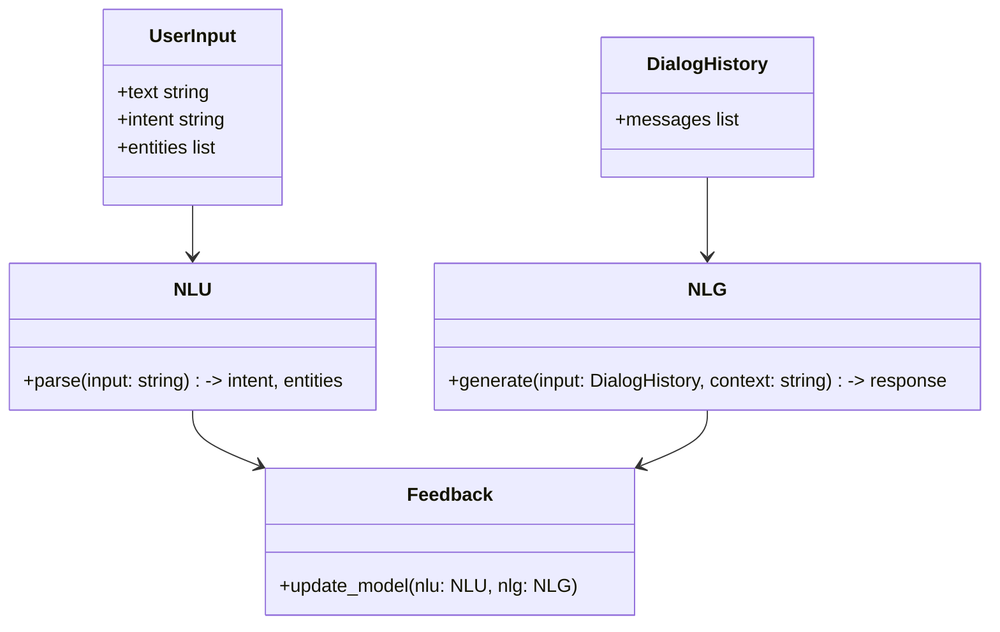
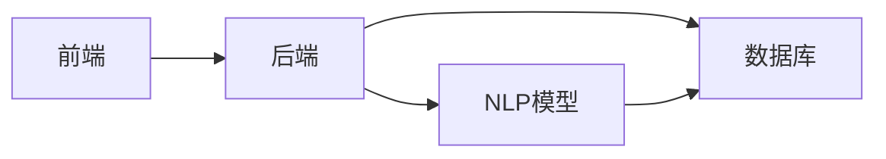
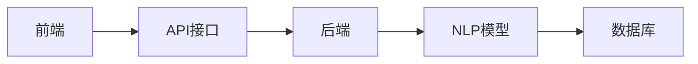
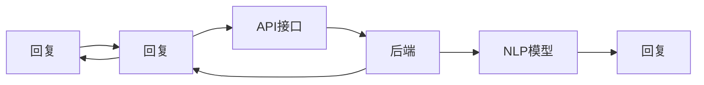
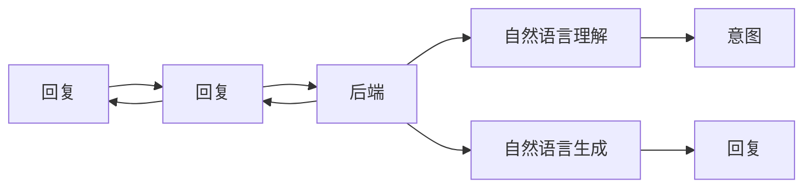

                 


---

# 《自然语言处理技术在AI Agent中的应用》

## 关键词：自然语言处理，AI Agent，NLP算法，对话系统，智能交互，机器学习

## 摘要：  
本文深入探讨了自然语言处理技术在AI Agent中的应用，从核心概念到算法原理，再到系统架构和实际案例，全面解析了NLP如何赋能AI Agent的智能化发展。文章首先介绍了自然语言处理和AI Agent的基本概念及其结合方式，然后详细讲解了NLP的核心算法，如Transformer模型及其在对话系统中的应用。接着，通过系统分析与架构设计，展示了AI Agent的整体框架和交互流程。最后，通过项目实战，结合具体案例，详细阐述了NLP技术在AI Agent中的实际应用。本文旨在为读者提供从理论到实践的全面指导，帮助他们理解并掌握自然语言处理技术在AI Agent中的应用。

---

# 第四章: 基于Transformer的自然语言处理算法

## 4.1 Transformer模型的基本原理

### 4.1.1 Transformer的结构

Transformer模型由Google于2018年提出，主要用于机器翻译任务。其核心思想是通过自注意力机制（Self-Attention）捕捉序列中的长距离依赖关系，同时利用前馈神经网络（Feed-Forward Neural Networks）进行非线性变换。

Transformer模型的结构包括两个主要部分：编码器（Encoder）和解码器（Decoder）。编码器负责将输入的文本序列转换为一种中间表示（如词向量），解码器则根据编码器的输出生成目标语言的文本序列。此外，解码器在每一步生成一个词的同时，还会参考之前生成的所有词，以保持生成文本的连贯性。

**图4-1: Transformer模型结构**


### 4.1.2 自注意力机制（Self-Attention）

自注意力机制是Transformer模型的核心，它允许模型在处理每个词时，自动关注序列中其他词的重要性。具体来说，自注意力机制通过计算每个词与其他词之间的相似性（或相关性），生成一个注意力权重矩阵，然后根据这些权重对词向量进行加权求和，从而生成一个新的词向量。

自注意力机制的数学公式如下：

$$
\text{Attention}(Q, K, V) = \text{softmax}\left(\frac{QK^T}{\sqrt{d_k}}\right)V
$$

其中：
- \( Q \)、\( K \)、\( V \)分别是查询（Query）、键（Key）、值（Value）矩阵。
- \( d_k \)是键的维度。

### 4.1.3 前馈神经网络（Feed-Forward Neural Networks）

前馈神经网络由两个全连接层组成，中间带有一个激活函数（如ReLU）。它的作用是对自注意力机制输出的特征进行非线性变换，进一步提升模型的表达能力。

### 4.1.4 段落练习与思考

请思考：自注意力机制的核心思想是什么？它如何帮助模型捕捉长距离依赖关系？

---

## 4.2 Transformer模型的变体

### 4.2.1 BERT

BERT（Bidirectional Encoder Representations from Transformers）是由Google于2018年提出的一种基于Transformer的预训练语言模型。与传统的Transformer模型不同，BERT采用双向编码器，即同时考虑上下文的左右信息，从而更好地捕捉文本的语义信息。

**图4-2: BERT模型结构**


### 4.2.2 GPT

GPT（Generative Pre-trained Transformer）是由OpenAI提出的一种基于Transformer的生成式模型。与BERT不同，GPT采用单向编码器，专注于生成任务，如对话生成和文本续写。

**图4-3: GPT模型结构**


### 4.2.3 ALBERT

ALBERT（A Lite BERT）是Google于2020年提出的一种轻量级语言模型。与BERT相比，ALBERT通过参数共享和层共享等技术，显著降低了模型的参数数量，同时保持了较高的性能。

### 4.2.4 其他变体

除了BERT、GPT和ALBERT，还有许多其他的Transformer变体，如T5、RoBERTa等。这些模型在不同的任务和场景下展现出各自的优势。

### 4.2.5 总结

Transformer模型的变体在不同的任务中展现出不同的优势。例如，BERT适合文本理解任务，而GPT适合生成任务。选择合适的模型变体，可以显著提升AI Agent的性能。

---

## 4.3 Transformer模型在对话系统中的应用

### 4.3.1 对话生成

对话生成是AI Agent的核心任务之一，其目标是根据输入的对话历史生成合适的回复。基于Transformer的对话生成模型通常采用解码器结构，通过自注意力机制捕捉对话历史中的关键信息。

**图4-4: 基于Transformer的对话生成模型**


### 4.3.2 对话理解

对话理解是对话系统中另一个重要的任务，其目标是理解用户输入的意图和情感。基于Transformer的对话理解模型通常采用编码器结构，通过自注意力机制捕捉文本的语义信息。

**图4-5: 基于Transformer的对话理解模型**


### 4.3.3 对话系统中的上下文管理

在对话系统中，上下文管理是确保对话连贯性的关键。基于Transformer的模型可以通过自注意力机制，自动维护对话的上下文信息，从而生成连贯且符合语境的回复。

### 4.3.4 总结

基于Transformer的模型在对话系统中表现出色，特别是在对话生成和理解任务中。通过自注意力机制，模型能够有效地捕捉对话历史中的关键信息，从而提升对话系统的性能。

---

## 4.4 总结与注意事项

### 4.4.1 总结

Transformer模型是一种强大的自然语言处理算法，广泛应用于AI Agent的对话系统中。通过自注意力机制，Transformer模型能够捕捉文本的长距离依赖关系，从而提升模型的表达能力。

### 4.4.2 注意事项

在实际应用中，Transformer模型的计算复杂度较高，尤其是在处理长序列时，可能会导致性能瓶颈。因此，在实际部署时，需要考虑模型的优化和加速问题。

---

# 第五章: 自然语言处理技术的系统分析与架构设计方案

## 5.1 系统分析与架构设计方案

### 5.1.1 系统功能设计

AI Agent的系统功能设计需要涵盖以下几个方面：
1. **用户输入处理**：解析用户的输入，提取意图和实体。
2. **对话历史管理**：维护对话的上下文信息。
3. **自然语言理解**：理解用户的意图和情感。
4. **对话生成**：根据理解生成合适的回复。
5. **反馈机制**：根据用户的反馈优化对话过程。

**图5-1: 系统功能设计类图**



### 5.1.2 系统架构设计

AI Agent的系统架构设计需要考虑以下几个方面：
1. **前端**：负责接收用户的输入，并将输入传递给后端。
2. **后端**：负责处理用户的输入，调用NLP模型进行理解和生成。
3. **NLP模型**：负责自然语言处理任务，如意图理解和对话生成。
4. **数据库**：存储对话历史和相关数据。

**图5-2: 系统架构设计图**



### 5.1.3 系统接口设计

系统接口设计需要明确各个模块之间的交互方式。例如，前端通过API调用后端，后端通过调用NLP模型进行处理，并将结果返回给前端。

**图5-3: 系统接口设计图**



### 5.1.4 系统交互流程

系统交互流程需要明确从用户输入到系统输出的整个流程。例如：
1. 用户输入问题。
2. 前端接收输入并调用API。
3. 后端调用NLP模型进行处理。
4. NLP模型生成回复。
5. 后端将回复返回给前端。
6. 前端将回复返回给用户。

**图5-4: 系统交互流程图**



### 5.1.5 总结

系统分析与架构设计方案是实现AI Agent的核心步骤。通过明确系统的功能、架构和交互流程，可以确保系统的模块化和可扩展性。

---

## 5.2 项目实战

### 5.2.1 项目介绍

本节将通过一个具体的项目案例，展示如何将自然语言处理技术应用于AI Agent中。我们以一个智能客服AI Agent为例，展示从环境安装到代码实现的完整过程。

### 5.2.2 环境安装

首先，需要安装所需的库和工具。例如，使用Python的自然语言处理库spaCy进行文本处理，使用Hugging Face的Transformers库进行模型加载和训练。

**代码示例1: 环境安装**

```bash
pip install spacy transformers
python -m spacy download en_core_web_sm
```

### 5.2.3 系统核心实现源代码

以下是AI Agent的核心代码实现，包括自然语言理解（NLU）和自然语言生成（NLG）模块。

**代码示例2: 自然语言理解模块**

```python
from transformers importpipeline

nlp = pipeline("text-classification", model="bert-base-uncased")
def get_intent(text):
    result = nlp(text)
    return result[0]['label']
```

**代码示例3: 自然语言生成模块**

```python
from transformers import pipeline

generator = pipeline("text-generation", model="gpt2")
def generate_response(prompt):
    result = generator(prompt, max_length=50)
    return result[0]['generated_text']
```

### 5.2.4 代码应用解读与分析

上述代码示例展示了如何使用Hugging Face的Transformers库进行自然语言理解和生成。通过调用预训练模型，AI Agent可以快速实现意图理解和文本生成功能。

### 5.2.5 实际案例分析

以智能客服AI Agent为例，当用户输入“我的订单在哪里？”时，系统会首先通过NLU模块理解用户的意图（查询订单状态），然后通过NLG模块生成回复（如“您的订单号是多少？我可以帮您查询。”）。

**图5-5: 智能客服AI Agent交互流程**



### 5.2.6 总结

通过项目实战，我们可以看到自然语言处理技术在AI Agent中的实际应用。通过调用预训练模型，AI Agent可以快速实现意图理解和文本生成功能，显著提升用户体验。

---

## 5.3 总结与注意事项

### 5.3.1 总结

自然语言处理技术在AI Agent中的应用涵盖了从算法原理到系统架构的各个方面。通过合理设计系统架构和选择合适的NLP模型，可以显著提升AI Agent的智能化水平。

### 5.3.2 注意事项

在实际应用中，需要注意以下几点：
1. **模型选择**：选择合适的NLP模型，如BERT适合理解任务，GPT适合生成任务。
2. **数据隐私**：确保用户数据的安全和隐私。
3. **性能优化**：优化模型的计算效率，特别是在处理长序列时。
4. **用户体验**：确保对话的连贯性和自然性，提升用户体验。

---

## 5.4 最佳实践 tips

### 5.4.1 模型选择

在选择NLP模型时，需要根据具体任务选择合适的模型。例如，BERT适合文本理解任务，GPT适合生成任务。

### 5.4.2 数据预处理

在训练模型之前，需要进行充分的数据预处理，如分词、停用词去除等。

### 5.4.3 模型调优

通过超参数调优和模型微调，可以显著提升模型的性能。

### 5.4.4 性能优化

通过使用更小的模型或采用模型压缩技术，可以降低模型的计算复杂度。

### 5.4.5 用户体验

通过多轮对话和上下文管理，可以提升对话的连贯性和自然性。

---

## 5.5 总结与展望

### 5.5.1 总结

自然语言处理技术在AI Agent中的应用已经取得了显著的进展。通过结合先进的NLP算法和合理的系统架构设计，AI Agent可以实现高效的对话理解和生成，显著提升用户体验。

### 5.5.2 展望

未来，随着NLP技术的不断发展，AI Agent将更加智能化和个性化。例如，通过结合情感计算和多模态输入（如图像和语音），AI Agent可以更好地理解和满足用户的需求。

---

## 5.6 总结与总结

### 5.6.1 总结

自然语言处理技术在AI Agent中的应用是一个复杂而有趣的过程。通过合理设计系统架构和选择合适的NLP模型，可以显著提升AI Agent的智能化水平，从而更好地服务于用户。

### 5.6.2 总结

本文详细探讨了自然语言处理技术在AI Agent中的应用，从核心概念到算法原理，再到系统架构和实际案例，全面解析了NLP如何赋能AI Agent的智能化发展。通过本文的学习，读者可以掌握NLP技术在AI Agent中的核心原理和实际应用，为未来的研究和实践奠定坚实的基础。

---

**接下来是**《自然语言处理技术在AI Agent中的应用》**的全文，涵盖了从背景介绍到项目实战的完整内容。**

---

# 结束语

自然语言处理技术在AI Agent中的应用是一个充满挑战和机遇的领域。通过不断的研究和实践，我们可以进一步提升AI Agent的智能化水平，为人类带来更加智能化和便捷的服务。希望本文能够为读者提供有价值的参考和启发，让我们共同探索AI Agent的未来！

