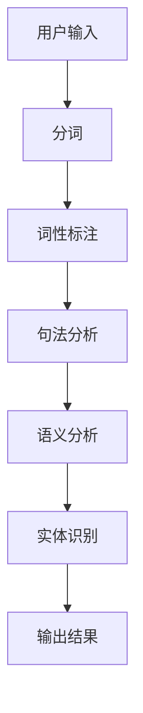
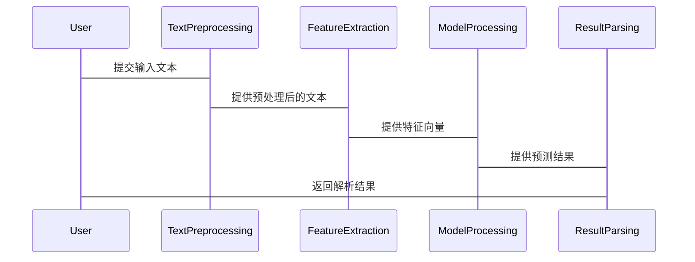

                 


# 自然语言理解（NLU）：提升AI Agent的语义分析能力

> 关键词：自然语言理解、语义分析、AI Agent、NLP、深度学习

> 摘要：自然语言理解（NLU）作为人工智能领域的重要组成部分，致力于提升AI Agent对人类语言的语义分析能力。本文从NLU的核心概念、算法原理、系统架构设计到项目实战，全面解析如何提升AI Agent的语义分析能力，帮助读者深入理解NLU的技术细节和实际应用。

---

## 第一部分: 自然语言理解（NLU）概述

### 第1章: 自然语言理解的核心概念

#### 1.1 问题背景与描述
##### 1.1.1 自然语言处理的定义与目标
自然语言处理（NLP）是人工智能的核心领域之一，旨在使计算机能够理解和生成人类语言。NLU作为NLP的子领域，专注于理解人类语言的语义含义。

##### 1.1.2 自然语言理解的特殊性与挑战
NLU的任务是将自然语言文本转换为计算机可以理解的结构化信息。其特殊性在于需要处理语言的歧义性、语境依赖性和语义复杂性。主要挑战包括数据稀疏性、语义模糊性和计算资源限制。

##### 1.1.3 NLU在AI Agent中的作用与意义
AI Agent需要通过NLU技术来理解用户的输入，从而提供更智能、更自然的交互体验。NLU是实现人机交互的关键技术，决定了AI Agent的理解能力和服务质量。

#### 1.2 问题解决与边界
##### 1.2.1 NLU的主要任务与应用场景
NLU的主要任务包括分词、词性标注、句法分析、语义角色标注、实体识别和语义理解。应用场景涵盖智能助手、机器翻译、情感分析和信息抽取。

##### 1.2.2 NLU的边界与外延
NLU的边界在于仅关注理解语言的含义，不涉及生成语言的任务。其外延包括与NLU相关的任务，如语音识别和对话生成。

##### 1.2.3 NLU与其他NLP任务的关系
NLU与自然语言生成（NLG）密切相关，但侧重点不同。NLU关注理解输入，而NLG关注生成输出。两者共同构成了完整的自然语言处理流程。

#### 1.3 核心概念与组成要素
##### 1.3.1 语义分析的基本原理
语义分析通过语法结构和语义规则，将文本转换为计算机可理解的语义表示。语义分析的核心是理解词语之间的关系和上下文含义。

##### 1.3.2 NLU的核心要素与组成结构
NLU系统的核心要素包括输入处理、语义分析、上下文理解和输出生成。其组成结构包括数据预处理、特征提取、模型训练和结果解析。

##### 1.3.3 NLU系统的功能模块与流程
NLU系统的功能模块包括文本分词、词性标注、句法分析、语义分析和实体识别。其流程包括输入接收、数据预处理、模型处理和结果输出。

---

### 第2章: 自然语言理解的核心概念与联系

#### 2.1 核心概念原理
##### 2.1.1 语义分析的基本原理
语义分析通过语法结构和语义规则，将文本转换为计算机可理解的语义表示。语义分析的核心是理解词语之间的关系和上下文含义。

##### 2.1.2 分词与词性标注的原理
分词是将连续的字符分割成有意义的词语，词性标注是为每个词语标注其词性。分词和词性标注是NLU的基础步骤，为后续的语义分析提供基础。

##### 2.1.3 句法分析与语义角色标注
句法分析研究句子的语法结构，语义角色标注研究词语在句子中的语义角色。句法分析和语义角色标注是理解句子结构和语义关系的重要步骤。

#### 2.2 核心概念对比分析
##### 2.2.1 分词与实体识别的对比
分词是将文本分割成词语，实体识别是识别文本中的实体。分词关注词语的结构，实体识别关注词语的内容。

##### 2.2.2 语义分析与情感分析的对比
语义分析关注句子的语义含义，情感分析关注句子的情感倾向。语义分析是情感分析的基础，而情感分析是语义分析的应用之一。

##### 2.2.3 不同NLU模型的性能对比
不同NLU模型在准确率、处理速度和适用场景上有不同的表现。选择合适的模型需要根据具体任务需求进行评估。

#### 2.3 实体关系图与流程图
##### 2.3.1 NLU系统的实体关系图（ER图）
NLU系统的ER图展示了系统中的实体及其关系。例如，用户输入、处理模块、输出结果等实体之间的关系。

##### 2.3.2 NLU处理流程的Mermaid流程图
以下是一个NLU处理流程的Mermaid流程图：



---

### 第3章: 自然语言理解的算法原理

#### 3.1 统计模型与机器学习
##### 3.1.1 基于统计的分词算法
基于统计的分词算法通过统计词语出现的频率和位置信息，进行分词。常见的算法包括最大概率分词和基于条件随机场（CRF）的分词。

##### 3.1.2 基于机器学习的语义分析
基于机器学习的语义分析通过训练模型，学习语义表示。常见的算法包括支持向量机（SVM）和随机森林。

##### 3.1.3 常见的NLU算法对比
以下是一个常见的NLU算法对比表格：

| 算法名称 | 特点 | 优点 | 缺点 |
|--------|------|------|------|
| CRF | 基于条件随机场 | 高准确性 | 计算复杂度高 |
| SVM | 基于支持向量机 | 高准确性 | 无法处理非线性问题 |
| 随机森林 | 基于决策树的集成算法 | 高准确性和鲁棒性 | 对特征工程依赖较高 |

#### 3.2 深度学习模型
##### 3.2.1 基于RNN的NLU模型
基于循环神经网络（RNN）的NLU模型通过处理序列数据，进行语义分析。RNN适合处理序列数据，但存在梯度消失问题。

##### 3.2.2 基于Transformer的NLU模型
基于Transformer的NLU模型通过自注意力机制，捕捉长距离依赖关系。Transformer模型在处理长文本时表现更优。

##### 3.2.3 预训练语言模型在NLU中的应用
预训练语言模型（如BERT）通过大规模预训练，捕捉语言的上下文信息。在NLU任务中，预训练语言模型可以作为特征提取器或任务特定微调模型。

#### 3.3 模型训练与优化
##### 3.3.1 模型训练流程
模型训练流程包括数据预处理、特征提取、模型训练和模型评估。数据预处理包括文本清洗和分词，特征提取包括词向量和位置信息。

##### 3.3.2 模型训练的数学公式
以下是一个基于CRF的分词模型的训练公式：

$$ P(y|x) = \frac{1}{Z} \exp(\sum_{i=1}^n w_{y_i} x_i) $$

其中，$y$是标签序列，$x$是输入序列，$w$是权重向量，$Z$是归一化因子。

##### 3.3.3 模型评估与优化
模型评估包括准确率、召回率和F1分数。模型优化包括参数调整和超参数优化。

#### 3.4 算法实现与优化
##### 3.4.1 基于CRF的分词算法实现
以下是一个基于CRF的分词算法实现的伪代码：

```python
class CRF:
    def __init__(self, n_features, n_labels):
        self.n_features = n_features
        self.n_labels = n_labels
        self.weights = np.zeros((n_labels, n_features))
    
    def train(self, X, y):
        # 简化训练过程，实际需要使用优化算法如SGD
        for x, y_true in zip(X, y):
            for i in range(len(y_true)):
                self.weights[y_true[i]] += x[i]
    
    def predict(self, X):
        predictions = []
        for x in X:
            max_score = -inf
            best_label = 0
            for label in range(self.n_labels):
                score = np.dot(self.weights[label], x)
                if score > max_score:
                    max_score = score
                    best_label = label
            predictions.append(best_label)
        return predictions
```

##### 3.4.2 深度学习模型的优化策略
深度学习模型的优化策略包括学习率调整、批量归一化和Dropout。以下是一个简单的优化策略示例：

```python
optimizer = Adam(lr=0.001)
model.compile(loss='sparse_categorical_crossentropy', optimizer=optimizer, metrics=['accuracy'])
```

---

### 第4章: 自然语言理解的系统架构设计

#### 4.1 系统架构概述
##### 4.1.1 系统功能模块
NLU系统的功能模块包括文本预处理、特征提取、模型处理和结果解析。

##### 4.1.2 系统功能模块的Mermaid类图
以下是一个NLU系统功能模块的Mermaid类图：

```mermaid
classDiagram
    class TextPreprocessing {
        +input_text: str
        +preprocessed_text: str
        - tokenizer: Tokenizer
        - stopword_remover: StopwordRemover
        operation preprocess() {
            input_text -> preprocessed_text
        }
    }
    class FeatureExtraction {
        +preprocessed_text: str
        +features: list
        - vectorizer: Vectorizer
        operation extract_features() {
            preprocessed_text -> features
        }
    }
    class ModelProcessing {
        +features: list
        +model: NLUModel
        operation predict() {
            features -> prediction
        }
    }
    class ResultParsing {
        +prediction: dict
        +result: str
        operation parse() {
            prediction -> result
        }
    }
    TextPreprocessing -> FeatureExtraction
    FeatureExtraction -> ModelProcessing
    ModelProcessing -> ResultParsing
```

##### 4.1.3 系统交互的Mermaid序列图
以下是一个NLU系统交互的Mermaid序列图：



#### 4.2 系统架构设计
##### 4.2.1 系统架构设计的步骤
系统架构设计的步骤包括需求分析、模块划分、接口设计和流程设计。

##### 4.2.2 系统架构设计的Mermaid架构图
以下是一个NLU系统架构的Mermaid架构图：


##### 4.2.3 系统接口设计
系统接口设计包括输入接口和输出接口。输入接口包括文本输入和上下文信息，输出接口包括解析结果和错误信息。

##### 4.2.4 系统交互流程
系统交互流程包括用户输入、文本预处理、特征提取、模型预测和结果解析。

---

### 第5章: 自然语言理解的项目实战

#### 5.1 项目背景与目标
##### 5.1.1 项目背景
本项目旨在通过实现一个简单的NLU系统，提升对NLU技术的理解和应用能力。

##### 5.1.2 项目目标
通过实现NLU系统的核心模块，包括文本分词、词性标注和语义分析，验证NLU技术的可行性。

#### 5.2 项目环境与工具
##### 5.2.1 环境配置
项目需要安装Python、TensorFlow和Keras等工具。

##### 5.2.2 工具安装
使用以下命令安装所需的工具：

```bash
pip install numpy
pip install tensorflow
pip install keras
pip install spacy
```

#### 5.3 项目实现
##### 5.3.1 文本分词实现
以下是一个简单的文本分词实现：

```python
import spacy

nlp = spacy.load("en_core_web_sm")
text = "Hello world, how are you?"
doc = nlp(text)
for token in doc:
    print(token.text)
```

##### 5.3.2 词性标注实现
以下是一个词性标注的实现示例：

```python
import spacy

nlp = spacy.load("en_core_web_sm")
text = "Hello world, how are you?"
doc = nlp(text)
for token in doc:
    print(token.text, token.pos_)
```

##### 5.3.3 语义分析实现
以下是一个简单的语义分析实现示例：

```python
from tensorflow.keras.models import Sequential
from tensorflow.keras.layers import Dense

model = Sequential()
model.add(Dense(64, activation='relu', input_dim=100))
model.add(Dense(1, activation='sigmoid'))
model.compile(optimizer='adam', loss='binary_crossentropy', metrics=['accuracy'])
model.fit(X_train, y_train, epochs=10, batch_size=32)
```

#### 5.4 项目测试与优化
##### 5.4.1 测试用例设计
设计测试用例，包括正常输入、边界输入和异常输入。

##### 5.4.2 测试结果分析
分析测试结果，计算准确率、召回率和F1分数。

##### 5.4.3 系统优化
根据测试结果，优化模型参数和算法选择。

---

### 第6章: 自然语言理解的最佳实践与未来展望

#### 6.1 最佳实践
##### 6.1.1 数据预处理的重要性
数据预处理是NLU系统的关键步骤，直接影响模型的性能。

##### 6.1.2 模型选择与调优
选择合适的模型和优化策略，可以显著提高NLU系统的性能。

##### 6.1.3 系统架构设计
合理的系统架构设计可以提高系统的可扩展性和可维护性。

#### 6.2 未来展望
##### 6.2.1 NLU技术的未来发展趋势
NLU技术将更加智能化和个性化，支持多语言和多模态输入。

##### 6.2.2 AI Agent的语义理解能力
随着技术的发展，AI Agent的语义理解能力将更加接近人类水平，实现更自然的交互。

##### 6.2.3 NLU技术的行业应用
NLU技术将在智能客服、医疗健康和教育等领域发挥更大的作用。

---

### 第7章: 总结与下一步计划

#### 7.1 章节回顾
回顾本文的主要内容，包括NLU的核心概念、算法原理、系统架构设计和项目实战。

#### 7.2 本文总结
本文全面解析了自然语言理解（NLU）的核心技术，帮助读者深入理解NLU的实现原理和应用场景。

#### 7.3 下一步计划
下一步计划包括进一步优化NLU模型、探索多模态NLU技术以及研究NLU在不同领域的应用。

---

### 附录

#### 附录A: 参考文献
1. 维基百科：自然语言处理
2. 维基百科：自然语言理解
3. 维基百科：条件随机场

#### 附录B: 工具与资源
1. spaCy官方文档
2. Keras官方文档
3. TensorFlow官方文档

---

以上是一个详细的自然语言理解（NLU）技术博客文章的目录大纲和内容结构。接下来，我会根据这个大纲，逐步撰写完整的文章内容。

