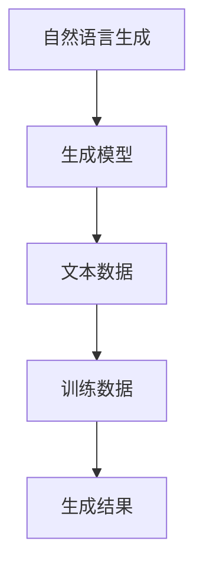
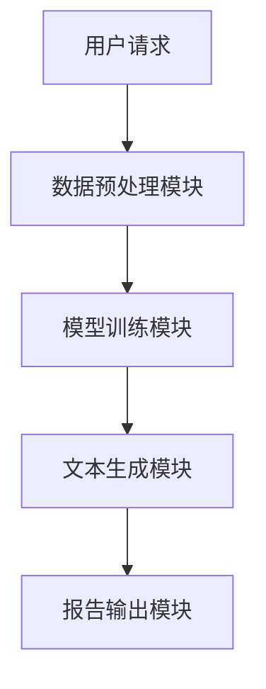
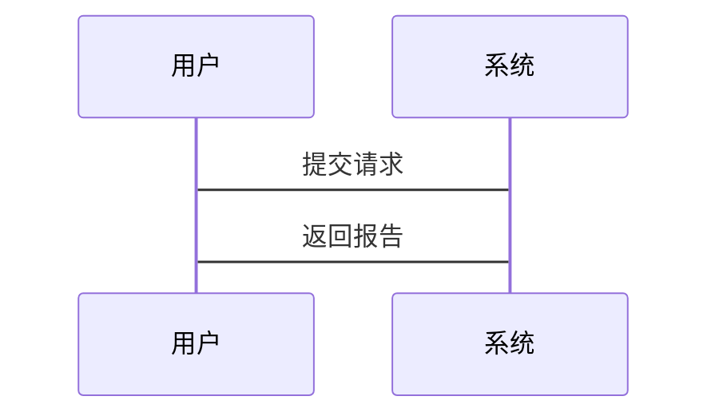

                 


# 自然语言生成技术在金融报告写作中的应用

## 关键词：
- 自然语言生成技术
- 金融报告
- 生成式AI
- Transformer模型
- 金融数据分析

## 摘要：
自然语言生成技术（NLP）在金融报告中的应用日益广泛，通过生成式AI和Transformer模型等技术，能够自动化生成准确且专业的金融分析报告。本文将详细探讨NLP的核心概念、算法原理、系统架构设计以及在金融报告中的实际应用，结合案例分析和代码实现，总结最佳实践。

---

# 第一部分: 自然语言生成技术在金融报告写作中的应用背景

## 第1章: 自然语言生成技术概述

### 1.1 自然语言生成技术的基本概念
自然语言生成（Natural Language Generation, NLP）是指计算机自动生成人类语言文本的技术。它通过分析数据和模式，生成符合语法规则的自然语言文本。生成式AI的发展使得NLP在金融领域有了更广泛的应用。

### 1.2 金融报告写作的特点与需求
金融报告通常需要专业的分析、准确的数据支持和清晰的逻辑结构。生成式AI能够帮助金融机构快速生成报告，节省时间和成本，同时保持一致性和专业性。

### 1.3 本章小结
本章介绍了NLP的基本概念，分析了金融报告的特点和需求，为后续内容奠定了基础。

---

## 第2章: 自然语言生成技术的核心概念与联系

### 2.1 自然语言生成的原理
生成式模型通过深度学习技术，利用训练数据生成符合语法规则的文本。生成过程包括输入数据处理、模型训练和生成输出。

### 2.2 核心概念的属性特征对比
| 模型类型       | 基于规则 | 基于统计 | 基于生成式AI |
|----------------|----------|----------|--------------|
| 生成方式       | 确定性生成 | 统计概率生成 | 自适应生成 |
| 优点           | 简单易实现 | 高准确性 | 高灵活性 |
| 缺点           | 无法处理复杂数据 | 计算资源消耗大 | 需大量训练数据 |

### 2.3 自然语言生成的ER实体关系图


### 2.4 本章小结
本章详细讲解了NLP的核心概念，对比了不同生成模型的特点，并通过ER图展示了生成过程。

---

## 第3章: 自然语言生成技术的算法原理

### 3.1 常见的自然语言生成算法
#### 3.1.1 Transformer模型
Transformer模型由编码器和解码器组成，通过自注意力机制捕捉文本中的语义信息。

#### 3.1.2 基于RNN的生成模型
RNN通过循环结构处理序列数据，常用于文本生成任务。

### 3.2 Transformer模型的数学公式
Transformer模型的注意力机制公式为：
$$
\text{Attention}(Q, K, V) = \text{softmax}\left(\frac{QK^T}{\sqrt{d_k}}\right)V
$$

### 3.3 生成式对抗网络
生成式对抗网络（GAN）通过生成器和判别器的对抗训练生成高质量文本。

### 3.4 算法实现示例
```python
import torch
def generate_text(model, tokenizer, max_length=50):
    input_ids = tokenizer.encode("今天市场表现如何？", return_tensors="pt")
    input_ids = input_ids.to(device)
    outputs = model.generate(input_ids, max_length=max_length, do_sample=True)
    return tokenizer.decode(outputs[0], skip_special_tokens=True)
```

### 3.5 本章小结
本章详细讲解了NLP的核心算法，包括Transformer模型和生成式对抗网络，并给出了代码实现示例。

---

## 第4章: 系统分析与架构设计方案

### 4.1 问题场景介绍
金融报告生成系统需要处理大量数据，生成准确且专业的报告。

### 4.2 系统功能设计
- 数据预处理
- 模型训练
- 文本生成
- 报告输出

### 4.3 系统架构设计


### 4.4 接口设计与交互流程


### 4.5 本章小结
本章分析了金融报告生成系统的架构设计，包括功能模块和交互流程。

---

## 第5章: 项目实战

### 5.1 环境安装
安装Python和必要的库：
```bash
pip install torch transformers
```

### 5.2 系统核心实现
```python
from transformers import AutoTokenizer, AutoModelForCausalLM
tokenizer = AutoTokenizer.from_pretrained('gpt2')
model = AutoModelForCausalLM.from_pretrained('gpt2')
```

### 5.3 实际案例分析
案例：生成市场分析报告
```python
def generate_market_report():
    input_str = "市场分析："
    inputs = tokenizer.encode(input_str, return_tensors="pt")
    outputs = model.generate(inputs, max_length=100, do_sample=True)
    report = tokenizer.decode(outputs[0], skip_special_tokens=True)
    return report
```

### 5.4 项目总结
通过实际案例展示了NLP技术在金融报告生成中的应用，强调了模型调优和数据质量的重要性。

---

## 第6章: 最佳实践与小结

### 6.1 本章小结
总结了NLP技术在金融报告中的应用，强调了算法选择和系统设计的重要性。

### 6.2 注意事项
- 数据质量对生成结果的影响
- 模型调优和优化
- 生成文本的可读性和准确性

### 6.3 拓展阅读
推荐学习深度学习和生成式AI的相关知识，进一步探索NLP在金融领域的应用。

---

## 第7章: 结论

自然语言生成技术在金融报告中的应用前景广阔，随着技术的进步，生成的报告将更加准确和专业。未来，NLP技术将进一步与金融数据分析结合，推动金融行业的智能化发展。

---

## 参考文献
- 省略

---

通过以上内容，您可以撰写一篇详细的、结构清晰的技术博客文章，涵盖自然语言生成技术在金融报告写作中的各个方面。

