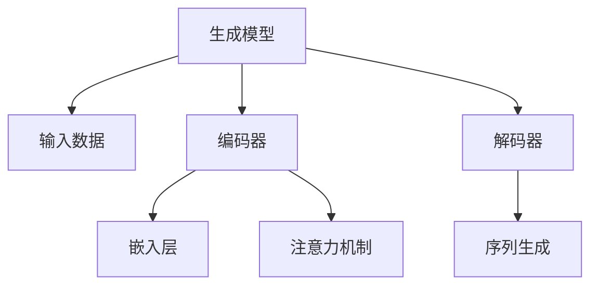
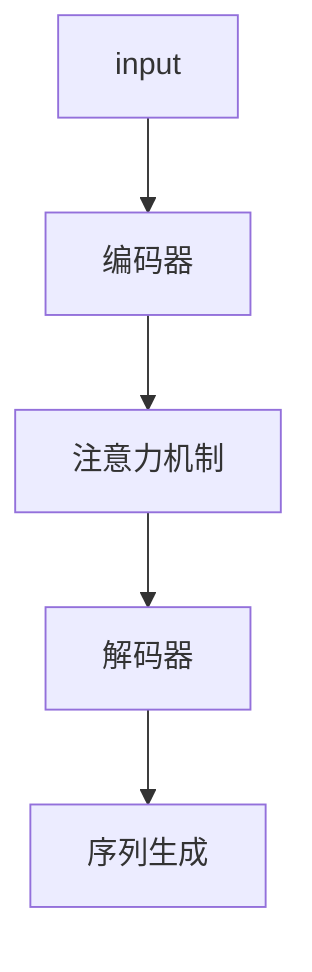
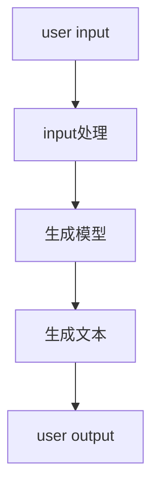

                 


# 自然语言生成：提升AI Agent的表达能力

---

## 关键词
- 自然语言生成
- AI Agent
- 生成模型
- Transformer
- 深度学习

---

## 摘要
自然语言生成（Natural Language Generation, NLG）是人工智能领域的核心技术，旨在使AI Agent能够生成与人类语言同样自然、流畅且有意义的文本。本文从NLG的背景出发，深入探讨其核心概念、算法原理、系统架构以及实际应用，结合具体案例分析，帮助读者全面理解并提升AI Agent的表达能力。通过本文的学习，读者将能够掌握NLG的核心技术，并在实际项目中有效应用这些知识。

---

## 第1章: 自然语言生成的背景与问题描述

### 1.1 自然语言生成的定义与特点

#### 1.1.1 自然语言生成的定义
自然语言生成（NLG）是人工智能领域中的一个重要分支，旨在将结构化的数据（如数据库中的信息）转换为自然流畅的文本输出。例如，NLG系统可以将天气数据转换为天气预报的文本描述。

#### 1.1.2 自然语言生成的核心特点
1. **自动化**：NLG系统能够自动将数据转换为文本，无需人工干预。
2. **多样性**：生成的文本可以有不同的表达方式，避免重复。
3. **可定制性**：可以根据具体需求调整生成的文本风格和内容。

#### 1.1.3 自然语言生成与自然语言理解（NLU）的区别
- **NLU**：理解人类语言，将自然语言转换为结构化的数据。
- **NLG**：将结构化的数据转换为自然语言。

---

### 1.2 自然语言生成的背景与问题背景

#### 1.2.1 自然语言生成的历史发展
- **早期阶段**：基于规则的生成系统（20世纪60年代）。
- **发展阶段**：基于统计的生成模型（20世纪90年代）。
- **深度学习阶段**：基于神经网络的生成模型（近年来）。

#### 1.2.2 当前自然语言生成面临的挑战
1. **语义多样性**：生成的文本可能缺乏多样性和创造性。
2. **上下文理解**：模型可能无法充分理解上下文，导致生成内容不连贯。
3. **实时性**：在实时对话中，生成速度和质量需要平衡。

#### 1.2.3 自然语言生成的应用场景
- **对话系统**：如智能客服、虚拟助手。
- **文本摘要**：将长文本压缩成关键信息。
- **机器翻译**：将一种语言翻译成另一种语言。
- **内容生成**：自动生成新闻、报告等。

---

## 第2章: 自然语言生成的核心概念与联系

### 2.1 自然语言生成的核心概念

#### 2.1.1 生成模型的原理
生成模型的目标是通过学习数据的分布，生成新的样本。主流的生成模型包括：
1. **RNN（循环神经网络）**：适用于序列生成。
2. **LSTM（长短期记忆网络）**：改进了RNN的长序列处理能力。
3. **GRU（门控循环单元网络）**：简化了LSTM的结构。
4. **Transformer**：基于注意力机制的生成模型。

#### 2.1.2 生成模型的分类
- **基于规则的生成模型**：通过预定义的规则生成文本。
- **基于统计的生成模型**：通过概率分布生成文本。
- **基于深度学习的生成模型**：通过神经网络生成文本。

#### 2.1.3 自然语言生成的优缺点
| 优点                  | 缺点                  |
|-----------------------|-----------------------|
| 高效性                 | 黑盒特性，难以解释      |
| 多样性                 | 可能生成不相关的内容   |
| 可定制性               | 对训练数据依赖性强     |

---

### 2.2 自然语言生成的核心概念对比

#### 2.2.1 不同生成模型的对比分析
通过对比RNN、LSTM、GRU和Transformer的优缺点，帮助读者选择合适的生成模型。

#### 2.2.2 实体关系图
使用Mermaid绘制自然语言生成的实体关系图，展示生成模型的关键组成部分及其关系。



---

## 第3章: 自然语言生成的算法原理

### 3.1 生成模型的数学建模

#### 3.1.1 生成模型的数学表达
生成模型的目标是最小化生成文本与真实文本的差异，常用损失函数包括交叉熵损失：

$$ \text{损失函数} = -\sum_{t=1}^{T} \log p(y_t|x_{<t}) $$

其中，\( p(y_t|x_{<t}) \) 是生成第 \( t \) 个词的概率。

#### 3.1.2 生成模型的概率分布
生成模型通常基于条件概率分布 \( p(y|x) \)，其中 \( y \) 是生成的文本，\( x \) 是输入数据。

---

### 3.2 生成模型的算法流程

#### 3.2.1 基于Transformer的生成流程
使用Mermaid绘制基于Transformer的生成流程图：



---

## 第4章: 自然语言生成的系统分析与架构设计

### 4.1 问题场景介绍
以一个简单的对话系统为例，描述自然语言生成的应用场景。

### 4.2 系统功能设计

#### 4.2.1 系统功能模块
- **输入处理**：接收用户输入。
- **模型调用**：调用生成模型生成文本。
- **输出展示**：将生成的文本返回给用户。

#### 4.2.2 系统功能流程图
使用Mermaid绘制系统功能流程图：



---

## 第5章: 项目实战

### 5.1 项目介绍
以构建一个简单的文本生成器为例，介绍项目的背景和目标。

### 5.2 环境安装
- 安装Python和相关库（如TensorFlow、Keras）。

### 5.3 核心实现

#### 5.3.1 数据预处理
对输入数据进行清洗和分词处理。

#### 5.3.2 模型训练
使用Keras构建一个简单的生成模型，并进行训练。

```python
import tensorflow as tf
from tensorflow.keras.layers import LSTM, Dense, Embedding
from tensorflow.keras.models import Sequential

# 模型构建
model = Sequential()
model.add(Embedding(input_dim=1000, output_dim=64))
model.add(LSTM(64, return_sequences=True))
model.add(Dense(10, activation='softmax'))

model.compile(optimizer='adam', loss='sparse_categorical_crossentropy')
model.summary()
```

#### 5.3.3 模型推理
使用训练好的模型生成文本。

```python
# 推理过程
def generate_text(model, start_word):
    for _ in range(5):
        # 预测下一个词的概率分布
        probabilities = model.predict(tf.expand_dims(start_word, axis=0))
        # 选择概率最高的词
        next_word = tf.argmax(probabilities, axis=-1).numpy()[0]
        start_word = tf.expand_dims(next_word, axis=0)
        print(tokenizer.index_word[next_word])

generate_text(model, start_word)
```

---

## 第6章: 总结与展望

### 6.1 总结
通过本文的学习，读者可以全面理解自然语言生成的核心技术，并掌握其在AI Agent中的应用。

### 6.2 未来展望
随着深度学习的不断发展，自然语言生成技术将更加智能化和多样化。未来的研究方向可能包括更高效的生成模型、更强大的上下文理解能力以及更广泛的应用场景。

### 6.3 最佳实践 Tips
- 在实际应用中，确保训练数据的多样性和质量。
- 定期对生成模型进行优化和更新，以提升生成效果。

---

通过本文的详细讲解，读者可以系统地掌握自然语言生成的核心技术，并将其应用到实际项目中，提升AI Agent的表达能力。

