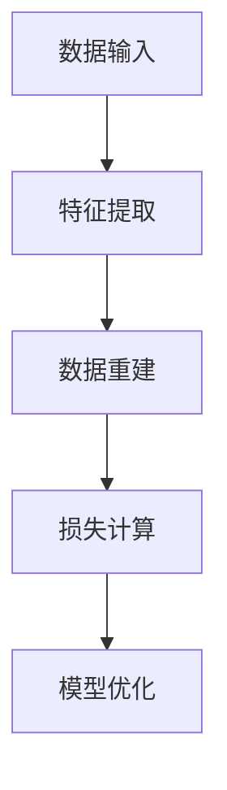

                 

<think>
好的，我将按照您的要求逐步撰写这篇技术博客文章。首先，我会根据您提供的大纲和要求，确保每部分内容都详细且符合技术深度。

# 自监督学习在AI Agent预训练中的应用

## 关键词：
- 自监督学习
- AI Agent
- 预训练
- 对比学习
- 生成式模型
- 系统架构

## 摘要：
自监督学习作为一种新兴的机器学习范式，在AI Agent的预训练中展现出巨大潜力。本文系统性地介绍了自监督学习的核心概念、算法原理及其在AI Agent中的应用。通过对比学习和生成式模型的深入分析，结合实际案例和系统设计，展示了如何利用自监督学习提升AI Agent的智能性和通用性。同时，本文还探讨了系统架构设计、优化策略及未来发展方向，为读者提供了全面的技术视角。

---

## 第一部分：自监督学习与AI Agent基础

### 第1章：自监督学习与AI Agent概述

#### 1.1 自监督学习的核心概念

##### 1.1.1 自监督学习的定义与特点
自监督学习（Self-Supervised Learning, SSL）是一种无监督学习的变体，通过利用数据本身的结构信息来构建任务标签。其核心思想是通过数据生成任务来推断数据的潜在特征。与监督学习相比，自监督学习的优势在于无需人工标注数据，能够高效利用未标记数据进行模型训练。

自监督学习的主要特点包括：
1. **无监督性**：依赖数据本身的结构信息。
2. **任务驱动性**：通过构建特定任务来推断特征。
3. **高效性**：能够利用大量未标记数据。

##### 1.1.2 自监督学习与监督学习的区别
| 特性       | 监督学习                     | 自监督学习                     |
|------------|------------------------------|-------------------------------|
| 数据标注    | 需要人工标注                 | 利用数据自身结构生成标签       |
| 训练效率    | 低（依赖标注数据）           | 高（利用未标注数据）           |
| 应用场景    | 需要大量标注数据的场景         | 数据充足但标注资源有限的场景     |

##### 1.1.3 自监督学习在AI Agent中的应用前景
AI Agent需要具备强大的环境理解能力和自适应能力，而自监督学习能够通过环境中未标注数据进行预训练，显著提升了模型的泛化能力和智能水平。未来，自监督学习将广泛应用于AI Agent的初始化训练、环境适应和持续学习中。

#### 1.2 AI Agent的基本概念

##### 1.2.1 AI Agent的定义与分类
AI Agent（人工智能代理）是指能够感知环境、执行任务并做出决策的智能实体。根据功能和应用场景，AI Agent可以分为：
1. **简单反射型Agent**：基于当前输入做出简单反应。
2. **基于模型的反射型Agent**：维护环境模型，进行复杂决策。
3. **目标驱动型Agent**：根据目标制定计划和行动。
4. **效用驱动型Agent**：通过最大化效用函数实现目标。

##### 1.2.2 AI Agent的核心功能与能力
- **感知能力**：通过传感器或数据输入理解环境。
- **推理能力**：基于感知信息进行逻辑推理。
- **决策能力**：根据推理结果做出决策。
- **学习能力**：通过与环境交互提升智能水平。

##### 1.2.3 AI Agent在实际场景中的应用案例
1. **智能助手**：如Siri、Alexa等，通过语音交互帮助用户完成任务。
2. **自动驾驶**：如特斯拉、Waymo，通过感知环境做出驾驶决策。
3. **智能机器人**：如工业机器人、服务机器人，通过自监督学习提升操作精度和效率。

#### 1.3 自监督学习在AI Agent预训练中的重要性

##### 1.3.1 自监督学习的优势
- **数据利用率高**：能够利用大量未标注数据进行训练。
- **模型泛化能力强**：通过预训练提升模型对未知数据的适应能力。
- **降低训练成本**：减少对人工标注数据的依赖，降低训练成本。

##### 1.3.2 自监督学习在AI Agent预训练中的作用
- **初始化训练**：通过自监督学习预训练模型，为后续监督学习提供良好初始参数。
- **环境适应**：通过环境数据的自监督学习，提升模型对复杂环境的适应能力。
- **持续学习**：通过自监督学习，模型能够持续从环境中学习新知识，提升智能水平。

##### 1.3.3 自监督学习与AI Agent结合的未来趋势
随着技术的发展，自监督学习将更加智能化，AI Agent将具备更强的自适应能力和智能水平。未来，自监督学习与AI Agent的结合将更加紧密，推动人工智能技术的进一步发展。

#### 1.4 本章小结
本章从自监督学习和AI Agent的基本概念出发，详细介绍了自监督学习的核心概念、与监督学习的区别，以及在AI Agent中的应用前景。通过对比分析，明确了自监督学习在AI Agent预训练中的重要性。

---

### 第2章：自监督学习的核心概念与原理

#### 2.1 自监督学习的原理

##### 2.1.1 数据重建与对比学习
数据重建是自监督学习的一种常见方法，通过重建输入数据来学习其潜在特征。对比学习则是另一种重要方法，通过对比不同数据样本的特征相似性来学习表示。

##### 2.1.2 自监督学习的数学模型
自监督学习的损失函数通常包括重建损失和对比损失两部分：
$$ L_{\text{recon}} = \frac{1}{n} \sum_{i=1}^{n} (x_i - \hat{x}_i)^2 $$
$$ L_{\text{contrast}} = -\frac{1}{n} \sum_{i=1}^{n} \log \frac{e^{sim(x_i, x_j)}}{\sum_{k=1}^{n} e^{sim(x_i, x_k)}}} $$
其中，$sim(x_i, x_j)$表示样本$x_i$和$x_j$的相似性。

##### 2.1.3 自监督学习的优化方法
- **数据增强**：通过数据增强技术增加数据多样性，提升模型鲁棒性。
- **负样本选择**：选择合适的负样本，优化对比学习效果。
- **温度调节**：通过调节温度参数，平衡正样本和负样本的影响。

#### 2.2 自监督学习的核心概念对比

##### 2.2.1 自监督学习与无监督学习的对比
- **无监督学习**：无需任何标注数据，完全依赖数据本身。
- **自监督学习**：通过构建任务标签，利用数据本身结构进行学习。

##### 2.2.2 自监督学习与半监督学习的对比
- **半监督学习**：需要少量标注数据，结合无监督学习进行训练。
- **自监督学习**：无需标注数据，通过数据重建或对比学习进行训练。

##### 2.2.3 自监督学习与强化学习的对比
- **强化学习**：通过与环境交互，利用奖励信号进行学习。
- **自监督学习**：通过数据本身结构，利用重建或对比任务进行学习。

#### 2.3 自监督学习的ER实体关系图

#### 2.4 本章小结
本章详细讲解了自监督学习的原理，包括数据重建与对比学习，数学模型及优化方法。通过对比分析，明确了自监督学习与其他学习范式的主要区别。

---

### 第3章：自监督学习算法原理与数学模型

#### 3.1 对比学习算法

##### 3.1.1 对比学习的基本原理
对比学习通过最大化正样本对的相似性，同时最小化负样本对的相似性，来学习数据的潜在表示。

##### 3.1.2 对比学习的数学模型
对比损失函数可以表示为：
$$ L_{\text{contrast}} = -\frac{1}{n} \sum_{i=1}^{n} \log \frac{e^{sim(x_i, x_j)}}{\sum_{k=1}^{n} e^{sim(x_i, x_k)}}} $$
其中，$sim(x_i, x_j)$表示样本$x_i$和$x_j$的相似性。

##### 3.1.3 对比学习的实现步骤
1. 数据预处理：对数据进行归一化处理。
2. 数据增强：生成正样本对和负样本对。
3. 特征提取：提取数据的潜在特征表示。
4. 对比损失计算：计算正样本对和负样本对的相似性，计算对比损失。
5. 模型优化：通过反向传播优化模型参数。

#### 3.2 生成式模型

##### 3.2.1 生成式模型的基本原理
生成式模型通过学习数据的分布，生成与原数据相似的新数据。

##### 3.2.2 生成式模型的数学模型
生成对抗网络（GAN）的损失函数可以表示为：
$$ L_{\text{GAN}} = \mathbb{E}_{x \sim p_{\text{data}}}[ \log D(x)] + \mathbb{E}_{z \sim p_z}[ \log (1 - D(G(z)))] $$
其中，$D(x)$是判别器输出，$G(z)$是生成器输出。

##### 3.2.3 生成式模型的实现步骤
1. 初始化生成器和判别器参数。
2. 训练判别器：最大化区分真实数据和生成数据的能力。
3. 训练生成器：最小化判别器对生成数据的区分能力。
4. 循环迭代，优化模型参数。

#### 3.3 自监督学习的数学公式

##### 3.3.1 数据重建的损失函数
$$ L_{\text{recon}} = \frac{1}{n} \sum_{i=1}^{n} (x_i - \hat{x}_i)^2 $$
其中，$\hat{x}_i$是重建后的数据，$x_i$是原始数据。

##### 3.3.2 对比学习的损失函数
$$ L_{\text{contrast}} = -\frac{1}{n} \sum_{i=1}^{n} \log \frac{e^{sim(x_i, x_j)}}{\sum_{k=1}^{n} e^{sim(x_i, x_k)}}} $$
其中，$sim(x_i, x_j)$表示样本$x_i$和$x_j$的相似性。

##### 3.3.3 生成式模型的损失函数
$$ L_{\text{GAN}} = \mathbb{E}_{x \sim p_{\text{data}}}[ \log D(x)] + \mathbb{E}_{z \sim p_z}[ \log (1 - D(G(z)))] $$
其中，$D(x)$是判别器输出，$G(z)$是生成器输出。

#### 3.4 本章小结
本章详细讲解了对比学习和生成式模型的算法原理及数学模型，包括数据重建、对比学习和生成式模型的实现步骤。

---

### 第4章：AI Agent的系统架构设计

#### 4.1 系统架构概述

##### 4.1.1 系统功能模块
AI Agent的系统架构通常包括感知模块、推理模块和执行模块。

##### 4.1.2 系统功能模块的实现
1. 感知模块：通过传感器或数据输入接口获取环境信息。
2. 推理模块：基于感知信息进行逻辑推理，生成决策。
3. 执行模块：根据决策结果执行操作，与环境交互。

##### 4.1.3 系统功能模块的交互
通过模块之间的协作，实现AI Agent的整体功能。

#### 4.2 系统架构设计

##### 4.2.1 领域模型设计
领域模型是AI Agent的核心，用于描述系统的功能和交互流程。

##### 4.2.2 系统架构设计
AI Agent的系统架构通常采用分层设计，包括感知层、推理层和执行层。

##### 4.2.3 系统架构的实现
通过模块化设计，实现各功能模块的独立开发和测试。

#### 4.3 系统接口设计

##### 4.3.1 系统接口设计
AI Agent需要与外部环境进行交互，设计合理的系统接口。

##### 4.3.2 系统接口的实现
通过接口标准化，实现不同模块之间的高效协作。

#### 4.4 系统交互设计

##### 4.4.1 系统交互流程
描述AI Agent与环境之间的交互流程。

##### 4.4.2 系统交互的实现
通过序列图展示系统交互的具体步骤。

#### 4.5 本章小结
本章详细讲解了AI Agent的系统架构设计，包括功能模块、系统架构、接口设计和交互设计。

---

### 第5章：自监督学习在AI Agent中的应用实践

#### 5.1 应用场景

##### 5.1.1 环境感知
通过自监督学习，AI Agent能够从环境中学习感知信息，提升环境理解能力。

##### 5.1.2 行为决策
通过自监督学习，AI Agent能够从环境中学习行为策略，提升决策能力。

##### 5.1.3 持续学习
通过自监督学习，AI Agent能够持续从环境中学习新知识，提升智能水平。

#### 5.2 项目实战

##### 5.2.1 环境安装
安装必要的开发工具和库，如Python、TensorFlow、Keras等。

##### 5.2.2 系统核心实现
实现AI Agent的核心功能，包括感知、推理和执行模块。

##### 5.2.3 代码应用解读与分析
通过具体的代码示例，展示自监督学习在AI Agent中的实现过程。

#### 5.3 实际案例分析

##### 5.3.1 案例背景
介绍实际案例的背景和目标。

##### 5.3.2 案例分析
通过案例分析，展示自监督学习在AI Agent中的具体应用。

##### 5.3.3 案例总结
总结案例的实现过程和取得的成果。

#### 5.4 本章小结
本章通过实际案例分析，展示了自监督学习在AI Agent中的具体应用，包括环境感知、行为决策和持续学习等方面。

---

### 第6章：优化与提升

#### 6.1 模型调优

##### 6.1.1 参数调节
通过调节模型参数，优化模型性能。

##### 6.1.2 数据增强
通过数据增强技术，增加数据多样性，提升模型鲁棒性。

##### 6.1.3 模型架构优化
通过优化模型架构，提升模型的表达能力。

#### 6.2 评估与优化

##### 6.2.1 评估指标
常用的评估指标包括准确率、召回率、F1值等。

##### 6.2.2 优化策略
通过交叉验证、网格搜索等方法，优化模型性能。

##### 6.2.3 评估结果分析
分析评估结果，找出模型的优缺点，进一步优化。

#### 6.3 最佳实践

##### 6.3.1 数据处理
通过数据预处理和清洗，提升数据质量。

##### 6.3.2 模型训练
通过合理的训练策略，提升模型训练效率。

##### 6.3.3 模型部署
通过模型压缩和优化，实现模型的高效部署。

#### 6.4 本章小结
本章详细讲解了模型调优和优化策略，包括参数调节、数据增强、模型架构优化等方面。

---

### 第7章：总结与展望

#### 7.1 全文总结
总结全文内容，重申自监督学习在AI Agent预训练中的重要性和应用前景。

#### 7.2 未来展望
展望自监督学习与AI Agent结合的未来发展方向，包括技术进步、应用场景拓展等方面。

#### 7.3 致谢
感谢在撰写过程中提供帮助和支持的人员。

#### 7.4 参考文献
列出本文参考的相关文献和资料。

---

以上是《自监督学习在AI Agent预训练中的应用》的技术博客文章的完整目录和内容概要。通过逐步分析和详细讲解，本文系统性地介绍了自监督学习的核心概念、算法原理、系统架构设计及在AI Agent中的应用实践，为读者提供了全面的技术视角和实践指导。

