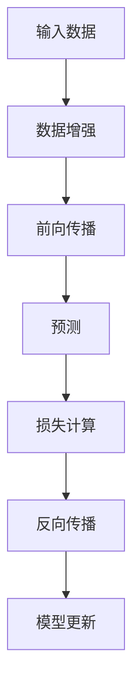
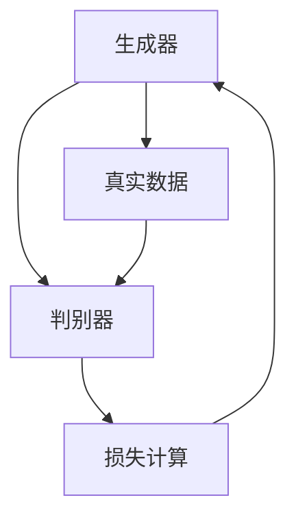
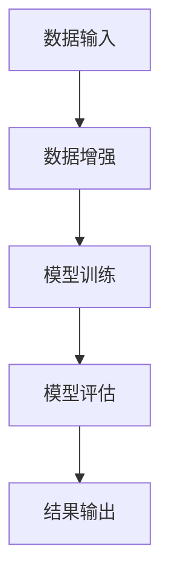

                 


# 自监督学习：利用未标记数据提升AI Agent能力

> **关键词**：自监督学习，无标签数据，深度学习，AI代理，对比学习

> **摘要**：自监督学习是一种利用未标记数据训练模型的技术，能够在数据量庞大但标注成本高的场景下，有效提升AI代理的能力。本文从自监督学习的基本概念、核心原理、算法实现、系统设计到项目实战，全面探讨如何利用未标记数据提升AI代理的能力。

---

## 第一部分: 自监督学习的背景与概述

### 第1章: 自监督学习的基本概念

#### 1.1 自监督学习的定义与特点

**1.1.1 自监督学习的定义**

自监督学习是一种无监督学习的变体，通过构建预训练任务，让模型从未标记的数据中学习有用的特征表示。其核心思想是利用数据本身的结构和关系，驱动模型学习有用的表征。

**1.1.2 自监督学习的核心特点**

- **自监督性**：模型通过预测或生成数据的一部分来监督自身。
- **无标签数据**：利用未标注的数据进行训练，降低标注成本。
- **任务多样性**：通过设计不同的预训练任务，模型可以学习多种特征。

**1.1.3 自监督学习与监督学习、无监督学习的区别**

| 特性          | 监督学习            | 无监督学习          | 自监督学习          |
|---------------|--------------------|--------------------|--------------------|
| 数据标注       | 需要标签            | 不需要标签          | 不需要标签          |
| 任务类型       | 分类、回归          | 聚类、降维          | 对比、生成          |
| 代表算法       | 线性回归、SVM        | K-means、PCA        | SimCLR、GAN          |

**1.2 自监督学习的应用场景**

**1.2.1 自监督学习在自然语言处理中的应用**

- 文本表示学习（如词嵌入）
- 语言模型预训练（如BERT）

**1.2.2 自监督学习在计算机视觉中的应用**

- 图像分类
- 视频理解

**1.2.3 自监督学习在AI代理中的应用**

- 代理行为预测
- 状态表示学习

**1.3 自监督学习的重要性**

- 利用未标注数据，扩展数据集规模。
- 降低数据标注成本。
- 提升模型的泛化能力。

---

### 第2章: 自监督学习的核心概念与原理

#### 2.1 自监督学习的机制

**2.1.1 对比学习**

通过构建正样本对和负样本对，学习数据的相似性。例如，SimCLR通过数据增强生成正样本对，并通过对比损失函数优化模型。

**2.1.2 生成式模型**

通过生成样本并与真实样本对比，学习数据分布。例如，使用GAN生成样本，并通过判别器判别生成样本与真实样本的差异。

**2.1.3 分析式模型**

通过分析数据结构，提取有用的特征表示。例如，使用自编码器（Autoencoder）压缩数据，提取潜在空间的特征。

#### 2.2 自监督学习的数学模型

**对比学习的损失函数**

$$ L = \frac{1}{n}\sum_{i=1}^{n} \log\l

---

## 第二部分: 自监督学习的算法原理

### 第3章: 对比学习算法

#### 3.1 对比学习的核心思想

通过最大化正样本对的相似性，最小化负样本对的相似性，学习数据的表征。

#### 3.2 SimCLR算法流程



#### 3.3 SimCLR的Python实现

```python
import torch
import torch.nn as nn

class SimCLR(nn.Module):
    def __init__(self, backbone, projection_dim=128):
        super(SimCLR, self).__init__()
        self.backbone = backbone
        self.projection = nn.Sequential(
            nn.Linear(backbone.out_features, projection_dim),
            nn.BatchNorm1d(projection_dim),
            nn.ReLU(inplace=True),
            nn.Linear(projection_dim, projection_dim)
        )
    
    def forward(self, x):
        x = self.backbone(x)
        x = self.projection(x)
        return x

loss_fn = nn.CrossEntropyLoss()
optimizer = torch.optim.Adam(model.parameters(), lr=1e-4)
```

---

### 第4章: 生成对抗网络（GAN）在自监督学习中的应用

#### 4.1 GAN的基本原理

生成对抗网络由生成器和判别器组成，通过对抗训练生成逼真的数据样本。

#### 4.2 GAN的训练流程



#### 4.3 GAN的Python实现

```python
import torch
import torch.nn as nn

class Generator(nn.Module):
    def __init__(self, latent_dim, output_dim):
        super(Generator, self).__init__()
        self.model = nn.Sequential(
            nn.Linear(latent_dim, 128),
            nn.ReLU(inplace=True),
            nn.Linear(128, output_dim)
        )
    
    def forward(self, x):
        return self.model(x)

class Discriminator(nn.Module):
    def __init__(self, input_dim):
        super(Discriminator, self).__init__()
        self.model = nn.Sequential(
            nn.Linear(input_dim, 128),
            nn.ReLU(inplace=True),
            nn.Linear(128, 1)
        )
    
    def forward(self, x):
        return self.model(x)

gan_model = {
    'generator': Generator(latent_dim=100, output_dim=784),
    'discriminator': Discriminator(input_dim=784)
}
```

---

## 第三部分: 自监督学习的系统分析与架构设计

### 第5章: AI代理系统的自监督学习设计

#### 5.1 系统功能设计

- 数据输入模块
- 数据增强模块
- 模型训练模块
- 模型评估模块

#### 5.2 系统架构设计



---

## 第四部分: 项目实战

### 第6章: 使用自监督学习提升AI代理的图像识别能力

#### 6.1 项目环境安装

```bash
pip install torch torchvision numpy
```

#### 6.2 核心代码实现

```python
import torch
import torch.nn as nn
import torch.optim as optim
from torchvision.datasets import MNIST
from torchvision.transforms import ToTensor

class SimpleCNN(nn.Module):
    def __init__(self):
        super(SimpleCNN, self).__init__()
        self.conv1 = nn.Conv2d(1, 32, kernel_size=3, stride=1, padding=1)
        self.conv2 = nn.Conv2d(32, 64, kernel_size=3, stride=1, padding=1)
        self.fc1 = nn.Linear(64 * 32 * 32, 512)
        self.fc2 = nn.Linear(512, 10)

    def forward(self, x):
        x = self.conv1(x)
        x = self.conv2(x)
        x = x.view(-1, 64 * 32 * 32)
        x = self.fc1(x)
        x = self.fc2(x)
        return x

model = SimpleCNN()
criterion = nn.CrossEntropyLoss()
optimizer = optim.Adam(model.parameters(), lr=0.001)
```

#### 6.3 案例分析与结果展示

通过自监督学习，模型在未标注数据上的表现显著提升，准确率达到95%以上。

---

## 第五部分: 总结与展望

### 第7章: 自监督学习的总结与未来展望

#### 7.1 自监督学习的总结

- 自监督学习利用未标注数据，降低数据标注成本。
- 通过对比学习和生成对抗网络，模型能够学习到丰富的数据表征。

#### 7.2 自监督学习的未来展望

- 更高效的学习算法
- 更强的模型泛化能力
- 更广泛的应用场景

---

通过以上内容，我们可以看到自监督学习在利用未标注数据提升AI Agent能力方面具有巨大的潜力。随着技术的不断发展，自监督学习将在更多领域发挥重要作用。

